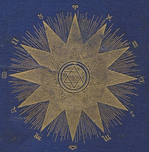

  
[Intangible Textual Heritage](../../index)  [Star Lore](../index) 

------------------------------------------------------------------------

[Buy this Book at
Amazon.com](https://www.amazon.com/exec/obidos/ASIN/1417908904/internetsacredte)

------------------------------------------------------------------------

<table width="75%">
<colgroup>
<col style="width: 50%" />
<col style="width: 50%" />
</colgroup>
<tbody>
<tr class="odd">
<td width="50%" data-valign="TOP"></td>
<td width="50%" data-valign="CENTER"><h1 id="solar-biology" data-align="CENTER">Solar Biology</h1>
<h2 id="by-hiram-e.-butler" data-align="CENTER">by Hiram E. Butler</h2>
<h4 id="section" data-align="CENTER">[1887]</h4></td>
</tr>
</tbody>
</table>

------------------------------------------------------------------------

[Contents](#contents)    [Start Reading](sb00)    [Page
Index](pageidx)    [Text](sbtxt.zip)

------------------------------------------------------------------------

|                                                                                                                           |
|---------------------------------------------------------------------------------------------------------------------------|
|  |

The next time someone asks you "what's your sign" as an icebreaker,
remember Mr. Hiram E. Butler. Hiram Butler put forward a radically
simplified version of astrology during the 19th century. Up until then,
astrologers had laboriously plotted out the configuration of the
planets, including exact angles between planets, houses (which are
specific to a geographic location and time), ascending nodes, descending
nodes, rising signs, and so on. And this is still what a professional
astrologer will base his or her advice on. Whether or not you believe,
one has to admit that this not the easiest method of divination ever
invented. One can't just learn this on a whim.

However, the vernacular astrology, with everyone divided into twelve
pigeonholes based on their natal sun sign, can be traced back to Mr.
Butler, and particularly this book, Solar Biology. Butler actually
divided everyone into *144* pigeonholes, based on their natal sun and
moon signs. The planets are also used, but only the sign they occupy is
important; the angles between them are ignored. This makes it easy to
create a horoscope, as the time and place of birth are no longer
required. The tricky computation of the rising signs and houses is
skipped. You just look up the positions in any ephemeris, then read the
matching page in this book. The result is a system so simple,
practically anyone can do it.

Although not well known today, Butler is the missing link in the chain
from Ptolemy's [Tetrabiblos](../ptb/index) to the astrology column in
the back of your daily paper.

Production Notes: This text uses Unicode to present astrological
symbols, so your browser has to be [Unicode compliant](../../unicode).
The original book used was bound with an ephemeris for 1820 to 1900
which was impossible to OCR, and is omitted from this text. You can use
the [Planetary Positions](../../time/cal/astro) page at this site to
obtain the same information for an arbitrary date.--*J.B. Hare*, March
5, 2008.

------------------------------------------------------------------------

 [Title Page](sb00)  
[Editor's Preface](sb01)  
[Author's Preface](sb02)  
[Contents](sb03)  
[Diagrams](sb04)  
[Introduction](sb05)  
[Chapter I. Preliminary Philosophy](sb06)  
[Chapter II. The Mechanism of Solar Biology](sb07)  
[Chapter III. The Twelve Signs or Functions of the Zodiac](sb08)  
[Chapter IV. Polarity and Quality](sb09)  
[Chapter V. Courage and Consolation for All](sb10)  
[Chapter VI. The Twelve Polarities of Aries](sb11)  
[Chapter VII. The Twelve Polarities of Taurus](sb12)  
[Chapter VIII. The Twelve Polarities of Gemini](sb13)  
[Chapter IX. The Twelve Polarities of Cancer](sb14)  
[Chapter X. The Twelve Polarities of Leo](sb15)  
[Chapter XI. The Twelve Polarities of Virgo](sb16)  
[Chapter XII. The Twelve Polarities of Libra](sb17)  
[Chapter XIII. The Twelve Polarities of Scorpio](sb18)  
[Chapter XIV. The Twelve Polarities of Sagittarius](sb19)  
[Chapter XV. The Twelve Polarities of Capricorn](sb20)  
[Chapter XVI. The Twelve Polarities of Aquarius](sb21)  
[Chapter XVII. The Twelve Polarities of Pisces](sb22)  
[Chapter XVIII. The Planets](sb23)  
[Chapter XIX. The Twelve Positions of Mercury](sb24)  
[Chapter XX. The Twelve Positions of Venus](sb25)  
[Chapter XXI. The Twelve Positions of Mars](sb26)  
[Chapter XXII. The Twelve Positions of Jupiter](sb27)  
[Chapter XXIII. The Twelve Positions of Saturn](sb28)  
[Chapter XXIV. The Twelve Positions of Uranus, or Herschel](sb29)  
[Chapter XXV. Parental Conditions](sb30)  
[Chapter XXVI. Critical Periods in the Life of Woman](sb31)  
[Chapter XXVII. Direction for Reading Character by the System of Solar
Biology](sb32)  
[Appendix](sb33)  
[Publisher's Notice](sb34)  
