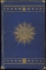
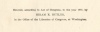

  
[Intangible Textual Heritage](../../index)  [Star Lore](../index.md) 
[Index](index)  [Next](sb01.md) 

------------------------------------------------------------------------

[Buy this Book at
Amazon.com](https://www.amazon.com/exec/obidos/ASIN/1417908904/internetsacredte.md)

------------------------------------------------------------------------

  
*Solar Biology*, by Hiram E. Butler, \[1887\], at Intangible Textual
Heritage

------------------------------------------------------------------------

<table data-border="0">
<colgroup>
<col style="width: 33%" />
<col style="width: 33%" />
<col style="width: 33%" />
</colgroup>
<tbody>
<tr class="odd">
<td data-valign="top" width="218">
  <a href="img/bcover.jpg"> 
Click to enlarge</a> 
Back Cover 

</td>
<td data-valign="top" width="218">
  <a href="img/spine.jpg"> 
Click to enlarge</a> 
Spine 

</td>
<td data-valign="top" width="218">
  <a href="img/fcover.jpg"> 
Click to enlarge</a> 
Front Cover 

</td>
</tr>
</tbody>
</table>

  [  
Click to enlarge](img/front.jpg.md)  
Frontispiece: Portrait of Hiram E. Butler  

  [  
Click to enlarge](img/title.jpg.md)  
Title Page  

 
[  
Click to enlarge](img/verso.jpg.md)  
Verso  

# SOLAR BIOLOGY:

## A SCIENTIFIC METHOD

###### OF

##### DELINEATING CHARACTER; DIAGNOSING DISEASE; DETERMINING MENTAL, PHYSICAL, AND BUSINESS QUALIFICATIONS, CONJUGAL ADAPTABILITY, ETC., ETC., FROM DATE OF BIRTH.

###### BY

### HIRAM E. BUTLER.

##### With Illustrations.

#### BOSTON:

#### ESOTERIC PUBLISHING COMPANY,

#### 478 SHAWMUT AVENUE.

#### \[1887\]

Scanned at Intangible Textual Heritage by John Bruno Hare, March 2008.
This text is in the public domain in the US because it was published
prior to 1923.

Entered, according to Act of Congress, in the year 1887, by

HIRAM E. BUTLER,

in the Office of the Librarian of Congress, at Washington.

\_\_\_\_\_\_\_\_\_\_\_\_\_\_\_\_\_\_\_\_\_\_\_\_\_\_\_\_\_\_\_\_\_  
J. B. CUSHING & CO., PRINTERS,
BOSTON.

------------------------------------------------------------------------

[Next: Editor's Preface](sb01.md)
