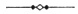

  
[Intangible Textual Heritage](../../index)  [Star Lore](../index.md) 
[Index](index)  [Previous](sb02)  [Next](sb04.md) 

------------------------------------------------------------------------

[Buy this Book at
Amazon.com](https://www.amazon.com/exec/obidos/ASIN/1417908904/internetsacredte.md)

------------------------------------------------------------------------

  
*Solar Biology*, by Hiram E. Butler, \[1887\], at Intangible Textual
Heritage

------------------------------------------------------------------------

### CONTENTS.

|                                                                               |                                                            |
|-------------------------------------------------------------------------------|------------------------------------------------------------|
| INTRODUCTION.                                                                 |                                                            |
|                                                                               | PAGE |
| Bible History of Solar Biology                 | [1](sb05.htm#page_1.md)                                       |
|     Useful evidences for sceptics                                             | [2](sb05.htm#page_2.md)                                       |
|     Hidden treasures of the Bible                                             | [2](sb05.htm#page_2.md)                                       |
|     Generation and potency of thought                                         | [2](sb05.htm#page_2.md)                                       |
|     The visible Logos or image of God                                         | [3](sb05.htm#page_3.md)                                       |
|     Restoration of the order of the heavens                                   | [3](sb05.htm#page_3.md)                                       |
|     Relation of the twelve sons of Jacob to the twelve signs of the zodiac    | [4](sb05.htm#page_4.md)                                       |
|     The metaphysical significance of the sign Leo                             | [7](sb05.htm#page_7.md)                                       |
|     Joseph as a fruitful bough                                                | [8](sb05.htm#page_8.md)                                       |
|     Jacob describes the nature of his twelve sons                             | [9](sb05.htm#page_9.md)                                       |
|     Testimony of Moses, Ezekiel, and Revelation                               | [11](sb05.htm#page_11.md)                                     |
|     The Twelve Apostles of Christ                                             | [11](sb05.htm#page_11.md)                                     |
|     Solomon's Temple                                                          | [12](sb05.htm#page_12.md)                                     |
|                                                                               |                                                            |
| CHAPTER I.                                                                    |                                                            |
| Preliminary Philosophy                         | [13](sb06.htm#page_13.md)                                     |
|     The physical, mental, and spiritual relations of man                      | [13](sb06.htm#page_13.md)                                     |
|     The body a chemical laboratory                                            | [13](sb06.htm#page_13.md)                                     |
|     The source of mental and physical energy                                  | [14](sb06.htm#page_14.md)                                     |
|     Conservation and waste of life forces                                     | [15](sb06.htm#page_15.md)                                     |
|     Why children should rise on first awaking                                 | [15](sb06.htm#page_15.md)                                     |
|     How chastity promotes the higher intuitions                               | [16](sb06.htm#page_16.md)                                     |
|     The relation of intuition to business success                             | [17](sb06.htm#page_17.md)                                     |
|     Love as a controlling influence                                           | [17](sb06.htm#page_17.md)                                     |
|     Psychic or will force as a controlling influence                          | [18](sb06.htm#page_18.md)                                     |
|     The power of conserved thought over mind and body                         | [19](sb06.htm#page_19.md)                                     |
|     Harmony between the selfhood and cause world                              | [20](sb06.htm#page_20.md)                                     |
| Involution and Evolution                       | [21](sb06.htm#page_21.md)                                     |
|     Judging character by the hair, finger-nails, etc.                         | [22](sb06.htm#page_22.md)                                     |
|     The rewards of controlling the passions                                   | [23](sb06.htm#page_23.md)                                     |
| Man's Triune Nature                            | [23](sb06.htm#page_23.md)                                     |
|     Experience and memory, the measure of conscious individuality             | [24](sb06.htm#page_24.md)                                     |
| p. xiv                                             |                                                            |
|                                                                               | PAGE |
| The Law of Soul Marriage                       | [25](sb06.htm#page_25.md)                                     |
|     The consequences of inharmony                                             | [26](sb06.htm#page_26.md)                                     |
| The Selection of Partners in Marriage          | [26](sb06.htm#page_26.md)                                     |
|     How to determine fitness                                                  | [27](sb06.htm#page_27.md)                                     |
|     Evidences of soul adaptability                                            | [28](sb06.htm#page_28.md)                                     |
|                                                                               |                                                            |
| CHAPTER II.                                                                   |                                                            |
| The Mechanism of Solar Biology                 | [30](sb07.htm#page_30.md)                                     |
|     The planets; their periods of revolution                                  | [30](sb07.htm#page_30.md)                                     |
|     Relation of the most ancient people to the solar fluid                    | [30](sb07.htm#page_30.md)                                     |
|     Intuitive knowledge and animal instinct                                   | [31](sb07.htm#page_31.md)                                     |
|     The signs of the zodiac as expressers of the life forces of a Grand Man   | [32](sb07.htm#page_32.md)                                     |
|     Idea of the Grecian poets                                                 | [82](sb09.htm#page_82.md)                                     |
|     A return of the Golden Age                                                | [33](sb07.htm#page_33.md)                                     |
|     Biblical order of the signs of the zodiac                                 | [33](sb07.htm#page_33.md)                                     |
|     Well-defined divisions of the solar fluid                                 | [36](sb07.htm#page_36.md)                                     |
|     The four quarters or trinities of the zodiac                              | [37](sb07.htm#page_37.md)                                     |
|     The solar fluid; its nature and expanse                                   | [39](sb07.htm#page_39.md)                                     |
| Description of Diagram No. 4                   | [40](sb07.htm#page_40.md)                                     |
|     Vulcan and the remote planets                                             | [41](sb07.htm#page_41.md)                                     |
| The Earth, Zodiac, and Polarities              | [42](sb07.htm#page_42.md)                                     |
|     The Moon as a polarizing body                                             | [42](sb07.htm#page_42.md)                                     |
| Attraction and Repulsion of Polarities         | [43](sb07.htm#page_43.md)                                     |
| Hints Regarding Marriage                       | [44](sb07.htm#page_44.md)                                     |
|     Sympathy arising from polarity                                            | [44](sb07.htm#page_44.md)                                     |
|     Harmony in marriage, good offspring, etc                                  | [45](sb07.htm#page_45.md)                                     |
|     Conditions when women are entitled to rule                                | [46](sb07.htm#page_46.md)                                     |
| The Order of the Living Temple                 | [47](sb07.htm#page_47.md)                                     |
|                                                                               |                                                            |
| CHAPTER III.                                                                  |                                                            |
| The Twelve Signs or Functions of the Zodiac.   |                                                            |
| ♈ (Aries)                                                                     | [49](sb08.htm#page_49.md)                                     |
| ♉ (Taurus)                                                                    | [51](sb08.htm#page_51.md)                                     |
| ♊ (Gemini)                                                                    | [53](sb08.htm#page_53.md)                                     |
| ♋ (Cancer)                                                                    | [54](sb08.htm#page_54.md)                                     |
| ♌ (Leo)                                                                       | [57](sb08.htm#page_57.md)                                     |
| ♍ (Virgo)                                                                     | [60](sb08.htm#page_60.md)                                     |
| p. xv                                               |                                                            |
|                                                                               | PAGE |
| ♎ (Libra)                                                                     | [62](sb08.htm#page_62.md)                                     |
| ♏ (Scorpio)                                                                   | [66](sb08.htm#page_66.md)                                     |
| ♐ (Sagittarius)                                                               | [69](sb08.htm#page_69.md)                                     |
| ♑ (Capricorn)                                                                 | [72](sb08.htm#page_72.md)                                     |
| ♒ (Aquarius)                                                                  | [75](sb08.htm#page_75.md)                                     |
| ♓ (Pisces)                                                                    | [77](sb08.htm#page_77.md)                                     |
|                                                                               |                                                            |
| CHAPTER IV.                                                                   |                                                            |
| Polarity and Quality                           | [80](sb09.htm#page_80.md)                                     |
|     Effect of the Moon in entering the sign of birth                          | [80](sb09.htm#page_80.md)                                     |
|     Periods favorable for procreation                                         | [81](sb09.htm#page_81.md)                                     |
|     A useful calendar for ladies                                              | [81](sb09.htm#page_81.md)                                     |
|     Periods most favorable to success                                         | [82](sb09.htm#page_82.md)                                     |
|                                                                               |                                                            |
| CHAPTER V.                                                                    |                                                            |
| Courage and Consolation To All                 | [83](sb10.htm#page_83.md)                                     |
|     The merit and virtue of life                                              | [83](sb10.htm#page_83.md)                                     |
|     The possibility of high and grand attainment                              | [84](sb10.htm#page_84.md)                                     |
|     Present life mainly that of the physical and material                     | [84](sb10.htm#page_84.md)                                     |
|     Methods of producing superior fruit                                       | [85](sb10.htm#page_85.md)                                     |
|     The solar system as a womb of natural generation                          | [85](sb10.htm#page_85.md)                                     |
| The Power and Importance of Breath             | [86](sb10.htm#page_86.md)                                     |
|     Means of strengthening and vitalizing the system                          | [86](sb10.htm#page_86.md)                                     |
|     Exhilaration of the mountain top                                          | [87](sb10.htm#page_87.md)                                     |
|                                                                               |                                                            |
| CHAPTER VI.                                                                   |                                                            |
| The Twelve Polarities of Aries.                |                                                            |
| ♈ (Aries), with the Moon in ♈ (Aries)                                         | [88](sb11.htm#page_88.md)                                     |
| “       “       “      “      ♉ (Taurus)                                      | [88](sb11.htm#page_88.md)                                     |
| “       “       “      “      ♊ (Gemini)                                      | [89](sb11.htm#page_89.md)                                     |
| “       “       “      “      ♋ (Cancer)                                      | [91](sb11.htm#page_91.md)                                     |
| “       “       “      “      ♌ (Leo)                                         | [92](sb11.htm#page_92.md)                                     |
| “       “       “      “      ♍ (Virgo)                                       | [93](sb11.htm#page_93.md)                                     |
| “       “       “      “      ♎ (Libra)                                       | [94](sb11.htm#page_94.md)                                     |
| “       “       “      “      ♏ (Scorpio)                                     | [96](sb11.htm#page_96.md)                                     |
| “       “       “      “      ♐ (Sagittarius)                                 | [96](sb11.htm#page_96.md)                                     |
| “       “       “      “      ♑ (Capricorn)                                   | [98](sb11.htm#page_98.md)                                     |
| “       “       “      “      ♒ (Aquarius)                                    | [99](sb11.htm#page_99.md)                                     |
| “       “       “      “      ♓ (Pisces)                                      | [100](sb11.htm#page_100.md)                                   |
| p. xvi                                             |                                                            |
|                                                                               |                                                            |
| CHAPTER VII.                                                                  |                                                            |
| The Twelve Polarities of Taurus.               |                                                            |
|                                                                               | PAGE |
| ♉ (Taurus), with the Moon in ♈ (Aries)                                        | [102](sb12.htm#page_102.md)                                   |
| “       “       “      “      ♉ (Taurus)                                      | [103](sb12.htm#page_103.md)                                   |
| “       “       “      “      ♊ (Gemini)                                      | [103](sb12.htm#page_103.md)                                   |
| “       “       “      “      ♋ (Cancer)                                      | [104](sb12.htm#page_104.md)                                   |
| “       “       “      “      ♌ (Leo)                                         | [105](sb12.htm#page_105.md)                                   |
| “       “       “      “      ♍ (Virgo)                                       | [107](sb12.htm#page_107.md)                                   |
| “       “       “      “      ♎ (Libra)                                       | [108](sb12.htm#page_108.md)                                   |
| “       “       “      “      ♏ (Scorpio)                                     | [109](sb12.htm#page_109.md)                                   |
| “       “       “      “      ♐ (Sagittarius)                                 | [109](sb12.htm#page_109.md)                                   |
| “       “       “      “      ♑ (Capricorn)                                   | [110](sb12.htm#page_110.md)                                   |
| “       “       “      “      ♒ (Aquarius)                                    | [111](sb12.htm#page_111.md)                                   |
| “       “       “      “      ♓ (Pisces)                                      | [112](sb12.htm#page_112.md)                                   |
|                                                                               |                                                            |
| CHAPTER VIII.                                                                 |                                                            |
| The Twelve Polarities of Gemini.               |                                                            |
| ♊ (Gemini), with the Moon in ♈ (Aries)                                        | [114](sb13.htm#page_114.md)                                   |
| “       “       “      “      ♉ (Taurus)                                      | [115](sb13.htm#page_115.md)                                   |
| “       “       “      “      ♊ (Gemini)                                      | [115](sb13.htm#page_115.md)                                   |
| “       “       “      “      ♋ (Cancer)                                      | [116](sb13.htm#page_116.md)                                   |
| “       “       “      “      ♌ (Leo)                                         | [116](sb13.htm#page_116.md)                                   |
| “       “       “      “      ♍ (Virgo)                                       | [117](sb13.htm#page_117.md)                                   |
| “       “       “      “      ♎ (Libra)                                       | [118](sb13.htm#page_118.md)                                   |
| “       “       “      “      ♏ (Scorpio)                                     | [119](sb13.htm#page_119.md)                                   |
| “       “       “      “      ♐ (Sagittarius)                                 | [120](sb13.htm#page_120.md)                                   |
| “       “       “      “      ♑ (Capricorn) 120                               |                                                            |
| “       “       “      “      ♒ (Aquarius)                                    | [121](sb13.htm#page_121.md)                                   |
| “       “       “      “      ♓ (Pisces)                                      | [121](sb13.htm#page_121.md)                                   |
|                                                                               |                                                            |
| CHAPTER IX.                                                                   |                                                            |
| The Twelve Polarities of Cancer.               |                                                            |
| ♋ (Cancer), with the Moon in ♈ (Aries)                                        | [123](sb14.htm#page_123.md)                                   |
| “       “       “      “      ♉ (Taurus)                                      | [123](sb14.htm#page_123.md)                                   |
| “       “       “      “      ♊ (Gemini)                                      | [125](sb14.htm#page_125.md)                                   |
| “       “       “      “      ♋ (Cancer)                                      | [125](sb14.htm#page_125.md)                                   |
| “       “       “      “      ♌ (Leo)                                         | [126](sb14.htm#page_126.md)                                   |
| “       “       “      “      ♍ (Virgo)                                       | [126](sb14.htm#page_126.md)                                   |
| p. xvii                                           |                                                            |
|                                                                               | PAGE |
| ♋ (Cancer), with the Moon in ♎ (Libra)                                        | [127](sb14.htm#page_127.md)                                   |
| “       “       “      “      ♏ (Scorpio)                                     | [128](sb14.htm#page_128.md)                                   |
| “       “       “      “      ♐ (Sagittarius)                                 | [128](sb14.htm#page_128.md)                                   |
| “       “       “      “      ♑ (Capricorn)                                   | [129](sb14.htm#page_129.md)                                   |
| “       “       “      “      ♒ (Aquarius)                                    | [130](sb14.htm#page_130.md)                                   |
| “       “       “      “      ♓ (Pisces)                                      | [131](sb14.htm#page_131.md)                                   |
|                                                                               |                                                            |
| CHAPTER X.                                                                    |                                                            |
| The Twelve Polarities of Leo.                  |                                                            |
| ♌ (Leo), with the Moon in ♈ (Aries)                                           | [132](sb15.htm#page_132.md)                                   |
| “       “       “      “      ♉ (Taurus)                                      | [133](sb15.htm#page_133.md)                                   |
| “       “       “      “      ♊ (Gemini)                                      | [133](sb15.htm#page_133.md)                                   |
| “       “       “      “      ♋ (Cancer)                                      | [134](sb15.htm#page_134.md)                                   |
| “       “       “      “      ♌ (Leo)                                         | [135](sb15.htm#page_135.md)                                   |
| “       “       “      “      ♍ (Virgo)                                       | [135](sb15.htm#page_135.md)                                   |
| “       “       “      “      ♎ (Libra)                                       | [136](sb15.htm#page_136.md)                                   |
| “       “       “      “      ♏ (Scorpio)                                     | [137](sb15.htm#page_137.md)                                   |
| “       “       “      “      ♐ (Sagittarius)                                 | [137](sb15.htm#page_137.md)                                   |
| “       “       “      “      ♑ (Capricorn)                                   | [138](sb15.htm#page_138.md)                                   |
| “       “       “      “      ♒ (Aquarius)                                    | [139](sb15.htm#page_139.md)                                   |
| “       “       “      “      ♓ (Pisces)                                      | [140](sb15.htm#page_140.md)                                   |
|                                                                               |                                                            |
| CHAPTER XI.                                                                   |                                                            |
| The Twelve Polarities of Virgo.                |                                                            |
| ♍ (Virgo), with the Moon in ♈ (Aries)                                         | [141](sb16.htm#page_141.md)                                   |
| “       “       “      “      ♉ (Taurus)                                      | [141](sb16.htm#page_141.md)                                   |
| “       “       “      “      ♊ (Gemini)                                      | [142](sb16.htm#page_142.md)                                   |
| “       “       “      “      ♋ (Cancer)                                      | [142](sb16.htm#page_142.md)                                   |
| “       “       “      “      ♌ (Leo)                                         | [143](sb16.htm#page_143.md)                                   |
| “       “       “      “      ♍ (Virgo)                                       | [144](sb16.htm#page_144.md)                                   |
| “       “       “      “      ♎ (Libra)                                       | [145](sb16.htm#page_145.md)                                   |
| “       “       “      “      ♏ (Scorpio)                                     | [146](sb16.htm#page_146.md)                                   |
| “       “       “      “      ♐ (Sagittarius)                                 | [147](sb16.htm#page_147.md)                                   |
| “       “       “      “      ♑ (Capricorn)                                   | [148](sb16.htm#page_148.md)                                   |
| “       “       “      “      ♒ (Aquarius)                                    | [149](sb16.htm#page_149.md)                                   |
| “       “       “      “      ♓ (Pisces)                                      | [149](sb16.htm#page_149.md)                                   |
| p. xviii                                         |                                                            |
|                                                                               |                                                            |
| CHAPTER XII.                                                                  |                                                            |
| The Twelve Polarities of Libra.                |                                                            |
|                                                                               | PAGE |
| ♎ (Libra), with the Moon in ♈ (Aries)                                         | [151](sb17.htm#page_151.md)                                   |
| “       “       “      “      ♉ (Taurus)                                      | [151](sb17.htm#page_151.md)                                   |
| “       “       “      “      ♊ (Gemini)                                      | [152](sb17.htm#page_152.md)                                   |
| “       “       “      “      ♋ (Cancer)                                      | [153](sb17.htm#page_153.md)                                   |
| “       “       “      “      ♌ (Leo)                                         | [153](sb17.htm#page_153.md)                                   |
| “       “       “      “      ♍ (Virgo)                                       | [154](sb17.htm#page_154.md)                                   |
| “       “       “      “      ♎ (Libra)                                       | [155](sb17.htm#page_155.md)                                   |
| “       “       “      “      ♏ (Scorpio)                                     | [155](sb17.htm#page_155.md)                                   |
| “       “       “      “      ♐ (Sagittarius)                                 | [155](sb17.htm#page_155.md)                                   |
| “       “       “      “      ♑ (Capricorn)                                   | [157](sb17.htm#page_157.md)                                   |
| “       “       “      “      ♒ (Aquarius)                                    | [158](sb17.htm#page_158.md)                                   |
| “       “       “      “      ♓ (Pisces)                                      | [158](sb17.htm#page_158.md)                                   |
|                                                                               |                                                            |
| CHAPTER XIII.                                                                 |                                                            |
| The Twelve Polarities of Scorpio.              |                                                            |
| ♏ (Scorpio), with the Moon in ♈ (Aries)                                       | [160](sb18.htm#page_160.md)                                   |
| “       “       “      “      ♉ (Taurus)                                      | [161](sb18.htm#page_161.md)                                   |
| “       “       “      “      ♊ (Gemini)                                      | [162](sb18.htm#page_162.md)                                   |
| “       “       “      “      ♋ (Cancer)                                      | [163](sb18.htm#page_163.md)                                   |
| “       “       “      “      ♌ (Leo)                                         | [164](sb18.htm#page_164.md)                                   |
| “       “       “      “      ♍ (Virgo)                                       | [165](sb18.htm#page_165.md)                                   |
| “       “       “      “      ♎ (Libra)                                       | [165](sb18.htm#page_165.md)                                   |
| “       “       “      “      ♏ (Scorpio)                                     | [166](sb18.htm#page_166.md)                                   |
| “       “       “      “      ♐ (Sagittarius)                                 | [167](sb18.htm#page_167.md)                                   |
| “       “       “      “      ♑ (Capricorn)                                   | [168](sb18.htm#page_168.md)                                   |
| “       “       “      “      ♒ (Aquarius)                                    | [168](sb18.htm#page_168.md)                                   |
| “       “       “      “      ♓ (Pisces)                                      | [169](sb18.htm#page_169.md)                                   |
|                                                                               |                                                            |
| CHAPTER XIV.                                                                  |                                                            |
| The Twelve Polarities of Sagittarius.          |                                                            |
| ♐ (Sagittarius), with the Moon in ♈ (Aries)                                   | [170](sb19.htm#page_170.md)                                   |
| “       “       “      “      ♉ (Taurus)                                      | [171](sb19.htm#page_171.md)                                   |
| “       “       “      “      ♊ (Gemini)                                      | [171](sb19.htm#page_171.md)                                   |
| “       “       “      “      ♋ (Cancer)                                      | [172](sb19.htm#page_172.md)                                   |
| “       “       “      “      ♌ (Leo)                                         | [173](sb19.htm#page_173.md)                                   |
| “       “       “      “      ♍ (Virgo)                                       | [174](sb19.htm#page_174.md)                                   |
| p. xix                                             |                                                            |
|                                                                               | PAGE |
| ♐ (Sagittarius), with the Moon in ♎ (Libra)                                   | [175](sb19.htm#page_175.md)                                   |
| “       “       “      “      ♏ (Scorpio)                                     | [176](sb19.htm#page_176.md)                                   |
| “       “       “      “      ♐ (Sagittarius)                                 | [177](sb19.htm#page_177.md)                                   |
| “       “       “      “      ♑ (Capricorn)                                   | [177](sb19.htm#page_177.md)                                   |
| “       “       “      “      ♒ (Aquarius)                                    | [178](sb19.htm#page_178.md)                                   |
| “       “       “      “      ♓ (Pisces)                                      | [179](sb19.htm#page_179.md)                                   |
|                                                                               |                                                            |
| CHAPTER XV.                                                                   |                                                            |
| The Twelve Polarities of Capricorn.            |                                                            |
| ♑ (Capricorn), with the Moon in ♈ (Aries)                                     | [180](sb20.htm#page_180.md)                                   |
| “       “       “      “      ♉ (Taurus)                                      | [181](sb20.htm#page_181.md)                                   |
| “       “       “      “      ♊ (Gemini)                                      | [181](sb20.htm#page_181.md)                                   |
| “       “       “      “      ♋ (Cancer)                                      | [182](sb20.htm#page_182.md)                                   |
| “       “       “      “      ♌ (Leo)                                         | [182](sb20.htm#page_182.md)                                   |
| “       “       “      “      ♍ (Virgo)                                       | [183](sb20.htm#page_183.md)                                   |
| “       “       “      “      ♎ (Libra)                                       | [184](sb20.htm#page_184.md)                                   |
| “       “       “      “      ♏ (Scorpio)                                     | [185](sb20.htm#page_185.md)                                   |
| “       “       “      “      ♐ (Sagittarius)                                 | [186](sb20.htm#page_186.md)                                   |
| “       “       “      “      ♑ (Capricorn)                                   | [186](sb20.htm#page_186.md)                                   |
| “       “       “      “      ♒ (Aquarius)                                    | [187](sb20.htm#page_187.md)                                   |
| “       “       “      “      ♓ (Pisces)                                      | [188](sb20.htm#page_188.md)                                   |
|                                                                               |                                                            |
| CHAPTER XVI.                                                                  |                                                            |
| The Twelve Polarities of Aquarius.             |                                                            |
| ♒ (Aquarius), with the Moon in ♈ (Aries)                                      | [190](sb21.htm#page_190.md)                                   |
| “       “       “      “      ♉ (Taurus)                                      | [190](sb21.htm#page_190.md)                                   |
| “       “       “      “      ♊ (Gemini)                                      | [191](sb21.htm#page_191.md)                                   |
| “       “       “      “      ♋ (Cancer)                                      | [191](sb21.htm#page_191.md)                                   |
| “       “       “      “      ♌ (Leo)                                         | [192](sb21.htm#page_192.md)                                   |
| “       “       “      “      ♍ (Virgo)                                       | [193](sb21.htm#page_193.md)                                   |
| “       “       “      “      ♎ (Libra)                                       | [194](sb21.htm#page_194.md)                                   |
| “       “       “      “      ♏ (Scorpio)                                     | [194](sb21.htm#page_194.md)                                   |
| “       “       “      “      ♐ (Sagittarius)                                 | [195](sb21.htm#page_195.md)                                   |
| “       “       “      “      ♑ (Capricorn)                                   | [106](sb12.htm#page_106.md)                                   |
| “       “       “      “      ♒ (Aquarius)                                    | [197](sb21.htm#page_197.md)                                   |
| “       “       “      “      ♓ (Pisces)                                      | [197](sb21.htm#page_197.md)                                   |
| p. xx                                               |                                                            |
|                                                                               |                                                            |
| CHAPTER XVII.                                                                 |                                                            |
| The Twelve Polarities of Pisces.               |                                                            |
|                                                                               | PAGE |
| ♓ (Pisces), with the Moon in ♈ (Aries)                                        | [199](sb22.htm#page_199.md)                                   |
| “       “       “      “      ♉ (Taurus)                                      | [199](sb22.htm#page_199.md)                                   |
| “       “       “      “      ♊ (Gemini)                                      | [201](sb22.htm#page_201.md)                                   |
| “       “       “      “      \`ca (Cancer)                                   | [202](sb22.htm#page_202.md)                                   |
| “       “       “      “      ♌ (Leo)                                         | [202](sb22.htm#page_202.md)                                   |
| “       “       “      “      ♍ (Virgo)                                       | [203](sb22.htm#page_203.md)                                   |
| “       “       “      “      ♎ (Libra)                                       | [204](sb22.htm#page_204.md)                                   |
| “       “       “      “      ♏ (Scorpio)                                     | [205](sb22.htm#page_205.md)                                   |
| “       “       “      “      ♐ (Sagittarius)                                 | [206](sb22.htm#page_206.md)                                   |
| “       “       “      “      ♑ (Capricorn)                                   | [207](sb22.htm#page_207.md)                                   |
| “       “       “      “      ♒ (Aquarius)                                    | [207](sb22.htm#page_207.md)                                   |
| “       “       “      “      ♓ (Pisces)                                      | [208](sb22.htm#page_208.md)                                   |
|                                                                               |                                                            |
| CHAPTER XVIII.                                                                |                                                            |
| The Planets                                    | [210](sb23.htm#page_210.md)                                   |
|     The solar plexus as a distributor of planetary influence                  | [210](sb23.htm#page_210.md)                                   |
|     The distinguishing principle between man and animals                      | [211](sb23.htm#page_211.md)                                   |
|     Cause of antagonism between the exterior and interior nature              | [211](sb23.htm#page_211.md)                                   |
|     Concerning exterior and interior signs                                    | [212](sb23.htm#page_212.md)                                   |
|     Significance of planets in the sign of one's nativity                     | [212](sb23.htm#page_212.md)                                   |
|     Effect of planetary positions on the size and structure of the body       | [213](sb23.htm#page_213.md)                                   |
|     The planets as centres of creative energy                                 | [213](sb23.htm#page_213.md)                                   |
| Order And Harmony of the Seven Vital Functions | [214](sb23.htm#page_214.md)                                   |
|     Positions of greatest controlling influence                               | [214](sb23.htm#page_214.md)                                   |
|                                                                               |                                                            |
| CHAPTER XIX.                                                                  |                                                            |
| The Twelve Positions of Mercury.               |                                                            |
| ☿ (Mercury): its Function                                                     | [215](sb24.htm#page_215.md)                                   |
| “       “       “      in ♈ (Aries)                                           | [216](sb24.htm#page_216.md)                                   |
| “       “       “      “  ♉ (Taurus)                                          | [216](sb24.htm#page_216.md)                                   |
| “       “       “      “  ♊ (Gemini)                                          | [216](sb24.htm#page_216.md)                                   |
| “       “       “      “  ♋ (Cancer)                                          | [217](sb24.htm#page_217.md)                                   |
| “       “       “      “  ♌ (Leo)                                             | [217](sb24.htm#page_217.md)                                   |
| “       “       “      “  ♍ (Virgo)                                           | [218](sb24.htm#page_218.md)                                   |
| “       “       “      “  ♎ (Libra)                                           | [218](sb24.htm#page_218.md)                                   |
| “       “       “      “  ♏ (Scorpio)                                         | [219](sb24.htm#page_219.md)                                   |
| “       “       “      “  ♐ (Sagittarius)                                     | [219](sb24.htm#page_219.md)                                   |
| “       “       “      “  ♑ (Capricorn)                                       | [219](sb24.htm#page_219.md)                                   |
| “       “       “      “  ♒ (Aquarius)                                        | [220](sb24.htm#page_220.md)                                   |
| “       “       “      “  ♓ (Pisces)                                          | [220](sb24.htm#page_220.md)                                   |
| p. xxi                                             |                                                            |
|                                                                               |                                                            |
| CHAPTER XX.                                                                   |                                                            |
| The Twelve Positions of Venus.                 |                                                            |
|                                                                               | PAGE |
| ♀ (Venus): its Function                                                       | [221](sb25.htm#page_221.md)                                   |
| “       “       “      in ♈ (Aries)                                           | [222](sb25.htm#page_222.md)                                   |
| “       “       “      “  ♉ (Taurus)                                          | [222](sb25.htm#page_222.md)                                   |
| “       “       “      “  ♊ (Gemini)                                          | [223](sb25.htm#page_223.md)                                   |
| “       “       “      “  ♋ (Cancer)                                          | [223](sb25.htm#page_223.md)                                   |
| “       “       “      “  ♌ (Leo)                                             | [223](sb25.htm#page_223.md)                                   |
| “       “       “      “  ♍ (Virgo)                                           | [224](sb25.htm#page_224.md)                                   |
| “       “       “      “  ♎ (Libra)                                           | [224](sb25.htm#page_224.md)                                   |
| “       “       “      “  ♏ (Scorpio)                                         | [224](sb25.htm#page_224.md)                                   |
| “       “       “      “  ♐ (Sagittarius)                                     | [225](sb25.htm#page_225.md)                                   |
| “       “       “      “  ♑ (Capricorn)                                       | [225](sb25.htm#page_225.md)                                   |
| “       “       “      “  ♒ (Aquarius)                                        | [225](sb25.htm#page_225.md)                                   |
| “       “       “      “  ♓ (Pisces)                                          | [226](sb25.htm#page_226.md)                                   |
|                                                                               |                                                            |
| CHAPTER XXI.                                                                  |                                                            |
| The Twelve Positions of Mars.                  |                                                            |
| ♂ (Mars): its Function                                                        | [228](sb26.htm#page_228.md)                                   |
| “       “       “      in ♈ (Aries)                                           | [228](sb26.htm#page_228.md)                                   |
| “       “       “      “  ♉ (Taurus)                                          | [229](sb26.htm#page_229.md)                                   |
| “       “       “      “  ♊ (Gemini)                                          | [229](sb26.htm#page_229.md)                                   |
| “       “       “      “  ♋ (Cancer)                                          | [229](sb26.htm#page_229.md)                                   |
| “       “       “      “  ♌ (Leo)                                             | [230](sb26.htm#page_230.md)                                   |
| “       “       “      “  ♍ (Virgo)                                           | [230](sb26.htm#page_230.md)                                   |
| “       “       “      “  ♎ (Libra)                                           | [231](sb26.htm#page_231.md)                                   |
| “       “       “      “  ♏ (Scorpio)                                         | [232](sb26.htm#page_232.md)                                   |
| “       “       “      “  ♐ (Sagittarius)                                     | [232](sb26.htm#page_232.md)                                   |
| “       “       “      “  ♑ (Capricorn)                                       | [233](sb26.htm#page_233.md)                                   |
| “       “       “      “  ♒ (Aquarius)                                        | [233](sb26.htm#page_233.md)                                   |
| “       “       “      “  ♓ (Pisces)                                          | [234](sb26.htm#page_234.md)                                   |
|                                                                               |                                                            |
| CHAPTER XXII.                                                                 |                                                            |
| The Twelve Positions of Jupiter.               |                                                            |
| ♃ (Jupiter): its Function                                                     | [235](sb27.htm#page_235.md)                                   |
| “       “       “      in ♈ (Aries)                                           | [235](sb27.htm#page_235.md)                                   |
| “       “       “      “  ♉ (Taurus)                                          | [236](sb27.htm#page_236.md)                                   |
| “       “       “      “  ♊ (Gemini)                                          | [237](sb27.htm#page_237.md)                                   |
| “       “       “      “  ♋ (Cancer)                                          | [237](sb27.htm#page_237.md)                                   |
| p. xxii                                           |                                                            |
|                                                                               | PAGE |
| ♃ (Jupiter), in ♌ (Leo)                                                       | [238](sb27.htm#page_238.md)                                   |
| “       “       “      “  ♍ (Virgo)                                           | [239](sb27.htm#page_239.md)                                   |
| “       “       “      “  ♎ (Libra)                                           | [239](sb27.htm#page_239.md)                                   |
| “       “       “      “  ♏ (Scorpio)                                         | [239](sb27.htm#page_239.md)                                   |
| “       “       “      “  ♐ (Sagittarius)                                     | [240](sb27.htm#page_240.md)                                   |
| “       “       “      “  ♑ (Capricorn)                                       | [240](sb27.htm#page_240.md)                                   |
| “       “       “      “  ♒ (Aquarius)                                        | [240](sb27.htm#page_240.md)                                   |
| “       “       “      “  ♓ (Pisces)                                          | [241](sb27.htm#page_241.md)                                   |
|                                                                               |                                                            |
| CHAPTER XXIII.                                                                |                                                            |
| The Twelve Positions of Saturn.                |                                                            |
| ♄ (Saturn): its Function                                                      | [242](sb28.htm#page_242.md)                                   |
| “       “       “      in ♈ (Aries)                                           | [243](sb28.htm#page_243.md)                                   |
| “       “       “      “  ♉ (Taurus)                                          | [243](sb28.htm#page_243.md)                                   |
| “       “       “      “  ♊ (Gemini)                                          | [244](sb28.htm#page_244.md)                                   |
| “       “       “      “  ♋ (Cancer)                                          | [244](sb28.htm#page_244.md)                                   |
| “       “       “      “  ♌ (Leo)                                             | [245](sb28.htm#page_245.md)                                   |
| “       “       “      “  ♍ (Virgo)                                           | [246](sb28.htm#page_246.md)                                   |
| “       “       “      “  ♎ (Libra)                                           | [246](sb28.htm#page_246.md)                                   |
| “       “       “      “  ♏ (Scorpio)                                         | [246](sb28.htm#page_246.md)                                   |
| “       “       “      “  ♐ (Sagittarius)                                     | [247](sb28.htm#page_247.md)                                   |
| “       “       “      “  ♑ (Capricorn)                                       | [247](sb28.htm#page_247.md)                                   |
| “       “       “      “  ♒ (Aquarius)                                        | [248](sb28.htm#page_248.md)                                   |
| “       “       “      “  ♓ (Pisces)                                          | [248](sb28.htm#page_248.md)                                   |
|                                                                               |                                                            |
| CHAPTER XXIV.                                                                 |                                                            |
| The Twelve Positions of Uranus, or Herschel    |                                                            |
| ♅ (Uranus): its Function                                                      | [250](sb29.htm#page_250.md)                                   |
| “       “       “      in ♈ (Aries)                                           | [250](sb29.htm#page_250.md)                                   |
| “       “       “      “  ♉ (Taurus)                                          | [251](sb29.htm#page_251.md)                                   |
| “       “       “      “  ♊ (Gemini)                                          | [251](sb29.htm#page_251.md)                                   |
| “       “       “      “  \`ca (Cancer)                                       | [251](sb29.htm#page_251.md)                                   |
| “       “       “      “  ♌ (Leo)                                             | [252](sb29.htm#page_252.md)                                   |
| “       “       “      “  ♍ (Virgo)                                           | [252](sb29.htm#page_252.md)                                   |
| “       “       “      “  ♎ (Libra)                                           | [252](sb29.htm#page_252.md)                                   |
| “       “       “      “  ♏ (Scorpio)                                         | [253](sb29.htm#page_253.md)                                   |
| “       “       “      “  ♐ (Sagittarius)                                     | [253](sb29.htm#page_253.md)                                   |
| “       “       “      “  ♑ (Capricorn)                                       | [253](sb29.htm#page_253.md)                                   |
| “       “       “      “  ♒ (Aquarius)                                        | [254](sb29.htm#page_254.md)                                   |
| “       “       “      “  ♓ (Pisces)                                          | [254](sb29.htm#page_254.md)                                   |
| p. xxiii                                         |                                                            |
| CHAPTER XXV.                                                                  |                                                            |
|                                                                               | PAGE |
| Parental Conditions                            | [255](sb30.htm#page_255.md)                                   |
|     Strong and weak points of character                                       | [255](sb30.htm#page_255.md)                                   |
|     Cause of the great variety of human types                                 | [255](sb30.htm#page_255.md)                                   |
|     Zodiac of the sun                                                         | [256](sb30.htm#page_256.md)                                   |
| Conflicting Attributes of Character            | [256](sb30.htm#page_256.md)                                   |
|     Reconciling conflicting tendencies                                        | [257](sb30.htm#page_257.md)                                   |
| How to Control and Overcome Bad Habits         | [258](sb30.htm#page_258.md)                                   |
|     Concerning effects of thought at and subsequent to meals                  | [258](sb30.htm#page_258.md)                                   |
|     Method of conquering prenatal conditions                                  | [259](sb30.htm#page_259.md)                                   |
| Efficacy of Fasting to Overcome Disease        | [259](sb30.htm#page_259.md)                                   |
|     How to create a new body                                                  | [260](sb30.htm#page_260.md)                                   |
|     The best time to commence a fast                                          | [261](sb30.htm#page_261.md)                                   |
|     Persons who should not take strong cathartics                             | [262](sb30.htm#page_262.md)                                   |
|     Salt fish as a corrective of fermentation                                 | [262](sb30.htm#page_262.md)                                   |
|                                                                               |                                                            |
| CHAPTER XXVI.                                                                 |                                                            |
| Critical Periods in the Life of Woman          | [264](sb31.htm#page_264.md)                                   |
|     Dangers attending girls at puberty                                        | [264](sb31.htm#page_264.md)                                   |
|     Importance of out-door exercise                                           | [265](sb31.htm#page_265.md)                                   |
| The Second Period and Danger in Woman's Life   | [265](sb31.htm#page_265.md)                                   |
|     New conditions and states of higher spiritual being                       | [266](sb31.htm#page_266.md)                                   |
|     Renewal of powers, longevity, etc.                                        | [266](sb31.htm#page_266.md)                                   |
|     Adjusting the habits and appetites to new and higher conditions           | [266](sb31.htm#page_266.md)                                   |
| Causes of Inharmony in Married Life            | [267](sb31.htm#page_267.md)                                   |
|     Intuition and reason contrasted                                           | [267](sb31.htm#page_267.md)                                   |
|     The electric, centrifugal, or masculine force                             | [268](sb31.htm#page_268.md)                                   |
|     The magnetic, centripetal, or feminine force                              | [268](sb31.htm#page_268.md)                                   |
|     Two methods of generation                                                 | [269](sb31.htm#page_269.md)                                   |
| Sexual Excesses                                | [270](sb31.htm#page_270.md)                                   |
|     Concerning latent sex forces                                              | [271](sb31.htm#page_271.md)                                   |
|     How love comes to he changed to repulsion                                 | [271](sb31.htm#page_271.md)                                   |
|     Misery prevented by knowledge of the laws of life                         | [272](sb31.htm#page_272.md)                                   |
|     Rewards of chastity                                                       | [273](sb31.htm#page_273.md)                                   |
|     Drawing from the fountain of life                                         | [273](sb31.htm#page_273.md)                                   |
| p. xxiv                                           |                                                            |
|                                                                               |                                                            |
| CHAPTER XXVII.                                                                |                                                            |
|                                                                               | PAGE |
| Directions for reading Character               | [274](sb32.htm#page_274.md)                                   |
|     Periods of the twelve signs of the zodiac                                 | [274](sb32.htm#page_274.md)                                   |
|     Directions for finding the polarity                                       | [274](sb32.htm#page_274.md)                                   |
|        “   “   “   “          position of the planets                         | [275](sb32.htm#page_275.md)                                   |
|     More frequent changes of planets as we approach the sun                   | [276](sb32.htm#page_276.md)                                   |
|     Tabulated form of writing a nativity                                      | [278](sb32.htm#page_278.md)                                   |
|     Significance of the twelve tribes of Israel                               | [278](sb32.htm#page_278.md)                                   |
|     To find to which of the twelve tribes one belongs                         | [278](sb32.htm#page_278.md)                                   |
|                                                                               |                                                            |
| APPENDIX.                                                                     |                                                            |
| Fragments of a lost planet                                                    | [279](sb33.htm#page_279.md)                                   |
| Powers and principalities of the air                                          | [279](sb33.htm#page_279.md)                                   |
| Historical foundation of Grecian myths                                        | [279](sb33.htm#page_279.md)                                   |
| Relations of the lost planet to this earth                                    | [280](sb33.htm#page_280.md)                                   |
| Nature and origin of evil                                                     | [280](sb33.htm#page_280.md)                                   |
| People whose faces shone like the sun                                         | [280](sb33.htm#page_280.md)                                   |
| Where the divergence from heavenly order originated                           | [281](sb33.htm#page_281.md)                                   |
| The planet Lucifer                                                            | [282](sb33.htm#page_282.md)                                   |
| The new MAN of the starry heavens                                             | [282](sb33.htm#page_282.md)                                   |
| Reasonableness of a special incarnation on this earth                         | [282](sb33.htm#page_282.md)                                   |
| What Isaiah says of the sin of Lucifer                                        | [283](sb33.htm#page_283.md)                                   |
| The extremity of individualism                                                | [283](sb33.htm#page_283.md)                                   |
| The people of Jupiter                                                         | [284](sb33.htm#page_284.md)                                   |
| Man's realization that he was naked                                           | [284](sb33.htm#page_284.md)                                   |
| A new cycle of the solar system                                               | [285](sb33.htm#page_285.md)                                   |
| Restoration of the solar and spiritual atmosphere to the lungs of man         | [285](sb33.htm#page_285.md)                                   |
| The nature of love                                                            | [286](sb33.htm#page_286.md)                                   |
| Possibilities of the people of earth                                          | [286](sb33.htm#page_286.md)                                   |
| A vast saying                                                                 | [287](sb33.htm#page_287.md)                                   |
| Demands of intellect and, affection                                           | [287](sb33.htm#page_287.md)                                   |
| Omnipotent personality opposed to chaos                                       | [288](sb33.htm#page_288.md)                                   |
| The future of earth                                                           | [288](sb33.htm#page_288.md)                                   |

 

PUBLISHER'S NOTICE.

For important notice to Readers,
Teachers, Lecturers, Physicians, and Agents, see pages
[289](sb34.htm#page_289), [290](sb34.htm#page_290.md).

------------------------------------------------------------------------

[Next: Diagrams](sb04.md)
