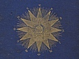

  
[Intangible Textual Heritage](../../index)  [Star Lore](../index.md) 
[Index](index)  [Previous](sb08)  [Next](sb10.md) 

------------------------------------------------------------------------

[Buy this Book at
Amazon.com](https://www.amazon.com/exec/obidos/ASIN/1417908904/internetsacredte.md)

------------------------------------------------------------------------

  
*Solar Biology*, by Hiram E. Butler, \[1887\], at Intangible Textual
Heritage

------------------------------------------------------------------------

p. 80

### CHAPTER IV.

#### POLARITY AND QUALITY.

We denominate mental tendency as
polarization of the mind. The moon acts as a magnet controlling the
front brain. Whatever sign the moon was in at the time of birth, its
nature, characteristics, and principles would form the general
subject-matter of the person's mind; yet their innate nature, determined
from the sign in which the earth was at birth, would give quality,
character, and color to the subject-matter or function in which they are
polarized, and on which they are mentally disposed to dwell. Thus, if we
should take twelve persons, born when the moon was in the same sign,
they would all be disposed to a corresponding plane of mental action,
yet they would bring to bear upon their work different powers and
qualities correspondent of their innate nature as derived from, and
characterized by, the sign of the sun's zodiac in which the earth was at
birth. The moon, consequently, establishes the plane or sphere of
activity; the position of the earth determines the resources or nature
with which one is equipped. Every time the moon enters the sign in which
a person was born the life forces are ripe for procreation, and also for
the renewal of one's own system. This is more apparent in the female
than in the male nature; and where a woman is living an orderly marital
life, the menstrual courses will begin

p. 81

about five or seven days prior to the moon's entering the sign in which
the earth was, in the sun's zodiac, at the time she was born; and when
it does enter the sign, the system will be in its best condition for
procreation: so, after it has passed out of this sign, the inclinations
will gradually die away. This will form a useful calendar for ladies to
know what time their menstrual periods are due (count one sign ahead of
that given in the almanac). Sometimes, when ladies’ conditions or
pursuits are inharmonious to their nature, their periods are changed to
the time of their polarity; that is, their periods occur when the moon
enters the sign of their polarization rather than on entering the sign
of their birth. In some cases, where the life forces are intensely
active, they will occur twice every moon. Such cases are most frequent
in hot climates; and, so to speak, such persons, so far as relates to
this function, live two years in one, and consequently will age
prematurely and die young. To avoid this, vigilant restraint should be
exercised over the activities of their nature, both physically,
mentally, and sexually. They should seek rest and quiet, cultivating
easy and harmonious conditions and movement until restored to the normal
periods of menstruation.

Another condition which produces a change in the time of their periods
is, when the mind of the wife is greatly absorbed in the husband, or
when the husband, by virtue of his positive nature, takes control of her
life forces: in which case, her periods will occur when the moon enters
the sign in which he was born, and sometimes it will be changed to the
sign of his polarity. To be regular, they never ought to have them
sooner

p. 82

or later than within these limits. Men and women are both more easily
affected by the opposite sex during the time the moon is in the sign in
which they were born, unless the period has been changed as above.
Again, men and women are strongest, and their mental powers are the
clearest, at this time. Therefore, their success in beginning business
will be most certain when the earth and the moon are both in the signs
in which they were born.

------------------------------------------------------------------------

[Next: Chapter V. Courage and Consolation for All](sb10.md)
