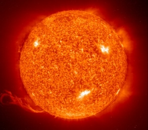

  
[Intangible Textual Heritage](../../index)  [Sky Lore](../index) 

------------------------------------------------------------------------

[Buy this Book at
Amazon.com](https://www.amazon.com/exec/obidos/ASIN/1585090441/internetsacredte)

------------------------------------------------------------------------

[Buy this Book on
Kindle](https://www.amazon.com/exec/obidos/ASIN/B002L16OXS/internetsacredte)

------------------------------------------------------------------------

<table width="75%">
<colgroup>
<col style="width: 50%" />
<col style="width: 50%" />
</colgroup>
<tbody>
<tr class="odd">
<td width="50%" data-valign="TOP"> 
Sun NASA/SOHO [1997] (Public Domain Image)</td>
<td width="50%" data-valign="CENTER"><h1 id="sun-lore-of-all-ages" data-align="CENTER">Sun Lore of All Ages</h1>
<h2 id="by-william-tyler-olcott" data-align="CENTER">by William Tyler Olcott</h2>
<h4 id="section" data-align="CENTER">[1914]</h4></td>
</tr>
</tbody>
</table>

------------------------------------------------------------------------

[Contents](#contents)    [Start Reading](slaa00)    [Page
Index](pageidx)    [Text \[Zipped\]](slaa.txt.gz)

------------------------------------------------------------------------

|                                                                                                                           |
|---------------------------------------------------------------------------------------------------------------------------|
|  |

This is a review of the literature of Sun lore. While for the most part
factually correct, this is not an academic study. Olcott is light on the
citations, and it apparent that he didn't use primary sources for the
vast majority of the myths. But by far the biggest problem here is the
reliance on the 19th century 'solar mythology' theorists, in which every
myth and scrap of folklore was interpreted as some symbolic aspect of
the sun, the solar year, the water cycle, and any other conceivable
sun-related phenomenon. That said, this is one of those books that makes
fascinating reading, whether you read it end-to-end or are just
browsing.

------------------------------------------------------------------------

 [Title Page](slaa00)  
[Introduction](slaa01)  
[Contents](slaa02)  
[Chapter I. Solar Creation Myths](slaa03)  
[Chapter II. Ancient Ideas of the Sun and the Moon](slaa04)  
[Chapter III. Solar Mythology](slaa05)  
[Chapter IV. Solar Mythology (*Continued*)](slaa06)  
[Chapter V. Solar Folk-Lore](slaa07)  
[Chapter VI. Sun Worship](slaa08)  
[Chapter VII. Sun Worship (*Continued*)](slaa09)  
[Chapter VIII. Sun-Catcher Myths](slaa10)  
[Chapter IX. Solar Festivals](slaa11)  
[Chapter X. Solar Omens, Traditions, and Superstitions](slaa12)  
[Chapter XI. Solar Significance of Burial Customs.
Orientation](slaa13)  
[Chapter XII. Emblematic and Symbolic Forms of the Sun](slaa14)  
