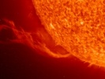

  
[Intangible Textual Heritage](../../index)  [Sky Lore](../index.md) 
[Index](index)  [Previous](slaa00)  [Next](slaa02.md) 

------------------------------------------------------------------------

[Buy this Book at
Amazon.com](https://www.amazon.com/exec/obidos/ASIN/1585090441/internetsacredte.md)

------------------------------------------------------------------------

[Buy this Book on
Kindle](https://www.amazon.com/exec/obidos/ASIN/B002L16OXS/internetsacredte.md)

------------------------------------------------------------------------

  
*Sun Lore of All Ages*, by William Tyler Olcott, \[1914\], at Intangible
Textual Heritage

------------------------------------------------------------------------

p. v

### Introduction

IN the compilation of the volume *Star Lore of All Ages*, a wealth of
interesting material pertaining to the mythology and folk-lore of the
sun and moon was discovered, which seemed worth collating in a separate
volume.

Further research in the field of the solar myth revealed sufficient
matter to warrant the publication of a volume devoted solely to the
legends, traditions, and superstitions that all ages and nations have
woven about the sun, especially in view of the fact that, to the
author's knowledge, no such publication has yet appeared.

The literature of the subject is teeming with interest, linked as it is
with the life-story of mankind from the cradle of the race to the
present day, for the solar myth lies at the very foundation of all
mythology, and as such must forever claim preeminence.

Naturally, there clusters about the sun a rich mine of folk-lore. The
prominence of the orb of day, its importance in the maintenance and the
development of life, the mystery that has ever

p. vi

enveloped it, its great influence in the well-being of mankind, have
secured for the sun a history of interest equalled by none, to which
every age and every race have contributed their pages.

In the light of modern science, this mass of myth and legend may seem
childish and of trifling value, but each age spells its own advance, and
the all-important present soon fades into the shadowy and forgotten
past. It is therefore in reviving past history that progress is best
measured and interpreted. The fancy so prevalent among the ancients that
the sun entered the sea each night with a hissing noise seems to us
utterly foolish and inane, but let us not ridicule past ages for their
crude notions and quaint fancies, lest some of the cherished ideas of
which we boast be transmuted by the touch of time into naught but idle
visions.

It is therefore important for the student of history to study the past
in all its phases, and whatever can be brought to light of the lore of
bygone ages should have for us a charm and should find a place in our
intellectual lives.

W. T. O.

NORWICH, CONN.

------------------------------------------------------------------------

[Next: Contents](slaa02.md)

