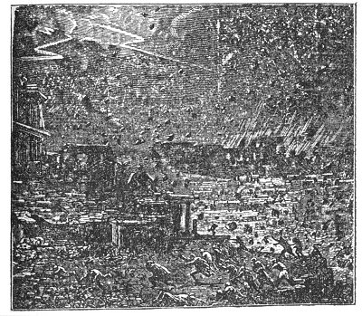
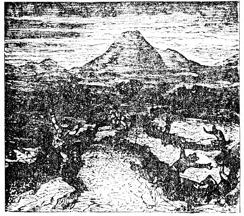
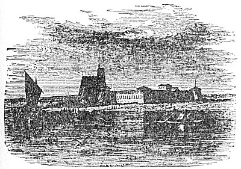
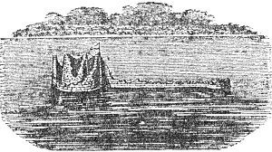

  
[Intangible Textual Heritage](../../index)  [Atlantis](../index.md) 
[Index](index)  [Previous](ataw103)  [Next](ataw105.md) 

------------------------------------------------------------------------

[Buy this Book at
Amazon.com](https://www.amazon.com/exec/obidos/ASIN/B0020ML528/internetsacredte.md)

------------------------------------------------------------------------

  
*Atlantis, the Antediluvian World*, by Ignatius Donnelly, \[1882\], at
Intangible Textual Heritage

------------------------------------------------------------------------

p. 31

 

## CHAPTER IV.

### WAS SUCH A CATASTROPHE POSSIBLE?

<table data-align="RIGHT">
<colgroup>
<col style="width: 100%" />
</colgroup>
<tbody>
<tr class="odd">
<td data-valign="CENTER"> 
COAL-MEASURES OF PENNSYLVANIA</td>
</tr>
</tbody>
</table>

ALL that is needed to answer this question is to briefly refer to some
of the facts revealed by the study of geology.

In the first place, the earth's surface is a record of successive
risings and fallings of the land. The accompanying picture represents a
section of the anthracite coal-measures of Pennsylvania. Each of the
coal deposits here shown, indicated by the black lines, was created when
the land had risen sufficiently above the sea to maintain vegetation;
each of the strata of rock, many of them hundreds of feet in thickness,
was deposited under water. Here we have twenty-three different changes
of the level of the land during the formation of 2000 feet of rock and
coal; and these changes took place over vast areas, embracing thousands
of square miles.

All the continents which now exist were, it is well understood, once,
under water, and the rocks of which they are composed were deposited
beneath the water; more than this, most of the rocks so deposited were
the detritus or washings of other continents, which then stood

p. 32

where the oceans now roll, and whose mountains and plains were ground
down by the action of volcanoes and earthquakes, and frost, ice, wind,
and rain, and washed into the sea, to form the rocks upon which the
nations now dwell; so that we have changed the conditions of land and
water: that which is now continent was once sea, and that which is now
sea was formerly continent. There can be no question that the Australian
Archipelago is simply the mountain-tops of a drowned continent, which
once reached from India to South America. Science has gone so far as to
even give it a name; it is called "Lemuria," and here, it is claimed,
the human race originated. An examination of the geological formation of
our Atlantic States proves beyond a doubt, from the manner in which the
sedimentary rocks, the sand, gravel, and mud--aggregating a thickness of
45,000 feet--are deposited, that they came from the north and east.
"They represent the detritus of pre-existing lands, the washings of
rain, rivers, coast-currents, and other agencies of erosion; and since
the areas supplying the waste could scarcely have been of less extent
than the new strata it formed, it is reasonably inferred that land
masses of continental magnitude must have occupied the region now
covered by the North Atlantic before America began to be, and onward at
least through the palæozoic ages of American history. The proof of this
fact is that the great strata of rocks are thicker the nearer we
approach their source in the east: the maximum thickness of the
palæozoic rocks of the Appalachian formation is 25,000 to 35,000 feet in
Pennsylvania and Virginia, while their minimum thickness in Illinois and
Missouri is from 3000 to 4000 feet; the rougher and grosser-textured
rocks predominate in the east, while the farther west we go the finer
the deposits were of which the rocks are composed; the finer materials
were carried farther west by the water." ("New Amer. Cyclop.," art.
*Coal*.)

The history of the growth of the European Continent, as recounted by
Professor Geikie, gives an instructive illustration

p. 33

 

   
DESTRUCTION OF POMPEII

 

of the relations of geology to geography. The earliest European land, he
says, appears to have existed in the north and north-west, comprising
Scandinavia, Finland, and the northwest of the British area, and to have
extended thence through boreal and arctic latitudes into North America.
Of the height and mass of this primeval land some idea may be formed by
considering the enormous bulk of the material derived from its
disintegration. In the Silurian formations of the British Islands alone
there is a mass of rock, worn from the land, which would form a
mountain-chain extending from Marseilles to the North Cape (1800 miles),
with a mean breadth of over thirty-three miles, and an average height of
16,000 feet.

As the great continent which stood where the Atlantic Ocean now is wore
away, the continents of America and Europe

p. 34

were formed; and there seems to have been from remote times a continuous
rising, still going on, of the new lands, and a sinking of the old ones.
Within five thousand years, or since the age of the "polished stone,"
the shores of Sweden, Denmark, and Norway have risen from 200 to 600
feet.

Professor Winchell says ("The Preadamites," p. 437):

We are in the midst of great, changes, and are scarcely conscious of it.
We have seen worlds in flames, and have felt a cornet strike the earth.
We have seen the whole coast of South America lifted up bodily ten or
fifteen feet and let down again in an hour. We have seen the Andes sink
220 feet in seventy years. . . Vast transpositions have taken place in
the coast-line of China. The ancient capital, located, in all
probability, in an accessible position near the centre of the empire,
has now become nearly surrounded by water, and its site is on the
peninsula of Corea. . . . There was a time when the rocky barriers of
the Thracian Bosphorus gave way and the Black Sea subsided. It had
covered a vast area in the north and east. Now this area became drained,
and was known as the ancient Lectonia: it is now the prairie region of
Russia, and the granary of Europe."

There is ample geological evidence that at one time the entire area of
Great Britain was *submerged to the depth of at least seventeen hundred
feet*. Over the face of the submerged land was strewn thick beds of
sand, gravel, and clay, termed by geologists "the Northern Drift." The
British Islands rose again from the sea, bearing these water-deposits on
their bosom. What is now Sicily once lay deep beneath the sea: A
subsequently rose 3000 feet above the sea-level. The Desert of Sahara
was once under water, and its now burning sands are a deposit of the
sea.

Geologically speaking, the submergence of Atlantis, within the
historical period, was simply the last of a number of vast changes, by
which the continent which once occupied the greater part of the Atlantic
had gradually sunk under the ocean, while the new lands were rising on
both sides of it.

p. 35

We come now to the second question, Is it possible that Atlantis could
have been suddenly destroyed by such a convulsion of nature as is
described by Plato? The ancients regarded this part of his story as a
fable. With the wider knowledge which scientific research has afforded
the modern world, we can affirm that such an event is not only possible,
but that the history of even the last two centuries has furnished us
with striking parallels for it. We now possess the record of numerous
islands lifted above the waters, and others sunk beneath the waves,
accompanied by storms and earthquakes similar to those which marked the
destruction of Atlantis.

In 1783 Iceland was visited by convulsions more tremendous than any
recorded in the modern annals of that country. About a month previous to
the eruption on the main-land a submarine volcano burst forth in the
sea, at a distance of thirty miles from the shore. It ejected so much
pumice that the sea was covered with it for a distance of 150 miles, and
ships were considerably impeded in their course. A new island was thrown
up, consisting of high cliffs, which was claimed by his Danish Majesty,
and named "Nyöe," or the New Island; but before a year had elapsed it
sunk beneath the sea, leaving a reef of rocks thirty fathoms under
water.

The earthquake of 1783 in Iceland destroyed 9000 people out of a
population of 50,000; twenty villages were consumed by fire or inundated
by water, and a mass of lava thrown out greater than the entire bulk of
Mont Blanc."

On the 8th of October, 1822, a great earthquake occurred on the island
of Java, near the mountain of Galung Gung. "A loud explosion was heard,
the earth shook, and immense columns of hot water and boiling mud, mixed
with burning brimstone, ashes, and lapilli, of the size of nuts, were
projected from the mountain like a water-spout, with such prodigious
violence that large quantities fell beyond the river Tandoi, which is
forty miles distant. . . . The first eruption lasted

p. 36

nearly five hours; and on the following days the rain fell ill torrents,
and the rivers, densely charged with mud, deluged the country far and
wide. At the end of four days (October 12th), a second eruption
occurred, more violent than the first, in which hot water and mud were
again vomited, and great blocks of basalt were thrown to the distance of
seven miles from the volcano. There was at the same time a violent
earthquake, the face of the mountain was utterly changed, its summits
broken down, and one side, which had been covered with trees, became an
enormous gulf in the form of a semicircle. Over 4000 persons were killed
and 114 villages destroyed." (Lyell's "Principles of Geology," p. 430.)

In 1831 a new island was born in the Mediterranean, near the coast of
Sicily. It was called Graham's Island. It came up with an earthquake,
and "a water-spout sixty feet high and eight hundred yards in
circumference rising from the sea." In about a month the island was two
hundred feet high and three miles in circumference; it soon, however,
stink beneath the sea.

The Canary Islands were probably a part of the original empire of
Atlantis. On the 1st of September, 1730, the earth split open near Year,
in the island of Lancerota. In one night a considerable hill of ejected
matter was thrown up; in a few days another vent opened and gave out a
lava stream which overran several villages. It flowed at first rapidly,
like water, but became afterward heavy and slow, like honey. On the 11th
of September more lava flowed out, covering up a village, and
precipitating itself with a horrible roar into the sea. Dead fish
floated on the waters in indescribable multitudes, or were thrown dying
on the shore; the cattle throughout the country dropped lifeless to the
ground, suffocated by putrid vapors, which condensed and fell down in
drops. These manifestations were accompanied by a storm such as the
people of the country had never known before. These dreadful commotions
lasted for *five years*. The lavas thrown out covered *one-third of the
whole island of Lancerota*.

p. 37

The Gulf of Santorin, in the Grecian Archipelago, has been for two
thousand years a scene of active volcanic operations. Pliny informs us
that in the year 186 B.C. the island of "Old Kaimeni," or the Sacred
Isle, was lifted up from the sea; and in A.D. 19 the island of "Thia"
(the Divine) made its appearance. In A.D. 1573 another island was
created, called "the small sunburnt island." In 1848 a volcanic
convulsion of three months' duration created a great shoal; an
earthquake

 

   
CALABRIAN PEASANTS INGULFED BY CREVASSES (1783).

 

destroyed many houses in Thera, and the sulphur and hydrogen issuing
from the sea killed 50 persons and 1000 domestic animals. A recent
examination of these islands shows that the whole mass of Santorin *has
sunk, since its projection from the sea, over* 1200 *feet*.

p. 38

The fort and village of Sindree, on the eastern arm of the Indus, above
Luckput, was submerged in 1819 by an earthquake, together *with a tract
of country* 2000 *square miles in extent*.

"In 1828 Sir A. Burnes went in a boat to the ruins of Sindree, where a
single remaining tower was seen in the midst of a wide expanse of sea.
The tops of the ruined walls still rose two or three feet above the
level of the water; and, standing on one of these, he could behold
nothing in the horizon but water, except in one direction, where a blue
streak of land to the north indicated the Ullah Bund. This scene," says
Lyell ("Principles of Geology," p. 462), "presents to the imagination a
lively picture of the revolutions now in progress on the earth-a waste
of waters where a few years before all was land, and the only land
visible consisting of ground uplifted by a recent earthquake."

We give from Lyell's great work the following curious pictures of the
appearance of the Fort of Sindree before and after the inundation.

In April, 1815, one of the most frightful eruptions recorded in history
occurred in the province of Tomboro, in the island of Sumbawa, about two
hundred miles from the eastern extremity of Java. It lasted from April
5th to July of that year; but was most violent on the 11th and 12th of
July. The sound of the explosions was heard for nearly one thousand
miles. *Out of a population of* 12,000*, in the province of Tombora,
only twenty-six individuals escaped*. "Violent whirlwinds carried up
men, horses, and cattle into the air, tore tip the largest trees by the
roots, and covered the whole sea with floating timber." (Raffles's
"History of Java," vol. i., p. 28.) *The ashes darkened the air*; "the
floating cinders to the westward of Sumatra formed, on the 12th of
April, a mass two feet thick and several miles in extent, *through which
ships with difficulty forced their way*." The darkness in daytime was
more profound than the blackest night. "The town called Tomboro, on the
west side of Sumbawa, was overflowed by the sea, which encroached upon
the shore, *so that the water remained* 

p. 39

 

   
FORT OF SINDEE, ON THE EASTERN BRANCH OF THE INDUS, BEFORE IT WAS
SUBMERGED BY THE EARTHQUAKE OF 1819.

   
VIEW OF THE FORT OF SINDREE FROM THE WEST IN MARCH, 1839.

 

permanently eighteen feet deep in places where there was land before.
The area covered by the convulsion was 1000 English miles in
circumference. "*In the island of Amboyna, in the same month and year,
the ground opened, threw out water*,

 

p. 40

and then closed again." (Raffles's "History of Java," vol. i., p. 25.)

But it is at that point of the European coast nearest to the site of
Atlantis at Lisbon that the most tremendous earthquake of modern times
has occurred. On the 1st of November, 1775, a sound of thunder was heard
underground, and immediately afterward a violent shock threw down the
greater part of the city. *In six minutes* 60,000 *persons perished*. A
great concourse of people had collected for safety upon a new quay,
built entirely of marble; but suddenly it sunk down with all the people
on it, and not one of the dead bodies ever floated to the surface. A
great number of small boats and vessels anchored near it, and, full of
people, were swallowed up as in a whirlpool. No fragments of these
wrecks ever rose again to the surface; the water where the quay went
down is now 600 feet deep. The area covered by this earthquake was very
great. Humboldt says that a portion of *the earth's surface, four times
as great as the size of Europe, was simultaneously shaken*. It extended
from the Baltic to the West Indies, and from Canada to Algiers. At eight
leagues from Morocco the ground opened and swallowed a village of 10,000
inhabitants, and closed again over them.

It is very probable that the centre of the convulsion was in the bed of
the Atlantic, at or near the buried island of Atlantis, and that it was
a successor of the great earth throe which, thousands of years before,
had brought destruction upon that land.

Ireland also lies near the axis of this great volcanic area, reaching
from the Canaries to Iceland, and it has been many times in the past the
seat of disturbance. The ancient annals contain numerous accounts of
eruptions, preceded by volcanic action. In 1490, at the Ox Mountains,
Sligo, one occurred by which one hundred persons and numbers of cattle
were destroyed; and a volcanic eruption in May, 1788, on the hill of
Knocklade, Antrim, poured a stream of lava sixty yards wide for
thirty-nine

p. 41

 

  [  
Click to enlarge](img/04100.jpg.md)  
ERUPTION OF VESUVIUS IN 1737.

 

p. 43

hours, and destroyed the village of Ballyowen and all the inhabitants,
save a man and his wife and two children. ("Amer. Cyclop.," art.
*Ireland*.)

While we find Lisbon and Ireland, east of Atlantis, subjected to these
great earthquake shocks, the West India Islands, west of the same
centre, have been repeatedly visited in a similar manner. In 1692
Jamaica suffered from a violent earthquake. The earth opened, and great
quantities of water were cast out; many people were swallowed up in
these rents; the earth caught some of them by the middle and squeezed
them to death; the heads of others only appeared above-ground. A tract
of land near the town of Port Royal, about a thousand acres in extent,
sunk down in less than one minute, and the sea immediately rolled in.

The Azore Islands are undoubtedly the peaks of the mountains of
Atlantis. They are even yet the centre of great volcanic activity. They
have suffered severely from eruptions and earthquakes. In 1808 a volcano
rose suddenly in San Jorge to the height of 3500 feet, and burnt for six
days, desolating the entire island. In 1811 a volcano rose from the sea,
near San Miguel, creating an island 300 feet high, which was named
Sambrina, but which soon sunk beneath the sea. Similar volcanic
eruptions occurred in the Azores in 1691 and 1720.

Along a great line, a mighty fracture in the surface of the globe,
stretching north and south through the Atlantic, we find a continuous
series of active or extinct volcanoes. In Iceland we have Oerafa, Hecla,
and Rauda Kamba; another in Pico, in the Azores; the peak of Teneriffe;
Fogo, in one of the Cape de Verde Islands: while of extinct volcanoes we
have several in Iceland, and two in Madeira; while Fernando de Noronha,
the island of Ascension, St. Helena, and Tristan d'Acunha are all of
volcanic origin. ("Cosmos," vol. v., p. 331.)

The following singular passage we quote entire from Lyell's Principles
of Geology," p. 436:

p. 44

"In the *Nautical Magazine* for 1835, p. 642, and for 1838, p. 361, and
in the *Comptes Rendus*, April, 1838, accounts are given of a series of
volcanic phenomena, earthquakes, troubled water, floating scoria, and
columns of smoke, which have been observed at intervals since the middle
of the last century, in a space of open sea between longitudes 20° and
22' W., about half a degree south of the equator. These facts, says Mr.
Darwin, seem to show that an island or archipelago is in process of
formation in the middle of the Atlantic. A line joining St. Helena and
Ascension would, if prolonged, intersect this slowly nascent focus of
volcanic action. Should land be eventually formed here, it will not be
the first that has been produced by igneous action in this ocean since
it was inhabited by the existing species of testacea. At Porto Praya, in
St. Jago, one of the Azores, a horizontal, calcareous stratum occurs,
containing shells of recent marine species, covered by a great sheet of
basalt eighty feet thick. It would be difficult to estimate too highly
the commercial and political importance which a group of islands might
acquire if, in the next two or three thousand years, they should rise in
mid-ocean between St. Helena and Ascension."

These facts would seem to show that the great fires which destroyed
Atlantis are still smouldering in the depths of the ocean; that the vast
oscillations which carried Plato's continent beneath the sea may again
bring it, with all its buried treasures, to the light; and that even the
wild imagination of Jules Verne, when he described Captain Nemo, in his
diving armor, looking down upon the temples and towers of the lost
island, ht by the fires of submarine volcanoes, had some groundwork of
possibility to build upon.

But who will say, in the presence of all the facts here enumerated, that
the submergence of Atlantis, in some great world-shaking cataclysm, is
either impossible or improbable? As will be shown hereafter, when we
come to discuss the Flood legends, every particular which has come down
to us of the destruction of Atlantis has been duplicated in some of the
accounts just given.

p. 45

We conclude, therefore: 1. That it is proven beyond question, by
geological evidence, that vast masses of land once existed in the region
where Atlantis is located by Plato, and that therefore such an island
must have existed; 2. That there is nothing improbable or impossible in
the statement that it was destroyed suddenly by an earthquake "in one
dreadful night and day."

------------------------------------------------------------------------

[Next: Chapter V: The Testimony of the Sea.](ataw105.md)
