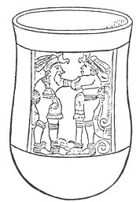
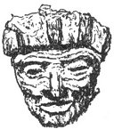
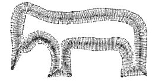
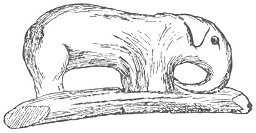
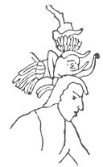
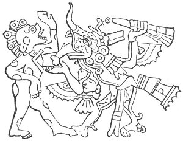

  
[Intangible Textual Heritage](../../index)  [Atlantis](../index) 
[Index](index)  [Previous](ataw302)  [Next](ataw304) 

------------------------------------------------------------------------

[Buy this Book at
Amazon.com](https://www.amazon.com/exec/obidos/ASIN/B0020ML528/internetsacredte)

------------------------------------------------------------------------

  
*Atlantis, the Antediluvian World*, by Ignatius Donnelly, \[1882\], at
Intangible Textual Heritage

------------------------------------------------------------------------

p. 165

## CHAPTER III.

### AMERICAN EVIDENCES OF INTERCOURSE WITH EUROPE OR ATLANTIS.

1\. ON the monuments of Central America there are representations of
bearded men. How could the beardless American Indians have imagined a
bearded race?

2\. All the traditions of the civilized races of Central America point
to an *Eastern* origin.

The leader and civilizer of the Nahua family was Quetzalcoatl. This is
the legend respecting him:

"*From the distant East*, from the fabulous Hue Hue Tlapalan, this
mysterious person came to Tula, and became the patron god and
high-priest of the ancestors of the Toltecs. He is described as having
been *a white man*, with strong formation of body, broad forehead, large
eyes, and *flowing beard*. He wore a mitre on his head, and was dressed
in a long white robe reaching to his feet, and covered with red crosses.
In his hand he held a sickle. His habits were ascetic, he never married,
was most chaste and pure in life, and is said to have endured penance in
a neighboring mountain, not for its effects upon himself, but as a
warning to others. He condemned sacrifices, except of fruits and
flowers, and was known as the god of peace; for, when addressed on the
subject of war, he is reported to have stopped his ears with his
fingers." ("North Amer. of Antiq.," p. 268.)

"He was skilled in many arts: he invented" (that is, imported)
"gem-cutting and metal-casting; he originated letters, and invented the
Mexican calendar. He finally returned to the land in the East from which
he came: leaving the American coast at Vera Cruz, he embarked in a canoe
made of serpent-skins, and '*sailed away into the east*.'" (*Ibid*., p.
271.)

p. 166

Dr. Le Plongeon says of the columns at Chichen:

"The base is formed by the head of Cukulcan, the shaft of the body of
the serpent, with its feathers beautifully carved to 

<table data-align="LEFT">
<colgroup>
<col style="width: 100%" />
</colgroup>
<tbody>
<tr class="odd">
<td data-valign="CENTER"> 
ANCIENT MEXICAN VASE.</td>
</tr>
</tbody>
</table>

the very chapiter. On the chapiters of the columns that support the
portico, at the entrance of the castle in Chichen Itza, may be seen the
carved figures of long-bearded men, with upraised hands, in the act of
worshipping sacred trees. They forcibly recall to mind the same worship
in Assyria."

In the accompanying cut of an ancient vase from Tula, we see a bearded
figure grasping a beardless man.

In the cut given below we see a face that might be duplicated among the
old men of any part of Europe.

The Cakchiquel MS. says: "Four persons came from Tulan, from the
*direction of the rising sun*--that is one Tulan. There is another Tulan
in Xibalbay, and another 

<table data-align="RIGHT">
<colgroup>
<col style="width: 100%" />
</colgroup>
<tbody>
<tr class="odd">
<td data-valign="CENTER"> 
BEARDED HEAD, FROM TEOTEHUACAN.</td>
</tr>
</tbody>
</table>

where the sun sets, *and it is there that we came*; and in the direction
of the setting sun there is another, where is the god; so that there are
four Tulans; and it is where the sun sets that we came to Tulan, *from
the other side of the sea*, where this Tulan is; and it is there that we
were conceived and begotten by our mothers and fathers."

That is to say, the birthplace of the race was in the East, across the
sea, at a place called Tulan and when they emigrated they called their
first stopping-place on the American continent Tulan also; and besides
this there were two other Tulans.

p. 167

"Of the Nahua predecessors of the Toltecs in Mexico the Olmecs and
Xicalaucans were the most important. They were the forerunners of the
great races that followed. According to Ixtlilxochitl, these
people-which are conceded to be one occupied the world in the third age;
*they came from the East in ships or barks* to the land of Potonchan,
which they commenced to populate."

3\. The Abbé Brasseur de Bourbourg, in one of the notes of the
Introduction of the "Popol Vuh," presents a very remarkable analogy
between the kingdom of Xibalba, described in that work, and Atlantis. He
says:

"Both countries are magnificent, exceedingly fertile, and abound in the
precious metals. The empire of Atlantis was divided into ten kingdoms,
governed by five couples of twin sons of Poseidon, the eldest being
supreme over the others; and the ten constituted a tribunal that managed
the affairs of the empire. Their descendants governed after them. The
ten kings of Xibalba, who reigned (in couples) under Hun-Came and
Vukub-Came (and who together constituted a grand council of the
kingdom), certainly furnish curious points of comparison. And there is
wanting neither a catastrophe--for Xibalba had a terrific
inundation--nor the name of Atlas, of which the etymology is found only
in the Nahuatl tongue: it comes from atl, water; and we know that a city
of Atlan (near the water) still existed on the Atlantic side of the
Isthmus of Panama at the time of the Conquest."

"In Yucatan the traditions all point to an *Eastern and foreign* origin
for the race. The early writers report that the natives believe their
ancestors to have crossed the sea by a passage which was opened for
them." (Landa's "Relacion," p. 28.)

"It was also believed that part of the population came into the country
from the West. Lizana says that the smaller portion, 'the little
descent,' came from the East, while the greater portion, 'the great
descent,' came from the West. Cogolluda considers the Eastern colony to
have been the larger. . . . The culture-hero Zamna, the author of all
civilization in Yucatan, is described as *the teacher of letters*, and
the leader of the people from their ancient home. . . . He was the
leader of a colony from the East." ("North Amer. of Antiq.," p. 229.)

p. 168

The ancient Mexican legends say that, after the Flood, Coxcox and his
wife, after wandering one hundred and four years, landed at *Antlan*,
and passed thence to Capultepec, and thence to Culhuacan, and lastly to
Mexico.

Coming from Atlantis, they named their first landing-place *Antlan*.

All the races that settled Mexico, we are told, traced their origin back
to an *Aztlan* (Atlan-tis). Duran describes Aztlan as "a most attractive
land." ("North Amer. of Antiq.," p. 257.)

Samé, the great name of Brazilian legend, came across the ocean *from
the rising sun*. He had power over the elements and tempests; the trees
of the forests would recede to make room for him (cutting down the
trees); the animals used to crouch before him (domesticated animals);
lakes and rivers became solid for him (boats and bridges); and he taught
the use of agriculture and magic. Like him, Bochica, the great law-giver
of the Muyscas, and son of the sun--he who invented for them the
calendar and regulated their festivals--had a white beard, a detail in
which all the American culture-heroes agree. The "Samé" of Brazil was
probably the "Zamna" of Yucatan.

4\. We find in America numerous representations of the elephant. We are
forced to one of two conclusions: either the

 

   
ELEPHANT MOUND, WISCONSIN.

 

monuments date back to the time of the mammoth in North America, or
these people held intercourse at some time in the

p. 169

past with races who possessed the elephant, and from whom they obtained
pictures of that singular animal. Plato tells us that the Atlanteans
possessed great numbers of elephants.

There are in Wisconsin a number of mounds of earth representing
different animals-men, birds, and quadrupeds.

 

   
ELEPHANT PIPE, LOISA COUNTY, IOWA.

 

\[paragraph continues\] Among the latter
is a mound representing an elephant, "so perfect in its proportions, and
complete in its representation of an elephant, that its builders must
have been well acquainted with all the physical characteristics of 

<table data-align="RIGHT">
<colgroup>
<col style="width: 100%" />
</colgroup>
<tbody>
<tr class="odd">
<td data-valign="CENTER"> 
ELEPHANT-TRUNK HEAD-DRESS, PALENQUE.</td>
</tr>
</tbody>
</table>

the animal which they delineated." We copy the representation of this
mound on [page 168](#img_16800).

On a farm in Louisa County, Iowa, a pipe was ploughed up which also
represents an elephant. We are indebted to the valuable work of John T.
Short ("The North Americans of Antiquity," p. 530) for a picture of this
singular object. It was found in a section where the ancient mounds were
very abundant and rich in relies. The pipe is of sandstone, of the
ordinary Mound-Builder's type, and has every appearance of age and
usage. There can be no doubt of its genuineness. The finder had no
conception of its archæological value.

In the ruined city of Palenque we find, in one of the palaces,

p. 170

a stucco bass-relief of a priest. His elaborate head-dress or helmet
represents very faithfully the head of an elephant. The [cut on page
169](#img_16900) is from a drawing made by Waldeck.

The decoration known as "elephant-trunks" is found in many parts of the
ancient ruins of Central America, projecting from above the door-ways of
the buildings.

In Tylor's "Researches into the Early History of Mankind," p. 313, I
find a remarkable representation of an elephant, taken from an ancient
Mexican manuscript. It is as follows:

 

   
MEXICAN REPRESENTATION OF ELEPHANT.

 

------------------------------------------------------------------------

[Next: Chapter IV: Corroborating Circumstances.](ataw304)
