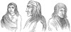
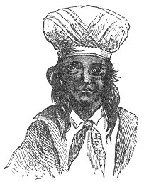
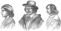
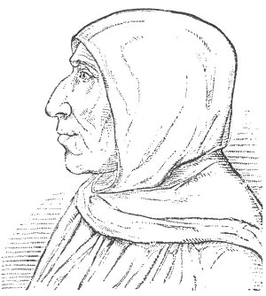
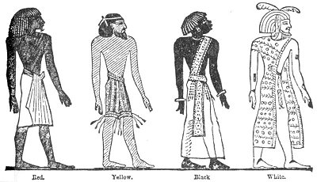

  
[Intangible Textual Heritage](../../index)  [Atlantis](../index) 
[Index](index)  [Previous](ataw304)  [Next](ataw306) 

------------------------------------------------------------------------

[Buy this Book at
Amazon.com](https://www.amazon.com/exec/obidos/ASIN/B0020ML528/internetsacredte)

------------------------------------------------------------------------

  
*Atlantis, the Antediluvian World*, by Ignatius Donnelly, \[1882\], at
Intangible Textual Heritage

------------------------------------------------------------------------

p. 183

## CHAPTER V.

### THE QUESTION OF COMPLEXION.

THE tendency of scientific thought in ethnology is in the direction of
giving more and more importance to the race characteristics, such as
height, color of the hair, eyes and skin, and the formation of the skull
and body generally, than to language. The language possessed by a people
may be merely the result of conquest or migration. For instance, in the
United States to-day, white, black, and red men, the descendants of
French, Spanish, Italians, Mexicans, Irish, Germans, Scandinavians,
Africans, all speak the English language, and by the test of language
they are all Englishmen; and yet none of them are connected by birth or
descent with the country where that language was developed.

There is a general misconception as to the color of the European and
American races. Europe is supposed to be peopled exclusively by white
men; but in reality every shade of color is represented on that
continent, from the fair complexion of the fairest of the Swedes to the
dark-skinned inhabitants of the Mediterranean coast, only a shade
lighter than the Berbers, or Moors, on the opposite side of that sea.
Tacitus spoke of the "Black Celts," and the term, so far as complexion
goes, might not inappropriately be applied to some of the Italians,
Spaniards, and Portuguese, while the Basques are represented as of a
still darker hue. Tylor says ("Anthropology," p. 67), "On the whole, it
seems that the distinction of color, from the fairest Englishman to the
darkest African, has no hard and fast lines. but varies gradually from
one tint to another."

And when we turn to America we find that the popular

p. 184

opinion that all Indians are "red men," and of the same hue from
Patagonia to Hudson's Bay, is a gross error.

Prichard says ("Researches into the Physical History of Mankind," vol.
i., p. 269, 4th ed., 1841):

"It will be easy to show that the American races show nearly as great a
variety in this respect as the nations of the old continent; there are
among them white races with a florid complexion, and tribes black or of
a very dark hue; that their stature, figure, and countenance are almost
equally diversified."

John T. Short says ("North Americans of Antiquity," p. 189):

"The Menominees, sometimes called the 'White Indians,' formerly occupied
the region bordering on Lake Michigan, around Green Bay. The whiteness
of these Indians, which is compared to that of white mulattoes, early
attracted the attention of the Jesuit missionaries, and has often been
commented on by travellers. While it is true that hybridy has done much
to lighten the color of many of the tribes, still the peculiarity of the
complexion of this people has been marked since the first time a
European encountered them. Almost every shade, from the ash-color of the
Menominees through the cinnamon-red, copper, and bronze tints, may be
found among the tribes formerly occupying the territory cast of the
Mississippi, until we reach the dark-skinned Kaws of Kansas, who are
nearly as black as the negro. The variety of complexion is as great in
South America as among the tribes of the northern part of the
continent."

In foot-note of p. 107 of vol. iii. of "U. S. Explorations for a
Railroad Route to the Pacific Ocean," we are told,

"Many of the Indians of Zuni (New Mexico) are white. They have a fair
skin, blue eyes, chestnut or auburn hair, and are quite good-looking.
They claim to be full-blooded Zunians, and have no tradition of
intermarriage with any foreign race. The circumstance creates no
surprise among this people, for from time immemorial a similar class of
people has existed among the tribe."

p. 185

Winchell says:

"The ancient Indians of California, in the latitude of forty-two
degrees, were as black as the negroes of Guinea, while in Mexico were
tribes of an olive or reddish complexion, relatively light. Among the
black races of tropical regions we find, generally, some light-colored
tribes interspersed. These sometimes have light hair and blue eyes. This
is the case with the Tuareg of the Sahara, the Afghans of India, and the
aborigines of the banks of the Oronoco and the Amazon." (Winchell's
"Preadamites, p. 185.)

William Penn said of the Indians of Pennsylvania, in his letter of
August, 1683:

"The natives . . . are generally tall, straight, well-built, and of
singular proportion; they tread strong and clever, and mostly walk with
a lofty chin. . . . Their eye is little and black, not unlike a
straight-looked Jew. . . . I have seen among them as comely
European-like faces of both sexes as on your side of the sea; and truly
an Italian complexion hath not much more of the white, and the noses of
several of them have as much of the Roman. . . . For their original, I
am ready to believe them to be of the Jewish race--I mean of the stock
of the ten tribes--and that for the following reasons: first, in the
next place, I find them to be of the like countenance, and their
children of so lively a resemblance that a man would think himself in
Duke's Place or Berry Street in London when he seeth them. But this is
not all: they agree in rites, they reckon by moons, they offer their
first-fruits, they have a kind of feast of tabernacles, they are said to
lay their altars upon twelve stones, their mourning a year, customs of
women, with many other things that do not now occur."

Upon this question of complexion Catlin, in his "Indians of North
America," vol. i., p. 95, etc., gives us some curious information. We
have already seen that the Mandans preserved an image of the ark, and
possessed legends of a clearly Atlantean character. Catlin says:

"A stranger in the Mandan village is first struck with the different
shades of complexion and various colors of hair which

p. 186

he sees in a crowd about him, and is at once disposed to exclaim, 'These
are not Indians.' There are a great many of these people whose
complexions appear as light as half-breeds; and among the women
particularly there are many whose skins are almost white, with the most
pleasing symmetry and proportion of feature; with hazel, with gray, and
with blue eyes; with mildness and sweetness of expression and excessive
modesty of demeanor, which render them exceedingly pleasing and
beautiful. Why this diversity of complexion I cannot tell, nor can they
themselves account for it. Their traditions, so far as I can learn them,
afford us no information of their having had any knowledge of white men
before the visit of Lewis and Clarke, made to their village thirty-three
years ago. Since that time until now (1835) there have been very few
visits of white men to this place, and surely not enough to have changed
the complexions and customs of a nation. And I recollect perfectly well
that Governor Clarke told me, before I started for this place, that I
would find the Mandans a strange people and half white.

"Among the females may be seen every shade and color of hair that can be
seen in our own country except red or auburn, which is not to be found.
. . . There are very many of both sexes, and of every age, from infancy
to manhood and old age, with hair of a bright silvery-gray, and in some
instances almost perfectly white. This unaccountable phenomenon is not
the result of disease or habit, but it is unquestionably an hereditary
characteristic which runs in families, and indicates no inequality in
disposition or intellect. And by passing this hair through my hands I
have found it uniformly to be as coarse and harsh as a horse's mane,
differing materially from the hair of other colors, which, among the
Mandans, is generally as fine and soft as silk.

"The stature of the Mandans is rather below the ordinary size of man,
with beautiful symmetry of form and proportion, and wonderful suppleness
and elasticity."

Catlin gives a group (54) showing this great diversity in complexion:
one of the figures is painted almost pure white, and with light hair.
The faces are European.

Major James W. Lynd, who lived among the Dakota Indians for nine years,
and was killed by them in the great outbreak of

p. 187

 

  [  
Click to enlarge](img/18700.jpg)  
GOVERNOR AND OTHER INDIANS OF THE PUEBLO OF SAN DOMINGO, NEW MEXICO.

 

p. 188

\[paragraph continues\] 1862, says (MS.
"Hist. of Dakotas," Library, Historical Society, Minnesota, p. 47),
after calling attention to the fact that the different tribes of the
Sioux nation represent several different degrees of darkness of color:

"The Dakota child is of lighter complexion than the young brave; this
one lighter than the middle-aged man, and the middle-aged man lighter
than the superannuated *homo*, who, by smoke, paint, dirt, and a drying
up of the vital juices, appears to be the true copper-colored Dakota.
The color of the Dakotas varies with the nation, and also with the age
and condition of the individual. It may be set down, however, as a shade
lighter than olive; yet it becomes still lighter by change of condition
or mode of life, and nearly vanishes, even in the child, under constant
ablutions and avoiding of exposure. Those children in the Mission at
Hazlewood, who are taken very young, and not allowed to expose
themselves, lose almost entirely the olive shade, and become quite as
white as the American child. The Mandans are as light as the peasants of
Spain, while their brothers, the Crows, are as dark as the Arabs. Dr.
Goodrich, in the 'Universal Traveller,' p. 154, says that the modern
Peruvians, in the warmer regions of Peru, are as fair as the people of
the south of Europe."

"The Aymaras, the ancient inhabitants of the mountains of Peru and
Bolivia, are described as having an olive-brown complexion, with regular
features, large heads, and a thoughtful and melancholy cast of
countenance. They practised in early times the deformation of the skull.

Professor Wilson describes the hair of the ancient Peruvians, as found
upon their mummies, as "a lightish brown, and of a fineness of texture
which equals that of the Anglo-Saxon race." "The ancient Peruvians,"
says Short ("North Americans of Antiquity," p. 187), "appear, from
numerous examples of hair found in their tombs, to have been an
auburn-haired race." Garcilasso, who had an opportunity of seeing the
body of the king, Viracocha, describes the hair of that monarch as
snow-white. Haywood tells us of the discovery, at the beginning of this
century, of three mummies in a cave on the south side of the

p. 190

Cumberland River (Tennessee), who were buried in baskets, as the
Peruvians were occasionally buried, and whose skin was fair and white,
and their hair auburn, and of a fine texture. ("Natural and Aboriginal
History of Tennessee," p. 191.)

 

   
CHOCTAW.

 

Neither is the common opinion correct which asserts all the American
Indians to be of the same type of features. The portraits on this page
and on pages 187 and 191, taken from the "Report of the U. S. Survey for
a Route for a Pacific Railroad," present features very much like those
of Europeans; in fact, every face here could be precisely matched among
the inhabitants of the southern part of the old continent.

p. 191

 

  [  
Click to enlarge](img/19100.jpg)  
SHAWNEES.

 

p. 193

On the other hand, look at the portrait of the great Italian orator and
reformer, Savonarola, on page [193](#img_19300). It looks more like the
hunting Indians of North-western America than any of the preceding
faces. In fact, if it was dressed with a scalp-lock it would pass muster
anywhere as a portrait of the "Man-afraid-of-his-horses," or "Sitting
Bull."

 

   
SAVONAROLA.

 

Adam was, it appears, a *red* man. Winchell tells us that Adam is
derived from the *red* earth. The radical letters ÂDâM are found in
ADaMaH, "something out of which vegetation was made to germinate," to
wit, the earth. ÂDôM and ÂDOM signifies *red, ruddy, bay-colored*, as of
a horse, the color of a red heifer. "ÂDâM, a man, a human being, male or
female, *red, ruddy*." ("Preadamites," p.161.)

"The Arabs distinguished mankind into two races, one *red, ruddy*, the
other black." (*Ibid*.) They classed themselves among the red men.

p. 194

Not only was Adam a red man, but there is evidence that, from the
highest antiquity, red was a sacred color; the gods of the ancients were
always painted *red*. The Wisdom of Solomon refers to this custom: "The
carpenter carved it elegantly, and formed it by the skill of his
understanding, and fashioned it to the shape of a man, or made it like
some vile beast, laying it over with vermilion, and with paint, coloring
it red, and covering every spot therein."

The idols of the Indians were also painted red, and red was the
religious color. (Lynd's MS. "Hist. of Dakotas," Library, Hist. Society,
Minn.)

The Cushites and Ethiopians, early branches of the Atlantean stock, took
their name from their "sunburnt" complexion; they were red men.

The name of the Phœnicians signified *red*. *Himyar*, the prefix of the
*Himyaritic* Arabians, also means red, and the Arabs were painted red on
the Egyptian monuments.

The ancient Egyptians were red men. They recognized four races of
men--the red, yellow, black, and white men. They themselves belonged to
the "*Rot*," or red men; the yellow men they called "*Namu*"--it
included the Asiatic races; the black men were called "*Nahsu*," and the
white men "*Tamhu*." The following figures are copied from Nott and
Gliddon's "Types of Mankind," p. 85, and were taken by them from the
great works of Belzoni, Champollion, and Lepsius.

In later ages so desirous were the Egyptians of preserving, the
aristocratic distinction of the color of their skin, that they
represented themselves on the monuments as of a crimson hue--an
exaggeration of their original race complexion.

In the same way we find that the ancient Aryan writings divided mankind
into four races--the white, red, yellow, and black: the four castes of
India were founded upon these distinctions in color; in fact, the word
for color in Sanscrit (*varna*) means caste. The red men, according to
the *Mahâbhârata*, were the Kshatriyas--the warrior caste-who were
afterward

p. 195

engaged in a fierce contest with the whites--the Brahmans--and were
nearly exterminated, although some of them survived, and from their
stock Buddha was born. So that not only the Mohammedan and Christian but
the Buddhistic religion seem to be derived from branches of the Hamitic
or red stock. The great Manu was also of the red race.

 

   
THE RACES OF MEN ACCORDING TO THE EGYPTIANS.

 

The Egyptians, while they painted themselves red-brown, represented the
nations of Palestine as yellow-brown, and the Libyans yellow-white. The
present inhabitants of Egypt range from a yellow color in the north
parts to a deep *bronze*. Tylor is of opinion ("Anthropology," p. 95)
that the ancient Egyptians belonged to a brown race, which embraced the
Nubian tribes and, to some extent, the Berbers of Algiers and Tunis. He
groups the Assyrians, Phœnicians, Persians, Greeks, Romans, Andalusians,
Bretons, dark Welshmen, and people of the Caucasus into one body, and
designates them as "dark whites." The Himyarite Arabs, as I have shown,
derived their name originally from their red color, and they were
constantly depicted on the Egyptian monuments as red or light

p. 196

brown. Herodotus tells us that there was a nation of Libyans, called the
Maxyans, who claimed descent from the people of Troy (the walls of Troy,
we shall see, were built by Poseidon; that is to say, Troy was an
Atlantean colony). These Maxyans painted their whole bodies red. The
Zavecians, the ancestors of the Zuavas of Algiers (the tribe that gave
their name to the French Zouaves), also painted themselves red. Some of
the Ethiopians were "copper-colored." ("'Amer. Cyclop.," art. *Egypt*,
p. 464.) Tylor says ("Anthropology," p. 160): "The language of the
ancient Egyptians, though it cannot be classed in the Semitic family
with Hebrew, has important points of correspondence, whether due to the
long intercourse between the two races in Egypt *or to some deeper
ancestral connection*; and such analogies also appear in the Berber
languages of North Africa."

These last were called by the ancients the Atlanteans.

"If a congregation of twelve representatives from Malacca, China, Japan,
Mongolia, Sandwich Islands, Chili, Peru, Brazil, Chickasaws, Comanches,
etc., were dressed alike, or undressed and unshaven, the most skilful
anatomist could not, from their appearance, separate them." (Fontaine's
"How the World was Peopled," pp. 147, 244.)

Ferdinand Columbus, in his relation of his father's voyages, compares
the inhabitants of Guanaani to the Canary Islanders (an Atlantean race),
and describes the inhabitants of San Domingo as still more beautiful and
fair. In Peru the Charanzanis, studied by M. Angraud, also resemble the
Canary Islanders. L'Abbé Brasseur de Bourbourg imagined himself
surrounded by Arabs when all his Indians of Rabinal were around him; for
they had, he said, their complexion, features, and beard. Pierre Martyr
speaks of the Indians of the Parian Gulf as having fair hair. ("The
Human Species," p. 201.) The same author believes that tribes belonging
to the Semitic type are also found in America. He refers to "certain
traditions of

p. 197

\[paragraph continues\] Guiana, and *the
use in the country of a weapon entirely characteristic of the ancient
Canary Islanders*."

When science is able to disabuse itself of the Mortonian theory that the
aborigines of America are all red men, and all belong to one race, we
may hope that the confluence upon the continent of widely different
races from different countries may come to be recognized and
intelligently studied. There can be no doubt that red, white, black, and
yellow men have united to form the original population of America. And
there can be as little doubt that the entire population of Europe and
the south shore of the Mediterranean is a mongrel race--a combination,
in varying proportions, of a dark-brown or red race with a white race;
the characteristics of the different nations depending upon the
proportions in which the dark and light races are mingled, for peculiar
mental and moral characteristics go with these complexions. The
red-haired people are a distinct variety of the white stock; there were
once whole tribes and nations with this color of hair; their blood is
now intermingled with all the races of men, from Palestine to Iceland.
Everything in Europe speaks of vast periods of time and long. continued
and constant interfusion of bloods, until there is not a fair-skinned
man on the Continent that has not the blood of the dark-haired race in
his veins; nor scarcely a dark-skinned man that is not lighter in hue
from intermixture with the white stock.

------------------------------------------------------------------------

[Next: Chapter VI: Genesis Contains a History of Atlantis](ataw306)
