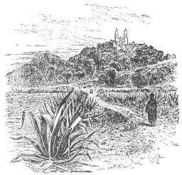
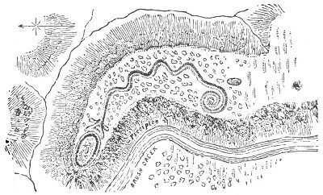
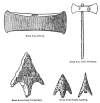

  
[Intangible Textual Heritage](../../index)  [Atlantis](../index) 
[Index](index)  [Previous](ataw305)  [Next](ataw307) 

------------------------------------------------------------------------

[Buy this Book at
Amazon.com](https://www.amazon.com/exec/obidos/ASIN/B0020ML528/internetsacredte)

------------------------------------------------------------------------

  
*Atlantis, the Antediluvian World*, by Ignatius Donnelly, \[1882\], at
Intangible Textual Heritage

------------------------------------------------------------------------

p. 198

## CHAPTER VI.

### GENESIS CONTAINS A HISTORY OF ATLANTIS

THE Hebrews are a branch of the great family of which that powerful
commercial race, the Phœnicians, who were the merchants of the world
fifteen hundred years before the time of Christ, were a part. The
Hebrews carried out from the common storehouse of their race a mass of
traditions, many of which have come down-to us in that oldest and most
venerable of human compositions, the Book of Genesis. I have shown that
the story of the Deluge plainly refers to the destruction of Atlantis,
and that it agrees in many important particulars with the account given
by Plato. The people destroyed were, in both instances, the ancient race
that had created civilization; they had formerly been in a happy and
sinless condition; they had become great and wicked; they were destroyed
for their sins--they were destroyed by water.

But we can go farther, and it can be asserted that there is scarcely a
prominent fact in the opening chapters of the Book of Genesis that
cannot be duplicated from the legends of the American nations, and
scarcely a custom known to the Jews that does not find its counterpart
among the people of the New World.

Even in the history of the Creation we find these similarities:

The Bible tells us (Gen. i., 2) that in the beginning the earth was
without form and void, and covered with water. In the Quiche legends we
are told, "at first all was sea--no man, animal, bird, or green
herb--there was nothing to be seen but the sea and the heavens."

p. 199

The Bible says (Gen. i., 2), "And the Spirit of God moved upon the face
of the waters." The Quiche legend says, "The Creator--the Former, the
Dominator--the feathered serpent--those that give life, moved upon the
waters like a glowing light."

The Bible says (Gen. i., 9), "And God said, Let the waters under the
heaven be gathered together unto one place, and let the dry land appear:
and it was so." The Quiche legend says, "The creative spirits cried out
'Earth!' and in an instant it was formed, and rose like a vapor-cloud;
immediately the plains and the mountains arose, and the cypress and pine
appeared."

The Bible tells us, "And God saw that it was good." The Quiche legend
says, "Then Gucumatz was filled with joy, and cried out, 'Blessed be thy
coming, O Heart of Heaven, Hurakan, thunder-bolt.'"

The order in which the vegetables, animals, and man were formed is the
same in both records.

In Genesis (chap. ii., 7) we are told, "And the Lord God formed man of
the dust of the ground." The Quiche legend says. "The first man was made
of clay; but he had no intelligence, and was consumed in the water."

In Genesis the first man is represented as naked. The Aztec legend says,
"The sun was much nearer the earth then than now, and his grateful
warmth rendered clothing unnecessary."

Even the temptation of Eve reappears in the American legends. Lord
Kingsborough says: "The Toltecs had paintings of a garden, with a single
tree standing in the midst; round the root of the tree is entwined a
serpent, whose head appearing above the foliage displays the face of a
woman. Torquemada admits the existence of this tradition among them, and
agrees with the Indian historians, who affirm that this was the first
woman in the world, who bore children, and from whom all mankind are
descended." ("Mexican Antiquities," vol. viii., p. 19.) There is also a
legend of Suchiquecal, who disobediently

p. 200

gathered roses from a tree, and thereby disgraced and injured herself
and all her posterity. ("Mexican Antiquities," vol. vi., p. 401.)

The legends of the Old World which underlie Genesis, and were used by
Milton in the "Paradise Lost," appear in the Mexican legends of a war of
angels in heaven, and the fall of *Zou-tem-que* (*Soutem*,
*Satan*--Arabic, *Shatana?*) and the other rebellious spirits.

We have seen that the Central Americans possessed striking parallels to
the account of the Deluge in Genesis.

There is also a clearly established legend which singularly resembles
the Bible record of the Tower of Babel.

Father Duran, in his MS. "Historia Antiqua de la Nueva Espana," A.D.
1585, quotes from the lips of a native of Cholula, over one hundred
years old, a version of the legend as to the building of the great
pyramid of Cholula. It is as follows:

"In the beginning, before the light of the sun had been created, this
land (Cholula) was in obscurity and darkness, and void of any created
thing; all was a plain, without hill or elevation, encircled in every
part by water, without tree or created thing; and immediately *after the
light and the sun arose in the east* there appeared gigantic men of
deformed stature and possessed the land, and desiring to see the
nativity of the sun, as well as his occident, proposed to go and seek
them. Dividing themselves into two parties, some journeyed to the west
and others toward the east; these travelled; until the sea cut off their
road, whereupon they determined to return to the place from which they
started, and arriving at this place (Cholula), not finding the means of
reaching the sun, enamored of his light and beauty, they determined to
build a tower so high that its summit should reach the sky. Having
collected materials for the purpose, they found a very adhesive clay and
bitumen, with which they speedily commenced to build the tower; and
having reared it to the greatest possible altitude, so that they say it
reached to the sky, the Lord of the Heavens, enraged, said to the
inhabitants of the sky, 'Have you observed how they of the earth have
built a high and haughty tower to mount hither, being enamored of the
light of the sun and

p. 201

 

   
RUINS OF THE TEMPLE OF CHOLULA.

 

his beauty? Come and confound them, because it is not right that they of
the earth, living in the flesh, should mingle with us.' Immediately the
inhabitants of the sky sallied forth like flashes of lightning; they
destroyed the edifice, and divided and scattered its builders to all
parts of the earth."

One can recognize in this legend the recollection, by a ruder race, of a
highly civilized people; for only a highly civilized people would have
attempted such a vast work. Their mental superiority and command of the
arts gave them the character of giants who arrived from the East; who
had divided into two great emigrations, one moving eastward (toward
Europe), the other westward (toward America). They were sun-worshippers;

p. 202

for we are told "they were enamored of the light and beauty of the sun,"
and they built a high place for his worship.

The pyramid of Cholula is one of the greatest constructions ever erected
by human hands. It is even now, in its ruined condition, 160 feet high,
1400 feet square at the base, and covers forty-five acres; we have only
to remember that the greatest pyramid of Egypt, Cheops, covers but
twelve or thirteen acres, to form some conception of the magnitude of
this American structure.

It must not be forgotten that this legend was taken down by a Catholic
priest, shortly after the conquest of Mexico, from the lips of an old
Indian who was born before Columbus sailed from Spain.

Observe the resemblances between this legend and the Bible account of
the building of the Tower of Babel:

"All was a plain without hill or elevation," says the Indian legend.
"They found a plain in the land of Shinar, and they dwelt there," says
the Bible. They built of brick in both cases. "Let us build us a tower
whose top may reach unto heaven," says the Bible. "They determined to
build a tower so high that its summit should reach the sky," says the
Indian legend. "And the Lord came down to see the city and the tower
which the children of men had builded. And the Lord said, Behold . . .
nothing will be restrained from them which they have imagined to do. Go
to, let us go down and confound them," says the Bible record. "The Lord
of the Heavens, enraged, said to the inhabitants of the sky, 'Have you
observed,' etc. Come and confound them," says the Indian record. "And
the Lord scattered them abroad from thence on all the face of the
earth," says the Bible. "They scattered its builders to all parts of the
earth," says the Mexican legend.

Can any one doubt that these two legends must have sprung in some way
from one another, or from some common source? There are enough points of
difference to show that the American

p. 203

is not a servile copy of the Hebrew legend. In the former the story
comes from a native of Cholula: it is told under the shadow of the
mighty pyramid it commemorates; it is a local legend which he repeats.
The men who built it, according to his account, were foreigners. They
built it to reach the sun--that is to say, as a sun-temple; while in the
Bible record Babel was built to perpetuate the glory of its architects.
In the Indian legend the gods stop the work by a great storm, in the
Bible account by confounding the speech of the people.

Both legends were probably derived from Atlantis, and referred to some
gigantic structure of great height built by that people; and when the
story emigrated to the east and west, it was in the one case affixed to
the tower of the Chaldeans, and in the other to the pyramid of Cholula,
precisely as we find the ark of the Deluge resting upon separate
mountain-chains all the way from Greece to Armenia. In one form of the
Tower of Babel legend, that of the Toltecs, we are told that the pyramid
of Cholula was erected "as a means of escape from a second flood, should
another occur."

But the resemblances between Genesis and the American legends do not
stop here.

We are told (Gen. ii., 21) that "the Lord God caused a deep sleep to
fall upon Adam," and while he slept God made Eve out of one of his ribs.
According to the Quiche tradition, there were four men from whom the
races of the world descended (probably a recollection of the red, black,
yellow, and white races); and these men were without wives, and the
Creator made wives for them "while they slept."

Some wicked misanthrope referred to these traditions when he said, "And
man's first sleep became his last repose."

In Genesis (chap. iii., 22), "And the Lord God said, Behold, the man is
become as one of us, to know good and evil: and now, lest he put forth
his hand, and take also of the tree of life, and eat, and live forever:"
therefore God drove him out of the garden. In the Quiche legends we are
told, "The gods feared

p. 204

that they had made men too perfect, and they breathed a cloud of mist
over their vision."

When the ancestors of the Quiches migrated to America the Divinity
parted the sea for their passage, as the Red Sea was parted for the
Israelites.

The story of Samson is paralleled in the history of a hero named
Zipanca, told of in the "Popol Vuh," who, being captured by his enemies
and placed in a pit, pulled down the building in which his captors had
assembled, and killed four hundred of them.

"There were giants in those days," says the Bible. A great deal of the
Central American history is taken up with the doings of an ancient race
of giants called Quinames.

This parallelism runs through a hundred particulars:

Both the Jews and Mexicans worshipped toward the east.

Both called the south "the right hand of the world."

Both burnt incense toward the four corners of the earth.

Confession of sin and sacrifice of atonement were common to both
peoples.

Both were punctilious about washings and ablutions.

Both believed in devils, and both were afflicted with leprosy.

Both considered women who died in childbirth as worthy of honor as
soldiers who fell in battle.

Both punished adultery with stoning to death.

As David leaped and danced before the ark of the Lord, so did the
Mexican monarchs before their idols.

Both had an ark, the abiding-place of an invisible god.

Both had a species of serpent-worship.

Compare our representation of the great serpent-mound in Adams County,
Ohio, with the following description of a great serpent-mound in
Scotland:

"*Serpent-worship in the West*.--Some additional light appears to have
been thrown upon ancient serpent-worship in the West by the recent
archaeological explorations of Mr. John S. Phené, F.G.S., F.R.G.S., in
Scotland. Mr. Phené has just investigated

p. 205

 

   
GREAT SERPENT MOUND, OHIO.

 

a curious earthen mound in Glen Feechan, Argyleshire, referred to by
him, at the late meeting of the British Association in Edinburgh, as
being in the form of a serpent or saurian. The mound, says the
*Scotsman*, is a most perfect one. The head is a large cairn, and the
body of the earthen reptile 300 feet long; and in the centre of the head
there were evidences, when Mr. Phené first visited it, of an altar
having been placed there. The position with regard to Ben Cruachan is
most remarkable. The three peaks are seen over the length of the reptile
when a person is standing on the head, or cairn. The shape can only be
seen so as to be understood when looked down upon from an elevation, as
the outline cannot be understood unless the whole of it can be seen.
This is most perfect when the spectator is on the head of the animal
form, or on the lofty rock to the west of it. This mound corresponds
almost entirely with one 700 feet long in America, an account of which
was lately published, after careful survey, by Mr. Squier. The altar
toward the head in each case agrees. In the American mound three rivers
(also objects of worship with the ancients) were evidently identified.
The number three was a sacred number in all ancient mythologies. The
sinuous winding and articulations of the vertebral spinal arrangement
are anatomically perfect

p. 206

in the Argyleshire mound. The gentlemen present with Mr. Phené during
his investigation state that beneath the cairn forming the head of the
animal was found a megalithic chamber, in which was a quantity of
charcoal and burnt earth and charred nutshells, a flint instrument,
beautifully and minutely serrated at the edge, and burnt bones. The back
or spine of the serpent, which, as already stated, is 300 feet long, was
found, beneath the peat moss, to be formed by a careful adjustment of
stones, the formation of which probably prevented the structure from
being obliterated by time and weather." (*Pall Mall Gazette*.)

We find a striking likeness between the works of the Stone Age in
America and Europe, as shown in the figures here given.

 

  [  
Click to enlarge](img/20600.jpg)  
STONE IMPLEMENTS OF EUROPE AND AMERICA.

 

p. 207

The same singular custom which is found among the Jews and the Hindoos,
for "a man to raise up seed for his deceased brother by marrying his
widow," was found among the Central American nations. (Las Casas, MS.
"Hist. Apoloq.," cap. ccxiii., ccxv. Torquemada, "Monarq. Ind.," tom.
ii., 377-8.)

No one but the Jewish high-priest might enter the Holy of Holies. A
similar custom obtained in Peru. Both ate the flesh of the sacrifices of
atonement; both poured the blood of the sacrifice on the earth; they
sprinkled it, they marked persons with it, they smeared it upon walls
and stones. The Mexican temple, like the Jewish, faced the east. "As
among the Jews the ark was a sort of portable temple, in which the Deity
was supposed to be continually present, so among the Mexicans, the
Cherokees, and the Indians of Michoacan and Honduras, an ark was held in
the highest veneration, and was considered an object too sacred to be
touched by any but the priests." (Kingsborough, "Mex. Antiq., "vol.
viii., p.258.)

The Peruvians believed that the rainbow was a sign that the earth would
not be again destroyed by a deluge. (*Ibid*., p. 25.)

The Jewish custom of laying the sins of the people upon the head of an
animal, and turning him out into the wilderness, had its counterpart
among the Mexicans, who, to cure a fever, formed a dog of maize paste
and left it by the roadside, saying the first passer-by would carry away
the illness. (Dorman, "Prim. Super.," p. 59.) Jacob's ladder had its
duplicate in the vine or tree of the Ojibbeways, which led from the
earth to heaven, up and down which the spirits passed. (*Ibid*., p. 67.)

Both Jews and Mexicans offered water to a stranger that be might wash
his feet; both ate dust in token of humility; both anointed with oil;
both sacrificed prisoners; both periodically separated the women, and
both agreed in the strong and universal idea of uncleanness connected
with that period.

Both believed in the occult power of water, and both practised baptism.

p. 208

"Then the Mexican midwife gave the child to taste of the water, putting
her moistened fingers in its mouth, and said, 'Take this; by this thou
hast to live on the earth, to grow and to flourish; through this we get
all things that support existence on the earth; receive it.' Then with
moistened fingers she touched the breast of the child, and said, 'Behold
the pure water that washes and cleanses thy heart, that removes all
filthiness; receive it: may the goddess see good to purify And cleanse
thine heart.' Then the midwife poured water upon the head of the child,
saying, 'O my grandson--my son--take this water of the Lord of the
world, which is thy life, invigorating and refreshing, washing and
cleansing. I pray that this celestial water, blue and light blue, may
enter into thy body, and there live; I pray that it may destroy in thee
and put away from thee all the things evil and adverse that were *given
thee before the beginning of the world*. . . . Wheresoever thou art in
this child, O thou hurtful thing, begone! leave it, put thyself apart;
for now does it live anew, and *anew is it born*; now again is it
purified and cleansed; now again is it shaped and engendered by our
mother, the goddess of water." (Bancroft's "Native Races," vol. iii., p.
372.)

Here we find many resemblances to the Christian ordinance of baptism:
the pouring of the water on the head, the putting of the fingers in the
mouth, the touching of the breast, the new birth, and the washing away
of the original sin. The Christian rite, we know, was not a Christian
invention, but was borrowed from ancient times, from the great
storehouse of Asiatic traditions and beliefs.

The Mexicans hung up the heads of their sacrificed enemies; this was
also a Jewish custom:

"And the Lord said unto Moses, Take all the heads of the people, and
hang them up before the Lord against the sun, that the fierce anger of
the Lord may be turned away from Israel. And Moses said unto the judges
of Israel, Slay ye every one his men that were joined unto Baal-peor."
(Numb., xxv., 4, 5.)

The Scythians, Herodotus tells us, scalped their enemies,

p. 209

and carried the scalp at the pommel of their saddles; the Jews probably
scalped their enemies:

"But God shall wound the head of his enemies, and the hairy scalp of
such a one as goeth on still in his trespasses." (Psa., lxviii., 21.)

The ancient Scandinavians practised scalping. When Harold Harefoot
seized his rival, Alfred, with six hundred followers, be "had them
maimed, blinded, hamstrung, *scalped*, or embowelled. (Taine's "Hist.
Eng. Lit.," p. 35.)

Herodotus describes the Scythian mode of taking the scalp:

He makes a cut round the head near the ears, and shakes the skull out."
This is precisely the Indian custom. "The more scalps a man has," says
Herodotus, "the more highly he is esteemed among them."

The Indian scalp-lock is found on the Egyptian monuments as one of the
characteristics of the Japhetic Libyans, who shaved all the head except
one lock in the middle.

The Mantchoos of Tartary wear a scalp-lock, as do the modern Chinese.

Byron describes the heads of the dead Tartars under the walls of
Corinth, devoured by the wild dogs:

"Crimson and green were the shawls of their wear,  
And each scalp had a single long tuft of hair,  
All the rest was shaven and bare."

These resemblances are so striking and so numerous that repeated
attempts have been made to prove that the inhabitants of America are the
descendants of the Jews; some have claimed that they represented "the
lost tribes" of that people. But the Jews were never a maritime or
emigrating people; they formed no colonies; and it is impossible to
believe (as has been asserted) that they left their flocks and herds,
marched across the whole face of Asia, took ships and sailed across the
greatest of the oceans to a continent of the existence of which they had
no knowledge.

p. 210

If we seek the origin of these extraordinary coincidences in opinions
and habits, we must go far back of the time of the lost tribes. We must
seek it in the relationship of the Jews to the family of Noah, and in
the identity of the Noachic race destroyed in the Deluge with the people
of the drowned Atlantis.

Nor need it surprise us to find traditions perpetuated for thousands
upon thousands of years, especially among a people having a religious
priesthood.

The essence of religion is conservatism; little is invented; nothing
perishes; change comes from without; and even when one religion is
supplanted by another its gods live on as the demons of the new faith,
or they pass into the folk-lore and fairy stories of the people. We see
Votan, a hero in America, become the god Odin or Woden in Scandinavia;
and when his worship as a god dies out Odin survives (as Dr. Dasent has
proved) in the Wild Huntsman of the Hartz, and in the Robin Hood (Oodin)
of popular legend. The Hellequin of France becomes the Harlequin of our
pantomimes. William Tell never existed; he is a myth; a survival of the
sun-god Apollo, Indra, who was worshipped on the altars of Atlantis.

Nothing here but it doth change  
Into something rich and strange."

The rite of circumcision dates back to the first days of Phœnicia,
Egypt, and the Cushites. It, too, was probably an Atlantean custom,
invented in the Stone Age. Tens of thousands of years have passed since
the Stone Age; the ages of copper, bronze, and iron bare intervened; and
yet to this day the Hebrew rabbi performs the ceremony of circumcision
with a stone knife.

Frothingham says, speaking of St. Peter's Cathedral, in Rome:

"Into what depths of antiquity the ceremonies carried me back! To the
mysteries of Eleusis; to the sacrificial rites of Phœnicia. The boys
swung the censors as censors had been

p. 211

swung in the adoration of Bacchus. The girdle and cassock of the priests
came from Persia; the veil and tonsure were from Egypt; the alb and
chasuble were prescribed by Numa Pompilius; the stole was borrowed from
the official who used to throw it on the back of the victim that was to
be sacrificed; the white surplice was the same as described by Juvenal
and Ovid."

Although it is evident that many thousands of years must have passed
since the men who wrote in Sanscrit, in Northwestern India, could have
dwelt in Europe, yet to this day they preserve among their ancient books
maps and descriptions of the western coast of Europe, and even of
England and Ireland; and we find among them a fuller knowledge of the
vexed question of the sources of the Nile than was possessed by any
nation in the world twenty-five years ago.

This perpetuation of forms and beliefs is illustrated in the fact that
the formulas used in the Middle Ages in Europe to exorcise evil spirits
were Assyrian words, imported probably thousands of years before from
the magicians of Chaldea. When the European conjurer cried out to the
demon, "*Hilka, hilka, besha, besha*," he had no idea that he was
repeating the very words of a people who had perished ages before, and
that they signified *Go away, go away, evil one, evil one*. (Lenormant,
"Anc. Hist. East," vol. i., p. 448.)

Our circle of 360 degrees; the division of a chord of the circle equal
to the radius into 60 equal parts, called degrees: the division of these
into 60 minutes, of the minute into 60 seconds, and the second into 60
thirds; the division of the day into 24 hours, each hour into 60
minutes, each minute into 60 seconds; the division of the week into
seven days, and the very order of the days--all have come down to us
from the Chaldeo-Assyrians; and these things will probably be
perpetuated among our posterity "to the last syllable of recorded time."

We need not be surprised, therefore, to find the same legends and
beliefs cropping out among the nations of Central America

p. 212

and the people of Israel. Nay, it should teach us to regard the Book of
Genesis with increased veneration, as a relic dating from the most
ancient days of man's history on earth; its roots cross the great ocean;
every line is valuable; a word, a letter, an accent may throw light upon
the gravest problems of the birth of civilization.

The vital conviction which, during thousands of years, at all times
pressed home upon the Israelites, was that they were a "chosen people,"
selected out of all the multitude of the earth, to perpetuate the great
truth that there was but one God--an illimitable, omnipotent, paternal
spirit, who rewarded the good and punished the wicked--in
contradistinction from the multifarious, subordinate, animal and bestial
demi-gods of the other nations of the earth. This sublime monotheism
could only have been the outgrowth of a high civilization, for man's
first religion is necessarily a worship of "stocks and stones," and
history teaches us that the gods decrease in number as man increases in
intelligence. It was probably in Atlantis that monotheism was first
preached. The proverbs of "Ptah-hotep," the oldest book of the
Egyptians, show that this most ancient colony from Atlantis received the
pure faith from the mother-land at the very dawn of history: this book
preached the doctrine of *one* God, "the rewarder of the good and the
punisher of the wicked." (Reginald S. Poole, *Contemporary Rev*., Aug.,
1881, p. 38.) "In the early days the Egyptians worshipped one only God,
the maker of all things, without beginning and without end. To the last
the priests preserved this doctrine and taught it privately to a select
few." ("Amer. Encycl.," vol. vi., p. 463.) The Jews took up this great
truth where the Egyptians dropped it, and over the heads and over the
ruins of Egypt, Chaldea, Phœnicia, Greece, Rome, and India this handful
of poor shepherds--ignorant, debased, and despised--have carried down to
our own times a conception which could only have originated in the
highest possible state of human society.

And even skepticism must pause before the miracle of the

p. 213

continued existence of this strange people, wading through the ages,
bearing on their shoulders the burden of their great trust, and pressing
forward under the force of a perpetual and irresistible impulse. The
speech that may be heard to-day in the synagogues of Chicago and
Melbourne resounded two thousand years ago in the streets of Rome; and,
at a still earlier period, it could be heard in the palaces of Babylon
and the shops of Thebes--in Tyre, in Sidon, in Gades, in Palmyra, in
Nineveh. How many nations have perished, how many languages have ceased
to exist, how many splendid civilizations have crumbled into ruin, bow
many temples and towers and towns have gone down to dust since the
sublime frenzy of monotheism first seized this extraordinary people! All
their kindred nomadic tribes are gone; their land of promise is in the
hands of strangers; but Judaism, with its offspring, Christianity, is
taking possession of the habitable world; and the continuous life of one
people--one poor, obscure, and wretched people--spans the tremendous
gulf between "Ptah-hotep" and this nineteenth century.

If the Spirit of which the universe is but an expression--of whose frame
the stars are the infinite molecules--can be supposed ever to interfere
with the laws of matter and reach down into the doings of men, would it
not be to save from the wreck and waste of time the most sublime fruit
of the civilization of the drowned Atlantis--a belief in the one, only,
just God, the father of all life, the imposer of all moral obligations?

------------------------------------------------------------------------

[Next: Chapter VII: The Origin of Our Alphabet](ataw307)
