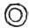
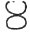
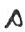
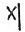
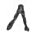
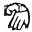
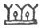
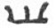
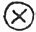

  
[Intangible Textual Heritage](../../index)  [Atlantis](../index) 
[Index](index)  [Previous](ataw306)  [Next](ataw308) 

------------------------------------------------------------------------

[Buy this Book at
Amazon.com](https://www.amazon.com/exec/obidos/ASIN/B0020ML528/internetsacredte)

------------------------------------------------------------------------

  
*Atlantis, the Antediluvian World*, by Ignatius Donnelly, \[1882\], at
Intangible Textual Heritage

------------------------------------------------------------------------

p. 214

## CHAPTER VII.

### THE ORIGIN OF OUR ALPHABET

\[*Transcribers note*: the argument in this section heavily depends on
the Bishop Landa Maya alphabet, which has now been discredited. The
Mayan writing was not decoded until late in the 20th Century. Mayan
hieroglyphs are ideographic with a phonetic component, albeit not the
ones that Landa described. The only thing demonstrated in this section
is the evolution of the alphabet in the Old World, which has no bearing
on the question of Atlantis--*jbh*\]

ONE of the most marvellous inventions for the advancement of mankind is
the phonetic alphabet, or a system of signs representing the sounds of
human speech. Without it our present civilization could scarcely have
been possible.

No solution of the origin of our European alphabet has. yet been
obtained: we can trace it back from nation to nation, and form to form,
until we reach the Egyptians, and the archaic forms of the Phœnicians,
Hebrews, and Cushites, but. beyond this the light fails us.

The Egyptians spoke of their hieroglyphic system of writing not as their
own invention, but as "the language of the gods." (Lenormant and Cheval,
"Anc. Hist. of the East," vol. ii., p. 208.) "The gods" were, doubtless,
their highly civilized ancestors--the people of Atlantis--who, as we
shall hereafter see, became the gods of many of the Mediterranean races.

"According to the Phœnicians, the art of writing was invented by
Taautus, or Taut, 'whom the Egyptians call Thouth,' and the Egyptians
said it was invented by Thouth, or Thoth, otherwise called 'the first
Hermes,' in which we clearly see that both the Phœnicians and Egyptians
referred the invention to a period older than their own separate
political existence, and to an older nation, from which both peoples
received it." (Baldwin's "Prehistoric Nations," p. 91.)

The "first Hermes," here referred to (afterward called Mercury by the
Romans), was a son of Zeus and Maia, a daughter of Atlas. This is the
same *Maia* whom the Abbé Brasseur de Bourbourg identifies with the Maya
of Central America.

p. 215

Sir William Drummond, in his "Origines," said:

"There seems to be no way of accounting either for the early use of
letters among so many different nations, or for the resemblance which
existed between some of the graphic systems employed by those nations,
than by supposing hieroglyphical writing, if I may be allowed the term,
to have been in use among the Tsabaists in the first ages after the
Flood, when Tsabaisin (planet-worship) was the religion of almost every
country that was yet inhabited."

Sir Henry Rawlinson says:

"So great is the analogy between the first principles of the Science of
writing, as it appears to have been pursued in Chaldea, and as we can
actually trace its progress in Egypt, that we can hardly hesitate to
assign the original invention *to a period before the Hamitic race had
broken up and divided*."

It is not to be believed that such an extraordinary system of
sound-signs could have been the invention of any one man or even of any
one age. Like all our other acquisitions, it must have been the slow
growth and accretion of ages; it must have risen step by step from
picture-writing through an intermediate condition like that of the
Chinese, where each word or thing was represented by a separate sign.
The fact that so old and enlightened a people as the Chinese have never
reached a phonetic alphabet, gives us some indication of the greatness
of the people among whom it was invented, and the lapse of time before
they attained to it.

Humboldt says:

"According to the views which, since Champollion's great discovery, have
been gradually adopted regarding the earlier condition of the
development of alphabetical writing, the Phœnician as well as the
Semitic characters are to be regarded as a phonetic alphabet that has
originated from pictorial writing; as one in which the ideal
signification of the symbols is wholly disregarded, and the characters
are regarded as mere signs for sounds." ("Cosmos," vol. ii., p. 129.)

p. 216

Baldwin says (" Prehistoric Nations," p. 93):

"The nation that became mistress of the seas, established communication
with every shore, and monopolized the commerce of the known world, must
have substituted a phonetic alphabet for the hieroglyphics as it
gradually grew to this eminence; while isolated Egypt, less affected by
the practical wants and tendencies of commercial enterprise, retained
the hieroglyphic system, and carried it to a marvellous height of
perfection."

It must be remembered that some of the letters of our alphabet are
inventions of the later nations. In the oldest alphabets there was no
*c*, the *g* taking its place. The Romans converted the *g* into *c*;
and then, finding the necessity for a *g* Sign, made one by adding a
tail-piece to the *c* (*C, G*). The Greeks added to the ancient alphabet
the *upsilon*, shaped like our V or Y, the two forms being used at first
indifferently: they added the X sign; they converted the <u>t</u> of the
Phœnicians into *th*, or *theta*; *z* and *s* into signs for double
consonants; they turned the Phœnician *y* (*yod*) into *i* (*iota*). The
Greeks converted the Phœnician alphabet, which was partly consonantal,
into one purely phonetic--"a perfect instrument for the expression of
spoken language." The *w* was also added to the Phœnician alphabet. The
Romans added the *y*. At first *i* and *j* were both indicated by the
same sound; a sign for *j* was afterward added. We have also, in common
with other European languages, added a double U, that is, VV, or W, to
represent the *w* sound.

The letters, then, which we owe to the Phœnicians, are A, B, C, D, E, H,
I, K, L, M, N, O, P, Q, R, S, T, Z. If we are to trace out resemblances
with the alphabet of any other country, it must be with these signs.

Is there any other country to which we can turn which possessed a
phonetic alphabet in any respect kindred to this Phœnician alphabet? It
cannot be the Chinese alphabet, which has more signs than words; it
cannot be the cuneiform alphabet of Assyria, with its seven hundred
arrow-shaped characters,

p. 217

none of which bear the slightest affinity to the Phœnician letters.

It is a surprising fact that *we find in Central America a phonetic
alphabet*. This is in the alphabet of the Mayas, the ancient people of
the peninsula of Yucatan, who claim that their civilization came to them
across the sea in ships from the east, that is, from the direction of
Atlantis. The Mayas succeeded to the Colhuas, whose era terminated one
thousand years before the time of Christ; from them they received their
alphabet. It has come to us through Bishop Landa, one of the early
missionary bishops, who confesses to having burnt a great number of Maya
books because they contained nothing but the works of the devil. He

<table data-align="RIGHT">
<colgroup>
<col style="width: 100%" />
</colgroup>
<tbody>
<tr class="odd">
<td data-valign="CENTER"> 
LANDA'S ALPHABET 
(From ''North Amer. of Antiquity,'' p. 434.</td>
</tr>
</tbody>
</table>

fortunately, however, preserved for posterity the alphabet of this
people. We present it herewith.

Diego de Landa was the first bishop of Yucatan. He wrote a history of
the Mayas and their country, which was preserved in manuscript at Madrid
in the library of the Royal Academy of History. . . . It contains a
description and explanation of the phonetic alphabet of the Mayas.
Landa's manuscript seems to have lain neglected in the library, for
little or nothing was heard of it until it was discovered by the French
priest Brasseur de Bourbourg, who, by means of it, has deciphered

p. 218

some of the old American writings. he says, 'the alphabet and signs
explained by Landa have been to me a Rosetta stone.'" (Baldwin's
"Ancient America," p. 191.)

When we observe, in the table of alphabets of different European nations
which I give herewith, how greatly the forms of the Phœnician letters
have been modified, it would surprise us to find any resemblance between
the Maya alphabet of two or three centuries since and the ancient
European forms. It must, however, be remembered that the Mayas are one
of the most conservative peoples in the world. They still adhere with
striking pertinacity to the language they spoke when Columbus landed on
San Salvador; and it is believed that that language is the same as the
one inscribed on the most ancient monuments of their country. Señor
Pimental says of them, "The Indians have preserved this idiom with such
tenacity that they will speak no other; it is necessary for the whites
to address them in their own language to communicate with them." It is
therefore probable, as their alphabet did not pass from nation to
nation, as did the Phœnician, that it has not departed so widely from
the original forms received from the Colhuas.

p. 219

 

  [  
Click to enlarge](img/21900.jpg)  
The Alphabet.

 

p. 221

But when we consider the vast extent of time which has elapsed, and the
fact that we are probably without the intermediate stages of the
alphabet which preceded the archaic Phœnician, it will be astonishing if
we find resemblances between *any* of the Maya letters and the European
forms, even though we concede that they are related. If we find decided
affinities between two or three letters, we may reasonably presume that
similar coincidences existed as to many others which have disappeared
under the attrition of centuries.

The first thought that occurs to us on examining the Landa alphabet is
the complex and ornate character of the letters. Instead of the two or
three strokes with which we indicate a sign for a sound, we have here
rude pictures of objects. And we find that these are themselves
simplifications of older forms of a still more complex character. Take,
for instance, the letter *pp* in Landa's alphabet,  : here are evidently the traces
of a face. The same appear, but not so plainly, in the sign for *x*,
which is  . Now, if we
turn to the ancient hieroglyphics upon the monuments of Central America,
we will find the human face appearing in a great many of them, as in the
following, which we copy from the Tablet of the Cross at Palenque. We
take the hieroglyphs from the left-hand side 

|                    |
|--------------------|
|  |

of the inscription. Here it will be seen that, out of seven
hieroglyphical figures, six contain human faces. And we find that in the
whole inscription of the Tablet of the Cross there are 33 figures out of
108 that are made up in part of the human countenance.

We can see, therefore, in the Landa alphabet a tendency to
simplification. And this is what we would naturally expect. When the
emblems--which were probably first intended for religious inscriptions,
where they could be slowly and carefully elaborated--were placed in the
hands of a busy, active, commercial people, such as were the Atlanteans,
and afterward the Phœnicians, men with whom time was valuable, the
natural tendency would be to simplify and condense them; and when the
original meaning of the picture was lost, they would naturally slur it,
as we find in the letters *pp* and *x* of the Maya alphabet, where the
figure of the human face remains only in rude lines.

The same tendency is plainly shown in the two forms of the letter *h*,
as given in Landa's alphabet; the original form is more elaborate than
the variation of it. The original form is 
. The variation is given as  . Now let us suppose this
simplification to be carried a step farther: we have seen the upper and
lower parts of the first form shrink into a smaller and less elaborate
shape; let us imagine that the same tendency does away with them
altogether; we would then have the

p. 222

letter H of the Maya alphabet represented by this figure,  ; now, as it takes less time to
make a single stroke than a double one, this would become in time  . We turn now to the archaic
Greek and the old Hebrew, and we find the letter *h* indicated by this
sign,  , precisely the
Maya letter *h* simplified. We turn to the archaic Hebrew, and we find
 . Now it is known that
the Phœnicians wrote from right to left, and just as we in writing from
left to right slope our letters to the right, so did the Phœnicians
slope their letters to the left. Hence the Maya sign becomes in the
archaic Phœnician this,  .
In some of the Phœnician alphabets we even find the letter h made with
the double strokes above and below, as in the Maya *h*. The Egyptian
hieroglyph for *h* is  
while *ch* is  . In time
the Greeks carried the work of simplification still farther, and
eliminated the top lines, as we have supposed the Atlanteans to have
eliminated the double strokes, and they left the letter as it has come
down to us, H.

Now it may be said that all this is coincidence. If it is, it is
certainly remarkable. But let us go a step farther:

We have seen in Landa's alphabet that there are two forms of the letter
m. The first is  . But we
find also an *m* combined with the letter *o*, *a*, or *e*, says Landa,
in this form,  . The *m*
here is certainly indicated by the central part of this combination, the
figure  ; where does that
come from? It is clearly taken from the heart of the original figure
wherein it appears. What does this prove? That the Atlanteans, or Mayas,
when they sought to simplify their letters and combine them with others,
took from the centre of the ornate hieroglyphical figure some
characteristic mark with which they represented the whole figure. Now
let us apply this rule:

We have seen in the table of alphabets that in every language, from our
own day to the time of the Phœnicians, *o* has been represented by a
circle or a circle within a circle. Now where did the Phœnicians get it?
Clearly from the Mayas. There are two figures for *o* in the Maya
alphabet; they are

p. 223

\[paragraph continues\]   and  ; now, if we apply the rule
which we have seen to exist in the case of the Maya *m* to these
figures, the essential characteristic found in each is the circle, in
the first case pendant from the hieroglyph; in the other, in the centre
of the lower part of it. And that this circle was withdrawn from the
hieroglyph, and used alone, as in the case of the *m*, is proved by the
very sign used at the foot of Landa's alphabet, which is,  . Landa calls this *ma*, *me*,
or *mo*; it is probably the latter, and in it we have the circle
detached from the hieroglyph.

We find the precise Maya *o* a circle in a circle, or a dot within a
circle, repeated in the Phœnician forms for *o*, thus,   and  , and by exactly the same forms
in the Egyptian hieroglyphics; in the Runic we have the circle in the
circle; in one form of the Greek o the dot was placed along-side of the
circle instead of below it, as in the Maya.

Are these another set of coincidences?

Take another letter:

The letter *n* of the Maya alphabet is represented by this sign, itself
probably a simplification of some more ornate form,  . This is something like our
letter S, but quite unlike our N. But let us examine into the pedigree
of our *n*. We find in the archaic Ethiopian, a language as old as the
Egyptian, and which represents the Cushite branch of the Atlantean
stock, the sign for *n* (*na*) is 
; in archaic Phœnician it comes still closer to the S
shape, thus,  , or in this
form,  ; we have but to
curve these angles to approximate it very closely to the Maya *n*; in
Troy this form was found, 
. The Samaritan makes it 
; the old Hebrew 
; the Moab stone inscription gives it  ; the later Phœnicians
simplified the archaic form still further, until it became  ; then it passed into  : the archaic Greek form is
 ; the later Greeks made
 , from which it passed
into the present form, N. All these forms seem to be representations of
a serpent; we turn to the

p. 224

valley of the Nile, and we find that the Egyptian hieroglyphic for *n*
was the serpent,  ; the
Pelasgian *n* was  ; the
Arcadian,  ; the Etruscan,
 .

Can anything be more significant than to find the serpent the sign for
*n* in Central America, and in all these Old World languages?

Now turn to the letter *k*. The Maya sign for *k* is  . This does not look much like
our letter K; but let us examine it. Following the precedent established
for us by the Mayas in the case of the letter m, let us see what is the
distinguishing feature here; it is clearly the figure of a serpent
standing erect, with its tail doubled around its middle, forming a
circle. It has already been remarked by Savolini that this erect serpent
is very much like the Egyptian *Uræus*, an erect serpent with an
enlarged body--a sacred emblem found in the hair of their deities. We
turn again to the valley of the Nile, and we find that the Egyptian
hieroglyphic for *k* was a serpent with a convolution or protuberance in
the middle, precisely as in the Maya, thus, 
; this was transformed into the Egyptian letter  ; the serpent and the
protuberance reappear in one of the Phœnician forms of *k*, to wit,
 ; while in the Punic we
have these forms,   and
 . Now suppose a busy
people trying to give this sign: instead of drawing the serpent in all
its details they would abbreviate it into something like this,  ; now we turn to the ancient
Ethiopian sign for *k* (*ka*), and we have 
, or the Himyaritic Arabian  ; while in the Phœnician it
becomes  ; in the archaic
Greek,  ; and in the later
Greek, when they changed the writing from left to right,  . So that the two lines
projecting from the upright stroke of our English K are a reminiscence
of the convolution of the serpent in the Maya original and the Egyptian
copy.

Turn now to the Maya sign for *t*: it is 
. What is the distinctive mark about this figure? It
is the cross composed of two curved lines, thus,  . It is probable that in the

p. 225

\[paragraph continues\] Maya sign the
cross is united at the bottom, like a figure *8*. Here again we turn to
the valley of the Nile, and we find that the Egyptian hieroglyph for *t*
is   and  ; and in the Syriac *t* it is
 . We even find the curved
lines of the Maya *t* which give it something of the appearance of the
numeral *8*, repeated accurately in the Mediterranean alphabets; thus
the Punic *t* repeats the Maya form almost exactly as   and  . Now suppose a busy people
compelled to make this mark every day for a thousand years, and
generally in a hurry, and the cross would soon be made without curving
the lines; it would become **X**. But before it reached even that
simplified form it had crossed the Atlantic, and appeared in the archaic
Ethiopian sign for *tsa*, thus, 
. In the archaic Phœnician the sign for *t* is   and  ; the oldest Greek form is
  or   and the later Greeks gave it
to the Romans  , and
modified this into  ; the
old Hebrew gave it as  
and  ; the Moab stone as
 ; this became in time
  and  .

Take the letter *a*. In the Maya there are three forms given for this
letter. The first is  ;
the third is  . The first
looks very much like the foot of a lion or tiger; the third is plainly a
foot or boot. If one were required to give hurriedly a rude outline of
either of these, would he not represent it thus,  ; and can we not conceive that
this could have been in time modified into the Phœnician *a*, which was
 ? The hieratic Egyptian
*a* was  ; the ancient
Hebrew, which was   or
 ; the ancient Greek was
the foot reversed,  ; the
later Greek became our A.

Turn next to the Maya sign for *q* (*ku*): it is  . Now what is the peculiarity
of this hieroglyph? The circle below is not significant, for there are
many circular figures in the Maya alphabet. Clearly, if one was called
upon to simplify this, he would retain the two small circles joined side
by side at the top, and would indicate the lower circle with a line or
dash. And when we turn to the Egyptian *q* we find it in this shape,

p. 226

\[paragraph continues\]  ; we turn to the Ethiopian *q*
(*khua*), and we find it 
, as *qua*, 
; while the Phœnician comes still nearer the supposed
Maya form in  ; the Moab
stone was  ; the
Himyaritic Arabian form became 
; the Greek form was 
, which graduated into the Roman Q. But a still more
striking proof of the descent of the Phœnician alphabet from the Maya is
found in the other form of the *q*, the Maya *cu*, which is  . Now, if we apply the Maya
rule to this, and discard the outside circle, we have this left,  . In time the curved line would
be made straight, and the figure would assume this form,  ; the next step would be to
make the cross on the straight line, thus, 
. One of the ancient Phœnician forms is  . Can all this be accident?

The letter *c* or *g* (for the two probably gave the same sound as in
the Phœnician) is given in the Maya alphabet as follows,  . This would in time be
simplified into a figure representing the two sides of a triangle with
the apex upward, thus,  .
This is precisely the form found by Dr. Schliemann in the ruins of Troy,
 . What is the Phœnician
form for *g* as found on the Moab stone? It is  . The Carthaginian Phœnicians
gave it more of a rounded form, thus, 
. The hieratic Egyptian figure for *g* was  ; in the earlier Greek form the
left limb of the figure was shortened, thus,  ; the later Greeks reversed it,
and wrote it  ; the
Romans, changed this into 
 and it finally became C.

In the Maya we have one sign for *p*, and another for *pp*. The first
contains a curious figure, precisely like our *r* laid on its back  , There is, apparently, no *r*
in the Maya alphabet; and the Roman *r* grew out of the later Phœnician
*r* formed thus,  ; it
would appear that the earliest Phœnician alphabet did not contain the
letter *r*. But if we now turn to the Phœnician alphabet, we will find
one of the curious forms

p. 227

of the *p* given thus,  ,
a very fair representation of an *r* lying upon its face. Is it not
another remarkable coincidence that the *p*, in both Maya and Phœnician,
should contain this singular sign?

The form of *pp* in the Maya alphabet is this,  . If we are asked, on the
principle already indicated, to reduce this to its elements, we would
use a figure like this,  ;
in time the tendency would be to shorten one of these perpendicular
lines, thus, and this we find is very much like the Phœnician *p*,  . The Greek *ph* is Φ.

The letter *l* in the Maya is in two forms; one of these is  , the other is  . Now, if we again apply the
rule which we observed to hold good with the letter *m*--that is, draw
from the inside of the hieroglyph some symbol that will briefly indicate
the whole letter--we will have one of two forms, either a right-angled
figure formed thus,  , or
an acute angle formed by joining the two lines which are unconnected,
thus,  ; and either of
these forms brings us quite close to the letter *l* of the Old World. We
find *l* on the Moab stone thus formed, 
. The archaic Phœnician form of *l* was  , or  ; the archaic Hebrew was   and  ; the hieratic Egyptian was
 ; the Greek form was
 --the Roman L.

The Maya letter *b* is shaped thus, 
. Now, if we turn to the Phœnician, we find that *b*
is represented by the same crescent-like figure which we find in the
middle of this hieroglyph, but reversed in the direction of the writing,
thus,  ; while in the
archaic Hebrew we have the same crescent figure as in the Maya, turned
in the same direction, but accompanied by a line drawn downward, and to
the left, thus,  ; a
similar form is also found in the Phœnician 
, and this in the earliest Greek changed into  , and in the later Greek into
Β. One of the Etruscan signs for *b* was 
, while the Pelasgian *b* was represented

p. 228

thus,  ; the Chaldaic *b*
was  ; the Syriac sign for
*b* was ‏ו ?B‎; the Illyrian *b* was 
.

The Maya *e* is  ; this
became in time  ; then
  (we see this form on the
Maya monuments); the dots in time were indicated by strokes, and we
reach the hieratic Egyptian form, 
: we even find in some of the ancient Phœnician
inscriptions the original Maya circles preserved in making the letter
*e*, thus,  ; then we find
the old Greek form,  ; the
old Hebrew,  ; and the
later Phœnician,  : when
the direction of the writing was changed this became  . Dr. Schliemann found a form
like this on inscriptions deep in the ruins of Troy,  . This is exactly the form
found on the American monuments.

The Maya *i* is  ; this
became in time  ; this
developed into a still simpler form, 
; and this passed into the Phœnician form,  . The Samaritan *i* was formed
thus,  ; the Egyptian
letter *i* is  : gradually
in all these the left-hand line was dropped, and we come to the figure
used on the stone of Moab, 
 and  ;
this in time became the old Hebrew 
, or  ;
and this developed into the Greek 
.

We have seen the complicated symbol for *m* reduced by the Mayas
themselves into this figure, 
: if we attempt to write this rapidly, we find it very
difficult to always keep the base lines horizontal; naturally we form
something like this,  :
the distinctive figure within the sign for *m* in the Maya is ‏ו ?X‎ or
 . We see this repeated in
the Egyptian hieroglyphics for *m*, 
, and  ,
and  ; and in the Chaldaic
*m*, ‏ו מ‎; and in the Ethiopic 
. We find one form of the Phœnician where the *m* is
made thus,  ; and in the
Punic it appears thus,  ;
and this is not unlike the *m* on the stone of Moab,  , or the ancient Phœnician
forms  ,  , and the old Greek  , or the ancient Hebrew  , 
.

p. 229

The  , *x*, of the Maya
alphabet is a hand pointing downward 
, this, reduced to its elements, would be expressed
some thing like this,   or
 ; and this is very much
like the *x* of the archaic Phœnician, 
; or the Moab stone, 
; or the later Phœnician 
 or the Hebrew 
,  , or
the old Greek,  : the
later Greek form was Ξ.

The Maya alphabet contains no sign for the letter *s*; there is,
however, a symbol called *ca* immediately above the letter *k*; it is
probable that the sign *ca* stands for the soft sound of *c*, as, in our
words *citron*, *circle*, *civil*, *circus*, etc. As it is written in
the Maya alphabet *ca*, and not *k*, it evidently represents a different
sound. The sign *ca* is this, 
. A somewhat similar sign is found in the body of the
symbol for *k*, thus,  ,
this would appear to be a simplification of *ca*, but turned downward.
If now we turn to the Egyptian letters we find the sign *k* represented
by this figure  ,
simplified again into  ;
while the sign for *k* in the Phœnician inscription on the stone of Moab
is  . If now we turn to
the *s* sound, indicated by the Maya sign *ca*,  , we find the resemblance still
more striking to kindred European letters. The Phœnician *s* is  ; in the Greek this becomes
 ; the Hebrew is  ; the Samaritan,  . The Egyptian hieroglyph for
*s* is  ; the Egyptian
letter *s* is  ; the
Ethiopic,  ; the Chaldaic,
 ; and the Illyrian *s c*
is  .

We have thus traced back the forms of eighteen of the ancient letters to
the Maya alphabet. In some cases the pedigree, is so plain as to be
indisputable.

For instance, take the *h*:

Maya,  ; old Greek,  ; old Hebrew,  ; Phœnician,  .

Or take the letter *o*:

Maya, o; old Greek, o; old Hebrew, o; Phœnician, o.

Or take the letter *t*:

Maya,  ; old Greek,  ; old Phœnician,   and  .

p. 230

Or take the letter *q*:

Maya,  ; old Phœnician,
  and  ; Greek,  .

Or take the letter *k*:

Maya,  ; Egyptian,  ; Ethiopian,  ; Phœnician,  .

Or take the letter *n*:

Maya,  ; Egyptian,  ; Pelasgian  , Arcadian,  ; Phœnician,  .

Surely all this cannot be accident!

But we find another singular proof of the truth of this theory: It will
be seen that the Maya alphabet lacks the letter *d* and the letter *r*.
The Mexican alphabet possessed a *d*. The sounds *d* and *t* were
probably indicated in the Maya tongue by the same sign, called *t* in
the Landa alphabet. The Finns and Lapps do not distinguish between these
two sounds. In the oldest known form of the Phœnician alphabet, that
found on the Moab stone, we find in the same way but one sign to express
the *d* and *t*. *D* does not occur on the Etruscan monuments, *t* being
used in its place. It would, therefore, appear that after the Maya
alphabet passed to the Phœnicians they added two new signs for the
letters *d* and *r*; and it is a singular fact that their poverty of
invention seems to have been such that they used to express both *d* and
*r*, the same sign, with very little modification, which they had
already obtained from the Maya alphabet as the symbol for *b*. To
illustrate this we place the signs side by side:

 

 

 

It thus appears that the very signs *d* and *r*, in the Phœnician, early
Greek, and ancient Hebrew, which are lacking in the

p. 231

\[paragraph continues\] Maya, were
supplied by imitating the Maya sign for *b*; and it is a curious fact
that while the Phœnician legends claim that Taaut invented the art of
writing, yet they tell us that Taaut made records, and "delivered them
to his successors and to foreigners, of whom one was Isiris (Osiris, the
Egyptian god), *the inventor of the three letters*." Did these three
letters include the *d* and *r*, which they did not receive from the
Atlantean alphabet, as represented to us by the Maya alphabet?

In the alphabetical table which we herewith append we have represented
the sign V, or vau, or *f*, by the Maya sign for U. "In the present
so-called Hebrew, as in the Syriac, Sabæic, Palmyrenic, and some other
kindred writings, the *vau* takes the place of F, and indicates the
sounds of *v* and *u*. F occurs in the same place also on the Idalian
tablet of Cyprus, in Lycian, also in Tuarik (Berber), and some other
writings." ("American Cyclopædia," art. F.)

Since writing the above, I find in the "Proceedings of the American
Philosophical Society" for December, 1880, p. 154, an interesting
article pointing out other resemblances between the Maya alphabet and
the Egyptian. I quote:

It is astonishing to notice that while Landa's first B is, according to
Valentini, represented by a footprint, and that path and footprint are
pronounced *Be* in the Maya dictionary, the Egyptian sign for B was the
human leg.

"Still more surprising is it that the H of Landa's alphabet is a tie of
cord, while the Egyptian H is a twisted cord. . . . But the most
striking coincidence of all occurs in the coiled or curled line
representing Landa's U; *for it is absolutely identical with the
Egyptian curled U*. The Mayan word for to wind or bend is Uuc; but why
should Egyptians, confined as they were to the valley of the Nile, and
abhorring as they did the sea and sailors, write their U precisely like
Landa's alphabet U in Central America? There is one other remarkable
coincidence between Landa's and the Egyptian alphabets; and, by-the-way,
the English and other Teutonic dialects have a curious share in it.
Landa's D (T) is a disk with lines inside the four quarters, the allowed
Mexican symbol for a day or sun.

p. 232

\[paragraph continues\] So far as sound is
concerned, the English *day* represents it; so far as the form is
concerned, the Egyptian 'cake,' ideograph for (1) country and (2) the
sun's orbit is essentially the same."

It would appear as if both the Phœnicians and Egyptians drew their
alphabet from a common source, of which the Maya is a survival, but did
not borrow from one another. They followed out different characteristics
in the same original hieroglyph, as, for instance, in the letter *b*.
And yet I have shown that the closest resemblances exist between the
Maya alphabet and the Egyptian signs--in the *c*, *h*, *t*, *i*, *k*,
*m*, *n*, *o*, *q*, and *s*--eleven letters in all; in some cases, as in
the *n* and *k*, the signs are identical; the *k*, in both alphabets, is
not only a serpent, but a serpent with a protuberance or convolution in
the middle! If we add to the above the *b* and *u*, referred to in the
"Proceedings of the American Philosophical Society," we have thirteen
letters out of sixteen in the Maya and Egyptian related to each other.
Can any theory of accidental coincidences account for all this? And it
must be remembered that these resemblances are found between the only
two phonetic systems of alphabet in the world.

Let us suppose that two men agree that each shall construct apart from
the other a phonetic alphabet of sixteen letters; that they shall employ
only simple forms--combinations of straight or curved lines--and that
their signs shall not in anywise resemble the letters now in use. They
go to work apart; they have a multitudinous array of forms to draw from
the thousand possible combinations of lines, angles, circles, and
curves; when they have finished, they bring their alphabets together for
comparison. Under such circumstances it is possible that out of the
sixteen signs one sign might appear in both alphabets; there is one
chance in one hundred that such might be the case; but there is not one
chance in five hundred that this sign should in both cases represent the
same sound. It is barely possible that two men working thus apart should
bit upon two or three identical forms, but altogether impossible

p. 233

that these forms should have the same significance; and by no stretch of
the imagination can it be supposed that in these alphabets so created,
without correspondence, thirteen out of sixteen signs should be the same
in form and the same in meaning.

It is probable that a full study of the Central American monuments may
throw stronger light upon the connection between the Maya and the
European alphabets, and that further discoveries of inscriptions in
Europe may approximate the alphabets of the New and Old World still more
closely by supplying intermediate forms.

We find in the American hieroglyphs peculiar signs which take the place
of pictures, and which probably, like the hieratic symbols mingled with
the hieroglyphics of Egypt, represent alphabetical sounds. For instance,
we find this sign on the walls of the palace of Palenque,  ; this is not unlike the form
of the Phœnician *t* used in writing, 
 and  ;
we find also upon these monuments the letter *o* represented by a small
circle, and entering into many of the hieroglyphs; we also find the
*tau* sign (thus   ) often
repeated; also the sign which we have supposed to represent *b*,  ; also this sign,  , which we think is the
simplification of the letter *k*; also this sign, which we suppose to
represent *e*,  ; also
this figure,  ; and this
 . There is an evident
tendency to reduce the complex figures to simple signs whenever the
writers proceed to form words.

Although it has so far been found difficult, if not impossible, to
translate the compound words formed from the Maya alphabet, yet we can
go far enough to see that they used the system of simpler sounds for the
whole hieroglyph to which we have referred.

Bishop Landa gives us, in addition to the alphabet, the signs which
represent the days and months, and which are evidently compounds of the
Maya letters. For instance, we have this figure as the representative of
the month *Mol*  . Here we

p. 234

see very plainly the letter ‏ו ?X‎ for *m*, the sign   for *o*; and we will possibly
find the sign for *l* in the right angle to the right of the *m* sign,
and which is derived from the figure in the second sign for *l* in the
Maya alphabet.

One of the most ancient races of Central America is the Chiapenec, a
branch of the Mayas. They claim to be the first settlers of the country.
They came, their legends tell us, from the East, from beyond the sea.

And even after the lapse of so many thousand years most remarkable
resemblances have been found to exist between the Chiapenec language and
the Hebrew, the living representative of the Phœnician tongue.

The Mexican scholar, Señor Melgar ("North Americans of Antiquity," p.
475) gives the following list of words taken from the Chiapenec and the
Hebrew:

<table data-border="0" width="638">
<colgroup>
<col style="width: 33%" />
<col style="width: 33%" />
<col style="width: 33%" />
</colgroup>
<tbody>
<tr class="odd">
<td data-valign="TOP" width="33%">
<em>English.</em>
</td>
<td data-valign="TOP" width="33%"><em></em>

Chiapenec.
</td>
<td data-valign="TOP" width="33%"><em></em>

Hebrew.
</td>
</tr>
<tr class="even">
<td data-valign="TOP" width="33%">
Son
</td>
<td data-valign="TOP" width="33%">
Been
</td>
<td data-valign="TOP" width="33%">
Ben.
</td>
</tr>
<tr class="odd">
<td data-valign="TOP" width="33%">
Daughter
</td>
<td data-valign="TOP" width="33%">
Batz
</td>
<td data-valign="TOP" width="33%">
Bath.
</td>
</tr>
<tr class="even">
<td data-valign="TOP" width="33%">
Father
</td>
<td data-valign="TOP" width="33%">
Abagh
</td>
<td data-valign="TOP" width="33%">
Abba.
</td>
</tr>
<tr class="odd">
<td data-valign="TOP" width="33%">
Star in Zodiac
</td>
<td data-valign="TOP" width="33%">
Chimax
</td>
<td data-valign="TOP" width="33%">
Chimah.
</td>
</tr>
<tr class="even">
<td data-valign="TOP" width="33%">
King
</td>
<td data-valign="TOP" width="33%">
Molo
</td>
<td data-valign="TOP" width="33%">
Maloc.
</td>
</tr>
<tr class="odd">
<td data-valign="TOP" width="33%">
Name applied to Adam
</td>
<td data-valign="TOP" width="33%">
Abagh
</td>
<td data-valign="TOP" width="33%">
Abah.
</td>
</tr>
<tr class="even">
<td data-valign="TOP" width="33%">
Afflicted
</td>
<td data-valign="TOP" width="33%">
Chanam
</td>
<td data-valign="TOP" width="33%">
Chanan.
</td>
</tr>
<tr class="odd">
<td data-valign="TOP" width="33%">
God
</td>
<td data-valign="TOP" width="33%">
Elab
</td>
<td data-valign="TOP" width="33%">
Elab.
</td>
</tr>
<tr class="even">
<td data-valign="TOP" width="33%">
September
</td>
<td data-valign="TOP" width="33%">
Tsiquin
</td>
<td data-valign="TOP" width="33%">
Tischiri.
</td>
</tr>
<tr class="odd">
<td data-valign="TOP" width="33%">
More
</td>
<td data-valign="TOP" width="33%">
Chic
</td>
<td data-valign="TOP" width="33%">
Chi.
</td>
</tr>
<tr class="even">
<td data-valign="TOP" width="33%">
Rich
</td>
<td data-valign="TOP" width="33%">
Chabin
</td>
<td data-valign="TOP" width="33%">
Chabic.
</td>
</tr>
<tr class="odd">
<td data-valign="TOP" width="33%">
Son of Seth
</td>
<td data-valign="TOP" width="33%">
Enot
</td>
<td data-valign="TOP" width="33%">
Enos.
</td>
</tr>
<tr class="even">
<td data-valign="TOP" width="33%">
To give
</td>
<td data-valign="TOP" width="33%">
Votan
</td>
<td data-valign="TOP" width="33%">
Votan.
</td>
</tr>
</tbody>
</table>

 

Thus, while we find such extraordinary resemblances between the Maya
alphabet and the Phœnician alphabet, we find equally surprising
coincidences between the Chiapenec tongue, a branch of the Mayas, and
the Hebrew, a branch of the Phœnician.

Attempts have been repeatedly made by European scholars to trace the
letters of the Phœnician alphabet back to the elaborate hieroglyphics
from which all authorities agree they must

p. 235

have been developed, but all such attempts have been failures. But here,
in the Maya alphabet, we are not only able to extract from the heart of
the hieroglyphic the typical sign for the sound, but we are able to go a
step farther, and, by means of the inscriptions upon the monuments of
Copan and Palenque, deduce the alphabetical hieroglyph itself from an
older and more ornate figure; we thus not Only discover the relationship
of the European alphabet to the American, but we trace its descent in
the very mode in which reason tells us it must have been developed. All
this proves that the similarities in question did not come from
Phœnicians having accidentally visited the shores of America, but that
we have before us the origin, the source, the very matrix in which the
Phœnician alphabet was formed. In the light of such a discovery the
inscriptions upon the monuments of Central America assume incalculable
importance; they take us back to a civilization far anterior to the
oldest known in Europe; they represent the language of antediluvian
times.

It may be said that it is improbable that the use of an alphabet could
have ascended to antediluvian times, or to that prehistoric age when
intercourse existed between ancient Europe and America; but it must be
remembered that if the Flood legends of Europe and Asia are worth
anything they prove that the art of writing existed at the date of the
Deluge, and that records of antediluvian learning were preserved by
those who escaped the Flood; while Plato tells us that the people of
Atlantis engraved their laws upon columns of bronze and plates of gold.

There was a general belief among the ancient nations that the art of
writing was known to the antediluvians. The Druids believed in books
more ancient than the Flood. They styled them "the books of Pheryllt,"
and "the writings of Pridian or Hu." "Ceridwen consults them before she
prepares the mysterious caldron which shadows out the awful catastrophe
of the Deluge." (Faber's "Pagan Idolatry," vol. ii., pp. 150, 151.)

p. 236

\[paragraph continues\] In the first
*Avatar* of Vishnu we are told that "the divine ordinances were stolen
by the demon Haya-Griva. Vishnu became a fish; and after the Deluge,
when the waters had subsided, he recovered the holy books *from the
bottom of the ocean*." Berosus, speaking of the time before the Deluge,
says: "Oannes wrote concerning the generations of mankind and their
civil polity." The Hebrew commentators on Genesis say, "Our rabbins
assert that Adam, our father of blessed memory, composed a book of
precepts, which were delivered to him by God in Paradise." (Smith's
"Sacred Annals," p. 49.) That is to say, the Hebrews preserved a
tradition that the Ad-ami, the people of Ad, or Adlantis, possessed,
while yet dwelling in Paradise, the art of writing. It has been
suggested that without the use of letters it would have been impossible
to preserve the many details as to dates, ages, and measurements, as of
the ark, handed down to us in Genesis. Josephus, quoting Jewish
traditions, says, "The births and deaths of illustrious men, between
Adam and Noah, were noted down at the time with great accuracy." (Ant.,
lib. 1, cap. iii., see. 3.) Suidas, a Greek lexicographer of the
eleventh century, expresses tradition when he says, "Adam was the author
of arts and letters." The Egyptians said that their god Anubis was an
antediluvian, and it wrote annals *before* the Flood." The Chinese have
traditions that the earliest race of their nation, prior to history,
"taught all the arts of life and wrote books." "The Goths always had the
use of letters;" and Le Grand affirms that before or soon after the
Flood "there were found the acts of great men engraved in letters on
large stones." (Fosbroke's "Encyclopædia of Antiquity," vol. i., p.
355.) Pliny says, "Letters were always in use." Strabo says, "The
inhabitants of Spain possessed records *written before the Deluge*."
(Jackson's "Chronicles of Antiquity," vol. iii., p. 85.) Mitford
("History of Greece," vol. i, p. 121) says, "Nothing appears to us so
probable as that it (the alphabet) was derived from the antediluvian
world."

------------------------------------------------------------------------

[Next: Chapter VIII: The Bronze Age in Europe.](ataw308)
