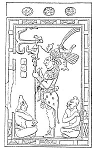
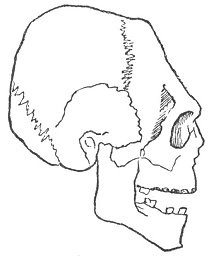
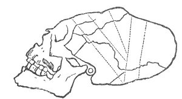
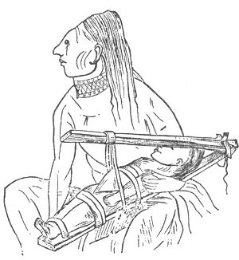
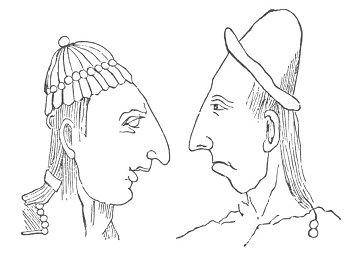
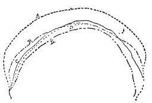
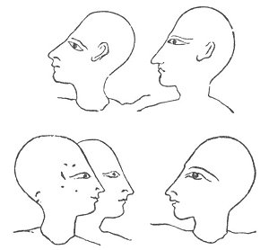
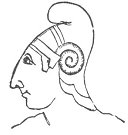
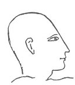

  
[Intangible Textual Heritage](../../index)  [Atlantis](../index.md) 
[Index](index)  [Previous](ataw308)  [Next](ataw401.md) 

------------------------------------------------------------------------

[Buy this Book at
Amazon.com](https://www.amazon.com/exec/obidos/ASIN/B0020ML528/internetsacredte.md)

------------------------------------------------------------------------

  
*Atlantis, the Antediluvian World*, by Ignatius Donnelly, \[1882\], at
Intangible Textual Heritage

------------------------------------------------------------------------

p. 268

## CHAPTER IX.

### ARTIFICIAL DEFORMATION OF THE SKULL.

AN examination of the American monuments shows ([see figure on page
269](#img_26900).md) that the people represented were in the habit of
flattening the skull by artificial means. The Greek and Roman writers
had mentioned this practice, but it was long totally forgotten by the
civilized world, until it was discovered, as an unheard-of wonder, to be
the usage among the Carib Islanders, and several Indian tribes in North
America. It was afterward found that the ancient Peruvians and Mexicans
practised this art: several flattened Peruvian skulls are depicted in
Morton's "Crania Americana." It is still in use among the Flat-head
Indians of the north-western part of the United States.

In 1849 a remarkable memoir appeared from the pen of M. Rathke, showing
that similar skulls had been found near Kertsch, in the Crimea, and
calling attention to the book of Hippocrates, "De Aeris, Aquis et Locu,"
lib. iv., and a passage of Strabo, which speaks of the practice among
the Scythians. In 1854 Dr. Fitzinger published a learned memoir on the
skulls of the Avars, a branch of the Uralian race of Turks. He shows
that the practice of flattening the head had existed from an early date
throughout the East, and described an ancient skull, greatly distorted
by artificial means, which had lately been found in Lower Austria.
Skulls similarly flattened have been found in Switzerland and Savoy. The
Huns under Attila had the same practice of flattening the heads.
Professor Anders Retzius proved (see "Smithsonian Report," 1859) that
the custom *still exists in the south of France, and in parts of
Turkey*.

p. 269

\[paragraph continues\] "Not long since a
French physician surprised the world by the fact that nurses in Normandy
were still giving the children's heads a sugar-loaf shape by bandages
and a tight cap,

 

   
STUCCO BAS-RELIEF IN THE PALACE OF PALENQUE.

 

while in Brittany they preferred to press it round. No doubt they are
doing so to this day." (Tylor's "Anthropology," p. 241.)

Professor Wilson remarks:

 

"Trifling as it may appear, it is not without interest to have the fact
brought under our notice, by the disclosures of ancient

p. 270

barrows and cysts, that the same practice of nursing the child and
carrying it about, bound to a flat cradle-board, prevailed in Britain
and the north of Europe long before the first notices of written history
reveal the presence of man beyond the Baltic or the English Channel, and
that in all probability the same custom prevailed continuously from the
shores of the German Ocean to Behring's Strait." ("Smithsonian Report,"
1862, p. 286.)

Dr. L. A. Gosse testifies to the prevalence of the same custom among the
Caledonians and Scandinavians in the earliest times; and Dr. Thurman has
treated of the same peculiarity among the Anglo-Saxons. Crania
Britannica," chap. iv., p. 38.)

<table data-align="LEFT">
<colgroup>
<col style="width: 100%" />
</colgroup>
<tbody>
<tr class="odd">
<td data-valign="CENTER"> 
ANCIENT SWISS SKULL.</td>
</tr>
</tbody>
</table>

Here, then, is an extraordinary and unnatural practice which has existed
from the highest antiquity, over vast regions of country, on both sides
of the Atlantic, and which is perpetuated unto this day in races as
widely separated as the Turks, the French, and the Flat-head Indians. Is
it possible to explain this except by supposing that it originated from
some common centre?

The annexed out represents an ancient Swiss skull, from a cemetery near
Lausanne, from a drawing of Frederick Troyon. Compare this with [the
illustration given on page 271](#img_27100.md), which represents a Peruvian
flat-head, copied from Morton's "Ethnography and Archæology of the
American Aborigines," 1846. This skull is shockingly distorted. The
dotted lines indicate the course of the bandages by which the skull was
deformed.

p. 271

 

   
PERUVIAN SKULL.

   
CHINOOK (FLAT-HEAD), AFTER CATLIN.

 

The following heads are from Del Rio's "Account of Palenque," copied
into Nott and Gliddon's "Types of Mankind," p. 440. They show that the
receding forehead was a natural characteristic of the ancient people of
Central America. The same form of head has been found even in fossil
skulls. We may therefore conclude that the skull-flattening, which we
find to have been practised in both the Old and New Worlds, was

p. 272

an attempt of other races to imitate the form of skull of a people whose
likenesses are found on the monuments of Egypt and of America. It has
been shown that this peculiar form of the head was present even in the
fœtus of the Peruvian mummies.

Hippocrates tells us that the practice among the Scythians was for the
purpose of giving a certain aristocratic distinction.

 

   
HEADS FROM PALENQUE.

 

Amedée Thierry, in his "History of Attila," says the Huns used it for
the same reason; and the same purpose influences the Indians of Oregon.

Dr. Lund, a Swedish naturalist, found in the bone caves of Minas-Geraes,
Brazil, ancient human bones associated with the remains of extinct
quadrupeds. "These skulls," says Lund, "show not only the peculiarity of
the American race but in an excessive degree, *even to the entire
disappearance of the forehead*." Sir Robert Schomburgh found on some of
the affluents of the Orinoco a tribe known as Frog Indians, whose heads
were flattened by Nature, as shown in newly-born children.

p. 273

In the accompanying plate we show the difference in the conformation of
the forehead 

<table data-align="RIGHT">
<colgroup>
<col style="width: 100%" />
</colgroup>
<tbody>
<tr class="odd">
<td data-valign="CENTER"> 
OUTLINES OF SKULLS OF DIFFERENT RACES.</td>
</tr>
</tbody>
</table>

in various races. The upper dotted line, A, represents the shape of the
European forehead; the next line, B, that of the Australian; the next,
C, that of the Mound Builder of the United States; the next, D, that of
the Guanche of the Canary Islands; and the next, E, that of a skull from
the Inca cemetery of Peru. We have but to compare these lines with the
skulls of the Egyptians, Kurds, and the heroic type of heads in the
statues of the gods of Greece, to see that there was formerly an ancient
race marked by a receding forehead; and that the practice of flattening
the skull was probably an attempt to approximate the shape of the head
to this standard of an early civilized and dominant people.

Not only do we find the same receding forehead in the skulls of the
ancient races of Europe and America, and the same attempt to imitate
this natural and peculiar conformation by artificial flattening of the
head, but it has been found (see Henry Gillman's "Ancient Man in
Michigan," "Smithsonian Report," 1875, p. 242) that the Mound Builders
and Peruvians of America, and the Neolithic people of France and *the
Canary Islands*, had alike an extraordinary custom of boring a circular
bole in the top of the skulls of their dead, so that the soul might
readily pass in and out. More than this, it has been found that in all
these ancient populations the skeletons exhibit a remarkable degree of
*platicnemism*, or flattening of the *tibiæ* or leg bones. (*lbid*.,
1873, p.367.) In this respect the Mound Builders of Michigan were
identical with the man of Cro Magnon and the ancient inhabitants of
Wales.

p. 274

The annexed ancient Egyptian heads, copied from the monuments, indicate
either that the people of the Nile deformed their heads by pressure upon
the front of the skull, or that

 

   
EGYPTIAN HEADS.

 

there was some race characteristic which gave this appearance to their
heads. These heads are all the heads of priests, and therefore
represented the aristocratic class.

The first illustration below is taken from a stucco relief 

<table data-align="LEFT">
<colgroup>
<col style="width: 100%" />
</colgroup>
<tbody>
<tr class="odd">
<td data-valign="CENTER"> 
CENTRAL AMERICAN HEAD.</td>
</tr>
</tbody>
</table>

<table data-align="LEFT">
<colgroup>
<col style="width: 100%" />
</colgroup>
<tbody>
<tr class="odd">
<td data-valign="CENTER"> 
EGYPTIAN HEAD.</td>
</tr>
</tbody>
</table>

found in a temple at Palenque, Central America. The second is from an
Egyptian monument of the time of Rameses IV.

The [outline drawing on the following page](#img_27500.md) shows the form
of the skull

p. 275

of the royal Inca line: the receding forehead here seems to be natural,
and not the result of artificial compression.

Both illustrations at the bottom of the preceding page show the same
receding form of the forehead, due to either artificial deformation of
the skull or 

<table data-align="RIGHT">
<colgroup>
<col style="width: 100%" />
</colgroup>
<tbody>
<tr class="odd">
<td data-valign="CENTER"> 
PERUVIAN INCA SKULL, FROM THE ANCIENT CEMETARY OF PAHACAMAC.</td>
</tr>
</tbody>
</table>

to a common race characteristic.

We must add the fact that the extraordinary practice of deforming the
skull was found all over Europe and America to the catalogue of other
proofs that the people of both continents were originally united in
blood and race. With the couvade, the practice of circumcision, unity of
religious beliefs and customs, folk-lore, and alphabetical signs,
language and flood legends, we array together a mass of unanswerable
proofs of prehistoric identity of race.

------------------------------------------------------------------------

[Next: Chapter I: Traditions of Atlantis.](ataw401.md)
