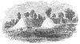
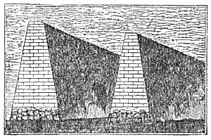
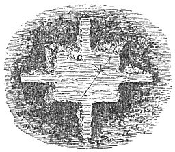
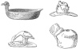
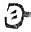

  
[Intangible Textual Heritage](../../index)  [Atlantis](../index) 
[Index](index)  [Previous](ataw502)  [Next](ataw504) 

------------------------------------------------------------------------

[Buy this Book at
Amazon.com](https://www.amazon.com/exec/obidos/ASIN/B0020ML528/internetsacredte)

------------------------------------------------------------------------

  
*Atlantis, the Antediluvian World*, by Ignatius Donnelly, \[1882\], at
Intangible Textual Heritage

------------------------------------------------------------------------

p. 370

## CHAPTER III.

### THE COLONIES OF THE MISSISSIPPI VALLEY

IF we will suppose a civilized, maritime people to have planted
colonies, in the remote past, along the headlands and shores of the Gulf
of Mexico, spreading thence, in time, to the tablelands of Mexico and to
the plains and mountains of New Mexico and Colorado, what would be more
natural than that these adventurous navigators, passing around the
shores of the Gulf, should, sooner or later, discover the mouth of the
Mississippi River; and what more certain than that they would enter it,
explore it, and plant colonies along its shores, wherever they found a
fertile soil and a salubrious climate. Their outlying provinces would
penetrate even into regions where the severity of the climate would
prevent great density of population or development of civilization.

The results we have presupposed are precisely those which we find to
have existed at one time in the Mississippi Valley.

The Mound Builders of the United States were pre-eminently a river
people. Their densest settlements and greatest works were near the
Mississippi and its tributaries. Says Foster ("Prehistoric Races," p.
110), "The navigable streams were the great highways of the Mound
Builders."

Mr. Fontaine claims ("How the World was Peopled") that this ancient
people constructed "levees" to control and utilize the bayous of the
Mississippi for the purpose of agriculture and commerce. The Yazoo River
is called *Yazoo-okhinnah*--the River of Ancient Ruins. "There is no
evidence that they had reached the Atlantic coast; no authentic remains

p. 371

of the Mound Builders are found in the New England States, nor even in
the State of New York." ("North Americans of Antiquity," p. 28.) This
would indicate that the civilization of this people advanced up the
Mississippi River and spread out over its tributaries, but did not cross
the Alleghany Mountains. They reached, however, far up the Missouri and
Yellowstone rivers, and thence into Oregon. The head-waters of the
Missouri became one of their great centres of population; but their
chief sites were upon the Mississippi and Ohio rivers. In Wisconsin we
find the northern central limit of their work; they seem to have
occupied the southern counties of the State, and the western shores of
Lake Michigan. Their circular mounds are found in Minnesota and Iowa,
and some very large ones in Dakota. Illinois and Indiana were densely
populated by them: it is believed that the vital centre of their
colonies was near the junction of the Ohio and Mississippi rivers.

The chief characteristic of the Mound Builders was that from which they
derived their name-the creation of great structures of earth or stone,
not unlike the pyramids of Mexico and Egypt. Between Alton and East St.
Louis is the great mound of Cahokia, which may be selected as a type of
their works: it rises ninety-seven feet high, while its square sides are
700 and 500 feet respectively. There was a terrace on the south side 160
by 300 feet, reached by a graded way; the summit of the pyramid is
flattened, affording a platform 200 by 450 feet. It will thus be seen
that the area covered by the mound of Cahokia is about as large as that
of the greatest pyramid of Egypt, Cheops, although its height is much
less.

The number of monuments left by the Mound Builders is extraordinarily
great. In Ohio alone there are more than ten thousand tumuli, and from
one thousand to fifteen hundred enclosures. Their mounds were not cones
but four-sided pyramids-their sides, like those of the Egyptian
pyramids, corresponding with the cardinal points. (Foster's "Prehistoric
Races," p. 112.)

p. 372

The Mound Builders had attained a considerable degree of civilization;
they were able to form, in the construction of their works, perfect
circles and perfect squares of great accuracy, carried over the varying
surface of the country. One large enclosure comprises exactly forty
acres. At Hopetown, Ohio, are two walled figures--one a square, the
other a circle--each containing precisely twenty acres. They must have
possessed regular scales of measurement, and the means of determining
angles and of computing the area to be enclosed by the square and the
circle, so that the space enclosed by each might exactly correspond.

"The most skilful engineer of this day would find it difficult," says
Mr. Squier, "without the aid of instruments, to lay down an accurate
square of the great dimensions above represented, measuring, as they do,
more than four-fifths of a mile in circumference. . . . But we not only
find accurate squares and perfect circles, but also, as we have seen,
octagons of great dimensions."

They also possessed an accurate system of weights; bracelets of copper
on the arms of a skeleton have been found to be of uniform size,
measuring each two and nine-tenth inches, and each weighing *precisely
four ounces*.

They built great military works surrounded by walls and ditches, with
artificial lakes in the centre to supply water. One work, Fort Ancient,
on the Little Miami River, Ohio, has a circuit of between four and five
miles; the embankment was twenty feet high; the fort could have held a
garrison of sixty thousand men with their families and provisions.

Not only do we find pyramidal structures of earth in the Mississippi
Valley very much like the pyramids of Egypt, Mexico, and Peru, but a
very singular structure is repeated in Ohio and Peru: I refer to the
double walls or prolonged pyramids, if I may coin an expression, shown
in the [cut page 375](#img_37500).

The Mound Builders possessed chains of fortifications reaching from the
southern line of New York diagonally across the

p. 373

 

  [  
Click to enlarge](img/37300.jpg)  
GRAND WAY NEAR PIKETON, OHIO.

 

p. 375

country, through Central and Northern Ohio to the Wabash. It would
appear probable, therefore, that while they advanced

 

   
WALLS AT GRAN-CHIMU, PERU.

 

from the south it was from the north-east the savage races came who
drove them south or exterminated them.

At Marietta, Ohio, we find a combination of the cross and pyramid., (See
p. 334, *ante*.) At Newark, Ohio, are extensive

 

   
CROSS AND PYRAMID MOUND, OHIO.

 

and intricate works: they occupy an area two miles square, embraced
within embankments twelve miles long. One of the mounds is a threefold
symbol, like a bird's foot; the central

p. 376

mound is 155 feet long, and the other two each 110 feet it length. Is
this curious design a reminiscence of Atlantis and the three-pronged
trident of Poseidon? (See 4th fig., p, 242, ante.)

The Mound Builders made sun-dried brick mixed with rushes, as the
Egyptians made sun-dried bricks mixed with straw; they worked in copper,
silver, lead, and there are evidences, as we shall see, that they
wrought even in iron.

Copper implements are very numerous in the mounds. Copper axes,
spear-heads, hollow buttons, bosses for ornaments, bracelets, rings,
etc., are found in very many of them strikingly similar to those of the
Bronze Age in Europe. In one in Butler County, Ohio, was found a copper
fillet around the head of a skeleton, with strange devices marked upon
it.

Silver ornaments have also been found, but not in such great numbers.
They seem to have attached a high value to silver, and it is often found
in thin sheets, no thicker than paper, wrapped over copper or stone
ornaments so neatly as almost to escape detection. The great esteem in
which they held a metal so intrinsically valueless as silver, is another
evidence that they must have drawn their superstitions from the same
source as the European nations.

Copper is also often found in this manner plated over stone pipes,
presenting an unbroken metallic lustre, the overlapping edges so well
polished as to be scarcely discoverable. Beads and stars made of shells
have sometimes been found doubly plated, first with copper then with
silver.

The Mound Builders also understood the art of casting metals, or they
held intercourse with some race who did; a copper axe it "cast" has been
found in the State of New York. (See Lubbock's "Prehistoric Times," p.
254, note.) Professor Foster ("Prehistoric Races," p. 259) also proves
that the ancient people of the Mississippi Valley possessed this art,
and he gives us representations of various articles plainly showing the
marks of the mould upon them.

p. 377

A rude article in the shape of an axe, composed of pure lead, weighing
about half a pound, was found in sinking a well within the trench of the
ancient works at Circleville. There can be no doubt it was the
production of the Mound Builders, as galena has often been found on the
altars in the mounds.

It has been generally thought, by Mr. Squier and others, that there were
no evidences that the Mound Builders were acquainted with the use of
iron, or that their plating was more than a simple overlaying of one
metal on another, or on some foreign substance.

Some years since, however, a mound was opened at Marietta, Ohio, which
seems to have refuted these opinions. Dr. S. P. Hildreth, in a letter to
the American Antiquarian Society, thus speaks of it:

"Lying immediately over or on the forehead of the body were found three
large circular bosses, or ornaments for a sword-belt or buckler; they
are composed of copper overlaid with a thick plate of silver. The fronts
are slightly convex, with a depression like a cup in the centre, and
they measure two inches and a quarter across the face of each. On the
back side, opposite the depressed portion, is a copper rivet or nail,
around which are two separate plates by which they were fastened to the
leather. Two small pieces of leather were found lying between the plates
of one of the bosses; they resemble the skin of a mummy, and seem to
have been preserved by the salts of copper. Near the side of the body
was found a plate of silver, which appears to have been the upper part
of a sword scabbard; it is six inches in length, two in breadth, and
weighs one ounce. It seems to have been fastened to the scabbard by
three or four rivets, the holes of which remain in the silver.

"Two or three pieces of copper tube were also found, *filled with iron
rust*. These pieces, from their appearance, composed the lower end of
the scabbard, near the point of the sword. No signs of the sword itself
were discovered, except the rust above mentioned.

"The mound had every appearance of being as old as any in the
neighborhood, and was at the first settlement of Marietta covered with
large trees. It seems to have been made for this

p. 378

single personage, as this skeleton alone was discovered. The bones were
very much decayed, and many of them crumbled to dust upon exposure to
the air."

Mr. Squier says, "These articles have been critically examined, and it
is beyond doubt that the copper bosses were absolutely *plated*, not
simply *overlaid*, with silver. Between the copper and the silver exists
a connection such as, it seems to me, could only be produced by heat;
and if it is admitted that. these are genuine relies of the Mound
Builders, it must, at the same time, be admitted that they possessed the
difficult art of plating one metal upon another. There is but one
alternative, viz., that they had occasional or constant intercourse with
a people advanced in the arts, from whom these articles were obtained.
Again, if Dr. Hildreth is not mistaken, *oxydized iron* or steel was
also discovered in connection with the above remains, from which also
follows the extraordinary conclusion that *the Mound Builders were
acquainted with the use of iron*, the conclusion being, of course,
subject to the improbable alternative already mentioned."

In connection with this subject, we would refer to the interesting
evidences that the copper mines of the shore of Lake Superior had been
at some very remote period worked by the Mound Builders. There were
found deep excavations, with rude ladders, huge masses of rock broken
off, also numerous stone tools, and all the evidences of extensive and
long-continued labor. It is even said that the great Ontonagon mass of
pure copper which is now in Washington was excavated by these ancient
miners, and that when first found its surface showed numerous marks of
their tools.

There seems to be no doubt, then, that the Mound Builders were familiar
with the use of copper, silver, and lead, and in all probability of
iron. They possessed various mechanical contrivances. They were very
probably acquainted with the lathe. Beads of shell have been found
looking very much like ivory, and showing the *circular striæ, identical
with those produced by turning in a lathe*.

In a mound on the Scioto River was found around the neck

p. 379

of a skeleton triple rows of beads, made of marine shells and the tusks
of some animal. "Several of these," says Squier, "still retain their
polish, and bear marks which seem to indicate that they were turned in
some machine, instead of being carved or rubbed into shape by hand."

"Not among the least interesting and remarkable relies," continues the
same author, "obtained from the mounds are the stone tubes. They are all
carved from fine-grained materials, capable of receiving a polish, and
being made ornamental as well as useful. The finest specimen yet
discovered, and which can scarcely be surpassed in the delicacy of its
workmanship, was found in a mound in the immediate vicinity of
Chillicothe. It is composed of a compact variety of slate. This stone
cuts with great clearness, and receives a fine though not glaring
polish. The tube under notice is thirteen inches long by one and
one-tenth in diameter; one end swells slightly, and the other terminates
in a broad, flattened, triangular mouth-piece of fine proportions, which
is carved *with mathematical precision*. It is drilled throughout; the
bore is seven-tenths of an inch in diameter at the cylindrical end of
the tube, and retains that calibre until it reaches the point where the
cylinder subsides into the mouth-piece, when it contracts gradually to
one-tenth of an inch. The inner surface of the tube is perfectly smooth
till within a short distance of the point of contraction. *For the
remaining distance the circular striæ, formed by the drill in boring,
are distinctly marked*. The carving upon it is very fine."

That they possessed saws is proved by the fact that on some fossil teeth
found in one of the mounds the *striæ* of the teeth of the saw could be
distinctly perceived.

When we consider that some of their porphyry carvings will turn the edge
of the best-tempered knife, we are forced to conclude that they
possessed that singular process, known to the Mexicans and Peruvians of
tempering copper to the hardness of steel.

p. 380

We find in the mounds adzes similar in shape to our own, with the edges
bevelled from the inside.

Drills and gravers of copper have also been found, with chisel-shaped
edges or sharp points.

"It is not impossible," says Squier, "but, on the contrary, very
probable, from a close inspection of the mound pottery, that the ancient
people possessed the simple approximation toward the potter's wheel; and
the polish which some of the finer vessels possess is due to other
causes than vitrification."

Their sculptures show a considerable degree of progress. They consist of
figures of birds, animals, reptiles, and the faces of men, carved from
various kinds of stones, upon the bowls of pipes, upon toys, upon rings,
and in distinct and separate figures. We give the opinions of those who
have examined them.

Mr. Squier observes: "Various though not abundant specimens of their
skill have been recovered, which in elegance of model, delicacy, and
finish, as also in fineness of material, come fully up to the best
Peruvian specimens, to which they bear, in many respects, a close
resemblance. The bowls of most of the stone pipes are carved in
miniature figures of animals, birds, reptiles, etc. All of them are
executed with strict fidelity to nature, and with exquisite skill. Not
only are the features of the objects faithfully represented, but their
peculiarities and habits. are in some degree exhibited. . . . The two
heads here presented, intended to represent the eagle, are far superior
in point of finish, spirit, and truthfulness, to any miniature carvings,
ancient or modern, which have fallen under the notice of the authors.
The peculiar defiant expression of the king of birds is admirably
preserved in the carving, which in this respect, more than any other,
displays the skill of the artist."

Traces of cloth with "doubled and twisted fibre" have been found in the
mounds; also matting; also shuttle-like tablets, used in weaving. There
have also been found numerous musical pipes, with mouth-pieces and
stops; lovers' pipes, curiously and delicately carved, reminding us of
Bryant's lines--

p. 381

 

  [  
Click to enlarge](img/38100.jpg)  
FROM THE MOUNDS OF THE OHIO VALLEY.

 

p. 383

"Till twilight came, and lovers walked and wooed  
In a forgotten language; and old tunes,  
From instruments of unremembered forms,  
Gave the soft winds a voice."

There is evidence which goes to prove that the Mound Builders had
relations with the people of a semi-tropical region in the direction of
Atlantis, Among their sculptures, in Ohio, we find accurate
representations of the lamantine, manatee, or sea-cow--found to-day on
the shores of Florida, Brazil, and Central America--and of the toucan, a
tropical and almost exclusively South American bird. Sea-shells from the
Gulf, pearls from the Atlantic, and obsidian from Mexico, have also been
found side by side in their mounds.

The antiquity of their works is now generally conceded. "From the ruins
of Nineveh and Babylon," says Mr. Gliddon, "we have bones of at least
two thousand five hundred years old; from the pyramids and the catacombs
of Egypt both mummied and unmummied crania have been taken, of still
higher antiquity, in perfect preservation; nevertheless, the skeletons
deposited in our Indian mounds, from the Lakes to the Gulf, are
crumbling into dust through age alone."

All the evidence points to the conclusion that civilized or
semi-civilized man has dwelt on the western continent from a vast
antiquity. Maize, tobacco, quinoa, and the mandico plants have been
cultivated so long that their wild originals have quite disappeared.

"The only species of palm cultivated by the South American Indians, that
known as the *Gulielma speciosa*, has lost through that culture its
original nut-like seed, and is dependent on the hands of its cultivators
for its life. Alluding to the above-named plants Dr. Brinton ("Myths of
the New World," p. 37) remarks, 'Several are sure to perish unless
fostered by human care. What numberless ages does this suggest? How many
centuries elapsed ere man thought of cultivating Indian corn? How many
more ere it had spread over nearly a hundred degrees of latitude and
lost all resemblance to its original form?'

p. 384

\[paragraph continues\] In the animal
kingdom certain animals were domesticated by the aborigines from so
remote a period that scarcely any of their species, as in the case of
the lama of Peru, were to be found in a state of unrestrained freedom at
the advent of the Spaniards." (Short's "North Americans of Antiquity,"
p. 11.)

The most ancient remains of man found in Europe are distinguished by a
flattening of the tibia; and this peculiarity is found to be present in
an exaggerated form in some of the American mounds. This also points to
a high antiquity.

"None of the works, mounds, or enclosures are found on the lowest formed
of the river terraces which mark the subsidence of the streams, and as
there is no good reason why their builders should have avoided erecting
them on that terrace while they raised them promiscuously on all the
others, it follows, not unreasonably, that this terrace has been formed
since the works were erected. (Baldwin's "Ancient America," p. 47.)

We have given some illustrations showing the similarity between the
works of the Mound Builders and those of the Stone and Bronze Age in
Europe. (See pp. [251](ataw308.htm#page_251),
[260](ataw308.htm#page_260), [261](ataw308.htm#page_261),
[262](ataw308.htm#page_262), [265](ataw308.htm#page_265),
[266](ataw308.htm#page_266), ante.)

The Mound Builders retreated southward toward Mexico, and probably
arrived there some time between A.D. 29 and A.D. 231, under the name of
Nahuas. They called the region they left in the Mississippi Valley "Hue
Hue Tlapalan"--*the old, old red land*--in allusion, probably, to the
red-clay soil of part of the country.

In the mounds we find many works of copper but none of bronze. This may
indicate one of two things: either the colonies which settled the
Mississippi Valley may have left Atlantis prior to the discovery of the
art of manufacturing bronze, by mixing one part of tin with nine parts
of copper, or, which is more probable, the manufactures of the Mound
Builders may have been made on the spot; and as they had no tin within
their territory they used copper alone, except, it

p. 385

may be, for such tools as were needed to carve stone, and these,
perhaps, were hardened with tin. It is known that the Mexicans possessed
the art of manufacturing true bronze; and the intercourse which
evidently existed between Mexico and the Mississippi Valley, as proved
by the presence of implements of obsidian in the mounds of Ohio, renders
it probable that the same commerce which brought them obsidian brought
them also small quantities of tin, or tin-hardened copper implements
necessary for their sculptures.

The proofs, then, of the connection of the Mound Builders with Atlantis
are:

1\. Their race identity with the nations of Central America who
possessed Flood legends, and whose traditions all point to an eastern,
over-sea origin; while the many evidences of their race identity with
the ancient Peruvians indicate that they were part of one great movement
of the human race, extending from the Andes to Lake Superior, and, as I
believe, from Atlantis to India.

2\. The similarity of their civilization, and their works of stone and
bronze, with the civilization of the Bronze Age in Europe.

3\. The presence of great truncated mounds, kindred to the pyramids of
Central America, Mexico, Egypt, and India.

4\. The representation of tropical animals, which point to an
intercourse with the regions around the Gulf of Mexico, where the
Atlanteans were colonized.

5\. The fact that the settlements of the Mound Builders were confined to
the valley of the Mississippi, and were apparently densest at those
points where a population advancing up that, stream would first reach
high, healthy, and fertile lands.

6\. The hostile nations which attacked them came from the north; and
when the Mound Builders could no longer hold the country, or when
Atlantis stink in the sea, they retreated in the direction whence they
came, and fell back upon their kindred races in Central America, as the
Roman troops in

p. 386

Gaul and Britain drew southward upon the destruction of Rome.

7\. The Natchez Indians, who are supposed to have descended from the
Mound Builders, kept a perpetual fire burning before an altar, watched
by old men who were a sort of priesthood, as in Europe.

8\. If the tablet said to have been found in a mound near Davenport,
Iowa, is genuine, which appears probable, the Mound Builders must either
have possessed an alphabet, or have held intercourse with some people
who did. (See "North Americans of Antiquity," p. 38.) This singular
relic exhibits what appears to be a sacrificial mound with a fire upon
it; over it are the sun, moon, and stars, and above these a mass of
hieroglyphics which bear some resemblance to the letters of European
alphabets, and especially to that unknown alphabet which appears upon
the inscribed bronze celt found near Rome. (See p. 258 of this work.)
For instance, one of the letters on the celt is this,  ; on the Davenport tablet we
find this sign,  ; on the
celt we have  ; on the
tablet,  ; on the celt we
have  ; on the tablet,
 .

------------------------------------------------------------------------

[Next: Chapter IV: The Iberian Colonies of Atlantis](ataw504)
