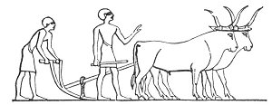

  
[Intangible Textual Heritage](../../index)  [Atlantis](../index) 
[Index](index)  [Previous](ataw509)  [Next](ataw511) 

------------------------------------------------------------------------

[Buy this Book at
Amazon.com](https://www.amazon.com/exec/obidos/ASIN/B0020ML528/internetsacredte)

------------------------------------------------------------------------

  
*Atlantis, the Antediluvian World*, by Ignatius Donnelly, \[1882\], at
Intangible Textual Heritage

------------------------------------------------------------------------

p. 456

## CHAPTER X.

### THE ARYAN COLONIES FROM ATLANTIS.

WE come now to another question: "Did the Aryan or Japhetic race come
from Atlantis?"

If the Aryans *are* the Japhetic race, and if Japheth was one of the
sons of the patriarch who escaped from the Deluge, then assuredly, if
the tradition of Genesis be true, the Aryans came from the drowned land,
to wit, Atlantis. According to Genesis, the descendants of the Japheth
who escaped out of the Flood with Noah are the Ionians, the inhabitants
of the Morea, the dwellers on the Cilician coast of Asia Minor, the
Cyprians, the Dodoneans of Macedonia, the Iberians, and the Thracians.
These are all now recognized as Aryans, except the Iberians.

"From non-Biblical sources," says Winchell, "we obtain further
information respecting the early dispersion of the Japhethites or
Indo-Europeans--called also Aryans. *All determinations confirm the
Biblical account of their primitive residence in the same country with
the Hamites and Semites*. Rawlinson informs us that even Aryan roots are
mingled with Presemitic in some of the old inscriptions of Assyria. The
precise region where these three families dwelt in a common home has not
been pointed out." ("Preadamites," p. 43.)

I have shown in the chapter in relation to Peru that all the languages
of the Hamites, Semites, and Japhethites are varieties of one aboriginal
speech.

The centre of the Aryan migrations (according to popular opinion) within
the Historical Period was Armenia. Here too

p. 457

is Mount Ararat, where it is said the ark rested--another identification
with the Flood regions, as it represents the usual transfer of the
Atlantis legend by an Atlantean people to a high mountain in their new
home.

Now turn to a map: Suppose the ships of Atlantis to have reached the
shores of Syria, at the eastern end of the Mediterranean, where dwelt a
people who, as we have seen, used the Central American Maya alphabet;
the Atlantis ships are then but two hundred miles distant from Armenia.
But these ships need not stop at Syria, they can go by the Dardanelles
and the Black Sea, by uninterrupted water communication, to the shores
of Armenia itself. If we admit, then, that it was from Armenia the
Aryans stocked Europe and India, there is no reason why the original
population of Armenia should not have been themselves colonists from
Atlantis.

But we have seen that in the earliest ages, before the first Armenian
migration of the historical Aryans, a people went from Iberian Spain and
settled in Ireland, and the language of this people, it is now admitted,
is Aryan. And these Iberians were originally, according to tradition,
from the West.

The Mediterranean Aryans are known to have been in Southeastern Europe,
along the shores of the Mediterranean, 2000 B.C. They at that early date
possessed the plough; also wheat, rye, barley, gold, silver, and bronze.
Aryan faces are found depicted upon the monuments of Egypt, painted four
thousand years before the time of Christ. "The conflicts between the
Kelts (an Aryan race) and the Iberians were far anterior in date to the
settlements of the Phœnicians, Greeks, Carthaginians, and Noachites on
the coasts of the Mediterranean Sea." ("American Cyclopædia," art.
*Basques*.) There is reason to believe that these Kelts were originally
part of the population and Empire of Atlantis. We are told (Rees's
"British Encyclopædia," art. *Titans*) that "Mercury, one of the
Atlantean gods, was placed as ruler over the Celtæ, and became their
great divinity." F. Pezron, in his "Antiquity of the Celtæ," makes

p. 458

out that the Celtæ were the same as the Titans, the giant race who
rebelled in Atlantis, and "that their princes were the same with the
giants of Scripture." He adds that the word Titan "is perfect Celtic,
and comes from *tit*, the earth, and *ten* or *den*, man, and hence the
Greeks very properly also called them *terriginæ*, or earth-born." And
it will be remembered that Plato uses the same phrase when he speaks of
the race into which Poseidon intermarried as "the earth-born primeval
men of that country."

The Greeks, who are Aryans, traced their descent from the people who
were destroyed by the Flood, as did other races clearly Aryan.

"The nations who are comprehended under the common appellation of
Indo-European," says Max Müller--"the Hindoos, the Persians, the Celts,
Germans, Romans, Greeks, and Slavs--do not only share the same words and
the same grammar, slightly modified in each country, but they seem to
have likewise preserved a mass of popular traditions which had grown up
before they left their common home."

"Bonfey, L. Geiger, and other students of the ancient Indo-European
languages, have recently advanced the opinion that the original home of
the Indo-European races must be sought in Europe, because their stock of
words is rich in the names of plants and animals, and contains names of
seasons that are not found in tropical countries or anywhere in Asia."
("American Cyclopædia," art. *Ethnology*.)

By the study of comparative philology, or the seeking out of the words
common to the various branches of the Aryan race before they separated,
we are able to reconstruct an outline of the civilization of that
ancient people. Max Müller has given this subject great study, and
availing ourselves of his researches we can determine the following
facts as to the progenitors of the Aryan stock: They were a civilized
race; they possessed the institution of marriage; they recognized the
relationship of father, mother, son, daughter, grandson,

p. 459

brother, sister, mother-in-law, father-in-law, son-in-law,
daughter-in-law, brother-in-law, and sister-in-law, and had separate
words for each of these relationships, which we are only able to express
by adding the words "in-law." They recognized also the condition of
widows, or "the husbandless." They lived in an organized society,
governed by a king. They possessed houses with doors and solid walls.
They had wagons and carriages. They possessed family names. They dwelt
in towns and cities, on highways. *They were not hunters or nomads*.
They were a peaceful people; the warlike words in the different Aryan
languages cannot be traced back to this original race. They lived in a
country having few wild beasts; the only wild animals whose names can be
assigned to this parent stock being the bear, the wolf, and the serpent.
The name of the elephant, "the beast with a hand," occurs only twice in
the "Rig-Veda;" a singular omission if the Aryans were from time
immemorial an Asiatic race; and "when it does occur, it is in such a way
as to show that he was still an object of wonder and terror to them."
(Whitney's "Oriental and Linguistic Studies," p. 26.) They possessed
nearly all the domestic animals we now have--the ox and the cow, the
horse, the dog, the sheep, the goat, the hog, the donkey, and the goose.
They divided the year into twelve months. They were farmers; they used
the plough; their name as a race (Aryan) was derived from it; they were,
*par excellence*, ploughmen; they raised various kinds of grain,
including flax, barley, hemp, and wheat; they had mills and millers, and
ground their corn. The presence of millers shows that they had proceeded
beyond the primitive condition where each family ground its corn in its
own mill. They used fire, and cooked and baked their food; they wove
cloth and wore clothing; they spun wool; they possessed the different
metals, *even iron*: they had gold. The word for "water" also meant
"salt made from water," from which it might be inferred that the water
with which they were familiar was saltwater. It is evident they
manufactured salt by evaporating salt-water.

p. 460

\[paragraph continues\] They possessed
boats and ships. They had progressed so far as to perfect "a decimal
system of enumeration, in itself," says Max Müller, "one of the most
marvellous achievements of the human mind, based on an abstract
conception of

 

   
ANCIENT EGYPTIAN PLOUGH.

 

quantity, regulated by a philosophical classification, and yet
conceived, nurtured, and finished before the soil of Europe was trodden
by Greek, Roman, Slav, or Teuton."

And herein we find another evidence of relationship between the Aryans
and the people of Atlantis. Although Plato does not tell us that the
Atlanteans possessed the decimal system of numeration, nevertheless
there are many things in his narrative which point to that conclusion
"There were ten kings ruling over ten provinces; the whole country was
divided into military districts or squares ten stadia each way; the
total force of chariots was ten thousand; the great ditch or canal was
one hundred feet deep and ten thousand stadia long; there were one
hundred Nereids," etc. In the Peruvian colony the decimal system clearly
obtained: "The army had heads of ten, fifty, a hundred, five hundred, a
thousand, ten thousand. . . . The community at large was registered in
groups, under the control of officers over tens, fifties, hundreds, and
so on." (Herbert Spencer, "Development of Political Institutions," chap.
x.) The same division into tens and hundreds obtained among the
Anglo-Saxons.

Where, we ask, could this ancient nation, which existed before

p. 461

Greek was Greek, Celt was Celt, Hindoo was Hindoo, or Goth was Goth,
have been located! The common opinion says, in Armenia or Bactria, in
Asia. But where in Asia could they have found a country so peaceful as
to know no terms for war or bloodshed;--a country so civilized as to
possess no wild beasts save the bear, wolf, and serpent? No people could
have been developed in Asia without bearing in its language traces of
century-long battles for life with the rude and barbarous races around
them; no nation could have fought for ages for existence against
"man-eating" tigers, lions, elephants, and hyenas, without bearing the
memory of these things in their tongue. A tiger, identical with that of
Bengal, still exists around Lake Aral, in Asia; from time to time it is
seen in Siberia. "The last tiger killed in 1828 was on the Lena, in
latitude fifty-two degrees thirty minutes, in a climate colder than that
of St. Petersburg and Stockholm."

The fathers of the Aryan race must have dwelt for many thousand years so
completely protected from barbarians and wild beasts that they at last
lost all memory of them, and all words descriptive of them; and where
could this have been possible save in some great, long-civilized land,
surrounded by the sea, and isolated from the attack of the savage tribes
that occupied the rest of the world? And if such a great civilized
nation had dwelt for centuries in Asia, Europe, or Africa, why have not
their monuments long ago been discovered and identified? Where is the
race who are their natural successors, and who must have continued to
live after them in that sheltered and happy land, where they knew no
human and scarcely any animal enemies? Why would any people have
altogether left such a home? Why, when their civilization had spread to
the ends of the earth, did it cease to exist in the peaceful region
where it originated?

Savage nations cannot usually count beyond five. This people had names
for the numerals up to one hundred, and the power, doubtless, of
combining these to still higher powers, as

p. 462

three hundred, five hundred, ten hundred, etc. Says a high authority,
"If any more proof were wanted as to the reality of that period which
must have preceded the dispersion of the Aryan race, we might appeal to
the Aryan numerals as irrefragable evidence of that long-continued
intellectual life which characterizes that period." Such a degree of
progress implies necessarily an alphabet, writing, commerce, and trade,
even as the existence of words for boats and ships has already implied
navigation.

In what have we added to the civilization of this ancient people? Their
domestic animals were the same as our own, except one fowl adopted from
America. In the past ten thousand years we have added one bird to their
list of domesticated animals! They raised wheat and wool, and spun and
wove as we do, except that we have added some mechanical contrivances to
produce the same results. Their metals are ours. Even iron, the triumph,
as we had supposed, of more modern times, they had already discovered.
And it must not be forgotten that Greek mythology tells us that the
god-like race who dwelt on Olympus, that great island "in the midst of
the Atlantic," in the remote west, wrought in iron; and we find the
remains of an iron sword and meteoric iron weapons in the mounds of the
Mississippi Valley, while the name of the metal is found in the ancient
languages of Peru and Chili, and the Incas worked in iron on the shores
of Lake Titicaca.

A still further evidence of the civilization of this ancient race is
found in the fact that, before the dispersion from their original home,
the Aryans had reached such a degree of development that they possessed
a regularly organized religion: they worshipped God, they believed in an
evil spirit, they believed in a heaven for the just. All this
presupposes temples, priests, sacrifices, and an orderly state of
society.

We have seen that Greek mythology is really a history of the kings and
queens of Atlantis.

When we turn to that other branch of the great Aryan

p. 463

family, the Hindoos, we find that their gods are also the kings of
Atlantis. The Hindoo god Varuna is conceded to be the Greek god Uranos,
who was the founder of the royal family of Atlantis.

In the Veda we find a hymn to "King Varuna," in which occurs this
passage:

"This earth, too, belongs to Varuna, the king, and this wide sky, with
its ends far apart. *The two seas are Varuna's loins*; he is contained
also in this drop of water."

Again in the Veda we find another hymn to King Varuna:

"He who knows the place of the birds that fly through the sky; who on
the waters knows *the ships*. He, the upholder of order, who knows *the
twelve months with the offspring of each, and knows the month that is
engendered afterward*."

This verse would seem to furnish additional proof that the Vedas were
written by a maritime people; and in the allusion to the twelve months
we are reminded of the Peruvians, who also divided the year into twelve
parts of thirty days each, and afterward added six days to complete the
year. The Egyptians and Mexicans also had intercalary days for the same
purpose.

But, above all, it must be remembered that the Greeks, an Aryan race, in
their mythological traditions, show the closest relationship to
Atlantis. *At*-tika and *At*-hens are reminiscences of *Ad*, and we are
told that Poseidon, god and founder of Atlantis, founded Athens. We find
in the "Eleusinian mysteries" an Atlantean institution; their influence
during the whole period of Greek history down to the coming of
Christianity was extraordinary; and even then this masonry of
Pre-Christian days, in which kings and emperors begged to be initiated,
was, it is claimed, continued to our own times in our own Freemasons,
who trace their descent back to "a Dionysiac fraternity which originated
in Attika." And just as we have seen the Saturnalian festivities of
Italy descending from Atlantean

p. 464

harvest-feasts, so these Eleusinian mysteries can be traced back to
Plato's island. Poseidon was at the base of them; the first hierophant,
Eumolpus, was "a son of Poseidon," and all the ceremonies were
associated with seed-time and harvest, and with Demeter or Ceres, an
Atlantean goddess, daughter of Chronos, who first taught the Greeks to
use the plough and to plant barley. And, as the "Carnival" is a survival
of the "Saturnalia," so Masonry is a survival of the Eleusinian
mysteries. The roots of the institutions of to-day reach back to the
Miocene Age.

We have seen that Zeus, the king of Atlantis, whose tomb was shown at
Crete, was transformed into the Greek god Zeus; and in like manner we
find him reappearing among the Hindoos as Dyaus. He is called
"Dyaus-pitar," or God the Father, as among the Greeks we have
Zeus-pater," which became among the Romans "Jupiter."

The strongest connection, however, with the Atlantean system is shown in
the case of the Hindoo god Deva-Nahusha.

We have seen in the chapter on Greek mythology that Dionysos was a son
of Zeus and grandson of Poseidon, being thus identified with Atlantis.
"When he arrived at manhood," said the Greeks, "he set out on a journey
through all known countries, even into the remotest parts of India,
instructing the people, as be proceeded, how to tend the vine, and how
to practise many other arts of peace, besides teaching them the value of
just and honorable dealings. He was praised everywhere as the greatest
benefactor of mankind." (Murray's "Mythology," p. 119.)

In other words, be represented the great Atlantean civilization,
reaching into "the remotest parts of India," and "to all parts of the
known world," from America to Asia. In consequence of the connection of
this king with the vine, he was converted in later times into the
dissolute god Bacchus. But everywhere the traditions concerning him
refer us back to Atlantis. "All the legends of Egypt, India, Asia Minor,
and

p. 465

the older Greeks describe him as a king very great during his life, and
deified after death. . . . Amon, king of Arabia or Ethiopia, married
Rhea, sister of Chronos, who reigned over Italy, Sicily, and *certain
countries of Northern Africa*." Dionysos, according to the Egyptians,
was the son of Amon by the beautiful Amalthea. Chronos and Amon had a
prolonged war; Dionysos defeated Chronos and captured his capital,
dethroned him, and put his son Zeus in his place; Zeus reigned nobly,
and won a great fame. Dionysos succeeded his father Amon, and "became
the greatest of sovereigns. He extended his sway in all the neighboring
countries, and completed the conquest of India. . . . He gave much
attention to the Cushite colonies in Egypt, greatly increasing their
strength, intelligence, and prosperity." (Baldwin's "Prehistoric
Nations," p. 283.)

When we turn to the Hindoo we still find this Atlantean king.

In the Sanscrit books we find reference to a god called Deva-Nahusha,
who has been identified by scholars with Dionysos. He is connected "with
the oldest history and mythology in the world." He is said to have been
a contemporary with Indra, king of Meru, who was also deified, and who
appears in the Veda as a principal form of representation of the Supreme
Being.

"The warmest colors of imagination are used in portraying the greatness
of Deva-Nahusha. For a time he had sovereign control of affairs in Meru;
he conquered the seven dwipas, and led his armies *through all the known
countries of the world*; by means of matchless wisdom and miraculous
heroism *he made his empire universal*." (*Ibid*., p. 287.)

Here we see that the great god Indra, chief god of the Hindoos, was
formerly king of Meru, and that Deva-Nahusha (De(va)nushas--De-onyshas)
had also been king of Meru; and we must remember that Theopompus tell us
that the island of Atlantis was inhabited by the "Meropes;" and
Lenormant

p. 466

has reached the conclusion that the first people of the ancient world
were "the men of Mero."

We can well believe, when we see traces of the same civilization
extending from Peru and Lake Superior to Armenia and the frontiers of
China, that this Atlantean kingdom was indeed "universal," and extended
through all the "known countries of the world."

"We can see in the legends that Pururavas, Nahusha, and others had no
connection with Sanscrit history. They are referred to ages very long
anterior to the Sanscrit immigration, and must have been great
personages celebrated in the traditions of the natives or Dasyus. . . .
Pururavas was a king of great renown, *who ruled over thirteen islands
of the ocean*, altogether surrounded by inhuman (or superhuman)
personages; he engaged in a contest with Brahmans, and perished.
Nahusha, mentioned by Maull, and in many legends, as famous for
hostility to the Brahmans, lived at the time when Indra ruled on earth.
He was a very great king, who ruled with justice a mighty empire, and
*attained the sovereignty of three worlds*." (Europe, Africa, and
America?) "Being intoxicated with pride, he was arrogant to Brahmans,
compelled them to bear his palanquin, and even dared to touch one of
them with his foot" (kicked him?), "whereupon be was transformed into a
serpent." (Baldwin's "Prehistoric Nations," p. 291.)

The Egyptians placed Dionysos (Osiris) at the close of the period of
their history which was assigned to the gods, that is, toward the close
of the great empire of Atlantis.

When we remember that the hymns of the "Rig-Veda" are admitted to date
back to a vast antiquity, and are written in a language that had ceased
to be a living tongue thousands of years ago, we can almost fancy those
hymns preserve some part of the songs of praise uttered of old upon the
island of Atlantis. Many of them seem to belong to sun-worship, and
might have been sung with propriety upon the high places of Peru:

"In the beginning there arose *the golden child*. He was the one born
Lord of all that is. He established the earth and the sky. Who is the
god to whom we shall offer sacrifice?

p. 467

"He who gives life; He who gives strength; whose command all the bright
gods" (the stars?) "revere; whose light is immortality; whose shadow is
death. . . . He who through his power is the one God of the breathing
and awakening world. He who governs all, man and beast. He whose
greatness these snowy mountains, whose greatness the sea proclaims, with
the distant river. *He through whom the sky is bright and the earth
firm*. . . . He who measured out the light in the air... Wherever the
mighty water-clouds went, where they placed the seed and lit the fire,
thence arose He who is the sole life of the bright gods. . . . He to
whom heaven and earth, standing firm by His will, look up, trembling
inwardly. . . . *May he not destroy us*; He, the creator of the earth;
He, the righteous, who created heaven. He also created *the bright and
mighty waters*."

This is plainly a hymn to the sun, or to a god whose most glorious
representative was the sun. It is the hymn of a people near the sea; it
was not written by a people living in the heart of Asia. It was the hymn
of a people living in a volcanic country, who call upon their god to
keep the earth "firm" and not to destroy them. It was sung at daybreak,
as the sun rolled up the sky over an "awakening world."

The fire (Agni) upon the altar was regarded as a messenger rising from
the earth to the sun:

"Youngest of the gods, their messenger, their invoker. . . . For thou, O
sage, goest wisely between these two creations (heaven and earth, God
and man) like a friendly messenger between two hamlets."

The dawn of the day (Ushas), part of the sun-worship, became also a god:

"She shines upon us like a young wife, rousing every living being to go
to his work. When the fire had to be kindled by man, she made the light
by striking down the darkness."

As the Egyptians and the Greeks looked to a happy abode (an under-world)
in the west, beyond the waters, so the Aryan's paradise was the other
side of some body of water. In the

p. 468

Veda (vii. 56, 24) we find a prayer to the Maruts, the storm-gods: "O,
Maruts, may there be to us a strong son, who is a living ruler of men;
through whom we may *cross the waters on our way to the happy abode*."
This happy abode is described as "where King Vaivasvata reigns; where
the secret place of heaven is; where the mighty waters are . . . where
there is food and rejoicing . . . where there is happiness and delight;
where joy and pleasure reside." (Rig-Veda ix. 113, 7.) This is the
paradise beyond the seas; the Elysion; the Elysian Fields of the Greek
and the Egyptian, located upon an island in the Atlantic which was
destroyed by water. One great chain of tradition binds together these
widely separated races.

"The religion of the Veda knows no idols," says Max Müller; "the worship
of idols in India is a secondary formation, a degradation of the more
primitive worship of ideal gods."

It was pure sun-worship, such as prevailed in Peru on the arrival of the
Spaniards. It accords with Plato's description of the religion of
Atlantis.

"The Dolphin's Ridge," at the bottom of the Atlantic, or the high land
revealed by the soundings taken by the ship *Challenger*, is, as will be
seen, of a three-pronged form--one prong pointing toward the west coast
of Ireland, another connecting with the north-east coast of South
America, and a third near or on the west coast of Africa. It does not
follow that the island of Atlantis, at any time while inhabited by
civilized people, actually reached these coasts; there is a strong
probability that races of men may have found their way there from the
three continents of Europe, America, and Africa; or the great continent
which once filled the whole bed of the present Atlantic Ocean, and from
whose débris geology tells us the Old and New Worlds were constructed,
may have been the scene of the development, during immense periods of
time, of diverse races of men, occupying different zones of climate.

There are many indications that there were three races of men

p. 469

dwelling on Atlantis. Noah, according to Genesis, had three sons--Shem,
Ham, and Japheth--who represented three different races of men of
different colors. The Greek legends tell us of the rebellions
inaugurated at different times in Olympus. One of these was a rebellion
of the Giants, "a race of beings sprung from the blood of Uranos," the
great original progenitor of the stock. "Their king or leader was
Porphyrion, their most powerful champion Alkyoneus." Their mother was
the earth: this probably meant that they represented the common people
of a darker line. They made a desperate struggle for supremacy, but were
conquered by Zeus. There were also two rebellions of the Titans. The
Titans seem to have had a government of their own, and the names of
twelve of their kings are given in the Greek mythology (see Murray, p.
27). They also were of "the blood of Uranos," the Adam of the people. We
read, in fact, that Uranos married Gæa (the earth), and had three
families: 1, the Titans; 2, the Hekatoncheires; and 3, the Kyklopes. We
should conclude that the last two were maritime peoples, and I have
shown that their mythical characteristics were probably derived from the
appearance of their ships. Here we have, I think, a reference to the
three races: 1, the red or sunburnt men, like the Egyptians, the
Phœnicians, the Basques, and the Berber and Cushite stocks; 2, the sons
of Shem, possibly the yellow or Turanian race; and 3, the whiter men,
the Aryans, the Greeks, Kelts, Goths, Slavs, etc. If this view is
correct, then we may suppose that colonies of the pale-faced stock may
have been sent out from Atlantis to the northern coasts of Europe at
different and perhaps widely separated periods of time, from some of
which the Aryan families of Europe proceeded; hence the legend, which is
found among them, that they were once forced to dwell in a country where
the summers were only two months long.

From the earliest times two grand divisions are recognized in the Aryan
family: "to the east those who specially called themselves *Arians*,
whose descendants inhabited Persia, India,

p. 470

etc.; to the west, the *Yavana*, or the Young Ones, who first emigrated
westward, and from whom have descended the various nations that have
populated Europe. This is the name (Javan) found in the tenth chapter of
Genesis." (Lenormant and Chevallier, "Ancient History of the East," vol.
ii., p. 2.) But surely those who "first emigrated westward," the
earliest to leave the parent stock, could not be the "Young Ones;" they
would be rather the elder brothers. But if we can suppose the Bactrian
population to have left Atlantis at an early date, and the Greeks,
Latins, and Celts to have left it at a later period, then they would
indeed be the "Young Ones" of the family, following on the heels of the
earlier migrations, and herein we would find the explanation of the
resemblance between the Latin and Celtic tongues. Lenormant says the
name of Erin (Ireland) is derived from Aryan; and yet we have seen this
island populated and named Erin by races distinctly. connected with
Spain, Iberia, Africa, and Atlantis.

There is another reason for supposing that the Aryan nations came from
Atlantis.

We find all Europe, except a small corner of Spain and a strip along the
Arctic Circle, occupied by nations recognized as Aryan; but when we turn
to Asia, there is but a corner of it, and that corner in the part
*nearest Europe*, occupied by the Aryans. All the rest of that great
continent has been filled from immemorial ages by non-Aryan races. There
are seven branches of the Aryan family: 1. Germanic or Teutonic; 2.
Slavo-Lithuanic; 3. Celtic; 4. Italic; 5. Greek; 6. Iranian or Persian;
7. Sanscritic or Indian; and of these seven branches five dwell on the
soil of Europe, and the other two are intrusive races in Asia *from the
direction of Europe*. The Aryans in Europe have dwelt there apparently
since the close of the Stone Age, if not before it, while the movements
of the Aryans in Asia are within the Historical Period, and they appear
as intrusive stocks, forming a high caste amid a vast population of a
different race. The Vedas are supposed to date back to

p. 471

\[paragraph continues\] 2000 B.C., while
there is every reason to believe that the Celt inhabited Western Europe
5000 B.C. If the Aryan race had originated in the heart of Asia, why
would not its ramifications have extended into Siberia, China, and
Japan, and all over Asia? And if the Aryans moved at a comparatively
recent date into Europe from Bactria, where are the populations that
then inhabited Europe--the men of the ages of stone and bronze? We
should expect to find the western coasts of Europe filled with them,
just as the eastern coasts of Asia and India are filled with Turanian
populations. On the contrary, we know that the Aryans descended upon
India from the Punjab, which lies to the north-west of that region; and
that their traditions represent that they came there from the west, to
wit, from the direction of Europe and Atlantis.

------------------------------------------------------------------------

[Next: Chapter XI: Atlantis Reconstructed.](ataw511)
