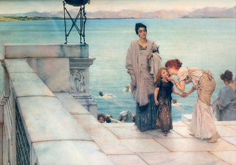

  
[Intangible Textual Heritage](../../index)  [Atlantis](../index) 

------------------------------------------------------------------------

[Buy this Book at
Amazon.com](https://www.amazon.com/exec/obidos/ASIN/B0020ML528/internetsacredte)

------------------------------------------------------------------------

<table width="75%">
<colgroup>
<col style="width: 50%" />
<col style="width: 50%" />
</colgroup>
<tbody>
<tr class="odd">
<td width="50%" data-valign="TOP"> 
A Kiss, by Lawrence Alma-Tadema [1891] (Public Domain Image)</td>
<td width="50%" data-valign="CENTER"><h1 id="atlantis-the-antediluvian-world" data-align="CENTER">Atlantis, the Antediluvian World</h1>
<h2 id="by-ignatius-donnelly" data-align="CENTER">by Ignatius Donnelly</h2>
<h4 id="section" data-align="CENTER">[1882]</h4></td>
</tr>
</tbody>
</table>

------------------------------------------------------------------------

[Contents](#contents)    [Start Reading](atawintr)    [Page
Index](pageidx)    [Text \[Zipped\]](ataw.txt.gz)

------------------------------------------------------------------------

|                                                                                                                           |
|---------------------------------------------------------------------------------------------------------------------------|
|  |

Ignatius Donnelly (1831-1901), lawyer, land promoter, politician and
virtuoso author, is today best known for his pioneering work on the
subject of Atlantis, "Atlantis the Antediluvian World" (ATAW). Published
in 1882, ATAW is one of the best constructed Atlantis theories, as it
makes no recourse to occult or 'channeled' information. Donnelly's lucid
style and command of the facts (such as they were) make the book
readable and compelling even today....--JBH

*[Read More](atawintr)...*       

------------------------------------------------------------------------

[Introduction by J.B. Hare](atawintr)  
[Additional Information About Donnelly by Norm Wolcott](wolcott)

[Title Page](ataw100)  
[Contents](atawcont)  

### Part I

[Chapter I: The Purpose of the Book.](ataw101)  
[Chapter II: Plato's History of Atlantis.](ataw102)  
[Chapter III: The Probabilities of Plato's Story.](ataw103)  
[Chapter IV: Was Such a Catastrophe Possible?](ataw104)  
[Chapter V: The Testimony of the Sea.](ataw105)  
[Chapter VI: The Testimony of the Flora and Fauna.](ataw106)  

### Part II

[Chapter I: The Destruction of Atlantis Described in the Deluge
Legends.](ataw201)  
[Chapter II: The Deluge of the Bible](ataw202)  
[Chapter III: The Deluge of the Chaldeans.](ataw203)  
[Chapter IV: The Deluge Legends of Other Nations.](ataw204)  
[Chapter V: The Deluge Legends of America.](ataw205)  
[Chapter VI: Some Consideration of the Deluge Legends.](ataw206)  

### Part III

[Chapter I: Civilization an Inheritance.](ataw301)  
[Chapter II: The Identity of the Civilizations of the Old World and the
New](ataw302)  
[Chapter III: American Evidences of Intercourse with Europe or
Atlantis.](ataw303)  
[Chapter IV: Corroborating Circumstances.](ataw304)  
[Chapter V: The Question of Complexion.](ataw305)  
[Chapter VI: Genesis Contains a History of Atlantis](ataw306)  
[Chapter VII: The Origin of Our Alphabet](ataw307)  
[Chapter VIII: The Bronze Age in Europe.](ataw308)  
[Chapter IX: Artificial Deformation of the Skull.](ataw309)  

### Part IV

[Chapter I: Traditions of Atlantis.](ataw401)  
[Chapter II: The Kings of Atlantis Become the Gods of the
Greeks.](ataw402)  
[Chapter III: The Gods of the Phoenicians Also Kings of
Atlantis.](ataw403)  
[Chapter IV: The God Odin, Woden, or Wotan.](ataw404)  
[Chapter V: The Pyramid, The Cross, and The Garden of Eden.](ataw405)  
[Chapter VI: Gold and Silver the Sacred Metals of Atlantis.](ataw406)  

### Part V

[Chapter I: The Central American and Mexican Colonies.](ataw501)  
[Chapter II: The Egyptian Colony.](ataw502)  
[Chapter III: The Colonies of the Mississippi Valley](ataw503)  
[Chapter IV: The Iberian Colonies of Atlantis](ataw504)  
[Chapter V: The Peruvian Colony.](ataw505)  
[Chapter VI: The African Colonies.](ataw506)  
[Chapter VII: The Irish Colonies From Atlantis.](ataw507)  
[Chapter VIII: The Oldest Son of Noah.](ataw508)  
[Chapter IX: The Antiquity of Some of Our Great Inventions.](ataw509)  
[Chapter X: The Aryan Colonies From Atlantis.](ataw510)  
[Chapter XI: Atlantis Reconstructed.](ataw511)  
