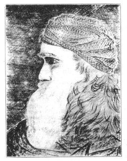

  
[Intangible Textual Heritage](../../index)  [Atlantis](../index) 
[Index](index)  [Next](dtp01) 

------------------------------------------------------------------------

[Buy this Book at
Amazon.com](https://www.amazon.com/exec/obidos/ASIN/B00213KFQ8/internetsacredte)

------------------------------------------------------------------------

  
*A Dweller on Two Planets*, by by Phylos the Thibetan (Frederick S.
Oliver), \[1894\], at Intangible Textual Heritage

------------------------------------------------------------------------

p. 2

   
(SIGNATURE OF PHYLOS, IN ATLAN CHARACTERS.)

   
PHYLOS, THE THIBETAN.  
(Otherwise named, in fulness, Yol Gorro, author of this book.)

p. 3

 

 

# A DWELLER ON TWO PLANETS

##### OR

## THE DIVIDING OF THE WAY

###### BY

### PHYLOS THE THIBETAN

(pseud. Frederick S. Oliver)

\[1894\]

###### Scanned, proofed and formatted at Intangible Textual Heritage, 2001-December, 2002, by John Bruno Hare. This book is in the public domain in the US because it was published prior to 1923.

This is before the coming of a new Heaven and a new Earth, in the which
shall reign the Prince of Peace for ever and forever, as the Old shall
be passed away, for lo! on earth there is nothing great but man; in man
there is nothing great but mind.

"Never utter these words: 'I do not know this, therefore it is false,'
One must study to know; know to understand; understand to
judge."--Apothegm of Narada.

"There are more things in heaven and earth, Horatio, than are dreamt of
In your philosophy"--Hamlet.

This book is dedicated to  
progressive thinkers everywhere, but especially to  
the "Invisible Helper" who has made  
possible its presentation to  
the world.

26: 17 :: 25.8 + 30 : 24

 

------------------------------------------------------------------------

[Next: Index](dtp01)
