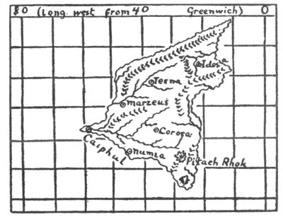
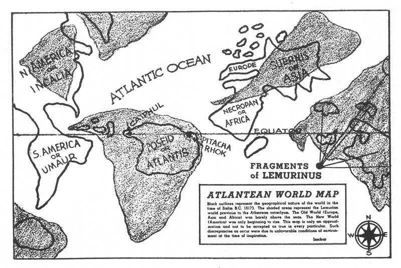

  
[Intangible Textual Heritage](../../index)  [Atlantis](../index) 
[Index](index)  [Previous](dtp03)  [Next](dtp05) 

------------------------------------------------------------------------

[Buy this Book at
Amazon.com](https://www.amazon.com/exec/obidos/ASIN/B00213KFQ8/internetsacredte)

------------------------------------------------------------------------

  
*A Dweller on Two Planets*, by by Phylos the Thibetan (Frederick S.
Oliver), \[1894\], at Intangible Textual Heritage

------------------------------------------------------------------------

   
MAP OF ATLANTIS  
From

A Dweller on Two Planets

   
MAP OF ATLANTIS  
From

An Earth Dweller's Return

   
ATLANTEAN WORLD MAP  
From

An Earth Dweller's Return

------------------------------------------------------------------------

[Next: Chapter I: Atlantis, Queen of the Waves](dtp05)
