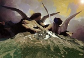

  
[Intangible Textual Heritage](../../index)  [Atlantis](../index) 
[Index](index)  [Previous](dtp50)  [Next](dtp52) 

------------------------------------------------------------------------

[Buy this Book at
Amazon.com](https://www.amazon.com/exec/obidos/ASIN/B00213KFQ8/internetsacredte)

------------------------------------------------------------------------

  
*A Dweller on Two Planets*, by by Phylos the Thibetan (Frederick S.
Oliver), \[1894\], at Intangible Textual Heritage

------------------------------------------------------------------------

# CHAPTER V

### "MAN'S INHUMANITY TO MAN"

Again the dead past revealed another scene. I saw myself in the person
of an ill-fed, ill-treated slave, ever hungry, wretched, too much so to
feel resentment. I died hungry, and then had a devachan of seeming
realization of my wants. 'Then again rebirth, and through a karma not
here to be explained, the new man had ease, wealth, plenty. But a
physical karma

p. 410

pursued, and he was ever hungry in the midst of plentitude, and lazy
when action was necessary. This state begot disease, and the product of
(in his previous life) "man's inhumanity to man," was afflicted with
cancer of the stomach. This killed the ferocious appetite, and the
sybarite, free of this, set to work to cure himself. Finding he must
fail, he sought comfort in religion, and went forth to the wilderness to
become a religious hermit. Now, a hermit's life is one of uselessness to
mankind. In that lone state my individuality lost opportunities to
cultivate moral strength by worldly contact, and behold me after death
come again to life as Zailm, weak enough to sin with Lolix and beget
then a karma that lasted, with newly got vigor, till only a few years
ago, punishing me more bitterly than death, as thou, knowest. If Zailm,
had sorrow, thou knowest he had also joy. So every life-karma is made up
of sunshine and shadow. "A tooth for a tooth?" Yea! But also "for a kiss
a kiss."

------------------------------------------------------------------------

[Next: Chapter VI: Why Atlantis Perished](dtp52)
