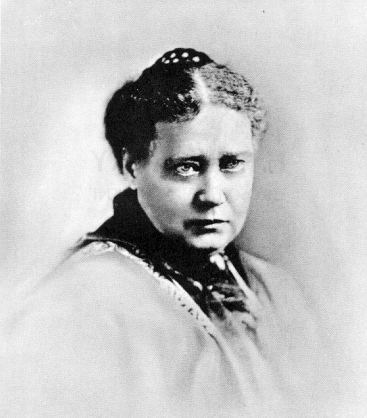
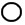

[Sacred-Texts](../../index)  [Atlantis Index](../index.md)  [The Secret
Doctrine](../../the/sd/index.md) 

------------------------------------------------------------------------

# Stanzas of Dzyan

## From The Secret Doctrine

### by H. P. Blavatsky -- Vol. 1

#### \[1888\]

------------------------------------------------------------------------

###### \[\[Vol. 1, Page 25\]\]

#### PART I.

### COSMIC EVOLUTION.

---------------------

##### SEVEN STANZAS TRANSLATED WITH COMMENTARIES FROM THE SECRET BOOK OF DZYAN.

------------------------------------------------------------------------

###### \[\[Vol. 1, Page 26\]\]

Nor Aught nor Nought existed; yon bright sky  
Was not, nor heaven's broad roof outstretched above.  
What covered all? what sheltered? what concealed?  
Was it the water's fathomless abyss?  
There was not death -- yet there was nought immortal,  
There was no confine betwixt day and night;  
The only One breathed breathless by itself,  
Other than It there nothing since has been.  
Darkness there was, and all at first was veiled  
In gloom profound -- an ocean without light --  
The germ that still lay covered in the husk  
Burst forth, one nature, from the fervent heat.

. . . . . . . .

Who knows the secret? who proclaimed it here?  
Whence, whence this manifold creation sprang?  
The Gods themselves came later into being --  
Who knows from whence this great creation sprang?  
That, whence all this great creation came,  
Whether Its will created or was mute,  
The Most High Seer that is in highest heaven,  
He knows it -- or perchance even He knows not."

"Gazing into eternity . . .  
Ere the foundations of the earth were laid,

. . . . .

Thou wert. And when the subterranean flame  
Shall burst its prison and devour the frame . . .  
Thou shalt be still as Thou wert before  
And knew no change, when time shall be no more.  
Oh! endless thought, divine **E**TERNITY."

------------------------------------------------------------------------

###### \[\[Vol. 1, Page\]\] 27 THE SECRET DOCTRINE.

#### COSMIC EVOLUTION.

In Seven Stanzas translated from the Book of Dzyan.

---------------------

##### STANZA I.

1\. **T**HE ETERNAL PARENT WRAPPED IN HER EVER INVISIBLE ROBES HAD
SLUMBERED ONCE AGAIN FOR SEVEN ETERNITIES.

2\. **T**IME WAS NOT, FOR IT LAY ASLEEP IN THE INFINITE BOSOM OF
DURATION.

3\. **U**NIVERSAL MIND WAS NOT, FOR THERE WERE NO **A**H-HI TO CONTAIN
IT.

4\. **T**HE SEVEN WAYS TO BLISS WERE NOT. **T**HE GREAT CAUSES OF MISERY
WERE NOT, FOR THERE WAS NO ONE TO PRODUCE AND GET ENSNARED BY THEM.

5\. **D**ARKNESS ALONE FILLED THE BOUNDLESS ALL, FOR FATHER, MOTHER AND
SON WERE ONCE MORE ONE, AND THE SON HAD NOT AWAKENED YET FOR THE NEW
WHEEL, AND HIS PILGRIMAGE THEREON.

6\. **T**HE SEVEN SUBLIME LORDS AND THE SEVEN TRUTHS HAD CEASED TO BE,
AND THE **U**NIVERSE, THE SON OF **N**ECESSITY, WAS IMMERSED IN
**P**ARANISHPANNA, TO BE OUTBREATHED BY THAT WHICH IS AND YET IS NOT.
**N**AUGHT WAS.

7\. **T**HE CAUSES OF EXISTENCE HAD BEEN DONE AWAY WITH; THE VISIBLE
THAT WAS, AND THE INVISIBLE THAT IS, RESTED IN ETERNAL NON-BEING -- THE
ONE BEING.

8\. **A**LONE THE ONE FORM OF EXISTENCE STRETCHED BOUNDLESS, INFINITE,
CAUSELESS, IN DREAMLESS SLEEP; AND LIFE PULSATED UNCONSCIOUS IN
UNIVERSAL SPACE, THROUGHOUT THAT ALL-PRESENCE WHICH IS SENSED BY THE
OPENED EYE OF THE **D**ANGMA.

9\. **B**UT WHERE WAS THE **D**ANGMA WHEN THE **A**LAYA OF THE UNIVERSE
WAS IN **P**ARAMARTHA AND THE GREAT WHEEL WAS **A**NUPADAKA?

------------------------------------------------------------------------

###### \[\[Vol. 1, Page\]\] 28 THE SECRET DOCTRINE.

##### STANZA II.

1\. . . . **W**HERE WERE THE BUILDERS, THE LUMINOUS SONS OF
**M**ANVANTARIC DAWN? . . . **I**N THE UNKNOWN DARKNESS IN THEIR
**A**H-HI **P**ARANISHPANNA. THE PRODUCERS OF FORM FROM NO-FORM -- THE
ROOT OF THE WORLD -- THE **D**EVAMATRI AND **S**VABHAVAT, RESTED IN THE
BLISS OF NON-BEING.

2\. . . . **W**HERE WAS SILENCE? **W**HERE THE EARS TO SENSE IT? **N**O,
THERE WAS NEITHER SILENCE NOR SOUND; NAUGHT SAVE CEASELESS ETERNAL
BREATH, WHICH KNOWS ITSELF NOT.

3\. **T**HE HOUR HAD NOT YET STRUCK; THE RAY HAD NOT YET FLASHED INTO
THE **G**ERM; THE **M**ATRIPADMA HAD NOT YET SWOLLEN.

4\. **H**ER HEART HAD NOT YET OPENED FOR THE ONE RAY TO ENTER, THENCE TO
FALL, AS THREE INTO FOUR, INTO THE LAP OF **M**AYA.

5\. **T**HE SEVEN SONS WERE NOT YET BORN FROM THE WEB OF LIGHT.
**D**ARKNESS ALONE WAS FATHER-MOTHER, **S**VABHAVAT; AND **S**VABHAVAT
WAS IN DARKNESS.

6\. **T**HESE TWO ARE THE **G**ERM, AND THE **G**ERM IS ONE. **T**HE
**U**NIVERSE WAS STILL CONCEALED IN THE **D**IVINE THOUGHT AND THE
**D**IVINE BOSOM. . . .

-------

##### STANZA III.

1\. . . . **T**HE LAST VIBRATION OF THE SEVENTH ETERNITY THRILLS THROUGH
INFINITUDE. **T**HE MOTHER SWELLS, EXPANDING FROM WITHIN WITHOUT, LIKE
THE BUD OF THE LOTUS.

2\. **T**HE VIBRATION SWEEPS ALONG, TOUCHING WITH ITS SWIFT WING THE
WHOLE UNIVERSE AND THE GERM THAT DWELLETH IN DARKNESS: **T**HE DARKNESS
THAT BREATHES OVER THE SLUMBERING WATERS OF LIFE. . .

3\. **D**ARKNESS RADIATES LIGHT, AND LIGHT DROPS ONE SOLITARY RAY INTO
THE MOTHER-DEEP. **T**HE RAY SHOOTS THROUGH THE VIRGIN EGG, THE RAY
CAUSES THE ETERNAL EGG TO THRILL, AND DROP THE NON-ETERNAL GERM, WHICH
CONDENSES INTO THE WORLD-EGG.

------------------------------------------------------------------------

###### \[\[Vol. 1, Page\]\] 29 THE SECRET DOCTRINE.

4\. **T**HEN THE THREE FALL INTO THE FOUR. **T**HE RADIANT ESSENCE
BECOMES SEVEN INSIDE, SEVEN OUTSIDE. **T**HE LUMINOUS EGG, WHICH IN
ITSELF IS THREE, CURDLES AND SPREADS IN MILK-WHITE CURDS THROUGHOUT THE
DEPTHS OF MOTHER, THE ROOT THAT GROWS IN THE DEPTHS OF THE OCEAN OF
LIFE.

5\. **T**HE ROOT REMAINS, THE LIGHT REMAINS, THE CURDS REMAIN, AND STILL
**O**EAOHOO IS ONE.

6\. **T**HE ROOT OF LIFE WAS IN EVERY DROP OF THE OCEAN OF IMMORTALITY,
AND THE OCEAN WAS RADIANT LIGHT, WHICH WAS FIRE, AND HEAT, AND MOTION.
**D**ARKNESS VANISHED AND WAS NO MORE; IT DISAPPEARED IN ITS OWN
ESSENCE, THE BODY OF FIRE AND WATER, OR FATHER AND MOTHER.

7\. **B**EHOLD, OH **L**ANOO! **T**HE RADIANT CHILD OF THE TWO, THE
UNPARALLELED REFULGENT GLORY: **B**RIGHT **S**PACE **S**ON OF **D**ARK
**S**PACE, WHICH EMERGES FROM THE DEPTHS OF THE GREAT DARK WATERS.
**I**T IS **O**EAOHOO THE YOUNGER, THE \* \* \* **H**E SHINES FORTH AS
THE SON; HE IS THE BLAZING **D**IVINE **D**RAGON OF **W**ISDOM; THE
**O**NE IS **F**OUR, AND **F**OUR TAKES TO ITSELF **T**HREE,\*\* AND THE
**U**NION PRODUCES THE **S**APTA, IN WHOM ARE THE SEVEN WHICH BECOME THE
**T**RIDASA (OR THE HOSTS AND THE MULTITUDES). **B**EHOLD HIM LIFTING
THE VEIL AND UNFURLING IT FROM EAST TO WEST. **H**E SHUTS OUT THE ABOVE,
AND LEAVES THE BELOW TO BE SEEN AS THE GREAT ILLUSION. **H**E MARKS THE
PLACES FOR THE SHINING ONES, AND TURNS THE UPPER INTO A SHORELESS SEA OF
FIRE, AND THE ONE MANIFESTED INTO THE GREAT WATERS.

8\. **W**HERE WAS THE GERM AND WHERE WAS NOW DARKNESS? **W**HERE IS THE
SPIRIT OF THE FLAME THAT BURNS IN THY LAMP, OH **L**ANOO? **T**HE GERM
IS THAT, AND THAT IS LIGHT, THE WHITE BRILLIANT SON OF THE DARK HIDDEN
FATHER.

9\. **L**IGHT IS COLD FLAME, AND FLAME IS FIRE, AND FIRE PRODUCES HEAT,
WHICH YIELDS WATER: THE WATER OF LIFE IN THE GREAT MOTHER.

10\. **F**ATHER-**M**OTHER SPIN A WEB WHOSE UPPER END IS FASTENED TO
SPIRIT -- THE LIGHT OF THE ONE DARKNESS -- AND THE LOWER ONE TO ITS
SHADOWY END, MATTER; AND THIS WEB IS THE UNIVERSE SPUN OUT OF THE TWO
SUBSTANCES MADE IN ONE, WHICH IS **S**VABHAVAT.

###### \[\[Footnote(s)\]\] -------------------------------------------------

\*\* In the English translation from the Sanskrit the numbers are given
in that language, *Eka, Chatur,* etc., etc. It was thought best to give
them in English.

------------------------------------------------------------------------

###### \[\[Vol. 1, Page\]\] 30 THE SECRET DOCTRINE.

11\. **I**T EXPANDS WHEN THE BREATH OF FIRE IS UPON IT; IT CONTRACTS
WHEN THE BREATH OF THE MOTHER TOUCHES IT. **T**HEN THE SONS DISSOCIATE
AND SCATTER, TO RETURN INTO THEIR MOTHER'S BOSOM AT THE END OF THE GREAT
DAY, AND RE-BECOME ONE WITH HER; WHEN IT IS COOLING IT BECOMES RADIANT,
AND THE SONS EXPAND AND CONTRACT THROUGH THEIR OWN SELVES AND HEARTS;
THEY EMBRACE INFINITUDE.

12\. **T**HEN **S**VABHAVAT SENDS **F**OHAT TO HARDEN THE ATOMS.
**E**ACH IS A PART OF THE WEB. **R**EFLECTING THE "**S**ELF-**E**XISTENT
**L**ORD" LIKE A MIRROR, EACH BECOMES IN TURN A WORLD.

-------

##### STANZA IV.

1\. . . . **L**ISTEN, YE **S**ONS OF THE **E**ARTH, TO YOUR INSTRUCTORS
-- THE **S**ONS OF THE **F**IRE. **L**EARN, THERE IS NEITHER FIRST NOR
LAST, FOR ALL IS ONE: NUMBER ISSUED FROM NO NUMBER.

2\. **L**EARN WHAT WE WHO DESCEND FROM THE **P**RIMORDIAL **S**EVEN, WE
WHO ARE BORN FROM THE **P**RIMORDIAL **F**LAME, HAVE LEARNT FROM OUR
FATHERS. . . .

3\. **F**ROM THE EFFULGENCY OF LIGHT -- THE RAY OF THE EVER-DARKNESS --
SPRUNG IN SPACE THE RE-AWAKENED ENERGIES; THE ONE FROM THE EGG, THE SIX,
AND THE FIVE. **T**HEN THE THREE, THE ONE, THE FOUR, THE ONE, THE FIVE
-- THE TWICE SEVEN THE SUM TOTAL. **A**ND THESE ARE THE ESSENCES, THE
FLAMES, THE ELEMENTS, THE BUILDERS, THE NUMBERS, THE ARUPA, THE RUPA,
AND THE FORCE OF **D**IVINE **M**AN -- THE SUM TOTAL. AND FROM THE
DIVINE MAN EMANATED THE FORMS, THE SPARKS, THE SACRED ANIMALS, AND THE
MESSENGERS OF THE SACRED FATHERS WITHIN THE HOLY FOUR.

4\. **T**HIS WAS THE ARMY OF THE VOICE -- THE DIVINE MOTHER OF THE
SEVEN. **T**HE SPARKS OF THE SEVEN ARE SUBJECT TO, AND THE SERVANTS OF,
THE FIRST, THE SECOND, THE THIRD, THE FOURTH, THE FIFTH, THE SIXTH, AND
THE SEVENTH OF THE SEVEN. **T**HESE "SPARKS" ARE CALLED SPHERES,
TRIANGLES, CUBES, LINES, AND MODELLERS; FOR THUS STANDS THE **E**TERNAL
**N**IDANA -- THE **O**EAOHOO, WHICH IS:

------------------------------------------------------------------------

###### \[\[Vol. 1, Page\]\] 31 THE SECRET DOCTRINE.

5\. "**D**ARKNESS" THE BOUNDLESS, OR THE NO-NUMBER, **A**DI-**N**IDANA
**S**VABHAVAT: --

> I. **T**HE **A**DI-**S**ANAT, THE NUMBER, FOR HE IS ONE.

> II\. **T**HE VOICE OF THE **L**ORD **S**VABHAVAT, THE NUMBERS, FOR HE
> IS ONE AND NINE.

> III\. **T**HE "FORMLESS SQUARE."

AND THESE THREE ENCLOSED WITHIN THE ARE THE SACRED FOUR;
AND THE TEN ARE THE ARUPA UNIVERSE. **T**HEN COME THE "SONS," THE SEVEN
FIGHTERS, THE ONE, THE EIGHTH LEFT OUT, AND HIS BREATH WHICH IS THE
LIGHT-MAKER.

6\. **T**HEN THE SECOND SEVEN, WHO ARE THE **L**IPIKA, PRODUCED BY THE
THREE. **T**HE REJECTED SON IS ONE. **T**HE "**S**ON-SUNS" ARE
COUNTLESS.

-------

##### STANZA V.

1\. **T**HE **P**RIMORDIAL **S**EVEN, THE **F**IRST **S**EVEN
**B**REATHS OF THE **D**RAGON OF **W**ISDOM, PRODUCE IN THEIR TURN FROM
THEIR **H**OLY **C**IRCUMGYRATING **B**REATHS THE **F**IERY
**W**HIRLWIND.

2\. **T**HEY MAKE OF HIM THE MESSENGER OF THEIR WILL. **T**HE **D**ZYU
BECOMES **F**OHAT, THE SWIFT SON OF THE **D**IVINE SONS WHOSE SONS ARE
THE **L**IPIKA, RUNS CIRCULAR ERRANDS. **F**OHAT IS THE STEED AND THE
THOUGHT IS THE RIDER. **H**E PASSES LIKE LIGHTNING THROUGH THE FIERY
CLOUDS; TAKES THREE, AND FIVE, AND SEVEN STRIDES THROUGH THE SEVEN
REGIONS ABOVE, AND THE SEVEN BELOW. **H**E LIFTS HIS VOICE, AND CALLS
THE INNUMERABLE SPARKS, AND JOINS THEM.

3\. **H**E IS THEIR GUIDING SPIRIT AND LEADER. **W**HEN HE COMMENCES
WORK, HE SEPARATES THE SPARKS OF THE **L**OWER **K**INGDOM THAT FLOAT
AND THRILL WITH JOY IN THEIR RADIANT DWELLINGS, AND FORMS THEREWITH THE
GERMS OF WHEELS. **H**E PLACES THEM IN THE SIX DIRECTIONS OF SPACE, AND
ONE IN THE MIDDLE -- THE CENTRAL WHEEL.

4\. **F**OHAT TRACES SPIRAL LINES TO UNITE THE SIXTH TO THE SEVENTH --
THE CROWN; AN ARMY OF THE **S**ONS OF **L**IGHT STANDS AT EACH ANGLE,
AND THE **L**IPIKA IN THE MIDDLE WHEEL, **T**HEY SAY: **T**HIS IS GOOD,
THE

------------------------------------------------------------------------

###### \[\[Vol. 1, Page\]\] 32 THE SECRET DOCTRINE.

FIRST **D**IVINE WORLD IS READY, THE FIRST IS NOW THE SECOND. **T**HEN
THE "**D**IVINE **A**RUPA" REFLECTS ITSELF IN **C**HHAYA **L**OKA, THE
FIRST GARMENT OF THE **A**NUPADAKA.

5\. **F**OHAT TAKES FIVE STRIDES AND BUILDS A WINGED WHEEL AT EACH
CORNER OF THE SQUARE, FOR THE FOUR HOLY ONES AND THEIR ARMIES.

6\. **T**HE **L**IPIKA CIRCUMSCRIBE THE TRIANGLE, THE FIRST ONE, THE
CUBE, THE SECOND ONE, AND THE PENTACLE WITHIN THE EGG. **I**T IS THE
RING CALLED "**P**ASS **N**OT" FOR THOSE WHO DESCEND AND ASCEND.
**A**LSO FOR THOSE WHO DURING THE **K**ALPA ARE PROGRESSING TOWARDS THE
GREAT DAY "**B**E WITH US." **T**HUS WERE FORMED THE **R**UPA AND THE
**A**RUPA: FROM ONE LIGHT SEVEN LIGHTS; FROM EACH OF THE SEVEN, SEVEN
TIMES SEVEN LIGHTS. **T**HE WHEELS WATCH THE RING. . . . .

-------

##### STANZA VI.

1\. **B**Y THE POWER OF THE **M**OTHER OF **M**ERCY AND **K**NOWLEDGE --
**K**WAN-**Y**IN -- THE "TRIPLE" OF **K**WAN-SHAI-**Y**IN, RESIDING IN
**K**WAN-YIN-**T**IEN, **F**OHAT, THE **B**REATH OF THEIR **P**ROGENY,
THE **S**ON OF THE **S**ONS, HAVING CALLED FORTH, FROM THE LOWER ABYSS,
THE ILLUSIVE FORM OF **S**IEN-**T**CHANG AND THE **S**EVEN
**E**LEMENTS:\*

2\. **T**HE **S**WIFT AND **R**ADIANT **O**NE PRODUCES THE **S**EVEN
**L**AYA **C**ENTRES, AGAINST WHICH NONE WILL PREVAIL TO THE GREAT DAY
"**B**E-WITH-**U**S," AND SEATS THE **U**NIVERSE ON THESE **E**TERNAL
**F**OUNDATIONS SURROUNDING **T**SIEN-**T**CHAN WITH THE **E**LEMENTARY
**G**ERMS.

3\. **O**F THE **S**EVEN -- FIRST ONE MANIFESTED, SIX CONCEALED, TWO
MANIFESTED, FIVE CONCEALED; THREE MANIFESTED, FOUR CONCEALED; FOUR
PRODUCED, THREE HIDDEN; FOUR AND ONE TSAN REVEALED, TWO AND ONE HALF
CONCEALED; SIX TO BE MANIFESTED, ONE LAID ASIDE. **L**ASTLY, SEVEN SMALL
WHEELS REVOLVING; ONE GIVING BIRTH TO THE OTHER.

###### \[\[Footnote(s)\]\] -------------------------------------------------

\* Verse 1 of Stanza VI. is of a far later date than the other Stanzas,
though still very ancient. The old text of this verse, having names
entirely unknown to the Orientalists would give no clue to the student.

------------------------------------------------------------------------

###### \[\[Vol. 1, Page\]\] 33 THE SECRET DOCTRINE.

4\. **H**E BUILDS THEM IN THE LIKENESS OF OLDER WHEELS, PLACING THEM ON
THE **I**MPERISHABLE **C**ENTRES.

HOW DOES **F**OHAT BUILD THEM? HE COLLECTS THE FIERY DUST. **H**E MAKES
BALLS OF FIRE, RUNS THROUGH THEM, AND ROUND THEM, INFUSING LIFE
THEREINTO THEN' SETS THEM INTO MOTION; SOME ONE WAY, SOME THE OTHER WAY.
**T**HEY ARE COLD, HE MAKES THEM HOT. **T**HEY ARE DRY, HE MAKES THEM
MOIST. **T**HEY SHINE, HE FANS AND COOLS THEM. **T**HUS ACTS **F**OHAT
FROM ONE TWILIGHT TO THE OTHER, DURING **S**EVEN **E**TERNITIES.

5\. **A**T THE FOURTH, THE SONS ARE TOLD TO CREATE THEIR IMAGES. **O**NE
THIRD REFUSES -- TWO OBEY.

THE CURSE IS PRONOUNCED; THEY WILL BE BORN ON THE FOURTH, SUFFER AND
CAUSE SUFFERING; THIS IS THE FIRST WAR.

6\. **T**HE OLDER WHEELS ROTATED DOWNWARDS AND UPWARDS. . . . **T**HE
MOTHER'S SPAWN FILLED THE WHOLE. **T**HERE WERE BATTLES FOUGHT BETWEEN
THE **C**REATORS AND THE **D**ESTROYERS, AND BATTLES FOUGHT FOR SPACE;
THE SEED APPEARING AND RE-APPEARING CONTINUOUSLY.

7\. **M**AKE THY CALCULATIONS, **L**ANOO, IF THOU WOULDEST LEARN THE
CORRECT AGE OF THY SMALL WHEEL. **I**TS FOURTH SPOKE IS OUR MOTHER.
**R**EACH THE FOURTH "FRUIT" OF THE FOURTH PATH OF KNOWLEDGE THAT LEADS
TO **N**IRVANA, AND THOU SHALT COMPREHEND, FOR THOU SHALT SEE . . . . .

-------

##### STANZA VII.

1\. **B**EHOLD THE BEGINNING OF SENTIENT FORMLESS LIFE.

FIRST THE **D**IVINE, THE ONE FROM THE **M**OTHER-**S**PIRIT; THEN THE
**S**PIRITUAL; THE THREE FROM THE ONE, THE FOUR FROM THE ONE, AND THE
FIVE FROM WHICH THE THREE, THE FIVE, AND THE SEVEN. **T**HESE ARE THE
THREE-FOLD, THE FOUR-FOLD DOWNWARD; THE "MIND-BORN" SONS OF THE FIRST
**L**ORD; THE SHINING SEVEN.

IT IS THEY WHO ARE THOU, ME, HIM, OH **L**ANOO. **T**HEY, WHO WATCH OVER
THEE, AND THY MOTHER EARTH.

------------------------------------------------------------------------

###### \[\[Vol. 1, Page\]\] 34 THE SECRET DOCTRINE.

2\. **T**HE ONE RAY MULTIPLIES THE SMALLER RAYS. **L**IFE PRECEDES FORM,
AND LIFE SURVIVES THE LAST ATOM OF FORM. **T**HROUGH THE COUNTLESS RAYS
PROCEEDS THE LIFE-RAY, THE ONE, LIKE A THREAD THROUGH MANY JEWELS.

3\. **W**HEN THE ONE BECOMES TWO, THE THREEFOLD APPEARS, AND THE THREE
ARE ONE; AND IT IS OUR THREAD, OH **L**ANOO, THE HEART OF THE MAN-PLANT
CALLED **S**APTASARMA.

4\. **I**T IS THE ROOT THAT NEVER DIES; THE THREE-TONGUED FLAME OF THE
FOUR WICKS. **T**HE WICKS ARE THE SPARKS, THAT DRAW FROM THE
THREE-TONGUED FLAME SHOT OUT BY THE SEVEN -- THEIR FLAME -- THE BEAMS
AND SPARKS OF ONE MOON REFLECTED IN THE RUNNING WAVES OF ALL THE RIVERS
OF EARTH.

5\. **T**HE SPARK HANGS FROM THE FLAME BY THE FINEST THREAD OF
**F**OHAT. **I**T JOURNEYS THROUGH THE **S**EVEN **W**ORLDS OF **M**AYA.
**I**T STOPS IN THE FIRST, AND IS A METAL AND A STONE; IT PASSES INTO
THE SECOND AND BEHOLD -- A PLANT; THE PLANT WHIRLS THROUGH SEVEN CHANGES
AND BECOMES A SACRED ANIMAL. **F**ROM THE COMBINED ATTRIBUTES OF THESE,
**M**ANU, THE THINKER IS FORMED. **W**HO FORMS HIM? **T**HE SEVEN LIVES,
AND THE ONE LIFE. **W**HO COMPLETES HIM? **T**HE FIVE-FOLD **L**HA.
**A**ND WHO PERFECTS THE LAST BODY? **F**ISH, SIN, AND SOMA. . . . .

6\. **F**ROM THE FIRST-BORN THE THREAD BETWEEN THE **S**ILENT
**W**ATCHER AND HIS **S**HADOW BECOMES MORE STRONG AND RADIANT WITH
EVERY CHANGE. **T**HE MORNING SUN-LIGHT HAS CHANGED INTO NOON-DAY GLORY.
. . . .

7\. **T**HIS IS THY PRESENT WHEEL, SAID THE **F**LAME TO THE **S**PARK.
**T**HOU ART MYSELF, MY IMAGE, AND MY SHADOW. **I** HAVE CLOTHED MYSELF
IN THEE, AND THOU ART MY **V**AHAN TO THE DAY, "**B**E WITH US," WHEN
THOU SHALT RE-BECOME MYSELF AND OTHERS, THYSELF AND ME. **T**HEN THE
BUILDERS, HAVING DONNED THEIR FIRST CLOTHING, DESCEND ON RADIANT EARTH
AND REIGN OVER MEN -- WHO ARE THEMSELVES. . . .
