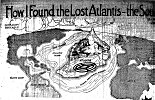

  
[Intangible Textual Heritage](../../index)  [Atlantis](../index.md) 
[Index](index)  [Previous](hif00)  [Next](hif02.md) 

------------------------------------------------------------------------

[  
Click to enlarge](img/atlmap.jpg.md)

A Reconstruction of the Lost Continent of Atlantis Made from Deep Sea
Surveys by the United States Government. The Gulf Stream Ran About the
Continent, Taking Exactly the Same Course as It Does Now, Turning East
at the Banks of Newfoundland and Circling on its Way to Europe the
Submerged Dolphin Ridge, Which is Evidently a Vestige of the Lost
Atlantean Continent. The Concentric Ovals Show How the Great City of the
Atlanteans Was Built, According to the Story Told by Plato. There were
Three Rings of Canals and Two Zones of Land, Cut by Four Rivers. From
This Island Continent, Destroyed Perhaps 20,000 Years Ago, Came All
Civilization. Egypt Is Supposed to Have Been Settled by a Colony of
Atlanteans, and Also Central and South America.

------------------------------------------------------------------------

[Next: Illustration: The New Diving Armor](hif02.md)
