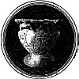
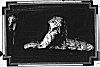

  
[Intangible Textual Heritage](../../index)  [Atlantis](../index) 
[Index](index)  [Previous](hif02)  [Next](hif04) 

------------------------------------------------------------------------

[  
Click to enlarge](img/owlvase.jpg)

In the Circle Above Is a Copy of the Ancient Owl-Headed Vase Which Dr.
Schliemann Found at Mycenae. The Phoenician Inscription Can Be Seen
Above the Owl's Head.

[  
Click to enlarge](img/objects.jpg)

Below It Are Two Other Objects Discovered in the Same Collection and
Believed to Have Come from Atlantis.

------------------------------------------------------------------------

[Next: Illustration: Siegfried and the Dragon](hif04)
