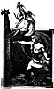

  
[Intangible Textual Heritage](../../index)  [Atlantis](../index.md) 
[Index](index)  [Previous](hif03)  [Next](hif05.md) 

------------------------------------------------------------------------

[  
Click to enlarge](img/dragon.jpg.md)

"SIEGFRIED AND THE DRAGON"

The Norse Pantheon and Heroes, Like the Greek, Were Only Memories of
Actual Kings, Queens and Heroes of Atlantis, Says Dr. Schliemann. The
Siegfried Legend, Like the Greek Legend of Theseus, Is a Real Story of
Real Exploits by Real Atlanteans Ages Ago.

------------------------------------------------------------------------

[Next: Introduction](hif05.md)
