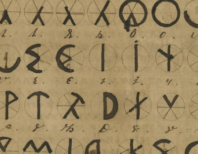

  
[Intangible Textual Heritage](../../index)  [Atlantis](../index) 

------------------------------------------------------------------------

<table width="75%">
<colgroup>
<col style="width: 50%" />
<col style="width: 50%" />
</colgroup>
<tbody>
<tr class="odd">
<td width="50%" data-valign="TOP"></td>
<td width="50%" data-valign="CENTER"><h1 id="the-oera-linda-book" data-align="CENTER">The Oera Linda Book</h1>
<h2 id="by-wiliam-r.-sandbach" data-align="CENTER">by Wiliam R. Sandbach</h2>
<h4 id="section" data-align="CENTER">[1876]</h4></td>
</tr>
</tbody>
</table>

------------------------------------------------------------------------

[Contents](#contents)    [Start Reading](olb00)    [Page
Index](pageidx)    [Text \[Zipped\]](olb.txt.gz)

------------------------------------------------------------------------

In the 19th century, ascendant nationalism in Europe used local folklore
and ancient legends to bolster a sense of identity. One curious example
of this is the Oera Linda Book, a controversial manuscript, dated 1256,
from the Frisian region of the Netherlands. The Oera Linda book is today
conventionally agreed to be a forgery, written during the mid-19th
century. This is based on the paper which the manuscript is written on,
as well as internal and linguistic evidence.

Purporting to be an episodic chronicle of wars and migrations of the
Frisian people, the Oera Linda Book describes events dated (very
precisely) from 2194 BCE to 803 CE. The reference date is the
submergence of 'Atland,' a lost land in the North Sea, which, according
to the book, occurred in 2193 BCE. The book is peppered with
descriptions of catastrophic earth changes, including volcanic
eruptions, strange weather, and rapid sea level changes. This is
intriguing because, even if a forgery, the Oera Linda Book predates the
origin of the modern Atlantis craze, which began with Ignatius
Donnelly's [Atlantis, the Antediluvian World](../ataw/index), published
in 1882.

The Oera Linda Book also claims that Europe was ruled by a (mostly)
peaceful, just matriarchy for most of its history, and that the Frisians
invented writing. There is a dark side, too: parts of the Oera Linda
Book have touches of bigotry and intolerance which will be galling to
most modern readers. This mix of themes have led to a continued
fascination with this text, regardless of its authenticity.

PRODUCTION NOTES: I was unable to obtain a printed
copy of this edition, so I printed out and scanned back in a Google page
image PDF, which does not give the best OCR yield. Hence there may still
be OCR errors lurking in this text. I had to omit the parallel Frisian
text on facing pages for technical reasons. Most of the footnotes in the
body of the text had to be placed at an inferred position, as for the
most part the footnotes refer to the Frisian text, not the English. For
this reason the place name references in the footnotes are logically
reversed. As far as I can tell, this is the first time that an
unmodified transcript of this translation of the Oera Linda Book has
appeared online.--J.B. Hare, January 29th, 2009.

------------------------------------------------------------------------

 [Title Page](olb00)  
[Translator's Preface](olb01)  
[Introduction](olb02)  
[Okke my Son](olb03)  
[The Book Of Adela's Followers](olb04)  
[Frya's Tex](olb05)  
[This has Fasta Spoken](olb06)  
[These are the Laws Established for the Government of the
Citadels](olb07)  
[Universal Law](olb08)  
[Here Follow the Laws which were thus Established](olb09)  
[These are the Rights of the Mothers and the Kings](olb10)  
[Here are the Rules Established for the Security of all
Frisians](olb11)  
[From Minno's Writings](olb12)  
[Laws for the Navigators](olb13)  
[Useful Extracts from the Writings left by Minno](olb14)  
[From Minno's Writings](olb15)  
[From the Writings of Minno](olb16)  
[These are the Three Principles on which these Laws are
founded](olb17)  
[These Rules are made for Angry People](olb18)  
[These are the Rules Concerning Bastards](olb19)  
[What is written hereunder is inscribed on the Walls of
Waraburgt](olb20)  
[This stands inscribed upon all Citadels](olb21)  
[How the Bad Time came](olb22)  
[This is inscribed on the Waraburgt by the Aldegamude](olb23)  
[All this is inscribed not only on the Waraburgt, but also on the Burgt
Stavia, which lies behind the Port of Stavre](olb24)  
[What the Consequence of this was](olb25)  
[Now we will write about the War between the Burgtmaagden Kalta and
Min-erva](olb26)  
[We now come to the History of Jon](olb27)  
[Now we shall write how it fared with Jon. It is inscribed at
Texland.](olb28)  
[This is about the Geertmen](olb29)  
[In the Year One Thousand and Five after Atland was submerged, this was
inscribed on the Eastern Wall of Fryasburgt](olb30)  
[This is inscribed in all our Citadels](olb31)  
[How it fared afterwards with the Magy](olb32)  
[The Writings of Adelbrost and Apollonia](olb33)  
[The Second Writing](olb34)  
[The Elegy of the Burgtmaagd](olb35)  
[The Oldest Doctrine](olb36)  
[The Second Part of the Oldest Doctrine](olb37)  
[This is written on Parchment. Speech and Answer to other Maidens as an
Example](olb38)  
[Now I will write myself, first about my Citadel, and then about what I
have been able to see](olb39)  
[The Writings of Frêthorik and Wiljow](olb40)  
[Now I will relate how the Geertman and many followers of Hellenia came
back](olb41)  
[This Writing has been given to me about Northland and Schoonland
(Scandinavia)](olb42)  
[Hail to all true Frisians](olb43)  
[The Writing of Konerêd](olb44)  
[Now I will write about Friso](olb45)  
[What Friso did further](olb46)  
[Now I will write about his son Adel](olb47)  
[Here is the Writing with Gosa's Advice](olb48)  
[Here is my Counsel](olb49)  
[The Writing of Beeden](olb50)  
[Letter of Rika the Oudmaagd, read at Staveren at the Juul
Feast](olb51)  
[Fragmentary](olb52)  
