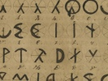

  
[Intangible Textual Heritage](../../index)  [Atlantis](../index) 
[Index](index)  [Previous](olb15)  [Next](olb17) 

------------------------------------------------------------------------

  
*The Oera Linda Book*, by Wiliam R. Sandbach, \[1876\], at Intangible
Textual Heritage

------------------------------------------------------------------------

### From the Writings of Minno.

When I came away from Athenia with my followers, we arrived at an island
named by my crew Kreta, because of the cries that the inhabitants raised
on our arrival. When they really saw that we did not come to make war,
they were quiet, so that at last I was able to buy a harbour in exchange
for a boat and some iron implements, and a piece of land. When we had
been settled there a short time, and they discovered that we had no
slaves, they were very much astonished; and when I explained to them
that we had laws which made everybody equal, they wished to have the
same; but they had hardly established them before the whole land was in
confusion.

The priests and the princes declared that we had excited their subjects
to rebellion, and the people appealed to us for aid and protection. When
the princes saw that they were about to lose their kingdom, they gave
freedom to their people, and came to me to establish a code of laws. The
people, however, got no freedom, and the princes remained masters,
acting according to their own pleasure. When this storm had passed, they
began to sow divisions among us. They told my people that I had invoked
their assistance to make myself permanent king. Once I found poison in
my food. So when a ship from

p. 58 p. 59

\[paragraph continues\] Flyland sailed
past, I quietly took my departure. Leaving alone, then, my own
adventures, I will conclude this history by saying that we must not have
anything to do with Finda's people, wherever it may be, because they are
full of false tricks, fully as much to be feared as their sweet wine
with deadly poison.

Here ends Minno's writing.

------------------------------------------------------------------------

[Next: These are the Three Principles on which these Laws are
founded](olb17)
