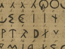

  
[Intangible Textual Heritage](../../index)  [Atlantis](../index) 
[Index](index)  [Previous](olb23)  [Next](olb25) 

------------------------------------------------------------------------

  
*The Oera Linda Book*, by Wiliam R. Sandbach, \[1876\], at Intangible
Textual Heritage

------------------------------------------------------------------------

### All this is inscribed not only on the Waraburgt, but also on the Burgt Stavia, which lies behind the Port of Stavre.

When Teunis wished to return home, he went first towards Denmark; but he
might not land there, for so the

p. 80 p. 81

mother had ordered, nor was he to land at Flyland nor anywhere about
there. In this way he would have lost all his people by want and
hardship, so he landed at night to steal and sailed on by day. Thus
coasting along, he at length arrived at the colony of Kadik [\*](#fn_23) (Cadiz), so called because it was built
with a stone quay. Here they bought all kinds of stores, but Tuntia the
Burgtmaagd would not allow them to settle there. When they were ready
they began to disagree. Teunis wished to sail through the straits to the
Mediterranean Sea, and enter the service of the rich Egyptian king, as
he had done before, but Inka said he had had enough of all those Finda's
people. Inka thought that perchance some high-lying part of Atland might
remain as an island, where he and his people might live in peace. As the
two cousins could not agree, Teunis planted a red flag on the shore, and
Inka a blue flag. Every man could choose which he pleased, and to their
astonishment the greater part of the Finns and Magyars followed Inka,
who had objected to serve the kings of Finda's people. When they had
counted the people and divided the ships accordingly, the fleet
separated. We shall hear of Teunis afterwards, but nothing more of Inka.

Neef Teunis coasted through the straits to the Mediterranean Sea. When
Atland was submerged there was much suffering also on the shores of the
Mediterranean, on which account many of Finda's people, Krekalanders,
and people from Lyda's land, came to us. On the other hand, many of our
people went to Lyda's land. The result of all this was that the
Krekalanders far and wide were lost to the superintendence of the
mother. Teunis had reckoned on this, and had therefore wished to find
there a good

p. 82 p. 83

haven from which he might go and serve under the rich princes; but as
his fleet and his people had such a shattered appearance, the
inhabitants on the coasts thought that they were pirates, and drove them
away. At last they arrived at the Phœnician coast, one hundred and
ninety-three years after Atland was submerged [\*](#fn_24). Near the coast they found an island with
two deep bays, so that there appeared to be three islands. In the middle
one they established themselves, and afterwards built a city wall round
the place. Then they wanted to give it a name, but disagreed about it.
Some wanted to call it Fryasburgt, others Neeftunia; but the Magyars and
Finns begged that it might be called Thyrhisburgt [†](#fn_25).

Thyr [‡](#fn_26) was the name of one of their
idols, and it was upon his feast-day that they had landed there; and in
return they offered to recognise Teunis as their perpetual king. Teunis
let himself be persuaded, and the others would not make any quarrel
about it. When they were well established, they sent some old seamen and
Magyars on an expedition as far as the town of Sidon; but at first the
inhabitants of the coast would have nothing to do with them, saying, You
are only foreign adventurers whom we do not respect. But when we sold
them some of our iron weapons, everything went well. They also wished to
buy our amber, and their inquiries about it were incessant. But Teunis,
who was far-seeing, pretended that he had no more iron weapons or amber.
Then merchants came and begged him to let them have twenty vessels,
which they would freight with the finest goods, and they would provide
as many people to row as he would require. Twelve ships were then laden
with wine, honey, tanned leather, and saddles and bridles mounted in
gold, such as had never been seen before.

Teunis sailed to the Flymeer with all this treasure, which so enchanted
the Grevetman of Westflyland that he induced

p. 84 p. 85

\[paragraph continues\] Teunis to build a
warehouse at the mouth of the Flymeer. Afterwards this place was called
Almanaland [\*](#fn_27), and the market where
they traded at Wyringen [†](#fn_28) was called
Toelaatmarkt. The mother advised that they should sell everything except
iron weapons, but no attention was paid to what she said. As the
Thyriers had thus free play, they came from far and near to take away
our goods, to the loss of our seafaring people. Therefore it was
resolved in a general assembly to allow only seven Thyrian ships and no
more in a year.

------------------------------------------------------------------------

### Footnotes

[81:\*](olb24.htm#fr_23) Kâdik is Cadiz.

[83:\*](olb24.htm#fr_24) 2193-193 is 2000 years
before Christ.

[83:†](olb24.htm#fr_25) Thyrhisburch is Tyre.

[83:‡](olb24.htm#fr_26) Thyr is the son of Odin.

[85:\*](olb24.htm#fr_27) Almanaland is Ameland.

[85:†](olb24.htm#fr_28) Wyringâ is Wieringen.

------------------------------------------------------------------------

[Next: What the Consequence of this was](olb25)
