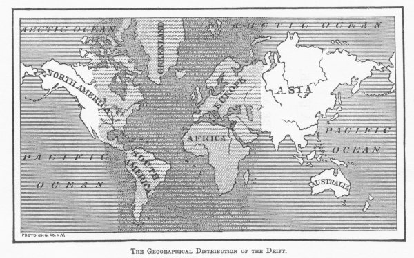

[Intangible Textual Heritage](../../index)  [Atlantis](../index) 
[Index](index)  [Next](rag01) 

------------------------------------------------------------------------

# RAGNAROK:

## THE AGE OF FIRE AND GRAVEL.

###### BY

#### IGNATIUS DONNELLY,

###### AUTHOR OF "ATLANTIS: THE ANTEDILUVIAN WORLD."

"I am not inclined to conclude that man had no existence at all before
the epoch of the great revolutions of the earth. He might have inhabited
certain districts of no great extent, whence, after these terrible
events, he repeopled the world. Perhaps, also, the spots where he abode
were swallowed up, and the bones lie buried under the beds of the
present seas."--CUVIER

.

\[1883\]

{scanned at Intangible Textual Heritage, December, 2001}

THE GEOGRAPHICAL DISTRIBUTION OF THE DRIFT.

{p. iii}

------------------------------------------------------------------------

[Next: Contents](rag01)
