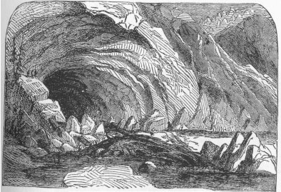
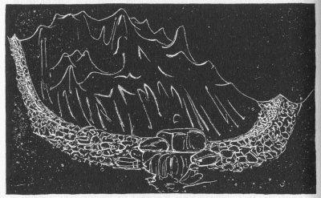

[Intangible Textual Heritage](../../index)  [Atlantis](../index.md) 
[Index](index)  [Previous](rag06)  [Next](rag08.md) 

------------------------------------------------------------------------

### CHAPTER V.

##### WAS IT CAUSED BY GLACIERS?

WHAT is a glacier? It is a river of ice, crowded by the weight of
mountain-ice down into some valley, along which it descends by a slow,
almost imperceptible motion, due to a power of the ice, under the force
of gravity, to rearrange its molecules. It is fed by the mountains and
melted by the sun.

The glaciers are local in character, and comparatively few in number;
they are confined to valleys having some general slope downward. The
whole Alpine mass does not move down upon the plain. The movement
downward is limited to these glacier-rivers.

The glacier complies with some of the conditions of the problem. We can
suppose it capable of taking in its giant paw a mass of rock, and using
it as a graver to carve deep grooves in the rock below it; and we can
see in it a great agency for breaking up rocks and carrying the
*detritus* down upon the plains. But here the resemblance ends.

That high authority upon this subject, James Geikie, says:

"But we can not fail to remark that, although scratched and polished
stones occur not infrequently in the frontal moraines of Alpine
glaciers, yet at the same time these moraines *do not at all resemble
till*. The moraine consists for the most part of a confused heap of
rough *angular* stones and blocks, and loose sand and *débris*;
scratched

{p. 18}

stones are decidedly in the minority, and indeed *a close search will
often fail to show them*. Clearly, then, the till is not of the nature
of a terminal moraine. *Each stone* in the 'till' gives evidence of
having been subjected to a grinding process. . . .

"We look in vain, however, among the glaciers of the Alps for such a
deposit. The scratched stones we may occasionally find, *but where is
the clay?* . . . It is clear that the conditions for the gathering of a
stony clay like the I till' do not obtain (as far as we know) among the
Alpine glaciers. There is too much water circulating below the ice there
to allow any considerable thickness of such a deposit to
accumulate."\[1\]

But it is questionable whether the glaciers do press with a steady force
upon the rocks beneath so as to score them. As a rule, the base of the
glacier is full of water; rivers flow from under them. The opposite
picture, from Professor Winchell's "Sketches of Creation," page 223,
does not represent a mass of ice, bugging the rocks, holding in its
grasp great gravers of stone with which to cut the face of the rocks
into deep grooves, and to deposit an even coating of rounded stones and
clay over the face of the earth.

On the contrary, here are only angular masses of rock, and a stream
which would certainly wash away any clay which might be formed.

Let Mr. Dawkins state the case:

"The hypothesis upon which the southern extension is founded--that the
bowlder-clays have been formed by ice melting on the land--is open to
this objection, that *no similar clays have been proved to have been so
formed*, either in the Arctic regions, where the ice-sheet has
retreated, or in the districts forsaken by the glaciers in the Alps or
Pyrenees, or in any other mountain-chain. . . .

The English bowlder-clays, as a whole, differ from

\[1. "The Great Ice Age," pp. 70-72.\]

{p. 19}

the *moraine profonde* in their softness, and the large area which they
cover. Strata of bowlder-clay at all comparable to the great clay mantle
covering the lower grounds of Britain, north of the Thames, are
conspicuous by their absence from the glaciated regions of Central
Europe and the Pyrenees, which were not depressed beneath the sea."

A RIVER ISSUING FROM A SWISS GLACIER.

Moreover, the Drift, especially the "till," lies in great continental
sheets of clay and gravel, of comparatively uniform thickness. The
glaciers could not form such sheets; they deposit their material in long
ridges called "terminal moraines."

Agassiz, the great advocate of the ice-origin of the Drift, says:

"All these moraines are the land-marks, so to speak, by which we trace
the height and extent, as well as the

\[1. Dawkin's "Early Man in Britain," pp. 116, 117.\]

{p. 20}

progress and retreat, of glaciers in former times. Suppose, for
instance, that a glacier were to disappear entirely. For ages it has
been a gigantic ice-raft, receiving all sorts of materials on its
surface as it traveled onward, and bearing them along with it; while the
hard particles of rocks set in its lower surface have been polishing and
fashioning the whole surface over which it extended. As it now melts it
drops its various burdens to the ground; bowlders are the milestones
marking the different stages of its journey; the terminal and lateral
moraines are the frame-work which it erected around itself as it moved
forward, and which define its boundaries centuries after it has
vanished."\[1\]

TERMINAL MORAINE.

And Professor Agassiz gives us, on page 307 of the same work, the above
representation of a "terminal moraine."

The reader can see at once that these semicircular

\[1. "Geological Sketches," p. 308.\]

{p. 21}

ridges bear no resemblance whatever to the great drift-deposits of the
world, spread out in vast and nearly uniform sheets, without
stratification, over hills and plains alike.

And here is another perplexity: It might naturally be supposed that the
smoothed, scratched, and smashed appearance of the underlying rocks was
due to the rubbing and rolling of the stones under the ice of the
glaciers; but, strange to say, we find that--

"The scratched and polished rock-surfaces are by no means confined to
till-covered districts. They are met with *everywhere* and *at all
levels* throughout the country, from the sea-coast up to near the tops
of some of our higher mountains. The lower hill-ranges, such as the
Sidlaws, the Ochils, the Pentlands, the Kilbarchan and Paisley Hills,
and others, exhibit polished and smoothed rock-surfaces *on their very
crest*. Similar markings streak and score the rocks up to a great height
in the deep valleys of the Highlands."\[1\]

We can realize, in our imagination, the glacier of the mountain-valley
crushing and marking the bed in which it moves, or even the plain on
which it discharges itself; but it is impossible to conceive of a
glacier upon the bare top of a mountain, without walls to restrain it or
direct its flow, or higher ice accumulations to feed it.

Again:

"If glaciers descended, as they did, on both sides of the great Alpine
ranges, then we would expect to find the same results on the plains of
Northern Italy that present themselves on the low grounds of
Switzerland. But this is not the case. On the plains of Italy there are
no traces of the stony clay found in Switzerland and all over Europe.
Neither are any of the stones of the drift of Italy scratched or
striated."\[2\]

\[1. "The Great Ice Age," p. 73.

2\. Ibid., pp. 491, 492.\]

{p. 22}

But, strange to say, while, as Geikie admits, no true "till" or Drift is
now being formed by or under the glaciers of Switzerland, nevertheless
"till" is found in that country *disassociated from the glaciers*.
Geikie says:

"In the low grounds of Switzerland we get a dark, tough clay, packed
with scratched and well-rubbed stones, and containing here and there
some admixture of sand and irregular beds and patches of earthy gravel.
This clay is quite unstratified, and the strata upon which it rests
frequently exhibit much confusion, being turned up on end and bent over,
exactly as in this country the rocks are sometimes broken and disturbed
below till. The whole deposit has experienced much denudation, but even
yet it covers considerable areas, and attains a thickness varying from a
few feet up to not less than thirty feet in thickness."\[1\]

Here, then, are the objections to this theory of the glacier-origin of
the Drift:

I. The glaciers do not produce striated stones.

II\. The glaciers do not produce drift-clay.

III\. The glaciers could not have formed continental sheets of "till."

IV\. The glaciers could not have existed upon, and consequently could
not have striated, the mountain-tops.

V. The glaciers could not have reached to the great plains of the
continents far remote from valleys, where we still find the Drift and
drift-markings.

VI\. The glaciers are limited in number and confined in their
operations, and were utterly inadequate to have produced the thousands
of square miles of drift-*débris* which we find enfolding the world.

\[1. "The Great Ice Age," p. 373.\]

{p. 23}

------------------------------------------------------------------------

[Next: Chapter VI. Was It Caused By Continental Ice-Sheets?](rag08.md)
