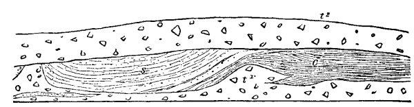

[Intangible Textual Heritage](../../index)  [Atlantis](../index.md) 
[Index](index)  [Previous](rag08)  [Next](rag10.md) 

------------------------------------------------------------------------

### CHAPTER VII.

##### THE DRIFT A GIGANTIC CATASTROPHE.

IN the first place, the Drift fell upon a fair and lovely world, a world
far better adapted to give happiness to its inhabitants than this
storm-tossed planet on which we now live, with its endless battle
between heat and cold, between sun and ice.

The pre-glacial world was a garden, a paradise; not excessively warm at
the equator, and yet with so mild and equable a climate that the plants
we now call tropical flourished within the present Arctic Circle. If
some future daring navigator reaches the north pole and finds solid land
there, he will probably discover in the rocks at his feet the fossil
remains of the oranges and bananas of the pre-glacial age.

That the reader may not think this an extravagant statement, let me cite
a few authorities.

A recent writer says:

"This was, indeed, for America, *the golden age* of animals and plants,
and in all respects but one--the absence of man--the country was more
interesting and picturesque than now. We must imagine, therefore, that
the hills and valleys about the present site of New York were covered
with noble trees, and a dense undergrowth of species, for the most part
different from those now living there; and that these were the homes and
feeding-grounds of many kinds of quadrupeds and birds, which have long
since become extinct. The broad plain which sloped gently seaward from
the highlands must have been

{p. 44}

covered with a sub-tropical forest of-giant trees and tangled vines
teeming with animal life. This state of things doubtless continued
through many thousands of years, but ultimately a change came over the
fair face of Nature more complete and terrible than we have language to
describe."\[1\]

Another says:

"At the close of the Tertiary age, which ends the long series of
geological epochs previous to the Quaternary, the landscape of Europe
had, in the main, assumed its modern appearance. The middle era of this
age--the Miocene--was characterized by tropical plants, a varied and
imposing fauna, and a genial climate, so extended as to nourish forests
of beeches, maples, *walnuts*, poplars, and *magnolias in Greenland and
Spitzbergen*, while an exotic vegetation hid the exuberant valleys of
England."\[2\]

Dr. Dawson says:

"This delightful climate was not confined to the present temperate or
tropical regions. It extended to the very shores of the Arctic Sea. In
*North* Greenland, at Atane-Kerdluk, in latitude 70° north, at an
elevation of more than a thousand feet above the sea, were found the
remains of beeches, oaks, pines, poplars, maples, *walnuts, magnolias,
limes*, and *vines*. The remains of similar plants were found in
Spitzbergen, in latitude 78° 56'."\[3\]

Dr. Dawson continues:

"Was the Miocene period on the whole a better age of the world than that
in which we live? In some respects it was. Obviously, there was in the
northern hemisphere a vast surface of land under a mild and equable
climate, and clothed with a rich and varied vegetation. Had we lived in
the Miocene we might have sat under our own vine and fig-tree equally in
Greenland and Spitzbergen and in those more southern climes to which
this

\[1. "Popular Science Monthly," October, 1878, p. 648.

2\. L. P. Gratacap, in "American Antiquarian," July, 1881, p. 280.

3\. Dawson, "Earth and Man," p. 261.\]

{p. 45}

privilege is now restricted. . . . Some reasons have been adduced for
the belief that in the Miocene and Eocene there were intervals of cold
climate; but the evidence of this may be merely local and exceptional,
and does not interfere with the broad characteristics of the age."\[1\]

Sir Edward Belcher brought away from the dreary shores of Wellington
Channel (latitude 75° 32' north) portions of a tree which there can be
no doubt whatever had actually grown where be found it. The roots were
in place, in a frozen mass of earth, the stump standing upright where it
was probably overtaken by the great winter.\[2\] Trees have been found,
*in situ*, on Prince Patrick's Island, in latitude 76° 12' north, *four
feet in circumference*. They were so old that the wood had lost its
combustible quality, and refused to burn. Mr. Geikie thinks that it is
possible these trees were pre-glacial, and belonged to the Miocene age.
They may have been the remnants of the great forests which clothed that
far northern region when the so-called glacial age came on and brought
the Drift.

We shall see hereafter that man, possibly civilized man, dwelt in this
fair and glorious world--this world that knew no frost, no cold, no ice,
no snow; that he had dwelt in it for thousands of years; that he
witnessed the appalling and sudden calamity which fell upon it; and that
he has preserved the memory of this catastrophe to the present day, in a
multitude of myths and legends scattered all over the face of the
habitable earth.

But was it sudden? Was it a catastrophe?

Again I call the witnesses to the stand, for I ask you, good reader, to
accept nothing that is not *proved*.

In the first place, was it sudden?

\[1. "Earth and Man," p. 264.

2\. "The Last of the Arctic Voyages," vol. i, p. 380.\]

{p. 46}

One writer says:

"The glacial action, in the opinion of the land-glacialists, was limited
to a *definite period*, and operated *simultaneously* over a vast
area."\[1\]

And again:

"The drift was accumulated where it is by some violent action."\[2\]

Louis Figuier says:

"The two cataclysms of which we have spoken surprised Europe at the
moment of the development of an important creation. The whole scope of
animated nature, the evolution of animals, was *suddenly arrested* in
that part of our hemisphere over which these gigantic convulsions
spread, followed by the brief but sudden submersion of entire
continents. Organic life had scarcely recovered from the violent shock,
when a second, and perhaps severer blow assailed it. The northern and
central parts of Europe, the vast countries which extend from
Scandinavia to the Mediterranean and the Danube, were visited by a
period of sudden and severe cold; the temperature of the polar regions
seized them. The plains of Europe, but now ornamented by the luxurious
vegetation developed by the heat of a burning climate, the boundless
pastures on which herds of great elephants, the active horse, the robust
hippopotamus, and great carnivorous animals grazed and roamed, became
covered with a mantle of ice and snow."\[3\]

M. Ch. Martins says:

"The most violent convulsions of the solid and liquid elements appear to
have been themselves only the effects due to a cause much more powerful
than the mere expansion of the pyrosphere; and it is necessary to recur,
in order to explain them, to some new and bolder hypothesis than has Yet
been hazarded. Some philosophers have belief

\[1. American Cyclopædia," vol. vi, p. 114.

2\. Ibid., vol. vi, p. 111.

3\. "The World before the Deluge," p. 435.\]

{p. 47}

in an astronomical revolution which may have overtaken our globe in the
first age of its formation, and have modified its position in relation
to the sun. They admit *that the poles have not always been as they are
now*, and that *some terrible shock displaced them*, changing at the
same time the inclination of the axis of the rotation of the
earth."\[1\]

Louis Figuier says:

"We can not doubt, after such testimony, of the existence, in the frozen
north, of the almost entire remains of the mammoth. The animals seem to
have *perished suddenly; enveloped in ice at the moment of their death*,
their bodies have been preserved from decomposition by the continual
action of the cold."\[2\]

Cuvier says, speaking of the bodies of the quadrupeds which the ice had
seized, and which have been preserved, with their hair, flesh, and skin,
down to our own times:

"If they had not been frozen as soon as killed, putrefaction would have
decomposed them; and, on the other hand, this eternal frost could not
have previously prevailed in the place where they died, for they could
not have lived in such a temperature. It was, therefore, *at the same
instant when these animals perished that the country they inhabited was
rendered glacial*. These events must have been *sudden, instantaneous,
and without any gradation*."\[3\]

There is abundant evidence that the Drift fell upon a land covered with
forests, and that the trunks of the trees were swept into the mass of
clay and gravel, where they are preserved to this day.

Mr. Whittlesey gives an account of a log found *forty feet below the
surface*, in a bed of blue clay, resting

\[1. "The World before the Deluge," p. 463.

2\. Ibid., p. 396.

3\. "Ossements fossiles, Discours sur les Révolutions du Globe."\]

{p. 48}

upon the "hard-pan" or "till," in a well dug at Columbia, Ohio.\[1\]

At Bloomington, Illinois, pieces of wood were found *one hundred and
twenty-three feet below the surface*, in sinking a shaft.\[2\]

And it is a very remarkable fact that none of these Illinois clays
*contain any fossils*.\[3\]

The inference, therefore, is irresistible that the clay, thus
unfossiliferous, fell upon and inclosed the trees while they were yet
growing.

These facts alone would dispose of the theory that the Drift was
deposited upon lands already covered with water. It is evident, on the
contrary, that it was dry land, inhabited land, land embowered in
forests.

On top of the Norwich crag, in England, are found the remains of an
ancient forest, "showing stumps of trees standing erect with their roots
penetrating an ancient soil."\[4\] In this soil occur the remains of
many extinct species of animals, together with those of others still
living; among these may be mentioned the hippopotamus, three species of
elephant, the mammoths, rhinoceros, bear, horse, Irish elk, etc.

In Ireland remains of trees have been found in sand-beds below the
till.\[5\]

Dr. Dawson found a hardened peaty bed under the bowlder-clay, in Canada,
which "contained many small roots and branches, apparently of coniferous
trees allied to the spruces."\[6\] Mr. C. Whittlesey refers to decayed

\[1. "Smithsonian Contributions," vol. xv.

2\. "Geology of Illinois," vol. iv, p. 179.

3\. "The Great Ice Age," p. 387.

4\. Ibid., p. 340. "Dublin Quarterly Journal of Science," vol. vi, p.
249.

5\. "Acadian Geology," p. 63.\]

{p. 49}

leaves and remains of the elephant and mastodon found below and in the
drift in America.\[1\]

"The remains of the mastodon, rhinoceros, hippopotamus, and elephant are
found in the pre-glacial beds of Italy."\[2\]

These animals were slaughtered outright, and so suddenly that few
escaped:

Admiral Wrangel tells us that the remains of elephants, rhinoceroses,
etc., are heaped up in such quantities in certain parts of Siberia that
"he and his men climbed over ridges and mounds composed entirely of
their bones."\[3\]

We have seen that the Drift itself has all the appearance of having been
the product of some sudden catastrophe:

"Stones and bowlders alike are scattered higgledy-piggledy, pell-mell,
through the clay, so as to give it a *highly confused and tumultuous
appearance*."

Another writer says:

"In the mass of the 'till' itself fossils sometimes, but very rarely,
occur. Tusks of the mammoth, reindeer-antlers, and *fragments of wood*
have from time to time been discovered. They almost invariably afford
marks of having been subjected to the same action as the stones and
bowlders by which they are surrounded."\[4\]

Another says:

"Logs and fragments of wood are often got at great depths in the buried
gorges."\[5\]

\[1. "Smithsonian Contributions," vol. xv.

2\. "The Great Ice Age," p. 492.

3\. Agassiz, "Geological Sketches," p. 209.

4\. "The Great Ice Age," p. 150.

5\. "Illustrations of Surface Geology," "Smithsonian Contributions."\]

{p. 50}

Mr. Geikie says:

"Below a deposit of till, at Woodhill Quarry, near Kilmaurs, in Ayrshire
(Scotland), the remains of mammoths and reindeer and certain marine
shells have several times been detected during the quarrying operations.
. . . Two elephant-tasks were got at a depth of seventeen and a half
feet from the surface. . . . The mammalian remains, obtained from this
quarry, occurred in a peaty layer between two thin beds of sand and
gravel which lay beneath a mass of 'till,' and *rested directly on the
sandstone rock*."\[1\]

And again:

"Remains of the mammoth have been met with at Chapelhall, near Airdrie,
where they occurred in a bed of laminated sand, *underlying* 'till.'
Reindeer-antlers have also been discovered in other localities, as in
the valley of the Endrick, about four miles from Loch Lomond, where an
antler was found associated with marine shells, near the bottom of a bed
of blue clay, and *close to the underlying rock*--the blue clay being
covered with twelve feet of tough, stony clay."\[2\]

Professor Winchell says

"Buried tree-trunks are often exhumed from the glacial drift at a depth
of from twenty to *sixty feet from the surface*. Dr. Locke has published
an account of a mass of buried drift-wood at Salem, Ohio, *forty-three
feet below the surface*, imbedded in ancient mud. The museum of the
University of Michigan contains several fragments of well-preserved
tree-trunks exhumed from wells in the vicinity of Ann Arbor. Such
occurrences are by no means uncommon. The encroachments of the waves
upon the shores of the Great Lakes reveal whole forests of the buried
trunks of the white cedar."\[3\]

These citations place it beyond question that the Drift came suddenly
upon the world, slaughtering the animals,

\[1. The Great Ice Age," p. 149.

2\. Ibid., p. 150.

3\. Winchell, "Sketches of Creation," p. 259.\]

{p. 51}

breaking up the forests, and overwhelming the trunks and branches of the
trees in its masses of *débris*.

Let us turn to the next question: Was it an extraordinary event, a
world-shaking cataclysm?

The answer to this question is plain: The Drift marks probably the most
awful convulsion and catastrophe that has ever fallen upon the globe.
The deposit of these continental masses of clay, sand, and gravel was
but one of the features of the apalling event. In addition to this the
earth at the same time was cleft with great cracks or fissures, which
reached down through many miles of the planet's crust to the central
fires and released the boiling rocks imprisoned in its bosom, and these
poured to the surface, as igneous, intrusive, or trap-rocks. Where the
great breaks were not deep enough to reach the central fires, they left
mighty fissures in the surface, which, in the Scandinavian regions, are
known as *fiords*, and which constitute a striking feature of the
scenery of these northern lands; they are great canals--hewn, as it
were, in the rock--with high walls penetrating from the sea far into the
interior of the land. They are found in Great Britain, Maine, Nova
Scotia, Labrador, Greenland, and on the Western coast of North America.

David Dale Owen tells us that the outburst of trap-rock at the Dalles of
the St. Croix came up *through open fissures*, breaking the continuity
of strata, without tilting them into inclined planes."\[1\] It would
appear as if the earth, in the first place, cracked into deep clefts,
and the igneous matter within took advantage of these breaks to rise to
the surface. It caught masses of the sandstone in its midst and hardened
around them.

These great clefts seem to be, as Owen says, "lines

\[1. "Geological Survey of Wisconsin, Iowa, and Minnesota," p. 142.\]

{p. 52}

radiating southwestwardly from Lake Superior, as if that was the seat of
the disturbance which caused them."\[1\]

Moreover, when we come to examine the face of the rocks on which the
Drift came, we do not find them merely smoothed and ground down, as we
might suppose a great, heavy mass of ice moving slowly over them would
leave them. There was something more than this. There was something,
(whatever it was,) that fell upon them with awful force and literally
*smashed* them, pounding, beating, pulverizing them, and turning one
layer of mighty rock over upon another, and scattering them in the
wildest confusion. We can not conceive of anything terrestrial that, let
loose upon the bare rocks to-day, would or could produce such results.

Geikie says:

"When the 'till' is removed from the underlying rocks, these almost
invariably show either a well-smoothed, polished, and striated surface,
or else a *highly confused, broken, and smashed* appearance."\[2\]

Gratacap says:

"'*Crushed ledges*' designate those plicated, overthrown, or curved
exposures where parallel rocks, as talcose schist, usually vertical, are
bent and fractured, *as if by a maul like force, battering them from
above*. The strata are oftentimes tumbled over upon a cliff-side like a
row of books, and rest upon heaps of fragments broken away by the strain
upon the bottom layers, or *crushed* off from their exposed
layers."\[3\]

The Rev. O. Fisher, F. G. S., says he

"Finds the covering beds to consist of two members--a lower one,
entirely destitute of organic remains, and

\[1. "Geological Survey of Wisconsin, Iowa, and Minnesota," p. 147.

2\. "The Great Ice Age," p. 73.

3\. "Popular Science Monthly," January, 1878, p. 326.\]

{p. 53}

generally unstratified, which has often been *forcibly* INDENTED *into
the bed beneath it*, sometimes exhibiting slickensides at the junction.
There is evidence of this lower member having been pushed or dragged
over the surface, from higher to lower levels, *in a plastic condition*;
on which account he has named it 'The Trail'."\[1\]

Now, all these details are incompatible with the idea of ice-action.
What condition of ice can be imagined that would *smash* rocks, that
would beat them like a maul, that would *indent* them?

And when we pass from the underlying rocks to the "till" itself, we find
the evidences of tremendous force exerted in the wildest and most
tumultuous manner.

When the clay and stones were being deposited on those crushed and
pounded rocks, they seem to have picked up the *detritus* of the earth
in great masses, and whirled it wildly in among their own material, and
deposited it in what are called "the intercalated beds." It would seem
as if cyclonic winds had been at work among the mass. While the "till"
itself is devoid of fossils, "the intercalated beds" often contain them.
Whatever was in or on the soil was seized upon, carried up into the air,
then cast down, and mingled among the "till."

James Geikie says, speaking of these intercalated beds:

"They are twisted, bent, crumpled, and confused *often in the wildest
manner*. Layers of clay, sand, and gravel, which were probably deposited
in a nearly horizontal plane, are puckered into folds and sharply curved
into vertical positions. I have seen whole beds of sand and clay which
had all the appearance of having been pushed forward bodily for some
distance the bedding assuming *the most fantastic appearance*. . . . The
intercalated beds are everywhere cut through by the overlying 'till,'
and

\[1. "Journal of the Geological Society and Geological Magazine."\]

{p. 54}

large portions have been carried away. . . . They form but a small
fraction of the drift-deposits."\[1\]

In the accompanying cut we have one of these sand (*s*) and clay (*c*)
patches, embosomed in the "till," *t*1 and *t*2.

STRATIFIED BEDS IN TILL, LEITHEN WATER, PEEBLESSHIRE, SCOTLAND.

And again, the same writer says:

"The intercalated beds are remarkable for having yielded an imperfect
skull of the great extinct ox (*Bos primigenius*), and remains of the
Irish elk or deer, and the horse, together with layers of peaty
matter."\[2\]

Several of our foremost scientists see in the phenomena of the Drift the
evidences of a cataclysm of some sort.

Sir John Lubbock\[3\] gives the following representation of a section of
the Drift at Joinville, France, containing

SECTION AT JOINVILLE.

\[1. "The Great Ice Age," p. 149.

2\. Ibid., p. 149.

3\. "Prehistoric Times," p. 370.\]

{p. 55}

an immense sandstone block, eight feet six inches in length, with a
width of two feet eight inches, and a thickness of three feet four
inches.

Discussing the subject, Mr. Lubbock says:

"We must feel that a body of water, with power to move such masses as
these, must have been very different from any floods now occurring in
those valleys, and might well deserve the name of a *cataclysm*. . . .
But a flood which could bring down so great a mass would certainly have
swept away the comparatively light and movable gravel below. We can not,
therefore, account for the phenomena by aqueous action, because a flood
which would deposit the sandstone blocks would remove the underlying
gravel, and a flood which would deposit the gravel would not remove the
blocks. The *Deus ex machinâ* has not only been called in most
unnecessarily, but when examined turns out to be but an idol, after
all."

Sir John thinks that floating ice might have dropped these blocks; but
then, on the other hand, M. C. d'Orbigny observes that all the fossils
found in these beds belong to fresh-water or land animals. The sea has
had nothing to do with them. And D'Orbigny thinks the Drift came from
cataclysms.

M. Boucher de Perthes, the first and most exhaustive investigator of
these deposits, has always been of opinion that the drift-gravels of
France were deposited by *violent cataclysms*.\[1\]

This view seems to be confirmed by the fact that the gravel-beds in
which these remains of man and extinct animals are found lie at an
elevation of from eighty to *two hundred feet above the present
water-levels of the valleys*.

Sir John Lubbock says:

"Our second difficulty still remains--namely, the height at which the
upper-level gravels stand above the

\[1. "Mém. Soc. d'Em. l'Abbeville," 1861, p. 475.\]

{p. 56}

present water-line. We can not wonder that these beds have generally
been attributed to violent cataclysms."\[1\]

In America, in Britain, and in Europe, the glacial deposits made clean
work of nearly all animal life. The great mammalia, too large to find
shelter in caverns, were some of them utterly swept away, while others
never afterward returned to those regions. In like manner palæolithic
man, man of the rude and unpolished flint implements, the contemporary
of the great mammalia, the mammoth, the hippopotamus, and the
rhinoceros, was also stamped out, and the cave-deposits of Europe show
that there was a long interval before be reappeared in those regions.
The same forces, whatever they were, which "smashed" and "pounded" and
"contorted" the surface of the earth, crushed man and his gigantic
associates out of existence.\[2\]

But in Siberia, where, as we have seen, some of the large mammalia were
caught and entombed in ice, and preserved even to our own day, there was
no "smashing" and "crushing" of the earth, and many escaped the
snow-sheets, and their posterity survived in that region for long ages
after the Glacial period, and are supposed only to have disappeared in
quite recent times. In fact, within the last two or three years a
Russian exile declared that he had seen a group of living mammoths in a
wild valley in a remote portion of that wilderness.

These, then, good reader, to recapitulate, are points that seem to be
established:

I. The Drift marked a world-convulsing catastrophe. It was a gigantic
and terrible event. It was something quite out of the ordinary course of
Nature's operations.

II\. It was sudden and overwhelming.

\[1. "Prehistoric Times," p. 372.

2\. "The Great Ice Age," p. 466.\]

{p. 57}

III\. It fell upon land areas, much like our own in geographical
conformation; a forest-covered, inhabited land; a glorious land, basking
in perpetual summer, in the midst of a golden age.

Let us go a step further.

{p. 58}

------------------------------------------------------------------------

[Next: Chapter VIII. Great Heat A Prerequisite](rag10.md)
