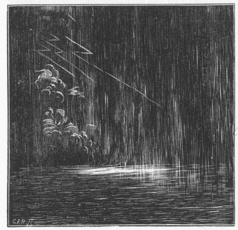

[Intangible Textual Heritage](../../index)  [Atlantis](../index.md) 
[Index](index)  [Previous](rag21)  [Next](rag23.md) 

------------------------------------------------------------------------

### CHAPTER VIII.

##### LEGENDS OF THE AGE OF DARKNESS.

ALL the cosmogonies begin with an Age of Darkness; a damp, cold, rainy,
dismal time.

Hesiod tells us, speaking of the beginning of things

"In truth, then, *foremost sprung Chaos*. . . . But from Chaos were born
*Erebus and black Night;* and from Night again sprang forth Æther and
Day, whom she bare after having conceived by *union with Erebus*."

Aristophanes, in his "Aves," says:\[1\]

"*Chaos and Night and black Erebus* and wide Tartarus *first
existed*."\[2\]

Orpheus says:

"*From the beginning the gloomy night enveloped and obscured all things*
that were under the ether" (the clouds). "The earth was invisible on
account of the darkness, but the light *broke through the ether*" (the
clouds), "and illuminated the earth."

By this power were produced the sun, moon, and stars.\[3\]

It is from Sanchoniathon that we derive most of the little we know of
that ancient and mysterious people, the Phœnicians. He lived before the
Trojan war; and of his writings but fragments survive--quotations in the
writings of others.

\[1. "The Theogony."

2\. Faber's "Origin of Pagan Idolatry," vol. i, p. 255.

3\. Cory's "Fragments," p. 298.\]

{p. 209}

He tells us that--

"The beginning of all things was a condensed, windy air, or a breeze of
*thick* air, and a *chaos turbid and black as Erebus*.

"Out of this chaos was generated Môt, which some call Ilus," (*mud,*)
"but others the putrefaction of a watery mixture. And from this sprang
all the seed of the creation, and the generation of the universe. . . .
And, when the air began to send forth light, winds were produced and
clouds, and very great defluxions and *torrents of the heavenly
waters*."

Was this "thick air" the air thick with comet-dust, which afterward
became the mud? Is this the meaning of the "*turbid* chaos"?

We turn to the Babylonian legends. Berosus wrote from records preserved
in the temple of Belus at Babylon. He says:

"There was a time in which there *existed nothing but darkness* and an
*abyss of waters*, wherein resided *most hideous beings*, which were
produced of a twofold principle."

Were these "hideous beings" the comets?

From the "Laws of Menu," of the Hindoos, we learn that the universe
existed at first in darkness.

We copy the following text from the Vedas:

"The Supreme Being alone existed; *afterward there was universal
darkness;* next the watery ocean was produced by the diffusion of
virtue."

We turn to the legends of the Chinese, and we find the same story:

Their annals begin with "Pwan-ku, or the Reign of Chaos."\[1\]

\[1. "The Ancient Dynasties of Berosus and China," Rev. T. P. Crawford,
D. D., p. 4.\]

{p. 210}

And we are told by the Chinese historians that--

"P'an-ku came forth in the midst of the *great chaotic void*, and we
know not his origin; that he knew the rationale of heaven and earth, and
*comprehended the changes of the Darkness and the Light*."\[1\]

He "existed *before the shining of the Light*."\[2\] He was "the Prince
of Chaos."

"After the chaos *cleared away*, heaven appeared first in order, then
earth, then after they existed, *and the atmosphere had changed its
character, man came forth*."\[3\]

That is to say, P'an-ku lived through the Age of Darkness, during a
chaotic period, and while the atmosphere was pestilential with the gases
of the comet. Where did he live? The Chinese annals tell us:

"In the age after the chaos, when heaven and earth had *just
separated*."

That is, when the great mass of cloud had just lifted from the earth:

"Records had not yet been established or inscriptions invented. At first
even the rulers *dwelt in caves* and desert places, eating raw flesh and
drinking blood. At this fortunate juncture Pan-ku-sze *came forth*, and
from that time heaven and earth began to be heaven and earth, men and
things to be men and things, and so the chaotic state passed away."\[1\]

This is the rejuvenation of the world told of in so many legends.

And these annals tell us further of the "Ten Stems," being the stages of
the earth's primeval history.

"At *Wu*--the Sixth Stem--the Darkness and the Light unite *with
injurious effects*--all things become *solid*," (frozen?), "*and the
Darkness destroys the growth of all things*.

\[1. Compendium of Wong-shi-Shing 1526-1590," Crawford, p. 3.

2\. Ibid.

3\. Ibid., p. 2.

4\. Ibid., p. 3.\]

{p. 211}

"At *Kung*--the Seventh Stem--*the Darkness nips all things*."

But the Darkness is passing away:

"At *Jin*--the Ninth Stem--the Light *begins to nourish all things in
the recesses below*.

"Lastly, at *Tsze*, all things *begin to germinate*."\[1\]

The same story is told in the "Twelve Branches."

"1. *K'wun-tun* stands for the period of *chaos, the cold midnight
darkness*. It is said that with it all things began to germinate in the
hidden recesses of the under-world."

In the 2d--*Ch'i-fun-yoh*--"light and heat become active, and all things
begin to rise in obedience to its nature." In the 3d--*Sheh-ti-kuh*--the
stars and sun probably appear, as from this point the calendar begins.
In the 5th--*Chi-shii*--all things in a torpid state begin to come
forth. In the 8th--*Hëen-hia*--all things harmonize, and the present
order of things is established; that is to say, the effects of the
catastrophe have largely passed away.\[2\]

The kings who governed before the Drift were called the Rulers of heaven
and earth; those who came after were the Rulers of man.

"*Cheu Ching-huen* says: 'The Rulers of man succeeded to the Rulers of
heaven and the Rulers of earth in the government; that then *the
atmosphere gradually cleared away*, and all things sprang up together;
that the order of time was gradually settled, and the usages of society
gradually became correct and respectful."\[3\]

And then we read that "the day and night had not yet been divided," but,
after a time, "day and night were distinguished from each other."\[4\]

Here we have the history of some event which changed

\[1. "Compendium of Wong-shi-Shing 1526-1590," Crawford, pp. 4, 5.

2\. Ibid., p. 8.

3\. Ibid.

4\. Ibid., p. 7.\]

{p. 212}

the dynasties of the world: the heavenly kingdom was succeeded by a
merely human one; there were chaos, cold, and darkness, and death to
vegetation; then the light increases, and vegetation begins once more to
germinate; the atmosphere is thick; the heavens rest on the earth; day
and night can not be distinguished from one another, and mankind dwell
in caves, and live on raw meat and blood.

Surely all this accords wonderfully with our theory.

And here we have the same story in another form:

"The philosopher of Oraibi tells us that when the people ascended by
means of the magical tree, which constituted the ladder from the lower
world to this, they found the firmament, *the ceiling of this world, low
down upon the earth*--the floor of this world."

That is to say, when the people climbed up, from the cave in which they
were bidden, to the surface of the earth, the dense clouds rested on the
face of the earth.

"Machito, one of their gods, raised the firmament on his shoulders to
where it is now seen. *Still the world was dark, as there was no sun, no
moon, and no stars*. So the people murmured because of the darkness and
the cold. Machito said, 'Bring me seven maidens'; and they brought him
seven maidens; and he said, 'Bring me seven baskets of cotton-bolls';
and they brought him seven baskets of cotton-bolls; and he taught the
seven maidens to weave a magical fabric from the cotton, and when they
had finished it he held it aloft, and the breeze carried it away toward
the firmament, and in the twinkling of an eye it was transformed into a
beautiful and full-orbed moon; and the same breeze caught the remnants
of flocculent cotton, which the maidens had scattered during their work,
and carried them aloft, and they were transformed into bright stars. But
*still it was cold;* and the people murmured again, and Machito said,
'Bring me seven buffalo-robes'; and they brought him seven
buffalo-robes, and from the densely matted hair of the robes he wove
another wonderful fabric, which the storm carried

{p. 213}

away into the sky, and it was transformed into the full-orbed sun. Then
Machito appointed times and seasons, and ways for the heavenly bodies;
and the gods of the firmament have obeyed the injunctions of Machito
from the day of their creation to the present." \*

Among the Thlinkeets of British Columbia there is a legend that the
Great Crow or Raven, Yehl, was the creator of most things:

"*Very dark, damp, and chaotic* was the world in the beginning; nothing
with breath or body moved there except Yehl; in the likeness of *a raven
he brooded over the mist; his black winds beat down the vast confusion;
the waters went back before him and the dry land appeared*. The
Thlinkeets were placed on the earth--though how or when does not exactly
appear--while the world was *still in darkness, and without sun, moon,
or stars*."\[2\]

The legend proceeds at considerable length to tell the doings of Yehl.
His uncle tried to slay him, and, when he failed, "he imprecated with a
potent curse a deluge upon all the earth. . . . The flood came, the
waters rose and rose; but Yehl clothed himself in his bird-skin, and
soared up to the heavens, where he stuck his beak into a cloud, and
remained until the waters were assuaged."\[3\]

This tradition reminds us of the legend of the Thessalian Cerambos, "who
escaped the flood by rising into the air on wings, given him by the
nymphs."

I turn now to the traditions of the Miztecs, who dwelt on the outskirts
of the Mexican Empire; this legend was taken by Fray Gregoria
Garcia\[4\] from a book found in a convent in Cuilapa, a little Indian
town, about a league and a half south of Oajaca; the book had been
compiled by the vicar of the convent, "just as they

\[1. "Popular Science Monthly," October, 1879, p. 800.

2\. Bancroft's "Native Races," vol. iii, p. 98.

3\. Ibid., p. 99.

4\. "Origen de los Ind.," pp. 327-329.\]

{p. 214}

themselves were accustomed to depict and to interpret it in their
primitive scrolls":

"In the year and in *the day of obscurity and darkness*," (the days of
the dense clouds?), "yea, even before the days or the years were,"
(before the visible revolution of the sun marked the days, and the
universal darkness and cold prevented the changes of the seasons?),
"when the world was in *great darkness and chaos*, when the earth was
covered with water, and there was nothing but *mud and slime on all the
face of the earth*--behold a god became visible, and his name was the
Deer, and his surname was the Lion-snake. There appeared also a very
beautiful goddess called the Deer, and surnamed the Tiger-snake. These
two gods were the origin and beginning of all the gods."

This lion-snake was probably one of the comets; the tiger-snake was
doubtless a second comet, called after the tiger, on account of its
variegated, mottled appearance. It will be observed they appeared
*before* the light had returned,

These gods built a temple on a high place, and laid out a garden, and
waited patiently, offering sacrifices to the higher gods, wounding
themselves with *flint* knives, and "praying that it might seem good to
them to shape the firmament, and *lighten the darkness* of the world,
and to establish the foundation of the earth; or, rather, to gather the
waters together so that the earth might appear--as they had no place to
rest in save only one little garden."

Here we have the snakes and the people confounded together. The earth
was afterward made fit for the use of mankind, and at a later date there
came--

"A great deluge, wherein perished many of the sons and daughters that
had been born to the gods; and it is said that, when the deluge was
passed, the human race

{p. 215}

was restored, as at the first, and the Miztec kingdom populated, and the
heavens and the earth established."\[1\]

Father Duran, in his MS. "History Antique of New Spain," written in A.
D. 1585, gives the Cholula legend, which commences:

"In the beginning, *before the light of the sun* had been created, this
land was *in obscurity and darkness* and void of any created thing."

In the Toltec legends we read of a time when--

"There was a tremendous hurricane that carried away trees, mounds,
houses, and the largest edifices, notwithstanding which many men and
women escaped, *principally in caves*, and places where the great
hurricane could not reach them. A few days having passed, they set out
to see what had become of the earth, when they found it all populated
with monkeys. All this time they were in darkness, *without seeing the
light of the sun, nor the moon, that the wind had brought them*."\[2\]

In the Aztec creation-myths, according to the accounts furnished by
Mendieta, and derived from Fray Andres de Olmos, one of the earliest of
the Christian missionaries among the Mexicans, we have the following
legend of the "Return of the Sun":

"*Now, there had been no sun in existence for many years;* so the gods
being assembled in a place called Teotihuacan, six leagues from Mexico,
and gathered at the time *around a great fire*, told their devotees that
he of them who should first cast himself into that, fire should have the
honor of being transformed into a sun. So, one of them, called
Nanahuatzin . . . flung himself into the fire. Then the gods" (the
chiefs?) "began to peer through the gloom in all directions *for the
expected light*, and to make bets as to what part of heaven. he should

\[1. Bancroft's "Native Races," vol. iii, pp. 71-73.

2\. "North Americans of Antiquity," p. 239.\]

{p. 216}

first appear in. Some said 'Here,' and some said 'There'; but when the
sun rose they were all proved wrong, for not one of them had fixed upon
the east."

In the long-continued darkness they had lost all knowledge of the
cardinal points. The ancient landmarks, too, were changed.

The "Popul Vuh," the national book of the Quiches, tells us of four ages
of the world. The man of the first age was made of clay; he was
"strengthless, inept, watery; he could not move his head, his face
looked but one way; his sight was restricted, he could not look behind
him," that is, he had no knowledge of the past; "he had been endowed
with language, but he had no intelligence, so he was consumed in the
water."\[1\]

Then followed a higher race of men; they filled the world with their
progeny; they had intelligence, but *no moral sense*"; "they forgot the
Heart of Heaven." They were *destroyed by fire and pitch from heaven*,
accompanied by tremendous earthquakes, from which only a few escaped.

Then followed a period *when all was dark*, save the white light "of the
morning-star--sole light as yet of the primeval world"--probably a
volcano.

"Once more are the gods in council, *in the darkness, in the night of a
desolated universe*."

Then the people prayed to God for light, evidently for the return of the
sun:

"'Hail! O Creator they cried, 'O Former! Thou that hearest and
understandest us! abandon us not! forsake us not! O God, thou that art
in heaven and on earth; O Heart of Heaven I O Heart of Earth! *give us
descendants, and a posterity as long as the light endure*.'" . . .

In other words, let not the human race cease to be.

\[1. Bancroft's "Native Races," vol. iii, p. 46.\]

{p. 217}

"It was thus they spake, living tranquilly, *invoking the return of the
light; waiting the rising of the sun;* watching the star of the morning,
precursor of the sun. But no sun came, and the four men and their
descendants grew uneasy. 'We have no person to watch over us,' they
said; 'nothing to guard our symbols!' Then they adopted gods of their
own, and waited. They kindled fires, *for the climate was colder;* then
there fell *great rains and hail-storms,* and put out their fires.
Several times they made fires, and several times the rains and storms
extinguished them. Many other trials also they underwent in Tulan,
famines and such things, and *a general dampness and cold*--for the
earth was *moist, there being yet no sun*."

All this accords with what I have shown we might expect as accompanying
the close of the so-called Glacial Age. Dense clouds covered the sky,
shutting out the light of the sun; perpetual rains and storms fell; the
world was cold and damp, muddy and miserable; the people were wanderers,
despairing and hungry. They seem to have come from an eastern land. We
are told:

"Tulan was a much colder climate than the happy eastern land they had
left."

Many generations seem to have grown up and perished under the sunless
skies, "waiting for the return of the light"; for the "Popul Vuh" tells
us that "here also the language of all the families was confused, so
that no one of the first four men could any longer understand the speech
of the others."

That is to say, separation and isolation into rude tribes had made their
tongues unintelligible to one another.

This shows that many, many years--it may be centuries--must have elapsed
before that vast volume of moisture, carried up by evaporation, was able
to fall

{p. 218}

back, in snow and rain to the land and sea, and allow the sun to shine
through "the blanket of the dark." Starvation encountered the scattered
fragments of mankind.

And in these same Quiche legends of Central America we are told:

"The persons of the godhead were enveloped in the *darkness which
enshrouded a desolated world*."\[1\]

They counseled together, and created four men of white and yellow maize
(the white and yellow races?). It was *still dark;* for they had no
light but the light of the morning-star. They came to Tulan.

And the Abbé Brasseur de Bourbourg gives further details of the Quiche
legends:

Now, behold our ancients and our fathers were made lords, and *had their
dawn*. Behold we will relate also the rising of the sun, the moon, and
the stars! Great was their joy when they saw the morning-star, which
came out first, with its resplendent face before the sun. *At last* the
sun itself began to come forth; the animals, small and great, were in
joy; they rose from the water-courses and ravines, and stood on the
mountain-tops, with their heads toward where the sun was coming. An
innumerable crowd of people were there, and the dawn cast light on all
these people at once. At last *the face of the ground was dried by the
sun:* like a man the sun showed himself, and his presence warmed and
dried the surface of the ground. Before the sun appeared, *muddy and
wet* was the surface of the ground, and it was before the sun appeared,
and then only the sun rose like a man. *But his heat had no strength*,
and he *did but show when he rose;* he only remained like" (an image in)
"a mirror and it is not, indeed, the same sun that appears now, they
say, in the stories."\[2\]

\[1. "North Americans of Antiquity," p. 214.

2\. Tylor's "Early History of Mankind," p. 308.\]

{p. 219}

How wonderfully does all this accord with what we have shown would
follow from the earth's contact with a comet!

The earth is wet and covered with mud, the clay; the sun is long absent;
at last he returns; he dries the mud, but his face is still covered with
the remnants of the great cloud-belt; "his heat has no strength"; he
shows himself only in glimpses; he shines through the fogs like an image
in a mirror; he is not like the great blazing orb we see now.

But the sun, when it did appear in all its glory, must have been a
terrible yet welcome sight to those who had not looked upon him for many
years. We read in the legends of the Thlinkeets of British Columbia,
after narrating that the world was once "dark, damp, and chaotic," full
of water, with no sun, moon, or stars, how these luminaries were
restored. The great hero-god of the race, Yehl, got hold of three
mysterious boxes, and, wrenching the lids off, let out the sun, moon,
and stars.

"When he set up the blazing light" (of the sun) "in heaven, the people
that saw it were at first afraid. Many hid themselves in the mountains,
and in the forests, and even in the water, and were changed into the
various kinds of animals that frequent these places."\[1\]

Says James Geikie:

"Nor can we form any proper conception of how long a time was needed to
bring about that other change of climate, under the influence of which,
slowly and imperceptibly, this immense sheet of frost melted away from
the lowlands and retired to the mountain recesses. We must allow that
long ages elapsed before the warmth became such as to induce plants and
animals to clothe and people the land. How vast a time, also, must have
passed away ere the warmth reached its climax!"\[2\]

\[1. Bancroft's "Native Races," vol. iii, p. 100.

2\. "The Great Ice Age," p. 184.\]

{p. 220}

And all this time the rain fell. There could be no return of the sun
until all the mass of moisture sucked up by the comet's heat had been
condensed into water, and falling on the earth had found its way back to
the ocean; and this process had to be repeated many times. It was the
age of the great primeval rain.

THE PRIMEVAL STORM.

In the Andes, Humboldt tells us of a somewhat similar state of facts:

"A thick mist during a particular season obscures the firmament for many
months. Not a planet, not the most brilliant stars of the southern
hemisphere--Canopus, the

{p. 221}

Southern Cross, nor the feet of Centaur--are visible. It is frequently
almost impossible to discover the position of the moon. If by chance the
outlines of the sun's disk be visible during the day, it appears devoid
of rays."

Says Croll:

"We have seen that the accumulation of snow and ice on the ground,
resulting from the long and cold winters, tended to cool the air and
produce fogs, which cut off the sun's rays."\[1\]

The same writer says:

"Snow and ice lower the temperature by chilling the air and condensing
the rays into thick fogs. The great strength of the sun's rays during
summer, due to his nearness at that season, would, in the first place,
tend to produce an increased amount of evaporation. But the presence of
snow-clad mountains and an icy sea would chill the atmosphere and
condense the vapors into thick fogs. The thick fogs and cloudy sky would
effectually prevent the sun's rays from reaching the earth, and the
snow, in consequence, would remain unmelted during the entire summer. In
fact, we have this very condition of things exemplified in some of the
islands of the Southern Ocean at the present day. Sandwich Land, which
is in the same parallel of latitude as the north of Scotland, is covered
with ice and snow the entire summer; and in the Island of South Georgia,
which is in the same parallel as the center of England, the perpetual
snow descends to the very sea-beach. The following is Captain Cook's
description of this dismal place: 'We thought it very extraordinary,' he
says, 'that an island between the latitudes of 54° and 55° should, in
the very height of summer, be almost wholly covered with frozen snow, in
some places many fathoms deep. . . . The head of the bay was terminated
by ice-cliffs of considerable height, pieces of which were continually
breaking off, which made a noise like cannon. Nor were the interior
parts of the country less horrible. The savage rocks raised their lofty
summits

\[1. "Climate and Time," p. 75.\]

{p. 222}

till lost in the clouds, and valleys were covered with seemingly
perpetual snow. Not a tree nor a shrub of any size was to be seen.'"

I return to the legends.

The Gallinomeros of Central California also recollect the day of
darkness and the return of the sun:

"In the beginning they say there was *no light, but a thick darkness
covered all the earth*. Man stumbled blindly against man and against the
animals, the birds clashed together in the air, and confusion reigned
everywhere. The Hawk happening by chance to fly into the face of the
Coyote, there followed mutual apologies, and afterward a long discussion
on the emergency of the situation. Determined to make some effort toward
abating the public evil, the two set about a remedy. The Coyote gathered
a great heap, of tules" (rushes) "rolled them into a ball, and gave it
to the Hawk, together with some pieces of flint. Gathering all together
as well as he could, the Hawk flew straight up into the sky, where he
struck fire with the flints, lit his ball of reeds, and left it there
whirling along all in a fierce red glow as it continues to the present;
for it is the sun. In the same way the moon was made, but as the tules
of which it was constructed were rather damp, its light has always been
somewhat uncertain and feeble."\[2\]

The Algonquins believed in a world, an earth, "anterior to this of ours,
but one *without light or human inhabitants*. A lake burst its bounds
and submerged it wholly."

This reminds us of the Welsh legend, and the bursting of the lake Llion
(see page 135, *ante*).

The ancient world was united in believing in great cycles of time
terminating in terrible catastrophes:

\[1. Captain Cook's "Second Voyage," vol. ii, pp. 232-235;

2\. "Climate and Time," Croll, pp. 60, 61.

3\. Powers's Pomo MS., Bancroft's "Native Races," vol. iii, p. 86.\]

{p. 223}

Hence arose the belief in Epochs of Nature, elaborated by ancient
philosophers into the Cycles of the Stoics, the great Days of Brahm,
long periods of time rounding off by sweeping destructions, the
Cataclysms and Ekpyrauses of the universe. Some thought in these all
things perished, others that a few survived. . . . For instance,
Epietetus favors the opinion that at the solstices of the great year not
only all human beings, but even the gods, are annihilated; and
speculates whether at such times Jove feels lonely.\[1\] Macrobius, so
far from agreeing with him, explains the great antiquity of Egyptian
civilization by the hypothesis that that country is so happily situated
between the pole and the equator, as to escape both the deluge and
conflagration of the great cycle."\[2\]

In the Babylonian Genesis tablets we have the same references to the man
or people who, after the great disaster, divided the heavens into
constellations, and regulated, that is, discovered and revealed, their
movements. In the Fifth Tablet of the Creation Legend\[3\] we read:

"1. It was delightful all that was fixed by the great gods.

2\. Stars, their appearance (in figures) of animals he arranged.

3\. To fix the year through the observation of their constellations,

4\. Twelve months or signs of stars in three rows he arranged,

5\. From the day when the year commences unto the close.

6\. He marked the positions of the wandering stars to shine in their
courses,

7\. That they may not do injury, and may not trouble any one."

That is to say, the civilized race that followed the great cataclysm,
with whom the history of the event was

\[1. Discourses," book iii, chapter xiii.

2\. Brinton's Myths of the New World," p. 215.

3\. Proctor's Pleasant Ways," p. 393.\]

{p. 224}

yet fresh, and who were impressed with all its horrors, and who knew
well the tenure of danger and terror on which they held all the
blessings of the world, turned their attention to the study of the
heavenly bodies, and sought to understand the source of the calamity
which had so recently overwhelmed the world. Hence they "marked," as far
as they were able, "the positions of the 'comets,'" "that they might
not" again "do injury, and not trouble any one." The word here given is
*Nibir*, which Mr. Smith says does not mean planets, and, in the above
account, *Nibir* is contradistinguished from the stars; they have
already been arranged in constellations; hence it can only mean comets.

And the tablet proceeds, with distinct references to the Age of
Darkness:

"8. The positions of the gods Bel and Hea he fixed with him,

9\. And *he opened the great gates in the darkness shrouded*.

10\. The fastenings were strong on the left and right.

11\. In its mass, (i. e., the lower chaos,) he made a *boiling*.

12\. The god Uru (the moon) *he caused to rise out*, the *night he
overshadowed*,

13\. To fix it also for the light of the night until the shining of the
day.

14\. That the month might not be broken, and in its amount be regular,

15\. At the beginning of the month, at the rising of the night,

16\. His (the sun's) horns are breaking through to shine on the heavens.

17\. On the seventh day *to a circle he begins to swell*,

18\. And stretches *toward the dawn further*,

19\. When the god Shamas, (the in the horizon of heaven, in the east,

20 . . . . formed beautifully and . . .

21 . . . . to the orbit Shamas was perfected."

{p. 225}

Here the tablet becomes illegible. The meaning, however, seems plain:

Although to left and right, to east and west, the darkness was fastened
firm, was dense, yet "the great gods opened the great gates in the
darkness," and let the light through. First, the moon appeared, through
a "boiling," or breaking up of the clouds, so that now men were able to
once more count time by the movements of the moon. On the seventh day,
Shamas, the sun, appeared; first, his horns, his beams, broke through
the darkness imperfectly; then he swells to a circle, and comes nearer
and nearer to perfect dawn; at last he appeared on the horizon, in the
east, formed beautifully, and his orbit was perfected; i. e., his orbit
could be traced continuously through the clearing heavens.

But how did the human race fare in this miserable time?

In his magnificent poem "Darkness," Byron has imagined such a blind and
darkling world as these legends depict; and he has imagined, too, the
hunger, and the desolation, and the degradation of the time.

We are not to despise the imagination. There never was yet a great
thought that had not wings to it; there never was yet a great mind that
did not survey things from above the mountain-tops.

If Bacon built the causeway over which modern science has advanced, it
was because, mounting on the pinions of his magnificent imagination, he
saw that poor struggling mankind needed such a pathway; his heart
embraced humanity even as his brain embraced the universe.

The river which is a boundary to the rabbit, is but a landmark to the
eagle. Let not the gnawers of the world, the rodentia, despise the
winged creatures of the upper air.

{p. 226}

Byron saw what the effects of the absence of the sunlight would
necessarily be upon the world, and that which he prefigured the legends
of mankind tell us actually came to pass, in the dark days that followed
the Drift.

He says:

"Morn came, and went--and came, and brought no day,  
And men forgot their passions in the dread  
Of this their desolation, and all hearts  
Were chilled into a selfish prayer for light. . . .  
A fearful hope was all the world contained;  
Forests were set on fire--but hour by hour  
They fell and faded,--and the crackling trunks  
Extinguished with a crash,--and all was black.  
The brows of men by the despairing light  
Wore an unearthly aspect, as by fits  
The flashes fell upon them; some lay down  
And bid their eyes and wept; and some did rest  
Their chins upon their clinchèd hands and smiled;  
And others hurried to and fro, and fed  
Their funeral piles with fuel, and looked up  
With mad disquietude on the dull sky,  
The pall of a past world; and then again  
With curses cast them down upon the dust,  
And gnashed their teeth and howled. . . .  
And War, which for a moment was no more,  
Did glut himself again--a meal was bought  
With blood, and each sat sullenly apart,  
Gorging himself in gloom, . . . and the pang  
Of famine fed upon all entrails;--men  
Died, and their bones were tombless as their flesh  
The meager by the meager were devoured,  
Even dogs assailed their masters."

How graphic, how dramatic, how realistic is this picture! And how true!

For the legends show us that when, at last, the stones and clay had
ceased to fall, and the fire had exhausted itself, and the remnant of
mankind were able to dig their way out, to what an awful wreck of nature
did they return.

{p . 227}

Instead of the fair face of the world, as they had known it, bright with
sunlight, green with the magnificent foliage of the forest, or the
gentle verdure of the plain, they go forth upon a wasted, an unknown
land, covered with oceans of mud and stones; the very face of the
country changed--lakes, rivers, hills, all swept away and lost. They
wander, breathing a foul and sickening atmosphere, under the shadow of
an awful darkness, a darkness which knows no morning, no stars, no moon;
a darkness palpable and visible, lighted only by electrical discharges
from the abyss of clouds, with such roars of thunder as we, in this day
of harmonious nature, can form no conception of. It is, indeed, "chaos
and ancient night." All the forces of nature are there, but disorderly,
destructive, battling against each other, and multiplied a thousand-fold
in power; the winds are cyclones, magnetism is gigantic, electricity is
appalling.

The world is more desolate than the caves from which they have escaped.
The forests are gone; the fruit-trees are swept away; the beasts of the
chase have perished; the domestic animals, gentle ministers to man, have
disappeared; the cultivated fields are buried deep in drifts of mud and
gravel; the people stagger in the darkness against each other; they fall
into the chasms of the earth; within them are the two great oppressors
of humanity, hunger and terror; hunger that knows not where to turn;
fear that shrinks before the whirling blasts, the rolling thunder, the
shocks of blinding lightning; that knows not what moment the heavens may
again open and rain fire and stones and dust upon them.

God has withdrawn his face; his children are deserted; all the, kindly
adjustments of generous Nature are gone. God has left man in the midst
of a material world without law; he is a wreck, a fragment, a lost
particle,

{p. 228}

in the midst of an illimitable and endless warfare of giants.

Some lie down to die, hopeless, cursing their helpless gods; some die by
their own bands; some gather around the fires of volcanoes for warmth
and light--stars that attract them from afar off; some feast on such
decaying remnants of the great animals as they may find projecting above
the *débris*, running to them, as we shall see, with outcries, and
fighting over the fragments.

The references to the worship of "the morning star," which occur in the
legend, seem to relate to some great volcano in the East, which alone
gave light when all the world was lost in darkness. As Byron says, in
his great poem, "Darkness":

And they did live by watch-fires--and the thrones,  
The palaces of crownèd kings--the huts,  
The habitations of all things which dwell,  
Were burnt for beacons; cities were consumed,  
And men were gathered round their blazing homes  
To look once more into each other's face;  
Happy were they *who dwelt within the eye  
Of the volcanoes and their mountain-torch*."

In this pitiable state were once the ancestors of all mankind.

If you doubt it, reader, peruse again the foregoing legends, and then
turn to the following Central American prayer, the prayer of the Aztecs,
already referred to on page 186, *ante*, addressed to the god
Tezcatlipoca, himself represented as a flying or winged serpent,
perchance the comet:

"Is it possible that this lash and chastisement are not given for our
correction and amendment, but only for our total destruction and
overthrow; that *the sun will never more shine upon us, but that we must
remain in perpetual darkness?* . . . It is a sore thing to tell how we
are all in

{p. 229}

darkness. . . . O Lord, . . . make an end of *this smoke and fog*.
Quench also the *burning and destroying fire of thine anger*; let
serenity come and *clearness*," (light); "let the small birds of thy
people begin to sing and *approach the sun*."

There is still another Aztec prayer, addressed to the same deity,
equally able, sublime, and pathetic, which it seems to me may have been
uttered when the people had left their biding-place, when the
conflagration had passed, but while darkness still covered the earth,
before vegetation had returned, and while crops of grain as yet were
not. There are a few words in it that do not answer to this
interpretation, where it refers to those "people who have something";
but there may have been comparative differences of condition even in the
universal poverty; or these words may have been an interpolation of
later days. The prayer is as follows:

"O our Lord, protector most strong and compassionate, invisible and
impalpable, thou art the giver of life; lord of all, and lord of
battles. I present myself here before thee to say some few words
concerning the need of the poor people of none estate or intelligence.
When they lie down at night they have nothing, nor when they rise up in
the morning; the darkness and the light pass alike in great poverty.
Know, O Lord, that thy subjects and servants suffer a sore poverty that
can not be told of more than that it is a sore poverty and desolateness.
The men have no garments, nor the women, to cover themselves with, but
only certain rags rent in every part, that allow the air and the cold to
pass everywhere.

"With great toil and weariness they scrape together enough for each day,
*going by mountain and wilderness seeking their food*; so faint and
enfeebled are they that their bowels cleave to their ribs, and all their
body reechoes with hollowness, and they walk as people affrighted, the
face and body in likeness of death. If they be merchants, they now sell
only cakes of salt and broken

{p. 230}

pepper; the people that have something despise their wares, so that they
go out to sell from door to door, and from house to house; and when they
sell nothing they sit down sadly by some fence or wall, or in some
corner, licking their lips and gnawing the nails of their hands for the
hunger that is in them; they look on the one side and on the other at
the mouths of those that pass by, hoping peradventure that one may speak
some word to them.

"O compassionate God, the bed on which they lie down is not a thing to
rest upon, but to endure torment in; they draw a rag over them at night,
and so sleep; there they throw down their bodies, and the bodies of
children that thou hast given them. For the misery that they grow up in,
for the filth of their food, for the lack of covering, their faces are
yellow, and all their bodies of the color of earth. They *tremble with
cold*, and for leaness they stagger in walking. They go weeping and
sighing, and full of sadness, and all misfortunes are joined to them;
*though they stay by afire, they find little heat*."\[1\]

The prayer continues in the same strain, supplicating God to give the
people "some days of prosperity and tranquillity, so that they may sleep
and know repose"; it concludes:

"If thou answerest my petition it will be only of thy liberality and
magnificence, for no one is worthy to receive thy bounty for any merit
of his, but only through thy grace. *Search below the dung-hills* and in
the mountains for thy servants, friends, and acquaintance, and raise
them to riches and dignities." . . .

"Where am I? Lo, I speak with thee, O King; well do I know that I stand
in an eminent place, and that I talk with one of great majesty, before
whose presence flows a river through a chasm, a gulf sheer down of awful
depth; this, also, is a slippery place, whence many precipitate
themselves, for there shall not be found one without error before thy
majesty. I myself, a man of little understanding and lacking speech,
dare to address

\[1. Bancroft's "Native Races," vol. iii, p. 204.\]

{p. 231}

my words to thee; I put myself in peril of falling into the gorge and
cavern of this river. I, Lord, have come to take with my hands,
*blindness to mine eyes*, rottenness and shriveling to my members,
poverty and affliction to my body; for my meanness and rudeness this it
is that I merit to receive. Live and rule for ever in all quietness and
tranquillity, O thou that art our lord, our shelter, our protector, most
compassionate, most pitiful, invisible, impalpable."

It is true that much of all this would apply to any great period of
famine, but it appears that these events occurred when there was great
cold in the country, when the people gathered around fires and could not
get warm, a remarkable state of things in a country possessing as
tropical a climate as Mexico. Moreover, these people were wanderers,
"going by mountain and wilderness," seeking food, a whole nation of
poverty-stricken, homeless, wandering paupers. And when we recur to the
part where the priest tells the Lord to seek his friends and servants in
the mountains, "below the dung-hills," and raise them to riches, it is
difficult to understand it otherwise than as an allusion to those who
had been buried under the falling slime, clay, and stones. Even poor men
do not dwell under dung-hills, nor are they usually buried under them,
and it is very possible that in transmission from generation to
generation the original meaning was lost sight of. I should understand
it to mean, "Go, O Lord, and search and bring back to life and comfort
and wealth the millions thou hast slaughtered on the mountains, covering
them with hills of slime and refuse."

And when we turn to the traditions of the kindred and more ancient race,
the Toltecs,\[1\] we find that, after the fall of the fire from heaven,
the people, emerging from the

\[1. "North Americans of Antiquity," p. 240.\]

{p. 232}

seven caves, wandered *one hundred and four years*, "suffering from
nakedness, hunger, and cold, over many lands, across expanses of sea,
and through untold hardships," precisely as narrated in the foregoing
pathetic prayer.

It tells of the migration of a race, over the desolated world, during
the Age of Darkness. And we will find something, hereafter, very much
like it, in the Book of Job.

{p. 233}

------------------------------------------------------------------------

[Next: Chapter IX. The Triumph Of The Sun](rag23.md)
