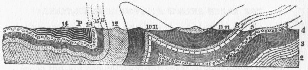

[Intangible Textual Heritage](../../index)  [Atlantis](../index.md) 
[Index](index)  [Previous](rag33)  [Next](rag35.md) 

------------------------------------------------------------------------

### CHAPTER VII.

##### THE EARTH STRUCK BY COMETS MANY TIMES.

IF the reader is satisfied, from my reasoning and the facts I have
adduced, that the so-called Glacial Age really represents a collision of
the earth with one of these wandering luminaries of space, the question
can not but occur to him, Was this the first and only occasion, during
all the thousands of millions of years that our planet has been
revolving on its axis and circling around the sun, that such a
catastrophe has occurred?

The answer must be in the negative.

We find that all through the rocky record of our globe the same
phenomena which we have learned to recognize as peculiar to the Drift
Age are, at distant intervals, repeated.

The long ages of the Palæozoic Time passed with few or no disturbances.
The movements of the earth's crust oscillated at a rate not to exceed
one foot in a century.\[1\] It was an age of peace. Then came a
tremendous convulsion. It has been styled by the geologists "the epoch
of the Appalachian revolution."

"Strata were upraised and flexed into great (olds, some of the folds a
score or more of miles in span. Deep fissures were opened in the earth's
crust," like the fiords or great rock-cracks which accompanied the
Diluvial or Drift Age. "Rocks were consolidated; and over some parts
sandstones and shales were crystallized into gneiss,

\[1. Dana's "Text-Book," p. 150.\]

{p. 432}

mica-schist, and other related rocks, and limestone into architectural
and statuary marble. Bituminous coal was turned into anthracite in
Pennsylvania."\[1\]

I copy from the same work (p. 153) the following cut, showing the extent
to which the rocks were crushed out of shape:

SECTION ON THE SCHUYLKILL, PENNSYLVANIA.

P, Pottsville on the coal-measures; 2, Calciferous formation; 3,
Trenton; 4, Hudson River; 5, Oneida and Niagara; 7, Lower Helderberg; 8,
10, 11, Devonian; 12, 13, Subcarboniferous; 14, Carboniferous, or
coal-measures.

These tremendous changes were caused by a pressure of some kind which
came from the east, from where the Atlantic Ocean now rolls.

"It was due to a *lateral* pressure, the folding having taken place just
as it might in paper or cloth under a lateral or *pushing*
movement."\[2\]

"It was accompanied by *great heat* which melted and consolidated the
rocks, changed their condition, drove the volatile gases out of the
bituminous coal and changed it into anthracite, in some places altered
it to graphite, as if it had been passed through a furnace."\[3\]

It also made an almost universal slaughter of all forms of life:

"The extermination of life which took place at this time was one of the
most extensive in all geological history; . . . no fossils of the
Carboniferous formation occur in later rocks."\[4\]

\[1. Dana's "Text-Book," p. 152.

2\. Ibid., p. 155.

3\. Ibid., p. 155.

4\. Ibid., p. 157.\]

{p. 433}

it was accompanied or followed, as in the Drift Age, by tremendous
floods of water; the evaporated seas returned to the earth in wasting
storms:

"The waters commenced the work of denudation, which has been continued
to the present time."\[1\]

Is not all this a striking confirmation of my theory?

Here we find that, long before the age of man, a fearful catastrophe
happened to the earth. Its rocks were melted--not merely decomposed, as
in the Drift Age,--but actually melted and metamorphosed; the heat, as
in the Drift Age, sucked up the waters of the seas, to cast them down
again in great floods; it wiped out nearly all the life of the planet,
even as the Drift Age exterminated the great mammals; whatever drift
then fell probably melted with the burning rocks.

Here are phenomena which no ice-sheet, though it were a thousand miles
thick, can explain; here is heat, not ice; combustion, not cold; and yet
all these phenomena are but the results which we have seen would
naturally follow the contact of the earth with a comet.

But while, in this particular case, the size of the comet, or its more
fiery nature, melted the surface of the globe, and changed the very
texture of the solid rocks, we find in the geological record the
evidences of repeated visitations when Drift was thrown upon the earth
in great quantities; but the heat, as in the last Drift Age, was not
great enough to consume all things.

In the Cambrian formation, conglomerates are found, combinations of
stones and hardened clay, very much like the true "till."

In the Lower Silurian of the south of Scotland, large blocks and
bowlders (from one foot to five feet in diameter)

\[1. Dana's "Text-Book," p. 156.\]

{p. 434}

are found, "of gneiss, syenite, granite, etc., none of which belong to
the rocks of that neighborhood."

Geikie says:

"Possibly these bowlders may have come from some ancient Atlantis,
transported by ice."\[1\]

The conglomerates belonging to the Old Red Sandstone formation in the
north of England and in Scotland, we are told, "closely resemble a
consolidated bowlder drift."\[2\]

Near Victoria, in Australia, a conglomerate was found *nearly one
hundred feet in thickness*.

"Great beds of conglomerate occur at the bottom of the Carboniferous, in
various parts of Scotland, which it is difficult to believe are other
than ancient morainic *débris*. They are frequently quite unstratified,
and the stones *often show that peculiar blunted form which is so
characteristic of glacial work*."\[3\]

Professor Ramsay found well-scratched and blunted stones in a Permian
conglomerate.

In the north of Scotland, a coarse, bowlder-conglomerate is associated
with the Jurassic strata. The Cretaceous formation has yielded great
stones and bowlders. In the Eocene of Switzerland, erratics have been
found, some angular and some rounded. They often attain great size; one
measured one hundred and five feet in length, ninety feet in breadth,
and forty-five feet in height. Some of the blocks consist of *a kind of
granite not known to occur anywhere in the Alps*.

Geikie says:

"The occurrence in the Eocene of huge ice-carried blocks seems
*incomprehensible* when the general character of the Eocene fossils is
taken into account, for these have a somewhat *tropical* aspect. So,
likewise, the appearance of ice-transported blocks in the Miocene is a
*sore puzzle*,

\[1. "The Great Ice Age," p. 478.

2\. Ibid., p. 479.

3\. Ibid.\]

{p. 435}

as the fossils imbedded in this formation speak to us of tropical and
sub-tropical climates having prevailed in Central Europe."\[1\]

It was precisely during the age when a warm climate prevailed in
Spitzbergen and North Greenland that these erratics were dropped down on
the plains of Italy!

And, strange to say, just as we have found the Drift-deposits of Europe
and America unfossiliferous,--that is to say, containing no traces of
animal or vegetable life,--so these strange stone and clay deposits of
other and more ancient ages were in like manner unfossiliferous.\[2\]

In the "flysch" of the Eocene of the Alps, few or no fossils have been
found. In the conglomerates of Turin, belonging to the Upper Miocene
period, not a single organic remain has been found.

What conclusion is forced upon us?

That, written in the rocky pages of the great volume of the planet, are
the records of *repeated visitations from the comets* which then rushed
through the heavens.

No trace is left of their destructive powers, save the huge,
unstratified, unfossiliferous deposits of clay and stones and bowlders,
locked away between great layers of the sedimentary rocks.

Can it be that there wanders through immeasurable space, upon an orbit
of such size that millions of years are required to complete it, some
monstrous luminary, so vast that when it returns to us it fills a large
part of the orbit which the earth describes around the sun, and showers
down upon us deluges of *débris*, while it fills the world with flame?
And are these recurring strata of stones and clay and bowlders, written
upon these widely separated pages of the geologic volume, the record of
its oft and regularly recurring visitations?

\[1. "The Great Ice Age," p. 480.

2\. Ibid., p. 481.\]

{p. 436}

Who shall say? Science will yet compare minutely the composition of
these different conglomerates. No secret can escape discovery when the
light of a world's intelligence is brought to bear upon it.

And even here we stumble over a still more tremendous fact:

It has been supposed that the primeval granite was the molten crust of
the original glowing ball of the earth, when it first hardened as it
cooled.

But, lo! the microscope, (so Professor Whichell tells us,) reveals that
this very granite, this foundation of all our rocks, this ancient
globe-crust, is itself made up of sedimentary rocks, which were melted,
fused, and run together in some awful conflagration which wiped out all
life on the planet.

Beyond the granite, then, there were seas and shores, winds and rains,
rivers and sediment carried into the waters to form the rocks melted up
in this granite; there were countless ages; possibly there were animals
and man; but all melted and consumed together. Was this, too, the result
of a comet visitation?

Who shall tell the age of this old earth? Who shall count the ebbs and
flows of eternity? Who shall say how often this planet has been
developed up to the highest forms of life, and how often all this has
been obliterated in universal fire?

The earth is one great tomb of life:

        "All that tread  
The globe are but a handful to the tribes  
That slumber in its bosom."

In endless series the ages stretch along--birth, life, development,
destruction. And so shall it be till time is no more.

{p. 437}

------------------------------------------------------------------------

[Next: Chapter VIII. The After-Word](rag35.md)
