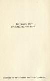

  
[Intangible Textual Heritage](../../index)  [Atlantis](../index.md) 
[Index](index)  [Next](smoa01.md) 

------------------------------------------------------------------------

  
*Selestor's Men of Atlantis*, by Clara Iza von Ravn, \[1937\], at
Intangible Textual Heritage

------------------------------------------------------------------------

# SELESTOR'S MEN OF ATLANTIS

###### By

### CLARA IZA VON RAVN

 

#### The Christopher Publishing House

#### Boston, U. S. A.

#### \[1937\]

Scanned, proofed and formatted by John Bruno Hare at Intangible Textual
Heritage, Dec. 2008. This text is in the public domain in the US because
its copyright was not renewed in a timely fashion at the US copyright
office as required by law at the time.

  [  
Click to enlarge](img/jacket.jpg.md)  
Dust Jacket  

  [  
Click to enlarge](img/cover.jpg.md)  
Front Cover  

  [  
Click to enlarge](img/title.jpg.md)  
Title Page  

 
[  
Click to enlarge](img/verso.jpg.md)  
Verso  

### DEDICATION

To the memory of my dear brothers—

Edgar Alfred Tibbets, whose great learning and patience in instructing
me has been my incentive to accomplish, and Frank William Tibbets, who
with tender, and never failing sympathy endeavored to smooth for me
life's rugged path.

Text on back of dust jacket.

Pictured in Majestic and Poetical Language

The author, in private life the Baroness von Ravn, has written poetry
and plays from girlhood; but her most serious work preceding this
appeared a number of years ago, and was entitled "The Scribe of a Soul,"
for which Professor van der Naillen, noted scientist, and associate of
[Flammarion](errata.htm#0.md), after reading her manuscript, wrote the
introduction. This will give an idea of the scientific value of the
present volume, although not of its thrilling interest, which can only
be found in reading its amazing pages.

"Selestor's Men of Atlantis," as the title indicates, is about Atlantis,
that great and ancient continent said to have been in the Atlantic, the
physical existence of which, beneath the sea, has been, we believe,
quite completely established by scientists. Many books have been written
about this land of semi-myth, but none from the standpoint of this
writer. In her foreword the author says:

"The wonderful amount of material, especially fossils of different
kinds, relating to the island of Atlantis, that were gathered by the
Schliemanns, father and son, noted archeologists who devoted their lives
to proving that such an island really did exist, to which other
scientists working independently or cooperating with the Schliemanns,
have added their achievements to the proof.

"In his majestic and poetical language Selestor, to whom we are indebted
for the contents of this book, has pictured the highly civilized state
of Atlantis’ inhabitants, that in several sciences were farther advanced
than our nation is today."

Selestor's description of the destruction of Atlantis, of the activities
of the people on the morning of the day it sank into the deep, is the
story of a tragedy beyond telling. After a weird description of the
fright of men and women who knew the doom that was coming, the chapter
closes with these words of Selestor's:

"The quivering mountain sank—an inch—the measure of a man's broad palm—a
fathom! Then a quiver and a roar marked moment when the land that mocked
the sun went down! Atlantis, thou hast sunk, but shall arise, a slimy
thing of ocean, still to bear much beauty, offering riches to the world
which hath not known thy fate."

This is a book that will be of equal interest to the scientist, the
historian, the student in all fields, and the reader for unusual
entertainment.

Cloth, Price $2.00

THE CHRISTOPHER PUBLISHING HOUSE, Boston

------------------------------------------------------------------------

[Next: Foreword](smoa01.md)
