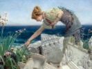

  
[Intangible Textual Heritage](../../index)  [Atlantis](../index) 
[Index](index)  [Previous](smoa10)  [Next](smoa12) 

------------------------------------------------------------------------

  
*Selestor's Men of Atlantis*, by Clara Iza von Ravn, \[1937\], at
Intangible Textual Heritage

------------------------------------------------------------------------

p. 68

### CHAPTER IX

*An ancestress of the Assyrians*.

To barter power was deemed a sudden freak of madness. Seldom was the
mood so turned, but if, perchance, this did occur the one so smitten
with greed and vile deceit was cast from chamber of the council,
stripped of robe and beaten as a slave in sight of all the populace,
then sent afar.

But one such case in many hundred years occurred, and none did know of
the intention or deceit till fell a tragedy that woke the horror of the
island people—held their indignation long. And yet we do admit,
unwillingly, that great events, or race of people, knowledge of new
countries, spring from crimes of men—from wrong to kind.

And such events occurred when fair Atlantis reared her head above the
sea: a wondrous land with power over many lands afar which she did
people from her exiles. Peopled she the wastes and forests deep which
lay full many thousand miles away.

The story of the violation of the laws of Government was on the tablets
graven long before the island sank, yet in its infancy the tale seemed
but a prophecy, which none saw fulfilled, the peopling of vast hills and
wastes by one—an outcast and his victim—bride yet not a bride.

She—the victim, too, of Fate and Falsity whose offspring filled tents
upon the hills nor sought the plains where dwelt a fairer race until,
grown strong, they swept in might one day and conquered. Set their mark
in later day on temple wall and carven

p. 69

gods, so massive that a wonder of the world men later did behold in
viewing what the hands of their descendants wrought. And this the graven
tablets told:

"There once dwelt in Atlantis a maiden whom they called "the Fair" for
beauty was her dower. And she was bartered for a seat of power in the
great Council Chamber, where the king upheld the law by signing with a
word each edict passed that met his favor.

He—the husband—who so wily won the maid, was not in his first youth nor
yet his second. Hair of snowy hue clung round a brow no length of
knowledge stamped, and eyes were dulled with wine, and form, which God
made perfect to contain a soul, was warped with foul excess.

Him they called "The great and rich Bahanan El." And sons had he and
daughters that the state had named, and others who bore no rank or name
save that their mothers—outcasts from the pure—gave unto them.

One son—Batisis—looked upon his father's wife—the lily pale and dark
eyed Attoline—and swore he would espouse her at his father's death.
"For," spake he. "Matter not her age when she is freed from that foul
lord who brought to life the atom whence I sprang, I still shall love,
and thus she shall be mine."

Alas for Attoline who drooped and sighed with dread of that gross
presence which they "husband" called and, anger’d, looked not on her
father's face when he appeared at feast or in the hall, and on her
mother's neck did weep, and moan and pray that death would come and
bring her quick relief.

One day she wandered where the sands met sea and chanced to face the
youth who swore she should be his by law of Right. And, seeing Attoline,
did

p. 70

read the creed of love and so forgot that wives have not the right to
love, save him who giveth shelter, name and gold and state, as law of
man proscribeth.

Law of God forbids the soul to sully with material gifts its heritage of
peace.

Thus spake the youth: "I long have known thy face as one that angels
stamped with perfect law, but thy sweet voice, alas; I ne’er have heard.
Speak but one word! Thy slave shall drink the tone long after he is
banished from thy sight."

"Speak not!" she cried, in voice her slaves might hear. Then lower:
"Speak not of thy departure, for the sun will hide its face when thou
shalt pass from view!"

He spoke: "Attoline, I have loved thee long and well. Speak but the word
and at thy feet I lie like spaniel fawning for a loving look—a creature
trodden on yet still alive to one kind word from lips that hold the
power to doom to death!"

One glance she gave from eyes whose fire was hid by fringe of jetty
lash, and rose his heart with courage.

"Speak, sweet. Shall we depart unto that friendly shore where none may
know thy state, or wealth, or past, and humbly live with love our
guiding star?"

She spake: "I go. For life is black indeed within the palace where the
low-browed lord doth rule and seek to win to his gross soul the love I
would withhold for one more noble. Him I know in thee."

"Farewell," breathed he, "for but one hour! and we again shall meet
beside the water. Seek thou this spot marked by yon boulder huge and
grey. But dead it seems yet it holds in its heart a secret chamber where
the torch burns that lighteth me upon the water when by night I roam
abroad in galley seeking prey of sea.

"For I am of the people who must wrest from

p. 71

men more blest the bread to nourish life, the goods to cover, gems to
deck for fête and gifts to buy the god's approval. Thus I speak that
thou mayest know I make no boast of goods, of name or state that men of
earth do prize; yet in my breast my heart beats high with hope and
Courage calleth me her son indeed!"

"And I," she faltered. "Well thou knowest my state; yet will I toil in
cot, as toil the kind who envy me, ere I return to his embrace—the
foul-souled one who bartered fortune's smiles to him—my father, for my
form, my life, my hopes, for all thou namest as gifts the gods do send.

"Oft have I thrust my hands to heaven and cried unto the gods, and
offered gifts the poor would fortunes call, yet not one hope gave they
of my release save what thou swearest. Hark! my maids speak: He cometh!
Lost indeed is hope and happiness!"

The dark rock closed around him. Magic art it seemed to that fond soul
whom love had found; and to her maids, who vied in giving service to the
one who ever held them equal in the best, she turned.

Bahanan came with anger on his brow, "To whom speakest thou, my wife?"
and she replied: "I spake no word. I looked reproof on him who called my
name, as thy wife, honored of the people, should."

Her grace of form, her glance of tenderness, so rare, disarmed suspicion
and so stilled the demon of the jealous god within his breast, he spake:
"I trust thee fully. Take thy way," and, turning, left her, for affairs
did call.

The gay throng passed and laughter filled the ear.

The gay throng heeded not the lover's meeting where the shadow fell from
tall, oared, galley, nor the veiled form that melted to the clasp of one
bold water-messenger or chief. Afar they sped ere that

p. 72

dread day of wrath had swept Atlantis from the world's great chart. Afar
in safety, for the port was gained ere sea was swept by waves of
mountain height.

And she—the beautiful, the fond, the happy at the last, bore sons and
daughters to her loved lord, and did become ancestress of that great
race which called Assyria home.

------------------------------------------------------------------------

[Next: Chapter X. The navy of Atlantis. Minerals of the island and
theories regarding them held by the mineralogists of that day and
country.](smoa12)
