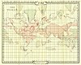
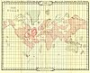
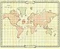

  
[Intangible Textual Heritage](../../index)  [Atlantis](../index) 
[Index](index)  [Previous](soattl)  [Next](soa00) 

------------------------------------------------------------------------

 

# Theosophical Maps of Atlantis

[  
Click to enlarge](img/a01.jpg)  
Map 1: Atlantis at its Prime  

[  
Click to enlarge](img/a02.jpg)  
Map 2: Atlantis in its Decadence  

[  
Click to enlarge](img/a03.jpg)  
Map 3: Ruta and Daitya  

[  
Click to enlarge](img/a04.jpg)  
Map 4: Poseidonis  

 

------------------------------------------------------------------------

[Next: Preface](soa00)
