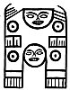
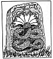

  
[Intangible Textual Heritage](../../index)  [Atlantis](../index) 
[Index](index)  [Previous](ssm05)  [Next](ssm07) 

------------------------------------------------------------------------

p. 56

### CHAPTER III

# SYMBOLS OF THE DEITY AND HIS ATTRIBUTES

SACRED SYMBOLS.--To make the Sacred Symbols as intelligible as possible
to my readers I am dividing them into classes. I shall start with the
highest, most Sacred Symbol of all, the Sun as Ra symbolizing the Deity.
It is the collective symbol representing the Deity with all His
attributes, and the only symbol that does so.

Next will be given symbols of His various attributes. Although I have
narrated the Tale of the Creation in my first book, *The Lost Continent
of Mu*, I am repeating it in this one for two reasons. First:--All
symbols connected with the Creation were looked upon as sacred, and were
used in religious ceremonies. Second:--In the version I am now giving I
am extending it slightly, which makes it come nearer to the original
version.

This will be followed by symbols used in religious teaching.

The following chapter will be the compound Sacred Symbols, with the
changes from their beginnings.

Decipherings of all symbols are given either accompanying the symbol or
in "The Lost Continent of Mu."\[paragraph continues\]

p. 57

This being the third book of a trilogy on Mu, I have not repeated in it
various decipherings, but have referred to "The Lost Continent," where
they will be found.

[  
Click to enlarge](img/05700.jpg)  
*The Sun*  

SYMBOLS OF THE DEITY.--*The Sun* was the *Monotheistic Symbol* of the
Deity. As the monotheistic or collective symbol it was called RA, and
being the *monotheistic* symbol it was looked upon as the most Sacred of
all the Sacred Symbols.

While each attribute of the Deity, in several cases, had various symbols
expressing it, there was only one monotheistic or collective symbol.

p. 58

During the early history of man there were no gods but the *One Great
Infinite*. The gods crept into religious ceremonies later. The beginning
of the gods was when the Four Great Creative Forces were given the name
of gods.

Scientists and archaeologists, not comprehending the ancient form of
writing and symbolisms, have unfortunately spread broadcast the error
that the ancients worshipped the Sun, when the fact is that they
regarded the Sun *as a symbol only*; and when they dedicated a temple to
the Sun, *it was to the Almighty* as either the Deity, the One Lord God,
or to the Almighty as His male attribute in creation.

### THE ATTRIBUTES OF THE DEITY

THE CREATOR'S TWO PRINCIPLES.--This is one of the most interesting of
the ancient conceptions. It arose from the assumption that to produce
anything, male and female were required; so that gave the Creator the
two principles--the sun symbolizing the male and the moon the female.

Symbols were then designed to express the different phases, if it can be
so called. First a symbol was devised to express the dual capacity; this
they called *Lahun*   the
English translation of which being "two in one, one in two" and by
extension "all in one and one is all." The glyph Lahun is a circle with
a bar drawn through its center. The Mexican Tablet No. 150 shows the Sun
symbolizing the male principle and the same cut

p. 59

shows the moon symbolizing the female principle.

It was quite usual among the ancients, when erecting temples, to build
two near each other. The larger one was dedicated to the Sun as the male
principle and the

[  
Click to enlarge](img/05900.jpg)  
*No. 150*  

smaller to the Moon as the female. The lines on Tablet No. 150 read:
"The Creator created one. One became two and two produced three from
whom all mankind descended." The top face symbolizes the Sun; the lower
face without rays the moon.

Isis: The Egyptians were not content with having the Moon symbolize the
female attribute of the Creator, so they devised a symbol for the moon
which they called Isis; thus they made a symbol to symbolize a symbol.

p. 60

The intricacies of what Isis was, beyond symbolizing Nature, and being
the executrix of God's commands, was only understood by the Egyptians
themselves, and they were not all in accord on the subject.

In ceremonies and processions Isis wore as her headdress a moon with a
pair of cow's horns. With the Egyptians, cow's horns symbolized
motherhood. The goddess Sati of Upper Egypt, and the goddess Hathor both
had cow's horns in their headdress. Hathor had a

[  
Click to enlarge](img/06000.jpg)  
*Isis*  

moon also like Isis. It appears to me that Sati, Hathor and Isis all
symbolized the same thing, only they were represented in slightly
different vestments.

The old Oriental Empires followed the Egyptians in making a woman
symbolize the moon.

The Babylonians had Astoreth. The Hittites had \[paragraph continues\]

p. 61

Hepet. The Greeks rejoiced in their Aphrodite, and the Romans in Venus.

Papyrus Ani: "In early days, before priests froze the thoughts of man
into blocks of stone and built of them shrines to a thousand gods, many
held that there was only One God."

THE DEITY AS THE CREATOR.--The Creation was one of the principal themes
of the Ancients. In this they clearly distinguished between the Creator
Himself and the work consummated, making a prominent dividing line in
their symbols. I shall first take the symbols of the Deity as the
Creator. The ancients looked upon the power of Creation as one of the
attributes of the Almighty.

The ancients had numerous figures, always conventional, symbolizing this
attribute. Apparently the most popular were adorned serpents. Many
designs of these serpents are found in ancient carvings and literature.

Two of these serpents are especially prominent. One was the cobra,
called in the Motherland, Naga. This one had *seven* heads. This number
was given to correspond with the seven stages of creation, the seven
mental planes, et cetera.

The seven-headed serpent originated in Mu and was there called *Naga*.
In various Mu colonies it received added names. judging from the
geographical position of the colonies where we find it, I think that the
lower western half of Mu was where it was used. The people using this
symbol were called after it--the Nagas.

p. 62

 

[  
Click to enlarge](img/06200.jpg)  
*Angkor Thom*  

[  
Click to enlarge](img/06201.jpg)  
*Anarajapoora--Ceylon*  

 

p. 63

The other serpent was covered with feathers instead of scales. This also
originated in the Motherland and was there called *Quetzacoatl*. It is
still to be found in the impenetrable jungles and swamps of Yucatan and
Central America, but extremely rare. During all of my explorations I
have only seen one, and I never want to see another. It is the most
venomous serpent ever known on earth. Its location was apparently along
the northern half of the Motherland. One tribe who made Quetzacoatl
their symbol for the Creator, like the Nagas took their name from it,
being known as--the Quetzals. The Quetzacoatl varied in design among
these people.

One of the most noteworthy conventional designs of the Quetzacoatl is
the *Dragon* so prominent in the northern parts of eastern Asia today.
In this effort the ancients carried the design to the extreme of
conventionality, for they endowed it with a crest, which it had not,
wings which it had and legs which were long instead of mere claws or
feet. They not only gave it the wherewithal to fly, but to run also,
which it could not do.

The Pueblo Indians of Arizona and New Mexico bestowed on it the name of
the bearded serpent as well as Quetzacoatl.

The Quiche Mayas, in their sacred book the *Popal Vuh*, refer to it as
follows:--

"All was immobility and silence in the darkness, in the night; only the
Creator, the maker, the dominator, *the Serpent covered with feathers*,
they who engender,

p. 64

 

[  
Click to enlarge](img/06400.jpg)  
Narayana  

 

p. 65

they who create, they are surrounded by green and blue, their name is
Gucumatz."

The name Gucumatz here does not refer to the Creator Himself but to His
Four Great Creative Forces, hence they are referred to as "they."

 

I found in a Nootka Indian tableau a serpent having a plume on his head,
unquestionably one of the conventional designs of Quetzacoatl. Although
the names of all other objects in the tableau were given, that of the
Serpent was omitted by these British Colombian Indians.

As *Sacred Symbols of the Creative Powers*, these were all held in great
reverence. They stood next to the Sun--the most sacred symbol of all.

I also find a feathered serpent in Egypt. In the tomb of Pharaoh Seti I
is to be seen a painting of a serpent having three heads, four legs of
man and *feathered wings*.

THE SACRED FOUR.--The Sacred Four is among the oldest religious
conceptions. I found it in the Sacred Inspired Writings of Mu.

The Sacred Four are the Four Great Primary Forces,

p. 66

coming from the Almighty. They first brought order out of chaos
throughout the Universe and then, on command, created the Universe with
all the bodies and life therein. When creation was completed they were
given charge of the physical universe. Today the Universe and all
physical life is controlled by these Forces.

[  
Click to enlarge](img/06600.jpg)  
*An ancient Hindu picture*  
The god Vishnu supported by the Serpent Ananta, having seven heads, the
symbol of the Seven Commands of Creation.  

The ancients held these Forces in such reverence that nearly if not all
of the very early temples were dedicated to them as the Creator's
executors. Most of the temples, I find, were subsequently dedicated to
the Sun and Moon, the Sun Temple symbolizing the male principle of the
Creator and the Temple of the Moon the female principle. Still later, I
find temples dedicated

p. 67

to Seven Great Commands of Creation and symbolized by an adorned or
conventional Serpent.

From the beginning various symbols for the Sacred Four began to creep
in. Also a plurality of names were given them at different times by
various people. I have a collection of over fifty names given to them.
Among them are: the Four Great Ones, the Four Powerful Ones, the Four
Great Kings, the Four Great Maharajas, the Four Great Builders, the Four
Great Architects, the Four Great Geometricians, the Four Great Pillars;
and today we call them the Four Archangels.

Somewhere about 6,000 or 7,000 years ago, a confusion was caused by
giving the Pillars *Keepers*, which were called Genii. This addition of
keepers for the Pillars must have occurred after the destruction of Mu,
as I do not find them in any writings of the First Civilization. The
Pillars were placed at the Four Corners of the earth to teach ancient
man the Four Cardinal points. The earth's symbol is a four-sided square,
which when referring to anything but the Cardinal points is shown with
sides, top and bottom parallel, thus 
 and when associated with the Cardinal points or
referring to them is placed thus 
 so that the points shall be in their true position.
The crossing of these two squares was used by the Egyptians to symbolize
the eight Roads to Heaven. 

The writings about the Genii are so obtuse and so mixed up that I cannot
look upon them as anything but

p. 68

a camouflage for the Pillars, consequently the changing of the name from
the Sacred Four to Genii is a change of vestment only.

BIRDS SYMBOLS OF THE SACRED FOUR.--Birds as symbols play an important
part in the ancient religious conceptions but what they actually
symbolized remained for the Mexican Tablets to tell us. We have an
Egyptian record in their ancient god Seb, but what is said about him by
the Egyptians is so purely symbolical, that without other evidences, the
layman could hardly be brought to understand.

 

THE GOD SEB: *Egyptian Book of the Dead*. Here the god Seb is called
"the Father of the Gods," "the Bearer of the Gods" and "the Leader of
the Gods." Seb was also called "the Great Cackler which produced the
Mundane Egg." He is spoken of as having "laid the egg out of which the
earth and all therein came forth." It further says: "I protect the egg
of the Great Cackler, if I thrive it thrives, if I live it lives, if I
breathe the breath of air it breathes." The god carries on his head the
figure of a goose. Seb was the Egyptian name for this particular species
of goose.

 

   
The Hittite Bird Symbol  
Courtesy of American Weekly

 

p. 69

The foregoing speaks of both the Creator and the Four Great Creative
Forces emanating from Him. As hitherto stated, "the Gods" were the
Sacred Four, thus showing that the old Egyptians knew perfectly well
what the Origin of Forces is.

Hawaiian Tradition: Ellis' Polynesian Research. "In the Sandwich Islands
there is a tradition saying that in the beginning there was nothing but
water when a big bird descended from on high and laid an egg in the sea.
The egg burst and Hawaii came forth."

It was Mexico, however, that has given us the clinching proof of what
bird symbols of the ancients really signified. Among Niven's collection
of Mexican Tablets, there are over fifty showing birds. I have selected
one to decipher, to tell what they all mean.

 

Mexican Tablet No. 1086: Those who have read my two books--The Lost
Continent of Mu and The Children of Mu will readily see the meaning of
two glyphs which I here point out in the bird figure.

The eye of the bird   is
the Uighur form of the monotheistic symbol of the Deity.

p. 70

Projecting from the bird's breast is the hieratic letter H in the
alphabet of Mu   which was
among all ancient people [was](errata.htm#1) the alphabetical symbol for
the Four Great Forces. The body of the bird is in the shape of a
pod--symbol for the home of the primary forces. The various lines in
connection with the pod are old esoteric Uighur temple writings.

This bird therefore symbolizes the Creative Forces of the Deity and the
forces are shown as emanating from or coming out of the Deity. By
extension, this figure reads: A symbol of the Almighty showing the four
Great Primary Forces coming out of Him.

Easter Island: On this little island have been found various bird
symbols and conventional animals with birds' heads. One has an egg in
its claw, which seems to show that the ancient Easter Islanders had the
same conceptions as the Hawaiians.

Legends of some of the North American Indians show that bird symbols are
their favorite symbol for the Creative Forces. Their name for this bird
is the Thunder Bird.

Birds appear among the ancient records of the Babylonians, Chaldeans and
Hittites as one of their symbols of the Sacred Four--The Creative
Forces.

The Assyrian Genii included a bird.

The Egyptians included a bird.

The Bible also includes a bird.

An Alaskan Totem Pole: A very old chief of the tribe

p. 71

of Haiden Indians, Queen Charlotte Island, Alaska, to which a totem pole
belongs has stated: "The winged creature which crowns the totem pole is
the Thunder Bird and represents the Great Creator." It would have been
more correct if he had said: "Represents the Great Creative *Forces*."

I am under the impression that the winged circle got its inspiration
from a bird symbol. This ancient conception remains dear to us; for
whenever heavenly beings are depicted, they are shown with wings like a
bird.

All the various bird symbols, from so many widely diversified spots,
express the same conception, and it seems to me that, different as they
are in appearance, they must have a common ancestor.

CROSS SYMBOLS OF THE SACRED FOUR.--The Specialized Cross was one of the
figures used by the ancients to denote the Sacred Four--the Four Great
Primary Forces. The cross was always a favorite symbol among the
ancients probably because they found it more expressive than any other
figure. Studying and writing about the Sacred Four appears also to have
been an absorbing theme with them. Today the Pueblo Indians of Arizona
and New Mexico refer to the Sacred Four as "Those above."

The mother of all crosses was plain with four arms of equal length. I
first find it in the Sacred and Inspired Writings as the symbol of The
Sacred Four--The Great Creative Forces.

Mexican Tablet No. 672: Is an exact duplication of

p. 72

the cross heretofore mentioned as appearing in the Oriental copies of
the Sacred Inspired Writings of Mu. As time went on this cross evolved.
It developed into

   
*No. 672*

four distinct lines, becoming more intricate al I the time.

1\. The end of the first line and the shortest, I have called the
Pyramid Cross.

2\. The end of the second line is a cross formed of four loops, having
the symbol of the Deity in the center. These I have called the Loop
Crosses.

3\. The end of the third line is the well-known Swastika, known as "the
good luck symbol."

4\. The end of the fourth line was the winged circle. The ancients
rioted in designs for this figure; the Egyptians excelling others in
beautiful devices and marvelous artistry.

Besides these four main lines, there were many single special designs.

THE PYRAMID CROSS. LINE 1.--A group of Crosses among Niven's collection
of Mexican tablets is especially interesting. I have called them the
Pyramid Crosses because they are designed on the lines of a

p. 73

pyramid. They are the cosmogony of a pyramid illustrated by a cross.

The four arms are composed of four triangles corresponding with the four
sides of a pyramid.

[  
Click to enlarge](img/07300.jpg)

The points of these triangles are covered with the monotheistic symbol
of the Deity.

The base of a pyramid is square; the four triangles brought together
form a square. The pyramid is built on astronomical lines; so is the
Cross.

These Crosses were drawn before the submersion of Mu. Were any pyramids
built before that date? I know of none. Were pyramids evolved out of
these Crosses?

Fig. A. Is the base of a pyramid divided into four triangles.

p. 74

Fig. B. Dotted lines within the circle show the points of the triangles,
corresponding to the top of a pyramid.

Fig. C. Shows the Cross with the monotheistic symbol of the Deity, Naga
Pattern, crowning the points.

Fig. D. Is the same as Fig. C with the exception that the Uighur
monotheistic symbol crowns the points.

Fig. E. The point of the triangle covered by the monotheistic symbol.
The following is written on these tablets:

"The Four Great Pillars," "The Sacred Four," "The Four Great
Architects," "The Four Great Builders" and "The Four Powerful Ones."

No. 777 confirms the fact that the four triangles forming the Cross are
the Sacred Four because the symbol within the triangle reads: "Pillar."
The four triangles with their inscriptions therefore read: "The Four
Great Pillars"--one of the names given to the Sacred Four.

During the life of Mu it was taught that the Four Great Pillars
sustained the Universe.

After the destruction of Mu the Universe was forgotten and the earth
given the honor of anchoring and sustaining the Pillars. A pillar was
placed at each of the Cardinal Points:--North, South, East and West.

THE LOOPED CROSSES. LINE 2.--The evolution of this line started with the
plain cross shown in the Sacred Writings and ended with the Deity being
added to four loops symbolizing the Four Great Forces, with the names of
the Forces given within the loop.

p. 75

   
*The evolution of the Looped Crosses*

Fig. 1. The Original Cross.

Fig. 2. The oldest form of Looped Cross I have as yet found. It is very
ancient from the fact that the symbol of the Deity is of the ancient
pattern and not specialized. It is a question in my mind whether a link
is not missing between Fig. 1 and Fig. 2; the change appears to me to be
too radical for the ancients.

Sometime during the teachings of primitive man trouble apparently began
to accumulate over the circle, which was used to symbolize various
things. It was then decided to specialize the circle which symbolized
the Deity. The Nagas added a dot in the center and the Uighurs an inner
circle. Fig. 2 has neither of these specializations.

Fig. 3a. Is the same as Fig. 2 except that Fig. 3a
has the Naga pattern of the symbol for the Deity.

Fig. 3b. Is the same as Fig. 2 except that this cross has the
Uighur pattern for the symbol of the Deity.

Fig. 4. This figure shows the last addition to the Looped Crosses.
Within the arms of the loops the names of the Force are written, in this
case the name of the Force being "builder" 
 (a two-sided square). The

p. 76

loop is a symbol that a certain divine order has been carried out. The
Force has returned to the giver of the command.

[  
Click to enlarge](img/07600.jpg)  
*A group of representative Looped Crosses taken from Niven's Mexican
Tablets*  

Various other Crosses were used by the ancients in their writings, and
each one had a different meaning. They are however easily
distinguishable from the Crosses symbolizing the Sacred Four. The
original Cross of the Sacred Four was a solid plain cross; all the
others are open crosses.

 

1\. This Cross reads *U-luumil* which means "the

p. 77

Land of," "the Country of," "the Empire of," et cetera.

2\. Another Cross is formed by four lines drawn across each other.

3\. Sometimes but not often we find the ends of this Cross connected.
The meaning of it is "slowly," "little by little" "slow progress," et
cetera.

THE SWASTIKA. LINE 3.--The Swastika was originally associated with good
luck from being the favorite symbol of the Sacred Four who were in
charge of the physical Universe and therefore the means by which all
good things came to man. While the Swastika is one of the oldest and
most universal of symbols, being found throughout the ancient world, its
origin and meaning have been lost for the past 3,500 years. The loss
occurred when the fierce Brahminical priesthood of India persecuted and
drove their teachers, the mild and highly educated Naacals, into the
snow-capped mountains of the North.

I found the origin and meaning of this symbol:

First: In the Naacal writings which were brought from the Motherland and
for thousands of years, probably, had lain dust covered and almost
forgotten in the archives of Oriental temples and monasteries.

Second: Confirmed by the Mexican Stone Tablets.

Fate, however, ordained that their coverings of dust and ashes of
thousands of years should be removed and their secrets be once more
known to the world.

The "good luck symbol" is a very appropriate name for the Swastika,
since it represents the physical welfare

p. 78

of man and all the Universe. The Swastika evolved from the plain
original Cross.

 

The Evolution of the Swastika:

Fig. 1. Is the [original](errata.htm#2) plain Cross.

Fig. 2. Here we have a circle added, surrounding the Cross. The Circle
is the symbol of the Deity. The Cross is shown within the Deity;
therefore it is apart of Him, emanating from Him. This accounts for the
ancients calling their works: "the Commands of the Creator," "His
Desires," "His Wishes," et cetera. The Forces symbolized by the Cross
were the executors of His commands. With the circle drawn around the
Cross it became a composite glyph symbolizing the ancient's full Godhead
of Five--*i. e.* The Deity and His Four Great Primary Forces, the Four
original Gods.

Fig. 3. Is a glyph found among the North American cliff writers. The
arms of the Cross extend beyond the circle.

Fig. 4. The next step was to project the arms beyond the circle and turn
their ends down at *right angles* 
 thus forming a two-sided square, which was the
ancient glyph for "Builder." Thus were shown the Four Great Builders of
the Universe. Without question it soon became

p. 79

evident to the ancients that by extending the original Cross they had
deprived themselves of the possibility of mentioning the Four Great
Forces without including the Deity. They could not write the Sacred
Four, but they must write the full Godhead of five. To rectify this and
bring back the symbol to its original meaning they eliminated the
circle, leaving only the Four Great Builders of the Universe.

Throughout the world have been found glyphs which archaeologists have
called Swastikas. I refer to a glyph which is formed by crossing the
hieratic letters N   which
are crossed thus   This is
not a Swastika but the diphthong *Sh* in the Motherland's alphabet.
Where the ends of a cross are *curved*, it is not a Swastika. The arms
of a Swastika must be bent over at *perfect right angles* to form a
perfect two-sided square, the symbol for "Builder."

Clement of Alexandria wrote: "These Four Powerful Ones, these Four
Canobs, these Heavenly Architects, emanate from the Great Supreme
Infinite One, and evolved the material Universe from chaos."

 

THE WINGED CIRCLE. LINE 4.--Apparently there was only one step between
the original cross and the

p. 80

winged circle, unless we accept the Mexican butterfly winged circle as a
step.

Fig. 1. The Original Cross.

Fig. 2. Dhyan Choans. Ancient, Oriental, and Mexican.

Fig. 3. Butterfly winged Circle. Mexican.

Fig. 4. Bird winged Circle. Hindu.

As will be seen, in all cases except one, the circles have feathered
wings. All these, I believe, originated since the destruction of Mu. The
Butterfly winged circle was in existence before Mu went down. The winged
circle was popularly received by all people but everyone appears to have
had a different conception of how it should be designed. The Egyptian
designs exceeded all others in gorgeously beautiful feather work.

TRUNCATED FIGURES.--Among the Mexican Tablets--Niven's collection--I
find over one hundred peculiar truncated figures.. They are purely
conventional and were not intended to represent any of Nature's lives.

On deciphering them I found that they are symbolical of the workings of
two of the Great Primary Forces.

The trunk indicates the direction in which these Forces work. The body
is that of a chrysalis or pod, the symbol for the home of the Primary
Forces. The lines are the numeral writings of the ancients--Uighur
pattern.

The legs and arms point to the positions of these Forces under certain
conditions.

p. 81

   
*Truncated Figures  
From Niven's collection of Mexican prehistoric tablets*

 

p. 82

CHINESE SYMBOLS.--From the Chinese writings it is hard to tell whether
Fig. 1 was the symbol for the

   

\[paragraph continues\] Sacred Four or the Four Genii or both. The
mountain was called *Yo*. Fig. 2 is a jade ornament from Peking. It is
one of the symbols of the Sacred Four, and looked upon as a sacred
emblem by the Chinese.

THE SCARAB.--Hitherto the Scarab beetle has been looked upon as a symbol
of Egyptian origin. I am here giving records which prove that the Scarab
beetle was used as a symbol of creative energy in the Motherland tens of
thousands of years before men settled in Egypt.

    

Fig. 2. Is a little tableau carved on the handle of a knife. A record
exists saying that this knife was worn by Prince Maya of India. Prince
Maya was the son of

p. 83

the first ruler over the Naga Empire of India. Traditions say that
Prince Maya lived 25,000 years ago; other traditions say 35,000 years
ago. Temple histories show that the Naga Empire was in existence 25,000
years ago.

Inscriptions on the handle of this knife state that it was made *before*
India was turned into a Colonial Empire.

It is believed, based on a tradition, that this knife was made in the
Motherland and obtained there by Prince Maya who brought it back to
India on his return after he had completed his studies in a Naacal
College. It is without question the oldest known knife in the world.
When it was presented to me by an Indian prince, a written history was
given with it, telling what ancient kings had worn it.

Referring back to the tableau, the Scarab is shown surrounded by rays of
glory, and kneeling in adoration are two deer called *Ceh*. This species
of deer was the ancient symbol for *first man*. *Ceh* is often shown as
the symbol for first man in ancient writings, both Hindu and Maya. Upper
Egypt was colonized from India. Without question, the colonists brought
this symbol with them, so that the Scarab as a sacred symbol originated
not in Egypt but in Mu the Motherland whence it was brought to Egypt by
way of India.

Fig. 3. Is one of the vignettes of the Book of the Dead and is a reflex
of the symbol just described.

Fig. 1. Is a vignette of the Egyptian god *Khepra* also taken from the
Book of the Dead.

p. 84

Egyptian writings vary somewhat as to what the scarabaeus beetle
actually symbolizes.

The *name Khepra* is derived from the Egyptian word *kheper*, to create.

On the tablet of Ramases II at Kuban we read:--"The God Ra is like thee
in his limbs, the god Khepra in creative Force."

From the writings of Anana, 1320 B. C.:--"To the Egyptians the
Scarabaeus beetle is no god, but an emblem of the Creator, because it
rolls a ball of mud between its feet and sets therein its eggs to hatch,
as the Creator rolls the world around, thereby causing it to produce
life."

GANESHA.--Ganesha is the symbol of the attribute who cares for the
welfare of the crops and fields, and is generally known as "The Lord of
the crops and fields" upon which humanity depends for its sustenance. On
that account he is very much beloved.

Ganesha is depicted as having a man's body painted red with an
elephant's head placed upon it.

In India he is to be found at the crossroads sitting upon a stone.

Dear old Ganesha, (for he is very old, having originated in the
Motherland) everyone loves him, even the little children. No one ever
passes him without placing a flower between his arms, so that he is
always bedecked with flowers.

In Java he is more thought of still, for there he is held to be the
emblem of good luck also, and his

p. 85

[  
Click to enlarge](img/08500.jpg)  
*Ganesha from India*  

[  
Click to enlarge](img/08501.jpg)  
*Ganesha from Java*  
*Courtesy New York American*  

 

p. 86

representation is found everywhere, over the doors of shops, on bank
windows; in fact no place apparently can be lucky without him. The
Javanese give him Four Arms corresponding with the Four Great Primary
Forces from which we receive all our blessings.

------------------------------------------------------------------------

[Next: Chapter IV. The Creation](ssm07)
