  
[Intangible Textual Heritage](../../index)  [Atlantis](../index) 
[Index](index)  [Previous](ssm06)  [Next](ssm08) 

------------------------------------------------------------------------

p. 87

### CHAPTER IV

# THE CREATION

VIGNETTES FROM THE SACRED WRITINGS OF MU.--

Fig. 1. Fine, straight, horizontal lines. Symbol for Space.

Fig. 2. Symbolizing the Seven-headed Serpent as the Deity moving through
Space. The surrounding circle is the symbol for the Universe.

Fig. 3. Wavy [horizontal](errata.htm#3) lines symbolize Earthly Waters.

Fig. 4. The Circle. The monotheistic symbol of the Deity.

Fig. 5. The Plain Cross. Symbol of the Sacred Four. The Four Great
Primary Forces coming direct from the Almighty.

Fig. 6. The full Godhead of Five. The Deity and his Four Great Primary
and Creative Forces.

Fig. 7. Lahun. The dual principle of the Creator.

Fig. 8. The Fires of the Underneath. The Earth's Center.

Fig. 9. Vertical, fine, dotted lines from the Sun symbolize the Sun's
affinitive Forces to the Earth's Light Forces.

p. 88

Fig. 10. Vertical, fine, straight lines from the Sun, symbolize the
Sun's affinitive Forces to the Earth's Light Forces.

[  
Click to enlarge](img/08800.jpg)

Fig. 11. Vertical, wavy lines from the Sun, symbolize the Sun's
affinitive Force to the Earth's Heat Force.

Fig. 12. The Sun's affinitive Forces to the Earth's Life Forces striking
the Earth's Forces in the Cosmic Eggs formed in the waters.

Fig. 13. The Sun's affinitive Forces to the Earth's \[paragraph
continues\]

p. 89

Life Forces striking the Earth's Forces in Cosmic Eggs which have been
formed on the land.

Fig. 14. Symbol of the Waters as the Mother of Life.

Fig. 15. The Tau, symbol of Resurrection and Emersion.

Fig. 16. The Tree of Life and the Serpent. The Serpent symbolizes the
Waters and the Tree--Mu, the Mother of Man, the Only Life. All of
nature's lives are illusion; they do not continue on. Only man is Life
and Life is everlasting.

Mexican Tablet No. 1231: I consider this cross the most valuable writing
which has come down to us from the First Civilization both as regards
religion and science. This cross tells us that all Forces throughout the
Universe have their origin in the Deity. That these Forces are
controlling life and all movements of matter down to the atom and
particles of atoms, either directly or indirectly. It shows us that the
Forces called Atomic Forces are only indirect workings of Primary Forces
through Atoms. It tells us how the Great Primary Forces are working in a
manner to maintain regular and perfect movements of each and every body
throughout the Universe.

All of the arms of this cross are symbols of the Primary Forces coming
from and out of the Deity. All of these arms or Forces are pointing
towards the East--the four form a circle. Therefore, the Primary Forces
are all working in a circle from a Center and proceeding

p. 90

[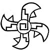  
Click to enlarge](img/09000.jpg)  
*Tablet No. 1231*  

in an Easterly direction.

Detailed deciphering of this symbol is to be found in *The Lost
Continent of Mu*, Page 34.

The Origin of Forces has always been a mooted question among scientists.
We have here a writing by the scientists of the earth's First Great
Civilization, telling us what the origin is; and not only that, but also
the manner and direction of their workings. Especially

p. 91

it shows us the curvatures apparent throughout the Universe, which are
causing so much controversy among scientists today.

[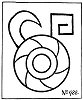  
Click to enlarge](img/09100.jpg)

How long ago this was written I cannot say: but certainly more than
12,000 years ago.

Mexican Tablet No. 988: I am giving this tablet as

p. 92

a confirmation of the previous one regarding the direction in which the
Forces are working throughout the Universe. This particular glyph shows
the lines running from the outside to the Center--therefore it is the
Centripetal Force.

This glyph, without any script, appears on many of the Yucatan and
Central American inscriptions.

Pedro Beltram, Le Plongeon and others have written that this glyph
refers to the movement of the Sun. Here it distinctly states that it
represents the workings of a primary Force.

 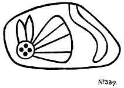

Mexican Tablet No. 339: This interesting little tablet symbolizes the
Four Great Primary Forces, in the shape of a butterfly, flying through
space and evolving law and order out of chaos in obedience to the
command of the Creator--His first command in Creation.

p. 93

 

[  
Click to enlarge](img/09300.jpg)  
''Let Land Appear''  
''And waters covered the face of the earth''  

 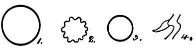

 

p. 94

A full deciphering of this tablet is given in *The Lost Continent of
Mu*, Page 37.

Mexican Tablet No. 1267:

Fig. 1. The outside circle--The Universe.

Fig. 2. The wavy circle--The Waters.

Fig. 3. The inside--The Earth.

Fig. 4. "The Fires of the underneath"--Volcanic gases. The Force symbol,
coming out of the Fires, tells us that land is about to be raised.

Mexican Tablet No. 328: This Mexican tablet symbolizes the actual first
life on earth. A full reading of this compound glyph is given in *The
Children of Mu*, page 76.

THE TALE OF THE CREATION.--The following is what I found in the old
Oriental Naacal writing, supplemented by the Mexican Tablets:

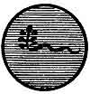  
*Naacal*

"Originally the Universe was only a soul or spirit. Everything was
without form and without life. All was calm, silent and soundless. Void
and dark was the immensity of space. Only the Supreme Spirit, the Great
Self-Existing Power, the Creator, the Seven-Headed Serpent, moved within
the abyss of darkness."

"The desire came to Him to create worlds, and the

p. 95

desire came to Him to create the earth with living things upon it, and
He created the earth and all therein. This is the manner of the creation
of the earth with all there is within and upon it:--The Seven-headed
Serpent)

[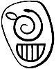  
Click to enlarge](img/09500.jpg)  
*No. 328*  

the Creator, gave seven great commands."

These two tablets tell us that these seven commands

p. 96

were given to the Four Great Primary Forces. That these Forces were the
executors of the Creator's commands throughout the Creation.

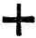  
*Naacal*

   
*Mexican No. 1231*

"*The First Command*: 'Let the gases, which are scattered throughout
space and without form and order, be brought together and out of them
let worlds be formed.'

   
*Mexican No. 339*

Then the gases were brought together in the form of whirling masses."

"*The Second Command*: 'Let the gases solidify and let the earth be
formed.' Then the gases solidified. Volumes were left on the outside of
the crust, from which the waters and the atmosphere were to be formed;
and volumes were left enveloped within the crust. Darkness prevailed,
and there was no sound for as yet neither the atmosphere nor the waters
were formed."

p. 97

"*The Third Command*: 'Let the outside gases be separated and let them
form the waters and the atmosphere.'

   
*Mexican No. 1267*

\[paragraph continues\] And the gases were separated. One part went to
form the waters, the remainder formed the atmosphere. The waters settled
upon the face of the Earth so that no land appeared anywhere."

   
*Naacal No. 10*

"The gases which did not form the waters, went to form the atmosphere.
And the shafts of the Sun met the shafts of the earth's light contained
in the atmosphere, which gave birth to light. Then there was light upon
the face of the Earth."

   
*Naacal No. 11*

"And the shafts of the Sun met the shafts of the Earth's heat which was
contained in her atmosphere

p. 98

and gave it life. Then there was heat to warm the face of the earth."

   
*Mexican No. 51*

"*The Fourth Command*: 'Let the fires that are within the earth raise
land above the face of the waters.' Then the fires of the underneath
lifted the land on which the waters rested until the land appeared above
the face of the waters-this was the dry land."

<table data-cellspacing="0" data-border="0" data-cellpadding="9" width="798">
<colgroup>
<col style="width: 25%" />
<col style="width: 25%" />
<col style="width: 25%" />
<col style="width: 25%" />
</colgroup>
<tbody>
<tr class="odd">
<td width="25%" data-valign="TOP">
 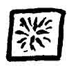 
<em>Naacal 
No. 12</em>
</td>
<td width="25%" data-valign="TOP">
  
<em>Naacal 
No. 13</em>
</td>
<td width="25%" data-valign="TOP">
  
<em>Egyptian 
No. 1</em>
</td>
<td width="25%" data-valign="TOP">
  
<em>Hindu 
No. 2</em>
</td>
</tr>
</tbody>
</table>

   
*Mexican No. 328*

 

"*The Fifth Command*: 'Let life come forth in the waters.' And the
shafts of the Sun met the shafts of the earth in the mud of the waters,
and out of particles of

p. 99

mud formed cosmic eggs. From these eggs life came forth as commanded."

   
*Naacal No. 13*

"*The Sixth Command*: 'Let Life come forth on the land.' And the shafts
of the Sun met the shafts of the earth in the dust of the land and out
of particles of dust formed cosmic eggs. From these cosmic eggs life
came forth as commanded." (What I have translated as arrows and shafts
is the glyph  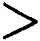.)

"*The Seventh Command*: And when this was done, the Seventh Intellect
said: 'Let us make man after our own *fashion* and let us endow him with
powers to rule this earth.' Then the Seven-Headed Intellect, The Creator
of All Things throughout the Universe, created man and placed within his
body a *living, imperishable spirit*, and man became like the Creator in
*intellectual* power."

What does the phrase "after our own fashion" mean? It certainly does not
mean in the *image* of the Creator; for, a little farther on in the
Sacred Writings, it says: "To man the Creator is incomprehensible. He
can

p. 100

 

[  
Click to enlarge](img/10000.jpg)  
*Mexican Tablet No. 1584  
Creation of the First Pair  
Man and Woman*  

 

p. 101

neither be *pictured* nor named, He is the Nameless."

If man were "in the image of God" he would be a picture of God; and, as
God can neither be pictured nor named, being incomprehensible, the Bible
has erred in translation by using the word "image."

"Like the Creator" unquestionably means, in intellect and mystic powers,
for man possesses both.

Mexican Tablet No. 1584: This tablet reads:--"Man was created with the
dual principle, male and female. The Creator caused this man to pass
into a sleep (our death) and while he slept, the principles were severed
by Cosmic Forces. When he awoke (born again) he was two--man and woman."

There are innumerable writings stating that man was created alone, and
that woman was taken from a part of the original man. I shall quote a
few prominent writings on the subject and also include some legends.

THE BIBLE.--*Genesis. 2. V. 21-22*.

"And the Lord God caused a deep *sleep* \[Among the ancients death was
called sleep: therefore, here sleep is equivalent to our death.\] to
fall upon Adam, and he slept: \[that is he died\] and He took one of his
ribs, and closed up the flesh instead thereof. And the rib which the
Lord God had taken from man, made he a woman, and brought her unto the
man."

This is Ezra's translation of the writings of Moses 800 years after.
Moses' writings were copies of the Naga in the language and writing of
the Motherland and were only partially understood by Ezra who had not

p. 102

become a Master in the Chaldi in Babylonia before he was released from
bondage and returned to his own land.

EGYPT.--Egypt obtained the Sacred Inspired Writings of Mu from two
sources, in which the creation of woman appears. First, from India,
brought by the Nagas when they made their first settlement at Maioo in
Nubia, Upper Egypt. Second, from Atlantis, brought by the Mayas under
the leadership of Thoth, who made his first settlement at Saïs on the
Nile Delta, Lower Egypt. This probably accounts for two versions of the
Creation in the early chapters of the Bible. One was from the people who
came from India--the other from the people who came from Atlantis,
forming Upper and Lower Egypt.

HINDU.--The Sacred Inspired Writings of Mu were brought to India by the
Naacals from the Motherland, and from India they were carried by the
Naacals to the more recent colonies of Babylonia on the Euphrates and to
Maioo in Upper Egypt.

CHALDEAN.--The Chaldean and Egyptian were therefore reflexes of the
Hindu, and the Hindu a reflex of the Motherland: thus showing,
definitely, that the legend of woman coming out of man originated in Mu,
the Motherland.

HAWAII. PACIFIC ISLANDS.--The Hawaiians have a very ancient legend
stating:--"*Taaroa* made man out of red earth *Araca*, and *breathed
into his nostrils*. He made woman from man's bones and called her
*Ivi*."

p. 103

This part of the legend is identical with the Biblical arid continues so
throughout, except in unimportant details.

In the Polynesian language every letter in a word is pronounced: thus
Ivi in Polynesian is pronounced *Eve-y*. Mu was destroyed about 12,000
years ago, so that this legend must have been orally handed down for at
least 12,000 years.

THE GREEK LEGEND.--In all of their conceptions, the Greeks were always
original. They gave a viewpoint on a subject different from all others,
even to the creation of man and woman.

Plato says: "Human beings were originally created with the man and woman
combined in one body. Each body had four arms and four legs. The bodies
were round, and they rolled over and over, using the arms and legs to
move them. By and by they began to treat the gods badly. They stopped
their sacrifices and even threatened to roll up Mount Olympus to attack
and overthrow the gods.

"One god said, 'Let us kill them all. They are dangerous.'

"Another said, 'No, I have a better idea. We will cut them in half. Then
they will only have two arms and two legs; they won't be round. They
won't be able to roll. Being multiplied by two, they will offer twice as
many sacrifices, and what is the most important, each half will be so
busy looking for the other half that they will not have time to bother
us.'

p. 104

UIGHUR.--The frontispiece of this book, coming from the ancient capital
of the Uighurs destroyed about 18,000 to 20,000 years ago--Chinese
records say 19,000 years ago--is probably the oldest record of man being
created with the dual principle.

There are in this world those, the spiritual part of whose brains are so
finely keyed to each other, that words are unnecessary to express the
feelings of one towards the other when they *first* meet. These possibly
are the two halves of man and woman which in bygone times made one soul.
All the past is bridged at a glance. The divine, pure love for one
another leaps into life again on the instant. Many modern writers have
vulgarly termed this "the man call." It is not the man call; it is the
souls' call, mates. The "man call" is materialism. Materialism has
nothing to do with it, because the call is spiritual.

Again, two persons, meeting for the first time, may or may not take a
dislike to one another. One of them at least may take a dislike to the
other and mistrust the other for no apparent reason. This is popularly
termed "first impressions." Probably if their past incarnations could be
recalled and they could see all that happened in them, the question
would be answered.

A glyph, generally a circle but sometimes oblong with two parallel lines
drawn through its center dividing it into three parts as shown [Cut.
1](#img_10500) (Niven's Mexican Tablet No. 2379), is a common universal
symbol.

It is found among the cliff writings of our western

p. 105

states, in inscriptions on the Mexican Pyramid at Xochicalco, in the
Maya writings of Yucatan. It appears in a writing on Inscription Rock,
northeast Brazil

   
*Cut 1. Mexican No. 2379*

   
*Cut 2. A paragraph in the Sacred Inspired Writings (Naacal writing)*

near the boundary of British Guiana, and in other various American
carvings. It occurs in the ancient writings of the Uighurs, Hindus,
Babylonians and Egyptians.

p. 106

In the Oriental Naacal writings of the Sacred Inspired Writings, The
Books of the Golden Age, it is one of three glyphs forming a paragraph.
([See Cut. 2.](#img_10501)) The paragraph reads: ( 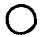 Hun)-The Creator is one.
(  Lahun, two)--He is two
in one. ( 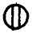 Mehen,
man)--These two engendered the son, mehen--man. It is thus shown that
the glyph   refers to the
Creation of man, and by the ordinary extensions given these very ancient
symbols, includes producing a continuance of, et cetera.

Lao Tzu in *Tao te King*, a Chinese book written about 600 B. C. just
before the time of Confucius, we read: "Reason Tao *made* One. One
*became* two. Two *produced* three. From these three, *all* mankind
descended."

In deciphering and translating this glyph, collected from many parts of
the earth, I have invariably found that, in the ancient explanation of
it, three words persist in every translation of it, viz: *made or
created*, *became* and *produced*; thus:

The Creator *created* man, man *became* two, these two *produced* three,
clearly in each case showing and defining the form of the steps in
progression, and the difference between each step.

An ancient glyph which by the ancients was called "*The Mysterious
Writing*" is an esoteric temple writing, a numeral writing, conveying
the same meaning and conception as the Mexican Tablet No. 2379.

p. 107

THE MYSTERIOUS WRITING.--The Mysterious Writing consisted of either six
small circles or six small disks, placed so as to form a triangle,
pyramid or keystone. The rows are so placed that they count-one, two,
three.

   
*Cut 3. The Mysterious Writing*

The two figures forming Cut 3 are written with the Naga form of
numerals. Sometimes the Nagas used circles, at other times disks; this
appears to have been optional, dependent on the taste of the writer.

The Uighurs, generally, used a bar or line to express their numerals. I
find their expression of the one, two and three most frequently written
thus  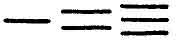 or  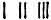.

KARA INSCRIPTION IN BRAZIL.--On a large prairie-like plain in the
northeastern part of Brazil near the boundary of British Guiana stands
an immense rock with many smooth faces which are literally covered with
very old inscriptions in the characters of the ancient Karas or Carians.

The following is one of the inscriptions with its deciphering and
translation:

p. 108

1\. This is a universal symbol found in the writings of all ancient
people.

2\. The Northern or Uighur form of writing the numeral 1. (Cara or
Karian pattern)

3\. Numeral 2.

4\. Numeral 3. This glyph is specialized by not having one end closed
which gives it a special significance.

 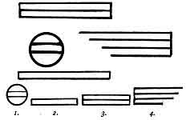

The Legend: One *became* two. Two *produced* three. From these three the
life was *continued* on.

The continuation is shown in the glyph for numeral 3 where the ends of
the bars are left open. The ancients designated by unattached ends that
unfinished work was being carried on.

It may be well to note here that the Cara glyph for 1, an enclosed bar,
was the Naga glyph for 5. All Naga counts were made up of 5's; thus ten
would be two or twice five. Ten being the numeral symbol of the
Infinite,

p. 109

was never used. As the symbol of the Infinite it was looked upon as
being too sacred.

I have here shown a South American inscription composed of a symbol or
vignette with its meaning given in script. This, to a great extent,
follows the character of the Sacred Inspired Writings of Mu; further, it
is unquestionable that this passage was taken from the Sacred Writings
for on the other side of the world comes the Motherland. In China we
find Lao Tzu in *Tao te King*, using virtually the same words about 600
B. C. which he took from the Sacred Writings of the Motherland.

XOCICALCO PYRAMID--MEXICO.--On this celebrated pyramid there are many
inscriptions. I have selected one which appears to me to be relative to
the creation of the first pair.

   
*Uighur writing*

1st Line. Numerals one, two and three with their hidden meaning as
previously given.

2nd Line. Includes the Uighur glyph for man having the dual principle.
Man before he became divided.
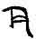

3rd Line. Includes man as the male principle only

p. 110

 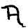 When *mankind* was
referred to, the Uighur plain letter M 
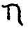 was given.)

   
*The evolution of the Uighur letter M  
1, Naga Mu. 2. Uighur Mu. 3. Second changing the right leg to be the
longer. 4. Third, the last pattern handed down to the Chinese*.

THE WATERS--THE MOTHER OF LIFE.--Throughout all ancient writings the
waters are referred to as "The Mother of Life." Thus it is shown that
the ancients knew perfectly well what is confirmed by geology today:
that is, the first life on earth was marine life, that is, it first
appeared in the waters.

To think that life first appeared in the waters is not only reasonable,
but it was imperative according to natural laws that it should do so;
for, life can only commence at a temperature below 200° F. I have been
unable to produce life at over 175° F.

During the earth's cooling, the waters were always a step in advance of
the rocks in cooling; therefore the waters being in advance of the rocks
in cooling were down to a temperature where life could make a start
before life could start among the rocks, or at the best hot, rocky,
gravelly sand with little or no actual soil.

 

[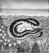  
Click to enlarge](img/11003.jpg)  
*The Waters of the Mother of Life*  

 

p. 111

The first life that appeared on this earth were tiny microscopical
marine grasses and lichens. These were destined to become the foundation
stones of *The House of Life--Nature's lives* and so the house was built
upon them until *Man, the Special Creation*, came to form the Divine
coping stone.

<table data-cellspacing="0" data-border="0" data-cellpadding="9" width="798">
<colgroup>
<col style="width: 50%" />
<col style="width: 50%" />
</colgroup>
<tbody>
<tr class="odd">
<td width="50%" data-valign="TOP">
 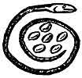 
Fig. 1.
</td>
<td width="50%" data-valign="TOP">
 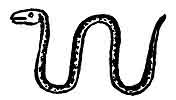 
Fig. 2.
</td>
</tr>
</tbody>
</table>

 

Various serpents are mentioned in the ancient writings, each one
symbolizing something different from the others. These ancient Serpent
Symbols are divided into two classes:

1\. The adorned Serpent symbolizing the Creative Attribute of the Deity.

2\. Plain unadorned Serpents were symbols of the waters. The symbolic
water symbol was called *Khan*.

 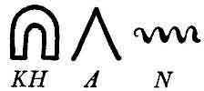

Fig. 1. This serpent is one of the vignettes appearing in the Sacred
Writings--Fifth Command. As this serpent has a nest of eggs within her
coils, it is permissible to assume that this creation refers to various
forms of marine life.

Mexican Tablet, No. 328. This serpent symbolizes

p. 112

actual first life in the waters, therefore the first life on earth.

Fig. 2. Is the usual form of the water symbol, without any additions,
such as eggs, et cetera.

[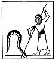  
Click to enlarge](img/11200.jpg)  
*Egyptian Vignette*  

HORUS IN COMBAT WITH APHOPHIS.--This vignette comes from an Egyptian
papyrus dating about 3,000 B. C. It depicts Horus the symbol of the Sun
in combat with Aphophis the waters.

This illustration plainly shows a great difference in the teachings from
the original that are found in the Sacred Writings and which are
repeated and confirmed

p. 113

in the Mexican Tablet No. 328. There the scientific account is given. In
the Egyptian a symbol is given without the explanation. The Mexican
Tablet is at least 7,000 years older than this Egyptian vignette.

But Egypt did not stand alone in this obtuse teaching:--the Greeks had
their Apollo, the Sun, killing the Serpent Python, the waters. The
Hindus had Krishma killing the Serpent Anatha, the waters, and the
Chaldeans had Belmarduk, the Sun, overcoming Tiamat, the waters.

Chaldean tablet found in the library of the palace of King Assurbanipal:
"At a time when neither the heavens above nor the earth below existed,
there was the watery abyss: the first of seed, the mistress of the
depths, the mother of the Universe.

"The waters covered everything; no product had ever been gathered nor
was there any sprout seen, aye, the very gods had not yet come into
being.

"The gods are preparing for a grand contest against the monster known as
Tiamat, the waters; the god Belmarduk overthrows Tiamat."

Tiamat is a Naga word meaning water everywhere, nowhere land. Belmarduk
was the Babylonian name for the Sun as the celestial orb and not as the
symbol Ra.

From the foregoing it appears to be that the first two extracts
correspond to the Mexican Tablet No. 339) and the last to the advent of
life on earth. Some connecting tablets are evidently missing.

In the Sacred Writings of Mu it is plainly shown that

p. 114

there was *no combat or fighting*. That it was the commingling of forces
in connection with elementary matter that produced the results and that
the Natural Law regarding the creation of Life had only been followed.

The savages and semi-savages of the South Sea Islands have legends among
themselves showing that they understand the workings of the Forces
better than the myths taught by the Egyptians, Greeks, Hindus and
Chaldeans, which go to prove that these myths were bred after Mu went
down and the South Sea Islands became isolated from the rest of the
world.

The South Sea Islanders explain that all creations are the result of
marriages (commingling) between gods (Forces), which is correct. Theirs
is the original explanation orally handed down for 12,000 years, and
wonderfully well they have kept it.

Of course there are divergences from the original, but when one
considers the time they have been orally passed on from father to son,
*it is a miracle* that the differences are so immaterial; but they have
had no unscrupulous priesthoods to tamper with the great things left
behind.

THE BIBLE.--Referring to the Bible again, and to show how extremely old
some parts of it are, those which came out of the Sacred Inspired
Writings, I will call attention to a few facts.

Moses without question bases his religious laws on the Pure Osirian as
taught by Thoth. Take for instance the ten commandments. In the Great
Hall of Truth of \[paragraph continues\]

p. 115

Osiris there are placed forty-two gods in a row, to ask the soul when it
enters this judgment Hall forty-two *questions* regarding the life of
the material body in which it had dwelt.

Moses took these forty-two questions and in a condensed form made
forty-two *commands* out of them which he condensed to ten commands.
This drastic change made by Moses was unquestionably necessary to meet
the condition into which his people had fallen. Moses changed nothing in
conception, he simply made more emphatic how they must live their lives
here on earth. He applied these laws to the living directly instead of
to the dead. The ten commandments, however, are found in the Sacred
Inspired Writings of Mu more than 70,000 years ago, only in the form of
questions instead of commands.

But the Jews were not the only people who had a conception that their
religious laws came directly from the Supreme God through some agent,
and this may be so for we have no record who wrote the writings of Mu
and it is distinctly stated they are Sacred and Inspired. Who was the
inspired one? What was his name?

Diodorus Siculus says:

"The Egyptians claim that their religious laws were given to Menevis by
Hermes.

"The Cretans held that their religious laws were given by Minos who
received them from Zeus.

"The Lycedaemonians claimed that theirs were the gift of Apollon to
Lykurgus.

p. 116

"The Aryans were given theirs by Zathraustes who received them from the
Good Spirit.

"The Getae claim that Zamolxis obtained theirs from the goddess Hestia.

"The Jews claim that Moses received theirs from Iao."

The inscriptions on the old Akkadian ruins of Babylonia, clearly express
the feelings and ideas of these people 10,000 to 15,000 years ago about
man and the creation. They believed man was a special creation and
showed how he came into being. They clearly indicate that God was the
Creator and that His Forces control the Universe and all therein. This
is corroborated by the Sacred Inspired Writings, the writings on the
Mexican Tablets, and the cliff writings of North America. All support
the fact that the first religion was pure Monotheism, that the Creator
created all things and today is controlling the Universe with all the
life throughout it.

Writings from western Thebes by one Amenemopet (Priest) are word for
word the same as the Proverbs written by Solomon. These writings are
dated several hundreds of years before Solomon was born.

Solomon was a scholar and reproduced these wonderful epics. Further, it
is clearly shown that besides being a Jew he was an Osirian--the
building of his temple showed it. Wherever possible in its construction,
Solomon carried out the most minute details, shown in the symbolical
Hall of Truth, Osiris presiding.

The Porch especially is noteworthy, for it has the two

p. 117

pillars with identically the same names and the same decorative
ornamentations.

Without question Solomon knew and appreciated that his religion was
nothing more or less than the Pure Osirian religion, arranged and
modified to suit the people of his times.

------------------------------------------------------------------------

[Next: Chapter V. Symbols Used In Religious Teachings](ssm08)
