  
[Intangible Textual Heritage](../../index)  [Atlantis](../index.md) 
[Index](index)  [Previous](ssm08)  [Next](ssm10.md) 

------------------------------------------------------------------------

p. 165

### CHAPTER VI

# SYMBOLS RELATING TO MU

THE SACRED LOTUS.--The Lotus has always been looked upon as the most
sacred of all sacred flowers--why?

Because it was selected as Mu's floral symbol. Why was it so selected?
The Lotus was the *first* flower to beautify the earth. Being the
*first* flower and Mu the land where man first appeared on earth, Mu and
the Lotus were naturally symbolic synonyms. As a mark of love and
mourning, the Egyptians, after the destruction of Mu, never depicted the
lotus as an open, living flower but always as closed and dead.

The lotus is a prominent figure in the carvings and adornments of all
ancient temples, and, except in Egypt, was continued down as open and
conventional until King Solomon's Temple. In this form, the tips of the
petals are turned in.

The lotus was indigenous to Mu. The plant was carried to all parts of
the world by the colonists, so that wherever we find the lotus today, we
know that the parent stock, like the parent stock of man, came
originally from Mu.

Fig. 2. The hieratic letter M in Mu's alphabet

p. 166

 

[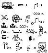  
Click to enlarge](img/16600.jpg.md)  
*Symbols Relating to Mu*  

 

p. 167

which was the alphabetical symbol for Mu as the Mother*land* of man.

Fig. 3. The second of the four glyphs for M in Mu's alphabet. This was
the symbol for Mu as the *Mother* of man.

Fig. 4. This is the numeral 3. Three was the numeral symbol for Mu and
very much used.

Fig. 5. The two lotus buds are the symbols for the two islands adjacent
to Mu. Mu and these two islands were geologically known as the Lands of
the West.

Fig. 6. An open lotus very much used in decorations and in traceries on
temple walls, when it was desired to refer to Mu. The ends of the petals
are turned in to denote Death.

Fig. 7. This is a symbol constantly appearing in the Maya writings and
has been translated in every conceivable way except the correct one.
Some of these decipherings are absolutely ludicrous, Le Plongeon's as an
example. This glyph is a compound symbol being composed of the second M
in Mu's alphabet   and
having at the end of each arm an imix 
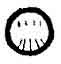 the symbol f or breast. These breasts are shown
distant from   the mother;
therefore physically not actually attached to it.

Cortez, as we are told by Bishop Landa, asked the natives what the
symbol meant. Their answer was Mother. This is correct as far as it
goes, but it does not

p. 168

go far enough.  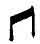 is the
alphabetical symbol for Mu, the mother of man.  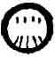 These imix' say, the breast of
Mu. In many of the ancient writings the two islands are called the
breasts of Mu. Therefore a liberal translation would be "Mu, the Mother
of Man," and because the two islands are included, the Lands of the
West. The imix is drawn as follows in the Troano MS.:

 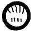 Front view of the
breast.

 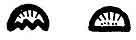 Representing side view
of the breast.

Fig. 8. The withered and dying lotus: Mu's floral symbol after she was
dead.

Fig. 9. The Lands of the West, at the time she was above water.

Fig. 10. Mu is submerged. No light shines upon her. She is in the region
of darkness.

Fig. 11. The Lands of the West are in darkness. No light shines upon
her.

Fig. 12. Mu, the Lands of the West. Maya.

Fig. 13. That Land of Kui--Maya writing.

Fig. 14. Peaks only remain above the watery abyss. Codex Cortesianus.

Fig. 15. The ten tribes which were submerged with Mu. Troano MS.

Fig. 16. Mu is sacrificed. She lies in the region of darkness. Book of
the Dead.

p. 169

 

[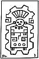  
Click to enlarge](img/16900.jpg.md)  
*An Altar Painting*  

 

p. 170

Fig. 17. The light of day has gone from Mu. Cliff writing, Nevada.

Fig. 18. Mu lies beyond the horizon over the great waters. Cliff
writing, Nevada.

Fig. 19. The Tree and Serpent. Cliff writing, Nevada.

Fig. 20. The Tree and the Serpent, as it appears in the Sacred Writings.

Fig. 21. One of the forms of the letter M found in various ancient
writings.

Fig. 22. The royal escutcheon of Mu.

Altar Painting--The Legend, Deciphering and Translation: This temple is
dedicated to the Sacred Four--the Four Great Forces which issue from the
mouth of The Almighty and are His commands. They first of all evolved
law and order out of chaos throughout the Universe, and then created all
things. They have now the charge of the physical welfare of all
creations. They order and control the movements of the Universe today.
This temple is under the jurisdiction of the mother church of Mu, whose
High Priest is Ra Mu, who is the mouthpiece of the Almighty One.

This legend is a key to the extreme age of the Mexican tablets. The
legend shows that at the time the temple was built Mu was above water,
because the temple is under the jurisdiction of Mu. Mu was submerged
about 10,000 B. C., thus showing that this temple was built *more* than
*12,000 years ago*, but how much longer I have found nothing to
indicate.

p. 171

 

   
''Mu, the Motherland, the Lands of the West''

   
''The Lord God speaks through the mouth of Mu''

 

p. 172

Mexican Tablet No. 684 reads: "Mu, the Motherland, the Lands of the
West."

Mexican Tablet No. 1005 reads: "God speaks through the Mouth of Mu."

   
*Legends on the Vignettes*

"Mu, the Empire of the Sun, the Lands of the West, has fallen into an
abyss. She is in the region of darkness, where the Sun never shines upon
her. Her crown no longer rules the earth."

While there are scores) hundreds even, of writings that tell of the
destruction of Mu, I have found only two tableaux depicting her
destruction. First I found the Egyptian, and next this North American
Indian. *Legend*: "The Creator considered the destruction of the
Motherland of Man. So the Four Great Forces the executors of His
commands caused the waters to swallow her up. They caused her to be
carried down into a watery abyss and be submerged.

Three Vignettes from the Egyptian "'Book of the Dead" depicting the
destruction of Mu by falling into a "tank" of fire--a fiery pit. As she
went down, flames arose around and enveloped her.

Fig. 1. No pillars showing.

Fig. 2. The Eastern pillar showing.

p. 173

 

[  
Click to enlarge](img/17300.jpg.md)  
*Thunder Bird and Whale  
A North American Nootka Indian Tableau recounting the Submergence of
Mu*  

 

p. 174

Fig. 3. All of the four pillars are found showing. This Egyptian
Vignette shows one phase only of the destruction of Mu, how she sank
into the fiery depths, The Nootka Indian shows the other phase, her
burial by water. Arizona also supplies data on Mu's destruction by the
symbolic pictures, pecked on her stones by the men of past ages. The
American records are hoary with age.

   
*Three Vignettes from the ''Book of the Dead''*

A Mexican Stone Tablet: This is one of the most extraordinary tablets I
have ever examined. It is a stone with highly glazed colors. The glyphs
are like glass and have been cut out of the face of the stone--a fine
sandstone--for a depth of about 1/16th of an inch. The
writings are in ancient, very ancient, characters used by the priesthood
only. Of what age it is, I have no idea: but the one who arranged the
glyphs had a temple knowledge. All of the glyphs are found among the
\[paragraph continues\]

p. 175

 

   
*Tablet from Mexico  
Destruction of Mu*

 

p. 176

Nagas only. It cannot be over 12,000 years old, because the writing is a
description of the destruction of Mu. It was bought from an Indian in
Mexico City who said he found it in a ruin. We must take the statement
for what it is worth.

Legend: "Kuiland, The Great Ruler of the Earth, exists no longer. She
was shaken up and down by earthquakes in various places. The land rolled
like ocean swells. Finally, the Pillars that supported her gave way. She
then sank into a fiery abyss. As the Great Ruler went down, flames from
the fires of the underneath arose and enveloped her. The waters rolled
in over her sunken form. Then was Kuiland, The Great Ruler, submerged."

The Field of Aarru, Chapter 110, "Book of the Dead." This large
vignette, one of the largest in [the](errata.htm#4.md) Book of the Dead,
was not comprehended by Ezra or any of his associates. Neither has it
been comprehended by any Egyptologist of the present time. To
substantiate my contention I have shown the two ends of this symbolic
picture.

The Vignette depicts the life of man in the Motherland. The lower part
is a conventional map of Mu. On the left hand top corner of the upper
part, there are three cartouches bearing the names of three waters,
shown in the lower part. The lower part also shows three lands, each
surrounded by water. The names of these waters as read by Egyptologists
are: Power of waters. Innumerable waters. Great place of waters.

p. 177

 

[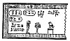  
Click to enlarge](img/17700.jpg.md)  
*The beginning of the Vignette*  

[  
Click to enlarge](img/17701.jpg.md)  
*The end of the Vignette  
The Field of Aarru, Chapter 110, ''Book of the Dead''*  

 

p. 178

Now let us see what Ezra's translations of them are: Genesis, Chapter 2,
Verse 11. "The name of the first is Pison. The name of the second Gihon.
And the third Hiddekel." Next I shall take the Biblical boundaries of
the Garden of Eden. They are given thus:--

Verse 8 And the Lord God planted a garden eastward in Eden and there he
put the man whom he had formed.

<table data-cellspacing="0" data-border="0" data-cellpadding="9" width="798">
<colgroup>
<col style="width: 33%" />
<col style="width: 33%" />
<col style="width: 33%" />
</colgroup>
<tbody>
<tr class="odd">
<td width="33%" data-valign="TOP">
 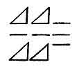 
<em>Power of waters</em>
</td>
<td width="33%" data-valign="TOP">
 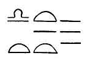 
<em>Innumerable waters</em>
</td>
<td width="33%" data-valign="TOP">
 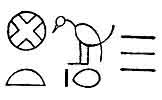 
<em>Great place of waters</em>
</td>
</tr>
</tbody>
</table>

 

(Anyone looking at the map today taking in Ethiopia, Assyria and the
Valley of the Euphrates--and seeing how a land might possibly cover this
area--to represent either an island or a garden, must at once feel that
the Biblical description is purely symbolical, which is corroborated in
Verse 8, where it says the garden was *eastward* in Eden. Where this was
written was either in Egypt or Palestine-therefore, according to present
general acceptance, in the middle of the garden itself, being in the
east or towards the east is a link showing the Garden of Eden that was
Mu in another vestment.)

Verse 9 And out of the ground made the Lord God to grow every tree that
is pleasant to the sight, and good

p. 179

for food: the tree of life also in the midst of the garden, and the tree
of knowledge of good and evil.

Verse 10 And a river went out of Eden to water the garden; and from
thence it was parted, and became into four heads.

Verse 11 The name of the first is Pison, that is it which compassed the
whole land of Havilah, where there is gold.

Verse 12 And the gold of that land is good, there is bedellium and the
onyx stone.

Verse 13 And the name of the second river is Gihon the same it is that
compasseth the whole land of Ethiopia.

Verse 14 And the name of the third river is Hiddekel: that is it which
goeth towards the east of Assyria, and the fourth river is Euphrates.

The Four Genii, as I have previously stated, were, to my mind another
vestment of the Sacred Four; which, in turn were given the name of the
Four Great Pillars, the executors of the Creator's commands.

The Genii appeared to be very popular among all ancient peoples since
the demise of Mu for I do not find their names before that date. But in
all nations and peoples during the past 10,000 or 11,000 years the Genii
are quite prominent. Most of the ancient peoples seem to have had a
varied conception of them, and how they should be described. I find them
associated with all histories and traditions of the creation. One of the
oldest records that I have found of them comes from the \[paragraph
continues\]

p. 180

Mayas of Yucatan and Central America. With them the Genii were referred
to as "the Keepers of the Pillars."

The Mayas as well as all other ancients symbolized the earth as a
four-sided square. At times and for certain purposes, for explanation,
they stood the square on one of its points forming a diamond out of it.
This brought the four points into astronomical lines pointing north,
south, east and west, making Four Cardinal Points. The theology
said--that at these four points, were four pillars sustaining heaven,
and at the foot of each pillar, was stationed one of the Genii, to look
after and care for it. The names of the Maya genii were:--

Kan-Bacab--the Yellow Bacab, placed in the South.

Chac-Bacab--the Red Bacab, placed in the East.

Zac-Bacab--the White Bacab, placed in the North.

Ec-Bacab--the Black Bacab, placed in the West.

It is thus seen that the Mayas, chose to define their genii by colors.

The Hindus had four Genii presiding at their Four Cardinal Points. (The
Hindus used the words cardinal points symbolically. They did not refer
to any particular spot or spots, but to wherever they might be.)

Instead of colors their Genii were called by phenomena connected with
life, their names were:--

Rouvera--the God of Wealth, placed in the North.

Yama--the judge of the Dead, placed in the South.

Indra--the King of Heaven, placed in the East.

Varona--the God of the Waters, placed in the West.

The Genii were also called gods by the Hindus.

p. 181

Chinese. The Chinese designated their Genii as Yo's--mountains. The four
mountains Tse-Yo. They also referred to them as the four quarters of the
earth. They are

Tai-Tsong--the Yo of the East.

Saing-Fou--the Yo of the West.

How-Kowang--the Yo of the South.

Chin-Si--the Yo of the North.

\[paragraph continues\] The Chinese symbolized these mountains as a
mountain in the shape of a triangle with an eye at the apex of the
mountain looking down from it.

Egyptian. According to the Egyptian theology there were Four Genii in
Amenti, which were placed at the Four Cardinal Points in charge of the
pillar which stood there, their names were:--

Amset--the genius at the Cardinal Point in the East.

Hapu--the genius at the Cardinal Point in the West.

Tesautmutf--the genius at the Cardinal Point in the North.

Quabsenuf--the genius at the Cardinal Point in the South.

Chap. 125, Book of the Dead, has a large picture of the great Hall of
Truth of Osiris. Near the seat of Osiris in this picture are shown the
Four Genii. They are symbolized as men in mummy form. One has the head
of a human being, another the head of a monkey, a third the head of a
hawk, and the fourth the head of a jackal (Anubis).

Chaldean. The Chaldeans believed that there were \[paragraph continues\]

p. 182

Four Genii protecting and looking after the welfare of all human beings.
This example does much to show the origin of the genii. As by the
swastika, we frequently see in the ancient writings that man's welfare
is constantly being watched over by the Sacred Four, symbolized by
crosses et cetera, and that by watching over and caring for the physical
welfare of the universe, including man, they are acting as the executors
of the Creator's wishes, desires, commandments et cetera. This is the
exact work of the genii as conceived by the Chaldeans. The names given
to the genii by the Chaldeans are:--

Sed-Alap or *Kirub*--Represented as a bull with a human face.

Lamas or *Nigal*--Represented as a lion with a man's head.

Ustar--After the human likeness.

Nattig--Represented with the head of an eagle.

The Hittites, *Assyrians* and *Persians* all had the Genii engrafted in
their cosmogony.

The Israelites. Although I cannot find any direct reference in the
Jewish research which I have made, that is no criterion and does not say
that they entirely rejected the idea.

In Ezekiel, Chapter 1, Verse 10, there is something at least touching on
it, for it says: "They four had the face of a man, and the face of a
lion, on the right side: and they four had the face of an ox on the left
side; they four also had the face of an eagle." The foregoing is

p. 183

given as a vision of Ezekiel. At the time this was written Ezekiel was a
captive among the Chaldeans.

Let us compare this vision with the Chaldean creed which had been in
existence thousands of years before Ezekiel came on earth.

Ezekiel's dream. Four beasts with the heads of a man, another an ox,
another a lion, and the fourth, an eagle.

Chaldean Belief. Four Genii, beasts with heads; one with a human face,
one with a face of a bull one with the face of a lion and the fourth
with the face of an eagle. These Chaldean genii stood at the bottom of
steps leading to temples and palaces, one could not walk through a city
without seeing many of them.

Thus to me it seems unquestionable that Ezekiel must have seen many of
them during his captivity. A set of four is now in the British Museum
and came from the king's palace, Nineveh. Ezekiel's vision looks like an
embellishment of the Chaldean Creed. Is the Biblical translation
correct?

 

HIERATIC LETTERS FROM THE ALPHABET OF MU

 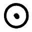

The hieratic letter A, pronounced Ahau. The monotheistic alphabetical
symbol of the Deity. 183

p. 184

 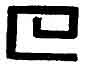

The hieratic letter H, the alphabetical symbol of the Four Great Primary
Forces, called in the Sacred Inspired Writings, "the Sacred Four."

The hieratic letter M, pronounced Mā and Mu, the *u* is pronounced as in
German u. The alphabetical

 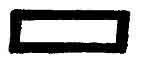

symbol of Mu, the Motherland. It was also the symbol for mother, earth,
land, country, empire, anything pertaining to the soil.

 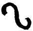

The hieratic letter N, the alphabetical symbol for the Serpent of
Creation.

 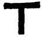

The hieratic letter T, pronounced Tāó, the alphabetical symbol for
resurrection, also emersion. Used in the Sacred Writings symbolizing
Mu's emersion.

 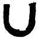

The hieratic letter U, pronounced as *oo* in moon. The alphabetical
symbol for an abyss, a deep hole, a valley. In the body of a word
another of the "u" glyphs is generally used as a V.

p. 185

 

   
*Dress ornament  
Society Islands*

   
*Dress ornament  
Marquesan*

 

p. 186

SOME MISCELLANEOUS SYMBOLS RELATING TO MU

 

This glyph is often found in ancient writings. It is one of the figures
that was used to symbolize the Four Great Primary Forces--the Sacred
Four. It is composed of four circles, each with one of its sides
incomplete.

 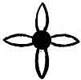

Another glyph symbolizing the Sacred Four. This was a very favorite
symbol among the Uighurs and is revered by the Chinese today. I have
also found it as a dress ornamentation among the South Sea Islanders
especially the Polynesians.

 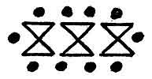

This peculiar glyph is found in various parts of the earth, but not
often. I have found it in writings where

p. 187

the ten tribes of people who went down with the Motherland at her
destruction are spoken of.

 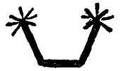

Apparently this is a Maya symbol. I have found it in no other writings.
It is found in the Maya description of the destruction of the
Motherland. It reads: "Peaks only rise out of the abyss." It therefore
refers to the islands that were formed between the gas chambers.

 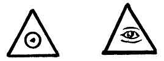

An equilateral triangle with the monotheistic symbol of the Deity within
symbolizes: the triangle--Heaven, The circle within--the Deity, reading
the Deity, the Infinite, dwells in Heaven, Heaven is His abode.

An equilateral triangle with an eye within symbolizes the Deity looking
out from heaven. In Egypt it was changed to the all seeing Eye of Osiris
looking down from heaven. These two symbols are found in all ancient
writings. Rather, they appear in many writings and among all people.

 

A large dot within a small circle was occasionally

p. 188

used by the Egyptians as an equivalent for an eye.

 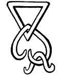

A conventional map of the Lands of the West after submersion. (From the
Troano Manuscript.)

------------------------------------------------------------------------

[Next: Chapter VII. Sacred Symbols Connecting North America to
Mu](ssm10.md)
