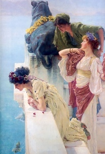

  
[Intangible Textual Heritage](../../index)  [Atlantis](../index.md) 

------------------------------------------------------------------------

[Buy this Book at
Amazon.com](https://www.amazon.com/exec/obidos/ASIN/B00213KMTI/internetsacredte.md)

------------------------------------------------------------------------

<table width="75%">
<colgroup>
<col style="width: 50%" />
<col style="width: 50%" />
</colgroup>
<tbody>
<tr class="odd">
<td width="50%" data-valign="TOP"> 
A Coign of Vantage, by Lawrence Alma-Tadema [1895] (Public Domain Image)</td>
<td width="50%" data-valign="CENTER"><h1 id="the-lost-continent" data-align="CENTER">The Lost Continent</h1>
<h2 id="by-cutcliffe-hyne" data-align="CENTER">by Cutcliffe Hyne</h2>
<h4 id="section" data-align="CENTER">[1900]</h4></td>
</tr>
</tbody>
</table>

------------------------------------------------------------------------

[Contents](#contents)    [Start Reading](tlc00.md)    [Page
Index](pageidx)    [Text (Zipped)](tlc.txt.gz.md)

------------------------------------------------------------------------

|                                                                                                                           |
|---------------------------------------------------------------------------------------------------------------------------|
|  |

"\[The\] story is not burdened with the
sentimentality and didacticism that oppress so many novels of this
group...The author does not try to project our modern Western moral code
on people of an ancient and supposedly different culture"--L. Sprague de
Camp, Lost Continents.

This lively Victorian-era Atlantis story is one of the best of the
genre, per Lin Carter, Sprague de Camp, and others. However, IMHO,
naming the principal character Deucalion in an Atlantis story is sort of
giving away the ending. Hyne's Atlantis is loosely based on [Donnelly's
conception](../ataw/index.md), a continent in the middle of the Atlantic
which disappears under the waves 'in a single day.' Hyne adds interest
by setting the story in the last decadent years of Atlantis. The evil
queen Phorenice is voracious and cruel, and Deucalion, ostensibly the
upholder of duty and tradition, is morally ambiguous. The barbarians are
literally at the gate. Dinosaurs, plesiosaurs, and mammoths are depicted
as surviving in Atlantis. There is a tragic love triangle, evil sorcery,
lots of swordplay, and a rousing naval battle. On one level, it's
swashbuckling fun in the vein of Robert E. Howard's Conan. On another
level, it's an attempt to explain a whole bunch of mythology by sourcing
it from Atlantis, and creating some new myths in the process. This idea
has obviously remained in the popular culture.

Charles John Cutcliffe Wright Hyne (b. 1866, d. 1944) was a British
writer of serialized magazine fiction at the end of the 19th century.
The Lost Continent was first published in the American Pearson's
Magazine from July to December 1899. Pearson's was the first to publish
the 'speculative fiction' of H.G. Wells and H. Rider Haggard in the US,
and the Hyne Atlantis serial was a standout. Hyne went on to publish
numerous other works, all in the adventure genre, but The Lost Continent
was the high point of his career. The book version was published in
1900, and apparently sold well; this edition is still in demand by
collectors. The novel was reprinted in a highly abridged form in the
[December 1944 issue of Famous Fantastic Mysteries](img/ffm4412.jpg.md). In
1972 it was finally reprinted unabridged in the Ballantine Books Adult
Fantasy line, with an introduction by Lin Carter, and Cutcliffe
unfortunately mispelled as Cutliffe on [the cover](img/balltlc.jpg.md) and
title page. This etext was scanned from a printing of the first, 1900
edition.

------------------------------------------------------------------------

 [Title Page](tlc00.md)  
[Contents](tlc01.md)  
[Illustrations](tlc02.md)  
[Prefatory. The Legatees of Deucalion](tlc03.md)  
[Chapter I. My Recall](tlc04.md)  
[Chapter II. Back To Atlantis](tlc05.md)  
[Chapter III. A Rival Navy](tlc06.md)  
[Chapter IV. The Welcome of Phorenice](tlc07.md)  
[Chapter V. Zaemon's Curse](tlc08.md)  
[Chapter VI. The Biters of the City Walls](tlc09.md)  
[Chapter VII. The Biters of the Walls (Further Account)](tlc10.md)  
[Chapter VIII. The Preacher From the Mountains](tlc11.md)  
[Chapter IX. Phorenice, Goddess](tlc12.md)  
[Chapter X. A Wooing](tlc13.md)  
[Chapter XI. An Affair With the Barbarous Fishers](tlc14.md)  
[Chapter XII. The Drug of Our Lady the Moon](tlc15.md)  
[Chapter XIII. The Burying Alive of Naïs](tlc16.md)  
[Chapter XIV. Again the Gods Make Change](tlc17.md)  
[Chapter XV. Zaemon's Summons](tlc18.md)  
[Chapter XVI. Siege of the Sacred Mountain](tlc19.md)  
[Chapter XVII. Naïs The Regained](tlc20.md)  
[Chapter XVIII. Storm of the Sacred Mountain](tlc21.md)  
[Chapter XIX. Destruction of Atlantis](tlc22.md)  
[Chapter XX. On the Bosom of the Deep](tlc23.md)  
[Advertisements](tlc24.md)  
