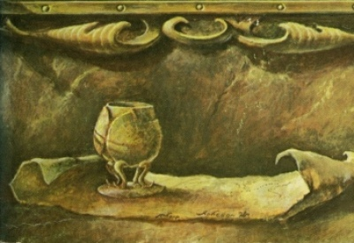

  
[Intangible Textual Heritage](../../index)  [Atlantis](../index.md) 

------------------------------------------------------------------------

<table width="75%">
<colgroup>
<col style="width: 50%" />
<col style="width: 50%" />
</colgroup>
<tbody>
<tr class="odd">
<td width="50%" data-valign="TOP"></td>
<td width="50%" data-valign="CENTER"><h1 id="the-treasure-of-atlantis" data-align="CENTER">The Treasure of Atlantis</h1>
<h2 id="by-j.-allan-dunn" data-align="CENTER">by J. Allan Dunn</h2>
<h4 id="section" data-align="CENTER">[1916]</h4></td>
</tr>
</tbody>
</table>

------------------------------------------------------------------------

[Contents](#contents)    [Start Reading](toa00.md)    [Page
Index](pageidx)    [Text \[Zipped\]](toa.txt.gz.md)

------------------------------------------------------------------------

This pulp-fiction era yarn about Atlantis in South America is actually a
fairly literate story with a big dollop of action. The story is similar
to The Lost World without the dinosaurs. Our two heros stumbling on a
trail of evidence leading to a mystical city deep in the Amazon, a shard
of the lost contient where everyone speaks Ancient Greek, but live like
Minoans, with a separate woman-only city devoted to worshipping a
goddess. Go figure.

Dunn seems to have at least done some adequate amount of research on
Atlantis, ancient Crete and travel in the upper Amazon. He includes
details such as the double axe (one of which gets used as a weapon at
one point, naturally). This is a virtual 'page turner' which makes a
satisfying read, plus we get yet another concept for the location of
Atlantis. And snappy dialog.

This was originally published in the magazine All Around, in December
1916, which specialized in adventure and action stories, including many
which would later be identified as science fiction, by authors such as
Edgar Rice Burroughs. The edition we scanned was a paperback edition
published in 1970 by Centaur Press, and the pagination is based on this
version. This was part of a series, the Time Lost. This edition is
actually in the public domain because it lacked a properly worded
copyright message so we have included material from it.--J.B. Hare, Dec.
24th, 2009.

------------------------------------------------------------------------

 [Title Page](toa00.md)  
[Introduction](toa01.md)  
[Contents](toa02.md)  
[Chapter I—The Flowing Road](toa03.md)  
[Chapter II—The Vase of Minos](toa04.md)  
[Chapter III—Laidlaw's Theory](toa05.md)  
[Chapter IV—Caxoeira Canyon](toa06.md)  
[Chapter V—Kiron](toa07.md)  
[Chapter VI—The Gates of Dor](toa08.md)  
[Chapter VII—The Queen Advances](toa09.md)  
[Chapter VIII—Aulus the Gladiator](toa10.md)  
[Chapter IX—The Initiation](toa11.md)  
[Chapter X—The Isle of Sele](toa12.md)  
[Chapter XI—The Judgment of Ru](toa13.md)  
[Chapter XII—The Hall of Sacrifice](toa14.md)  
[Chapter XIII—The End of Atlantis](toa15.md)  
[Advertisement](toa16.md)  
[Back cover copy](toa17.md)  
