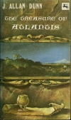

  
[Intangible Textual Heritage](../../index)  [Atlantis](../index) 
[Index](index)  [Next](toa01) 

------------------------------------------------------------------------

  
*The Treasure of Atlantis*, by J. Allan Dunn, \[1916\], at Intangible
Textual Heritage

------------------------------------------------------------------------

p. 1

THE TREASURE OF ATLANTIS

Here is an action-filled fantastic written in the early days of Edgar
Rice Burroughs and employing many of the devices that the master hand
used in opening up a whole new field of fiction in that remote period
prior to 1920. Here is a novel from the 1916 pages of the half-fabled
All Around magazine, full of the nostalgia and dreams of that era when
the world was so much larger and life was, accordingly, less
complicated.

In J. Allan Dunn's THE TREASURE OF ATLANTIS, an orchid hunter's
discovery is the catalyst that leads an expedition into the interior of
South America to the lost remnant of ancient Atlantis. Cut off from the
modern world, Atlantis offers swashbuckling intrigue, danger, and action
that is eminently suitable for the "Time-Lost" series. Here is thrilling
adventure out of the past in the Edgar Rice Burroughs tradition.

p. 2 p. 3

THE TREASURE OF ATLANTIS

p. 4 p. 5

# THE TREASURE OF ATLANTIS

## J. ALLAN DUNN

1872-1941

#### \[1916\]

Source edition: New York: Centaur Press, October 1970. Originally
published in *All Around*, December 1916.

Scanned, Proofed and Formatted at Intangible Textual Heritage, December
2009, by John Bruno Hare. This text is in the public domain in the US
because it was published prior to 1923. The additional material from the
Centaur Press edition is included because of a lack of copyright notice
in this edition.

 
[  
Click to enlarge](img/cover.jpg)  
Cover  

  [  
Click to enlarge](img/title.jpg)  
Title Page  

  [  
Click to enlarge](img/verso.jpg)  
Verso. Note lack of copyright notice  

------------------------------------------------------------------------

[Next: Introduction](toa01)

