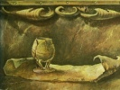

  
[Intangible Textual Heritage](../../index)  [Atlantis](../index) 
[Index](index)  [Previous](toa01)  [Next](toa03) 

------------------------------------------------------------------------

  
*The Treasure of Atlantis*, by J. Allan Dunn, \[1916\], at Intangible
Textual Heritage

------------------------------------------------------------------------

p. 9

### CONTENTS

|         |                       |                           |
|---------|-----------------------|---------------------------|
| Chapter |                       | Page                      |
| I       | The Flowing Road      | [13](toa03.htm#page_13)   |
| II      | The Vase of Minos     | [21](toa03.htm#page_21)   |
| III     | Laidlaw's Theory      | [24](toa04.htm#page_24)   |
| IV      | Caxoeira Canyon       | [34](toa06.htm#page_34)   |
| V       | Kiron                 | [41](toa06.htm#page_41)   |
| VI      | The Gates of Dor      | [54](toa07.htm#page_54)   |
| VII     | The Queen Advances    | [64](toa08.htm#page_64)   |
| VIII    | Aulus the Gladiator   | [68](toa09.htm#page_68)   |
| IX      | The Initiation        | [76](toa10.htm#page_76)   |
| X       | The Isle of Sele      | [87](toa11.htm#page_87)   |
| XI      | The Judgment of Ru    | [106](toa13.htm#page_106) |
| XII     | The Hall of Sacrifice | [114](toa14.htm#page_114) |
| XIII    | The End of Atlantis   | [121](toa14.htm#page_121) |

------------------------------------------------------------------------

[Next: Chapter I—The Flowing Road](toa03)

