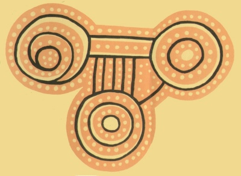

  
[Intangible Textual Heritage](../../index)  [Australia](../index.md) 

------------------------------------------------------------------------

[Buy this Book at
Amazon.com](https://www.amazon.com/exec/obidos/ASIN/B001VKXT10/internetsacredte.md)

------------------------------------------------------------------------

<table width="75%">
<colgroup>
<col style="width: 50%" />
<col style="width: 50%" />
</colgroup>
<tbody>
<tr class="odd">
<td width="50%" data-valign="TOP"></td>
<td width="50%" data-valign="CENTER"><h1 id="australian-legendary-tales" data-align="CENTER">Australian Legendary Tales</h1>
<h2 id="by-k.-langloh-parker" data-align="CENTER">By K. Langloh Parker</h2>
<h4 id="section" data-align="CENTER">1897</h4></td>
</tr>
</tbody>
</table>

------------------------------------------------------------------------

[Contents](#contents)    [Start Reading](alt00.md)    [Text
\[Zipped\]](alt.txt.gz.md)

------------------------------------------------------------------------

|                                                                                                                           |
|---------------------------------------------------------------------------------------------------------------------------|
|  |

This is still one of the best available collections of Australian
Aboriginal folklore. It was written for a popular audience, but the
stories are retold with integrity, and not filtered, as was the case
with similar books from this period. That said, the style of this book
reflects Victorian sentimentality and, an occasional tinge of racism
that may not sit well with some modern readers.

K. Langloh Parker (the K. stands for 'Katie') \[1856-1940\] lived in the
Australian outback most of her life, close to the Eulayhi people. The
texts, with their sentient animals and mythic transformations, have a
sonambulistic and chaotic narrative that mark them as authentic
dreamtime lore. The mere fact that she cared to write down these stories
places her far ahead of her contemporaries, who barely regarded native
Australians as human.

This was the first book Parker wrote. She write four books, three of
native folklore and one an [ethnography of the Eulayhi
tribe](../tet/index.md). This was also one of the first texts added to
sacred-texts after it was launched to add coverage of traditional
cultures. This was also the first text donated by sacred-texts to
Project Gutenberg.

Parker has some odd connections with modern popular culture. She was
rescued from drowning by an aborigine at an early age. This incident was
portrayed in the film 'Picnic at Hanging Rock', directed by Peter Weir.
The song They Call the Wind Mariah was based on a story from this book.
(And the pop singer Mariah Cary was reputedly named after this
song).--J.B. Hare

------------------------------------------------------------------------

 [Title Page](alt00.md)  
[Contents](alt01.md)  
[Preface](alt02.md)  
[Introduction](alt03.md)  
[Dinewan the Emu, and Goomblegubbon the Bustard](alt04.md)  
[The Galah, and Oolah the Lizard](alt05.md)  
[Bahloo the Moon and the Daens](alt06.md)  
[The Origin of the Narran Lake](alt07.md)  
[Gooloo the Magpie, and the Wahroogah](alt08.md)  
[The Weeoonibeens and the Piggiebillah](alt09.md)  
[Bootoolgah the Crane and Goonur the Kangaroo Rat, the Fire
Makers](alt10.md)  
[Weedah the Mocking Bird](alt11.md)  
[The Gwineeboos the Redbreasts](alt12.md)  
[Meamei the Seven Sisters](alt13.md)  
[The Cookooburrahs and the Goolahgool](alt14.md)  
[The Mayamah](alt15.md)  
[The Bunbundoolooeys](alt16.md)  
[Oongnairwah and Guinarey](alt17.md)  
[Narahdarn the Bat](alt18.md)  
[Mullyangah the Morning Star](alt19.md)  
[Goomblegubbon, Beeargah, and Ouyan](alt20.md)  
[Mooregoo the Mopoke, and Bahloo the Moon](alt21.md)  
[Ouyan the Curlew](alt22.md)  
[Dinewan the Emu, and Wahn the Crows](alt23.md)  
[Goolahwilleel the Topknot Pigeons](alt24.md)  
[Goonur, the Woman-Doctor](alt25.md)  
[Deereeree the Wagtail, and the Rainbow](alt26.md)  
[Mooregoo the Mopoke, and Mooninguggahgul the Mosquito Bird](alt27.md)  
[Bougoodoogahdah the Rain Bird](alt28.md)  
[The Borah of Byamee](alt29.md)  
[Bunnyyarl the Flies and Wurrunnunnah the Bees](alt30.md)  
[Deegeenboyah the Soldier-bird](alt31.md)  
[Mayrah, the Wind that Blows the Winter Away](alt32.md)  
[Wayarnbeh the Turtle](alt33.md)  
[Wirreenun the Rainmaker](alt34.md)  
[Appendix](alt35.md)  
[Glossary](alt36.md)  
