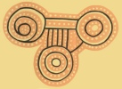

[Sacred-Texts](../../index)  [Australia](../index) 
[Paleolithic](../../nel/index)  [Shamanism](../../sha/index) 
[African](../../afr/index)  [Native American](../../nam/index) 

------------------------------------------------------------------------

# Australian Aboriginal Rock Art

These reproductions of rock art from Australia are from [The Native
Tribes of Central Australia](index) by Baldwin Spencer and F. J. Gillen
\[1899\]. Although these images are clearly in the public domain, if you
use them please respect their sacred nature.

Click on the thumbnails to view the full size image.

These paintings depict totemic inhabitants of the Australian landscape
in the 'dreamtime'. They constitute part of a text, the meaning of which
is esoteric knowledge only known to Aboriginal elders. Beyond that we
can't answer any questions as to their meaning or significance.

As outsiders, we can also appreciate these paintings as sacred art of
the most sophisticated nature. Although the Australian Aborigines may
have been impoverished by Western standards, their culture has an
unbroken history dating back tens of thousands of years. An observer
from another planet might well conclude that the Aborigines have the
highest level of culture on Earth on the basis of this art.

|                                        |
|----------------------------------------|
|  |
|  |
|  |
|  |
|  |
|  |
|  |
|  |
