  
[Intangible Textual Heritage](../../index)  [Australia](../index.md) 
[Index](index)  [Previous](ntca02)  [Next](ntca04.md) 

------------------------------------------------------------------------

*The Native Tribes of North Central Australia*, by Baldwin Spencer and
F. J. Gillen \[1899\], at Intangible Textual Heritage

------------------------------------------------------------------------

# The Native Tribes of Central Australia

p. 1

## Chapter I. Introduction

**Nature of the country occupied by the natives—Distribution of the
natives in local groups—Names given to the local groups—Local Totemic
groups—The Alatunja or head man of each group and his powers—The
position of Alatunja a hereditary one—Strong influence of
custom—Possibility of introduction of changes in regard to
custom—Councils of old men—Medicine men—Life in camp—Hunting
customs—Food and method of cooking—Tracking powers—Counting and
reckoning of time—General account of the more common weapons and
implements—Clothing—Fighting—Local Totemic groups—Variation in customs
amongst different Australian tribes—Personal appearance of the
natives—Cicatrices—Measurements of the body—Moral
character—Infanticide—Twins—Dread of evil magic.**

THE native tribes with which we are dealing occupy an area in the centre
of the Australian continent which, roughly speaking, is not less than
700 miles in length from north to south, and stretches out east and west
of the transcontinental telegraph line, covering an unknown extent of
country in either direction. The nature of the country varies much in
different parts of this large area; at Lake Eyre, in the south, it is
actually below sea-level. As we travel northwards for between 300 and
400 miles, the land gradually rises until it reaches an elevation of
2,000 feet; and to this southern part of the country the name of the
Lower Steppes may appropriately be given. Northwards from this lies an
elevated plateau forming the Higher Steppes, the southern limit of which
is roughly outlined by the James and Macdonnell p.
2 ranges, which run across from east to west for a distance of
400 miles.

The rivers which rise in the Higher Steppes find their way to the south,
passing through deep gaps in the mountain ranges and then meandering
slowly across the Lower Steppes until they dwindle away and are lost
amongst the southern sandy flats, or perhaps reach the great depressed
area centreing in the salt bed of Lake Eyre.

Away to the south and west of this steppe land lies a vast area of true
desert region, crossed by no river courses, but with mile after mile of
monotonous sand-hills covered with porcupine grass, or with long
stretches of country where thick belts of almost impenetrable mulga
scrub stretch across.

We may first of all briefly outline, as follows, the nature of the
country occupied by the tribes with which we are dealing. At the present
day the transcontinental railway line, after running along close by the
southern edge of Lake Eyre, lands the traveller at a small township
called Oodnadatta, which is the present northern terminus of the line,
and lies about 680 miles to the north of Adelaide. Beyond this transit
is by horse or camel; and right across the centre of the continent runs
a track following closely the course of the single wire which serves to
maintain, as yet, the only telegraphic communication between Australia
and Europe. From Oodnadatta to Charlotte Waters stretches a long
succession of gibber [1](#fn_0.md) plains, where,
mile after mile, the ground is covered with brown and purple stones,
often set close together as if they formed a tesselated pavement
stretching away to the horizon. They are formed by the disintegration of
a thin stratum of rock, called the Desert Sandstone, which forms the
horizontal capping of low terraced hills, from which every here and
there a dry watercourse, fringed with a thin belt of mulga-trees, comes
down on to the plain across which it meanders for a few miles and then
dies away.

The only streams of any importance in this part of the country are the
Alberga, Stevenson, and Hamilton, which run

p. 3

[  
Click to enlarge](img/ntca001.jpg.md)  
Fig. 1. Outline Map of the Central Area, showing the Distribution of the
Tribes referred to  

p. 4

across from the west and unite to form the Macumba River, which in times
of flood empties itself into Lake Eyre. It is only very rarely that the
rainfall is sufficient to fill the beds of these three streams; as a
general rule a local flood occurs in one or other of them, but on rare
occasions a widely distributed rainfall may fill the creeks and also the
Finke river, which flows south from the Macdonnell range, which lies
away to the north. When such a flood does occur—and this only takes
place at long and irregular intervals of time—then the ordinary river
beds are not deep enough to hold the body of water descending from the
various ranges in which the tributary streams take their rise. Under
these conditions the flood waters spread far and wide over the low-lying
lands around the river courses. Down the river beds the water sweeps
along, bearing with it uprooted trees and great masses of *débris*, and
carving out for itself new channels. Against opposing obstacles the
flood wrack is piled up in heaps—in fact, for months afterwards *débris*
amongst the branches of trees growing in and about the watercourses
indicates the height reached by the flood. What has been for often many
months dry and parched-up land is suddenly transformed into a vast sheet
of water. It is only however a matter of a very short time; the rainfall
ceases and rapidly the water sinks. For a few days the creeks will run,
but soon the surface flow ceases and only the scattered deeper holes
retain the water. The sun once more shines hotly, and in the damp ground
seeds which have lain dormant for months germinate, and, as if by magic,
the once arid land becomes covered with luxuriant herbage. Birds, frogs,
lizards and insects of all kinds can be seen and heard where before
everything was parched and silent. Plants and animals alike make the
most of the brief time in which they can grow and reproduce, and with
them it is simply a case of a keen struggle, not so much against living
enemies, as against their physical environment. If a plant can, for
example, before all the surface moisture is exhausted, grow to such a
size that its roots can penetrate to a considerable distance below the
surface to where the sandy soil remains cool, then it has a chance of
surviving; if not, it must perish. In just the same way amongst animals,
those which can grow p. 5 rapidly, and so can,
as in the case of the frogs, reach a stage at which they are able to
burrow while the banks of the waterhole in which they live are damp,
will survive.

It is difficult to realise without having seen it the contrast between
the Steppe lands of Australia in dry and rainy seasons. In the former
the scene is one of desolation; the sun shines down hotly on stony
plains or yellow sandy ground, on which grow wiry shrubs and small
tussocks of grass, not closely set together, as in moister country, but
separated from one another, so that in any patch of ground the number of
individual plants can be counted. The sharp, thin shadows of the wiry
scrub fall on the yellow ground, which shows no sign of animal life
except for the little ant-hills, thousands of whose occupants are
engaged in rushing about in apparently hopeless confusion, or piling
leaves or seeds in regular order around the entrance to their burrows. A
“desert oak” [1](#fn_1.md) or an acacia-tree may now
and then afford a scanty shade, but for weeks together no clouds hide
the brightness of the sun by day or of the stars by night.

Amongst the ranges which rise from the Higher Steppes the scenery is of
a very different nature. Here, wild and rugged quartzite ranges, from
which at intervals rise great rounded bluffs or sharply outlined peaks,
reaching in some instances a height of 5,000 feet, run roughly parallel
to one another, east and west, for between 300 and 400 miles. These
ridges are separated from one another by valleys, varying in width from
200 or 300 yards to twenty miles, where the soil is hard and yellow and
the scrub which thinly covers it is just like that of the Lower Steppes.
The river courses run approximately north and south, and, as the
watershed lies to the north of the main ranges, they have to cut at
right angles across the latter. This they do in gorges, which are often
deep and narrow. Some of them, except at flood times, are dry and afford
the only means of traversing the ranges; others are constantly filled
with water which, sheltered from the heat of the sun, remains in the
dark waterholes when

p. 6

elsewhere the watercourses are quite dry. The scenery amongst the ranges
is by no means devoid of beauty. The rugged red rocks, with here and
there patches of pines or cycads, or stray gum-trees with pure white
trunks, stand out sharply against the clear sky. In the gorges the rocks
rise abruptly from the sides of the waterpools, leaving often only a
thin strip of blue sky visible overhead. In some cases the gorge will
run for half a mile across the range like a zigzag cleft not more than
ten or twelve feet wide.

In addition to the Steppe lands there lies away to the south and west
the true desert country where there are no watercourses other than the
very insignificant ones which run for at most a mile or two across the
sandy flats which surround the base of isolated hills such as Mount Olga
or Ayers Rock. In this region the only water is to be found in rock
holes on the bare hills which every now and then rise out above the
sand-hills and the mulga-covered flats. Nothing could be more dreary
than this country; there is simply a long succession of sand-hills
covered with tussocks of porcupine grass, the leaves of which resemble
knitting-needles radiating from a huge pin-cushion, or, where the
sand-hills die down, there is a flat stretch of hard plain country, with
sometimes belts of desert oaks, or, more often, dreary mulga scrub. In
this desert country there is not much game; small rats and lizards can
be found, and these the native catches by setting fire to the porcupine
grass and so driving them from one tussock to another; but he must often
find it no easy matter to secure food enough to live upon. In times of
drought, which very frequently occur, the life of these sand-hill blacks
must be a hard one. Every now and then there are found, right in the
heart of the sand-hills, small patches of limestone, in each of which is
a deep pit-like excavation, at the bottom of which there may or may not
be a little pool of water, though such “native wells,” as they are
called, are of rare occurrence and are the remnants of old mound
springs. More likely than not, the little water which one does contain
is foul with the decaying carcase of a dingo which has ventured down for
a drink and has been too weak to clamber out again. The most
characteristic feature of the desert country, next to the sand-hills,
are the remains of p. 7 what have once been
lakes, but are now simply level plains of glistening white salt, hemmed
in with low hills covered with dreary scrub. Around these there is no
sign of life, and the most perfect silence reigns.

Such is the general nature of the great area of Steppe and desert land
inhabited by the Central Australian natives. In times of long-continued
drought, when food and water [1](#fn_2.md) are both
scarce, he has to suffer privation; but under ordinary circumstances,
except in the desert country, where it can never be very pleasant, his
life is by no means a miserable or a very hard one. Kangaroo,
rock-wallabies, emus, and other forms of game are not scarce, and often
fall a prey to his spear and boomerang, while smaller animals, such as
rats and lizards, are constantly caught without any difficulty by the
women, who also secure large quantities of grass seeds and tubers, and,
when they are in season, fruits, such as that of the quandong or native
plum.

Each of the various tribes speaks a distinct dialect, and regards itself
as the possessor of the country in which it lives. In the more southern
parts, where they have been long in contact with the white man, not only
have their numbers diminished rapidly, but the natives who still remain
are but poor representatives of their race, having lost all or nearly
all of their old customs and traditions. With the spread of the white
man it can only be a matter of comparatively a few years before the same
fate will befall the remaining tribes, which are as yet fortunately too
far removed from white settlements of any size to have become degraded.
However kindly disposed the white settler may be, his advent at once and
of necessity introduces a disturbing element into the environment of the
native, and from that moment degeneration sets in, no matter how
friendly may be the relations between the Aborigine and the new-comers.
The chance of securing cast-off clothing, food, tobacco, and perhaps
also knives and tomahawks, in return for services

p. 8

rendered to the settler, at once attracts the native into the vicinity
of any settlement however small. The young men, under the new influence,
become freed from the wholesome restraint of the older men, who are
all-powerful in the normal condition of the tribe. The strict moral
code, which is certainly enforced in their natural state, is set on one
side, and nothing is adopted in place of it. The old men see with sorrow
that the younger ones do not care for the time-honoured traditions of
their fathers, and refuse to hand them on to successors who, according
to their ideas, are not worthy to be trusted with them; vice, disease,
and difficulty in securing the natural food, which is driven away by the
settlers, rapidly diminish their numbers, and when the remnant of the
tribe is gathered into some mission station, under conditions as far
removed as they can well be from their natural ones, it is too late to
learn anything of the customs which once governed tribal life.

Fortunately from this point of view the interior of the continent is not
easily accessible, or rather its climate is too dry and the water supply
too meagre and untrustworthy, to admit as yet of rapid settlement, and
therefore the natives, in many parts, are practically still left to
wander over the land which the white man does not venture to inhabit,
and amongst them may still be found tribes holding firmly to the beliefs
and customs of their ancestors.

If now we take the Arunta tribe as an example, we find that the natives
are distributed in a large number of small local groups, each of which
occupies, and is supposed to possess, a given area of country, the
boundaries of which are well known to the natives. In speaking of
themselves, the natives will refer to these local groups by the name of
the locality which each of them inhabits. Thus, for example, the natives
living at Idracowra, as the white men call it, will be called *ertwa
Iturkawura opmira*, which means men of the Iturkawura camp; those living
at Henbury on the Finke will be called *ertwa Waingakama opmira*, which
means men of the Waingakama (Henbury) camp. Often also a number of
separate groups occupying a larger district will be spoken of
collectively by one name, as, for example, the groups living along the
Finke River are often spoken of as Larapinta men, p.
9 from the native name of the river. In addition to this the
natives speak of different divisions of the tribe according to the
direction of the country which they occupy. Thus the east side is called
*Iknura ambianya*, the west side *Aldorla ambianya*, the south-west
*Antikera ambianya*, the north side *Yirira ambianya*, the south-east
side *Urlewa ambianya. Ertwa iknura ambianya* is applied to men living
on the east, and so on.

Still further examination of each local group reveals the fact that it
is composed largely, but not entirely, of individuals who describe
themselves by the name of some one animal or plant. Thus there will be
one area which belongs to a group of men who call themselves kangaroo
men, another belonging to emu men, another to Hakea flower men, and so
on, almost every animal and plant which is found in the country having
its representative amongst the human inhabitants. The area of country
which is occupied by each of these, which will be spoken of as local
Totemic groups, varies to a considerable extent, but is never very
large, the most extensive one with which we are acquainted being that of
the witchetty grub people of the Alice Springs district. This group at
the present time is represented by exactly forty individuals (men,
women, and children), and the area of which they are recognised as the
proprietors extends over about 100 square miles. In contrast to this,
one particular group of “plum-tree” people is only, at the present day,
represented by one solitary individual, and he is the proprietor of only
a few square miles.

With these local groups we shall subsequently deal in detail, all that
need be added here in regard to them is that groups of the same
designation are found in many parts of the district occupied by the
tribe. For example, there are various local groups of kangaroo people,
and each one of these groups has its head man or, as the natives
themselves call him, its Alatunja. [1](#fn_3.md)
However small in numbers a local group may be it always has its
Alatunja.

p. 10

Within the narrow limits of his own group the local head man or Alatunja
takes the lead; outside of his group no head man has of necessity any
special power. If he has any generally-recognised authority, as some of
them undoubtedly have, this is due to the fact that he is either the
head of a numerically important group or is himself famous for his skill
in hunting or fighting, or for his knowledge of the ancient traditions
and customs of the tribe. Old age does not by itself confer distinction,
but only when combined with special ability. There is no such thing as a
chief of the tribe, nor indeed is there any individual to whom the term
chief can be applied.

The authority which is wielded by an Alatunja is of a somewhat vague
nature. He has no definite power over the persons of the individuals who
are members of his group. He it is who calls together the elder men, who
always consult concerning any important business, such as the holding of
sacred ceremonies or the punishment of individuals who have broken
tribal custom, and his opinion carries an amount of weight which depends
upon his reputation. He is not of necessity recognised as the most
important member of the council whose judgment must be followed, though,
if he be old and distinguished, then he will have great influence.
Perhaps the best way of expressing the matter is to say that the
Alatunja has, *ex-officio*, a position which, if he be a man of personal
ability, but only in that case, enables him to wield considerable power
not only over the members of his own group, but over those of
neighbouring groups whose head men are inferior in personal ability to
himself.

The Alatunja is not chosen for the position because of his ability; the
post is one which, within certain limits, is hereditary, passing from
father to son, always provided that the man is of the proper
designation—that is, for example, in a kangaroo group the Alatunja must
of necessity be a kangaroo man. To take the Alice Springs group as an
example, the holder of the office must be a witchetty grub man, and he
must also be old enough to be considered capable of taking the lead in
certain ceremonies, and must of necessity be a fully initiated man. The
present Alatunja inherited the post p. 11 from
his father, who had previously inherited it from his father. The present
holder has no son who is yet old enough to be an Alatunja, so that if he
were to die within the course of the next two or three years his brother
would hold the position, which would, however, on the death of this
brother, revert to the present holder's son. It of course occasionally
happens that the Alatunja has no son to succeed him, in which case he
will before dying nominate the individual whom he desires to succeed
him, who will always be either a brother or a brother's son. The
Alatunjaship always descends in the male line, and we are not aware of
anything which can be regarded as the precise equivalent of this
position in other Australian tribes, a fact which is to be associated
with the strong development of the local groups in this part of the
continent.

The most important function of the Alatunja is to take charge of what we
may call the sacred store-house, which has usually the form of a cleft
in some rocky range, or a special hole in the ground, in which,
concealed from view, are kept the sacred objects of the group. Near to
this store-house, which is called an *Ertnatulunga*, no woman, child, or
uninitiated man dares venture on pain of death.

At intervals of time, and when determined upon by the Alatunja, the
members of the group perform a special ceremony, called *Intichiuma*,
which will be described later on in detail, and the object of which is
to increase the supply of the animal or plant bearing the name of the
particular group which performs the ceremony. Each group has an
*Intichiuma* of its own, which can only be taken part in by initiated
men bearing the group name. In the performance of this ceremony the
Alatunja takes the leading part; he it is who decides when it is to be
performed, and during the celebration the proceedings are carried out
under his direction, though he has, while conducting them, to follow out
strictly the customs of his ancestors.

As amongst all savage tribes the Australian native is bound hand and
foot by custom. What his fathers did before him that he must do. If
during the performance of a ceremony his ancestors painted a white line
across the forehead, that line he must paint. Any infringement of
custom, within p. 12 certain limitations, is
visited with sure and often severe punishment. At the same time, rigidly
conservative as the native is, it is yet possible for changes to be
introduced. We have already pointed out that there are certain men who
are especially respected for their ability, and, after watching large
numbers of the tribe, at a time when they were assembled together for
months to perform certain of their most sacred ceremonies, we have come
to the conclusion that at a time such as this, when the older and more
powerful men from various groups are met together, and when day by day
and night by night around their camp fires they discuss matters of
tribal interest, it is quite possible for changes of custom to be
introduced. At the present moment, for example, an important change in
tribal organisation is gradually spreading through the tribe from north
to south. Every now and then a man arises of superior ability to his
fellows. When large numbers of the tribe are gathered together—at least
it was so on the special occasion to which we allude—one or two of the
older men are at once seen to wield a special influence over the others.
Everything, as we have before said, does not depend upon age. At this
gathering, for example, some of the oldest men were of no account; but,
on the other hand, others not so old as they were, but more learned in
ancient lore or more skilled in matters of magic, were looked up to by
the others, and they it was who settled everything. It must, however, be
understood that we have no definite proof to bring forward of the actual
introduction by this means of any fundamental change of custom. The only
thing that we can say is that, after carefully watching the natives
during the performance of their ceremonies and endeavouring as best we
could to enter into their feelings, to think as they did, and to become
for the time being one of themselves, we came to the conclusion that if
one or two of the most powerful men settled upon the advisability of
introducing some change, even an important one, it would be quite
possible for this to be agreed upon and carried out. That changes have
been introduced, in fact, are still being introduced, is a matter of
certainty; the difficulty to be explained is, how in face of the rigid
conservatism of the native, which may be said to be one of his

p. 13

[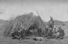  
Click to enlarge](img/ntca002.jpg.md)  
Fig. 2. Group of Old Men at a Wurley  

p. 14

leading features, such changes can possibly even be mooted. The only
possible chance is by means of the old men, and, in the case of the
Arunta people, amongst whom the local feeling is very strong, they have
opportunities of a special nature. Without belonging to the same group,
men who inhabit localities close to one another are more closely
associated than men living at a distance from one another, and, as a
matter of fact, this local bond is strongly marked—indeed so marked was
it during the performance of their sacred ceremonies that we constantly
found it necessary to use the term “local relationship.” Groups which
are contiguous locally are constantly meeting to perform ceremonies; and
among the Alatunjas who thus come together and direct proceedings there
is perfectly sure, every now and again, to be one who stands pre-eminent
by reason of superior ability, and to him, especially on an occasion
such as this, great respect is always paid. It would be by no means
impossible for him to propose to the other older men the introduction of
a change, which, after discussing it, the Alatunjas of the local groups
gathered together might come to the conclusion was a good one, and, if
they did so, then it would be adopted in that district. After a time a
still larger meeting of the tribe, with head men from a still wider
area—a meeting such as the Engwura, which is described in the following
pages—might be held. At this the change locally introduced would,
without fail, be discussed. The man who first started it would certainly
have the support of his local friends, provided they had in the first
instance agreed upon the advisability of its introduction, and not only
this, but the chances are that he would have the support of the head men
of other local groups of the same designation as his own. Everything
would, in fact, depend upon the status of the original proposer of the
change; but, granted the existence of a man with sufficient ability to
think out the details of any change, then, owing partly to the strong
development of the local feeling, and partly to the feeling of kinship
between groups of the same designation, wherever their local habitation
may be, it seems quite possible that the markedly conservative tendency
of the natives in regard to customs handed down to them from their,

p. 15

ancestors may every now and then be overcome, and some change, even a
radical one, be introduced. The traditions of the tribe indicate, it may
be noticed, their recognition of the fact that customs have varied from
time to time. They have, for example, traditions dealing with supposed
ancestors, some of whom introduced, and others of whom changed, the
method of initiation. Tradition also indicates ancestors belonging to
particular local groups who changed an older into the present marriage
system, and these traditions all deal with special powerful individuals
by whom the changes were introduced. It has been stated by writers such
as Mr. Curr “that the power which enforces custom in our tribes is for
the most part an impersonal one.” [1](#fn_4.md)
Undoubtedly public opinion and the feeling that any violation of tribal
custom will bring down upon the guilty person the ridicule and
opprobrium of his fellows is a strong, indeed a very strong, influence;
but at the same time there is in the tribes with which we are personally
acquainted something beyond this. Should any man break through the
strict marriage laws, it is not only an “impersonal power” which he has
to deal with. The head men of the group or groups concerned consult
together with the elder men, and, if the offender, after long
consultation, be adjudged guilty and the determination be arrived at
that he is to be put to death—a by no means purely hypothetical
case—then the same elder men make arrangements to carry the sentence
out, and a party, which is called an “*ininja*,” is organised for the
purpose. The offending native is perfectly well aware that he will be
dealt with by something much more real than an “impersonal power.” [2](#fn_5.md)

In addition to the Alatunja, there are two other classes of men who are
regarded as of especial importance; these are the so-called “medicine
men,” and in the second place the men who are supposed to have a special
power of communicating with the *Iruntarinia* or spirits associated with
the tribe. Needless to say there are grades of skill recognised

p. 16

amongst the members of these two classes, in much the same way as we
recognise differences of ability amongst members of the medical
profession. In subsequent chapters we shall deal in detail with these
three special types; meanwhile in this general *résumé* it is sufficient
to note that they have a definite standing and are regarded as, in
certain ways, superior to the other men of the tribe. It may, however,
be pointed out that, while every group has its Alatunja, there is no
necessity for each to have either a medicine or an *Iruntarinia* man,
and that in regard to the position of the latter there is no such thing
as hereditary succession.

Turning again to the group, we find that the members of this wander,
perhaps in small parties of one or two families, often, for example, two
or more brothers with their wives and children, over the land which they
own, camping at favourite spots where the presence of waterholes, with
their accompaniment of vegetable and animal food, enables them to supply
their wants. [1](#fn_6.md)

In their ordinary condition the natives are almost completely naked,
which is all the more strange as kangaroo and wallaby are not by any
means scarce, and one would think that their fur would be of no little
use and comfort in the winter time, when, under the perfectly clear sky,
which often remains cloudless for weeks together, the radiation is so
great that at

p. 17

[  
Click to enlarge](img/ntca003.jpg.md)  
Fig. 3. Members of a Family of Arunta Natives, showing the Wurley,
Weapons and Implements used in daily life  

night-time the temperature falls several degrees below freezing point.
The idea of making any kind of clothing as a protection against cold
does not appear to have entered the native mind, though he is keen
enough upon securing the Government blanket when he can get one, or, in
fact, any stray cast-off clothing of the white man. The latter is
however worn as much from motives of vanity as from a desire for warmth;
a lubra with nothing on except an ancient straw hat and an old pair of
boots is perfectly happy. The very kindness of the white man who
supplies him, in outlying parts, with stray bits of clothing is by no
means conducive to the longevity of the native. If you give a black
fellow, say a woollen shirt, he will perhaps wear it for a day or two,
after that his wife will be adorned with it, and then, in return for
perhaps a little food, it will be passed on to a friend. The natural
result is that, no sooner do the natives come into contact with white
men, than phthisis and other diseases soon make their appearance, and,
after a comparatively short time,

p. 18

[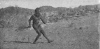  
Click to enlarge](img/ntca004.jpg.md)  
Fig. 4. Spear Throwing  

all that can be done is to gather the few remnants of the tribe into
some mission station where the path to final extinction may be made as
pleasant as possible.

If, now, the reader can imagine himself transported to the side of some
waterhole in the centre of Australia, he would probably find amongst the
scrub and gum-trees surrounding it a small camp of natives. Each family,
consisting of a man and one or more wives and children, accompanied
always by dogs, [1](#fn_7.md) occupies a *mia-mia*,
which is merely a lean-to of shrubs so placed as to shield the occupants
from the prevailing wind, which, if it be during the winter months, is
sure to be from the south-east. In front of this, or inside if the
weather be cold, will be a small fire of twigs, for the black fellow
never makes a large fire as the white man does. In this respect he
certainly regards the latter as a strange being, who makes a big fire
and then finds it so hot that he cannot go anywhere near to it. The
black fellow's idea is to make a small fire such that he can lie coiled
round it and, during the night, supply it

p. 19

[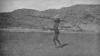  
Click to enlarge](img/ntca005.jpg.md)  
Fig. 5. Spear Throwing  

with small twigs so that he can keep it alight without making it so hot
that he must go further away.

Early in the morning, if it be summer, and not until the sun be well up
if it be winter, the occupants of the camp are astir. Time is no object
to them, and, if there be no lack of food, the men and women all lounge
about while the children laugh and play. If food be required, then the
women will go out accompanied by the children and armed with digging
sticks and *pitchis*, [1](#fn_8.md) and the day will
be spent out in the bush in search of small burrowing animals such as
lizards and small marsupials. The men will perhaps set off armed with
spears, spear-throwers, boomerangs and shields in search of larger game
such as emus and kangaroos. The latter are secured by stalking, when the
native gradually approaches his prey with perfectly noiseless footsteps.
Keeping a sharp watch on the animal, he remains absolutely still, if it
should turn its head, until once more it resumes its feeding. Gradually,
availing himself of the shelter of any bush or large tussock of grass,
he approaches near enough to throw

p. 20

his spear. The end is fixed into the point of the spear-thrower, and,
aided by the leverage thus gained, he throws it forward with all his
strength. Different men vary much in their skill in spear-throwing, but
it takes an exceptionally good man to kill or disable at more than
twenty yards. Sometimes two or three men will hunt in company, and then,
while one remains in ambush, the others combine to drive the animals as
close as possible to him. Euros [1](#fn_9.md) are
more easily caught than kangaroos, owing to the fact that they inhabit
hilly and scrub country, across which they make “pads,” by the side of
which men will lie in ambush while parties of women go out and drive the
animals towards them. On the ranges the rock-wallabies have definite
runs, and close by one of these a native will sit patiently, waiting
hour by hour, until some unfortunate beast comes by.

In some parts the leaves of the pituri plant (*Duboisia Hop-woodii*) are
used to stupefy the emu. The plan adopted is to make a decoction in some
small waterhole at which the animal is accustomed to drink. There,
hidden by some bush, the native lies quietly in wait. After drinking the
water the bird becomes stupefied, and easily falls a prey to the black
fellow's spear. Sometimes a bush shelter is made, so as to look as
natural as possible, close by a waterhole, and from behind this animals
are speared as they come down to drink. It must be remembered that
during the long dry seasons of Central Australia waterholes are few and
far between, so that in this way the native is aided in his work of
killing animals. In some parts advantage is taken of the inquisitive
nature of the emu. A native will carry something which resembles the
long neck and small head of the bird and will gradually approach his
prey, stopping every now and then, and moving about in the aimless way
of the bird itself. The emu, anxious to know what the thing really is,
will often wait and watch it until the native has the chance of throwing
his spear at close quarters. Sometimes a deep pit will be dug in a part
which is known to be a feeding ground of the bird. In the bottom of this
a short, sharply-pointed spear will be fixed upright, and then, on the
top, bushes will be spread and earth

p. 21

[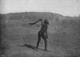  
Click to enlarge](img/ntca006.jpg.md)  
Fig. 6. Boomerang Throwing  

scattered upon them. The inquisitive bird comes up to investigate the
matter, and sooner or later ventures on the bushes, and, falling
through, is transfixed by the spear. Smaller birds such as the rock
pigeons, which assemble in flocks at any waterhole, are caught by
throwing the boomerang amongst them, and larger birds, such as the
eagle-hawk, the down of which is much valued for decorating the body
during the performance of sacred ceremonies, are procured by the same
weapon.

It may be said that with certain restrictions [1](#fn_10.md) which apply partly to groups of
individuals and partly to individuals at certain times of their lives,
everything which is edible is used for food. [2](#fn_11.md) So far as cooking is concerned, the method
is primitive. Many of the vegetables such as the Irriakura (the bulb of
*Cyperus rotundus*), may be eaten raw, or they may be

p. 22

roasted in hot ashes. Very often large quantities of the pods of an
acacia will be gathered and laid on the hot ashes, some of which are
heaped up over them, and then the natives simply sit round, and “shell”
and eat the seeds as if they were peas—in fact they taste rather like
raw green peas. Perhaps the most standard vegetable diet of the natives
in this part of the Centre is what is called by the natives in the north
of the Arunta, Ingwitchika, and by white men usually Munyeru. This is
the seed of a species of Claytonia. The women gather large quantities
and winnow the little black seeds by pouring them from one *pitchi* into
another so that the wind may carry off the loose husks, or else, taking
some up in their hands, they blow the husks away. When freed from the
latter, they are placed on one of the usual grinding stones and then
ground down with a smaller stone held in the hand. Water is poured on
every now and then, and the black, muddy-looking mixture tumbles over
the side into a receptacle, and is then ready for eating either raw or
after baking in the ashes. Munyeru seems to take the place amongst these
tribes of the Nardoo (the spore cases of *Marsilea quadrifolia*) which
is a staple article of food in the Barcoo district and other parts of
the interior of Australia.

In the case of animals the larger ones are usually cooked in more or
less shallow pits in the ground. An opossum is first of all
disembowelled, the wool is then plucked off with the fingers and the
body placed on the hot ashes. A rock wallaby is treated in much the same
way, except that the hair is first singed off in the fire and then the
skin is scraped with a piece of flint. The ashes are heaped up over the
body, which, when partly cooked, is taken out and an incision made in
each groin; the holes fill and refill with fluid, which is greatly
appreciated and drunk up at once. The animal is then divided up, the
flint at the end of the spear-thrower being used for this purpose. When
cooking an Echidna the intestines are first removed. Then a small hole
is dug, the bottom is sprinkled with water, and the animal placed in it.
The back is covered with a layer of moist earth or sand, which is
removed after about a quarter of an hour, and hot ashes substituted,
which are removed after a few minutes. The p.
23 skin with the quills is next cut off with a flint, and the
body is then placed amongst hot ashes till cooked.

When a euro or kangaroo is killed, the first thing that is always done
is to dislocate the hind-legs so as to make the animal what is called
*atnuta* or limp. A small hole is cut with a flint in one side of the
abdomen, and after the intestines have been pulled out, it is closed up
with a wooden skewer. The intestines are usually cooked by rolling them
about in hot sand and ashes, any fat which may be present being
carefully removed, as it is esteemed a great delicacy. One of the first
things to be done is to extract the tendons from the hind limbs. To do
this the skin is cut through close to the foot with the sharp bit of
flint which is attached to the end of the spear-thrower. A hitch is next
taken round the tendon with a stick, and then, with one foot against the
animal's rump, the man pulls until the upper end gives way. Then the
loose end is held in the teeth, and, when tightly stretched, the lower
end is cut through with the flint and the tendon thus extracted is
twisted up and put for safe keeping beneath the waist girdle, or in the
hair of the head just behind the ear. These tendons are of great service
to the natives in various ways, such as for attaching the barbed points
on to the ends of the spears, or for splicing spears or mending broken
spear-throwers. Meanwhile a shallow pit, perhaps one or two feet deep,
has been dug with sticks, and in this a large fire is made. When this
burns up, the body is usually held in the flames to singe off the fur,
after which it is scraped with a flint. Sometimes this part of the
performance is omitted. The hind legs are cut off at the middle joint
and the tail either divided in the middle or cut off close to the stump.
When the fire has burnt down the animal is laid in the pit on its back
with its legs protruding through the hot ashes, which are heaped up over
it. After about an hour it is supposed to be cooked, and is taken off,
laid on green boughs so as to prevent it from coming in contact with the
earth, and then cut up, the hind legs being usually removed first. In
some parts where the fur is not singed off, the first thing that is done
after removing the body from the fire is to take off the burnt skin. The
carver assists himself, during the process p.
24 of cutting the body up into joints, to such dainty morsels as
the heart and kidneys, while any juice which accumulates in the internal
cavities of the body is greedily drunk.

When cooking an emu the first thing that is done is to roughly pluck it;
an incision is then made in the side and the intestines withdrawn, and
the inside stuffed with feathers, the cut being closed by means of a
wooden skewer. A pit is dug sufficiently large to hold the body and a
fire lighted in it, over which the body is held and singed so as to get
rid of the remaining feathers. The legs are cut off at the knee joint,
and the head brought round under one leg, to which it is fastened with a
wooden skewer. The ashes are now removed from the pit, and a layer of
feathers put in; on these the bird is placed resting on its side;
another layer of feathers is placed over the bird, and then the hot
ashes are strewn over. When it is supposed to be cooked enough, it is
taken out, placed on its breast, and an incision is made running round
both sides so as to separate the back part from the under portion of the
body. It is then turned on to its back, the legs taken off and the meat
cut up.

The tracking powers of the native are well-known, but it is difficult to
realise the skill which they display unless one has seen them at
work. [1](#fn_12.md) Not only does the native know
the track of every beast and bird, but after examining any burrow he
will at once, from the direction in which the last track runs, tell you
whether the animal is at home or not. From earliest childhood boys and
girls alike are trained to take note of every track made by every living
thing. With the women especially it is a frequent amusement to imitate
on the sandy ground the tracks of various animals, which they make with
wonderful accuracy with their hands. Not only do they know the varied
tracks of the latter, but they will distinguish those of particular men
and women. In this respect the men vary greatly, a fact which is well
known to, and appreciated

p. 25

by, those in charge of the native police in various parts of the
interior of the continent. Whilst they can all follow tracks which would
be indistinguishable to the average white man, there is a great
difference in their ability to track when the tracks become obscure. The
difference is so marked that while an ordinary good tracker will have
difficulty in following them while he is on foot, and so can see them
close to, a really good one will unerringly follow them up on horse or
camel back. [1](#fn_13.md) Not only this, but,
strange as it may sound to the average white man whose meals are not
dependent upon his ability to track an animal to its burrow or hiding
place, the native will recognise the footprint of every individual of
his acquaintance.

Whilst in matters such as tracking, which are concerned with their
everyday life, and upon efficiency in which they actually depend for
their livelihood, the natives show conspicuous ability, there are other
directions in which they are as conspicuously deficient. This is perhaps
shown most clearly in the matter of counting. At Alice Springs they
occasionally count, sometimes using their fingers in doing so, up to
five, but frequently anything beyond four is indicated by the word
*oknira*, meaning much or great. One is *nintha*, two *thrama* or
*thera*, three *urapitcha*, four *therankathera*, five
*theranka-thera-nintha*. Time is counted by “sleeps” or “moons,” or
phases of the moon, for which they have definite terms: longer periods
they reckon by means of seasons, having names for summer and winter.
They have further definite words expressing particular times, such as
morning before sunrise (*ingwunthagwuntha*), evening (*ungwūrila*),
yesterday (*abmirka*), day before yesterday (*abmirkairprina*),
to-morrow (*ingwuntha*), day after to-morrow (*ingwunthairprina*),

p. 26

in some days (*ingwunthalkura*), in a short time (*ingwunthaunma*), in a
long time (*ingwuntha arbarmaninja*). [1](#fn_14.md) It may also be said that for every animal
and plant which is of any service to them, and for numberless others,
such as various forms of mice, insects, birds, &c., amongst animals, and
various kinds of shrubs and grasses amongst plants, they have
distinctive names; and, further still, they distinguish the sexes,
*marla* indicating the female sex, and *uria* the male. In many respects
their memory is phenomenal. Their mental powers are simply developed
along the lines which are of service to them in their daily life.

However, to return to the native camp once more. If we examine their
weapons and implements of various kinds, that is those usually carried
about, they will be found to be comparatively few in number and simple.
A woman has always a *pitchi*, that is a wooden trough varying in length
from one to three feet, which has been hollowed out of the soft wood of
the bean tree (*Erythrina vespertilio*), or it may be out of hard wood
such as mulga or eucalypt. In this she carries food material, either
balancing it on her head or holding it slung on to one hip by means of a
strand of human hair or ordinary fur string across one shoulder. Not
infrequently a small baby will be carried about in a *pitchi*. The only
other implement possessed by a woman is what is popularly called a “yam
stick,” which is simply a digging stick or, to speak more correctly, a
pick. The commonest form consists merely of a straight staff of wood
with one or both ends bluntly pointed, and of such a size that it can
easily be carried in the hand and used for digging in the ground. When
at work, a woman will hold the pick in the right hand close to the lower
end, and, alternately digging this into the ground with one hand, while
with the other she scoops out the loosened earth, will dig down with
surprising speed. In parts of the scrub, where live the honey ants,
which form,

p. 27

a very favourite food of the natives, acre after acre of hard sandy soil
is seen to have been dug out, simply by the picks of the women in search
of the insect, until the place has just the appearance of a deserted
field where diggers have, for long, been at work “prospecting.” Very
often a small *pitchi* will be used as a shovel or scoop, to clear the
earth out with, when it gets too deep to be merely thrown up with the
hand, as the woman goes on digging deeper and deeper until at last she
may reach a depth of some six feet or even more. Of course the children
go out with the women, and from the moment that they can toddle about
they begin to imitate the actions of their mother. In the scrub a woman
will be digging up lizards or honey ants while close by her small child
will be at work, with its diminutive pick, taking its first lessons in
what, if it be a girl, will be the main employment of her life.

So far as clothing is concerned, a woman is not much encumbered in her
work. She usually wears around her neck one or more rings, each of which
is commonly formed of a central strand of fur string, round which other
strands are tightly wound till the whole has a diameter varying from a
quarter to half an inch. The two ends of the central strand are left
projecting so that they can be tied behind the neck, and the ring thus
made is thickly coated with grease and red ochre. A similar kind of ring
is often worn on the head [1](#fn_15.md) and,
amongst the younger women especially, instead of, or perhaps in addition
to, the hair neck ring, there may be worn a long string of the bright
red beads of the bean tree. Each bead is bored through with a fire
stick, and the pretty necklet thus made hangs round the neck in several
coils, or may pass from each shoulder under the opposite arm pit.

North of the Macdonnell Ranges the women wear small aprons formed of
strands of fur string suspended from a waist string, and on the forehead
they often wear an ornament composed of a small lump of porcupine-grass
resin, into which are fixed either a few kangaroo incisor teeth or else
a number

p. 28

of small bright red seeds. A short strand of string is fixed into the
resin and by means of this the ornament is tied to the hair, so that it
just overhangs the forehead.

The men's weapons consist of shield, spears, boomerang and
spear-thrower, all of which are constantly carried about when on the
march. The shields, though they vary in size, are of similar design over
practically the whole Central area. They are uniformly made of the light
wood of the bean tree, so that their actual manufacture is limited to
the more northern parts where this tree grows. The Warramunga tribe are
especially noted for their shields, which are traded far and wide over
the Centre. Each has a distinctly convex outer and a concave inner
surface, in the middle of which a space is hollowed out, leaving a bar
running across in the direction of the length, which can be grasped by
the hand.

In the Ilpirra, Arunta and Luritcha tribes the ordinary spear is about
ten feet, or somewhat less, in length; the body is made of Tecoma wood
and the tip of a piece of mulga, which is spliced on to the body and the
splicing bound round with tendon. Close to the sharp point a small
curved barb is attached by tendon, though in many this barb is wanting.
A rarer form of spear is made out of heavier wood, such as the desert
oak (*Casuarina Descaineana*), and this is fashioned out of one piece
and has no barb.

The spear-thrower is perhaps the most useful single thing which the
native has. It is in the form of a hollowed out piece of mulga from two
feet to two feet six inches in length, with one end tapering gradually
to a narrow handle, and the other, more suddenly, to a blunt point, to
which is attached, by means of tendon, a short, sharp bit of hard wood
which fits into a hole in the end of a spear. At the handle end is a
lump of resin into which is usually fixed a piece of sharpedged flint or
quartzite, which forms the most important cutting weapon of the native.

The boomerangs are not like the well-known ones which are met with in
certain other parts and which are so made that when thrown they return
to the sender. The Central Australian native does not appear to have hit
upon this contrivance, or, at least, if he ever possessed any such, the
art of making

p. 29

[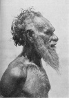  
Click to enlarge](img/ntca007.jpg.md)  
Fig. 7. Arunta Native, side face  

them is now completely lost; his boomerang has a widely open curve, and
the flat blade lies wholly in one plane.

In addition to these weapons a man will probably carry about with him a
small wallet which is made simply of part of the skin of some animal, or
perhaps of short strips of bark p. 30 tied
round with fur string. In this wallet he will carry a tuft or two of
feathers for decoration, a spare bit or two of quartzite, a piece of red
ochre, a kind of knout which has the form of a skein of string, and is
supposed, by men and women alike, to be of especial use and efficacy in
chastising women, and possibly he will have some charmed object, such as
a piece of hair cut from a dead man's head and carefully ensheathed in
hair or fur string. If the man be old it is not at all unlikely that he
will have with him, hidden away from the sight of the women, a sacred
stick or bull-roarer, or even a sacred stone.

In the south of the Arunta tribe the women weave bags out of string made
of fur or vegetable fibre, in which they carry food, &c., but these are
not found in the northern parts.

One of the most striking and characteristic features of the Central
Australian implements and weapons is the coating of red ochre with which
the native covers everything except his spear and spear-thrower.

As regards clothing and ornament, the man is little better off than the
woman. His most constant article is a waist belt made of human
hair—usually provided by his mother-in-law. On his forehead, stretched
across from ear to ear, is a *chilara* or broad band made of parallel
strands of fur string, and around his neck he will have one or more
rings similar to those worn by the women. His hair will be well greased
and also red ochred, and in the Luritcha and Arunta it may be surmounted
by a pad of emu feathers, worn in much the same way as a chignon, and
tied on to the hair with fur string. If he be at all vain he will have a
long nose-bone ornament, with a rat-tail or perhaps a bunch of cockatoo
feathers at one end, his *chilara* will be covered with white pipeclay
on which a design will be drawn in red ochre, and into either side of
his chignon will be fastened a tuft of white or brightly-coloured
feathers. His only other article of clothing, if such it can be called,
is the small public tassel which, especially if it be covered with white
pipeclay, serves rather as an ornament than as a covering.

Such are the ordinary personal belongings of the natives which they
carry about with them on their wanderings.

p. 31

[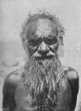  
Click to enlarge](img/ntca008.jpg.md)  
Fig. 8. Arunta Native, full face  

Each local group has certain favourite camping grounds by the side of
waterholes, where food is more or less easily attainable, and in spots
such as these there will always be found clusters of *mia-mias*, made of
boughs, which are simply replaced as the old ones wither up, or when
perhaps in the hot weather they are burnt down.

When many of them are camped together it can easily be seen that the
camp is divided into two halves, each separated from the other by some
such natural feature as a small creek, p. 32
or very often if the camping place be close to a hill, the one half will
erect its *mia-mias* on the rising, and the other on the low ground. We
shall see later that in the case of the Arunta tribe, for example, all
the individuals belong to one or other of the four divisions called
Panunga, Bulthara, Purula and Kumara, and in camp it will be found that
the first two are always separated from the last two.

During the day-time the women are sure to be out in search of food,
while the men either go out in search of larger game, or else, if lazy
and food be abundant, they will simply sleep all day, or perhaps employ
their time in making or trimming up their weapons. When conditions are
favourable every one is cheerful and light-hearted, though every now and
then a quarrel will arise, followed perhaps by a fight, which is usually
accompanied by much noise and little bloodshed. On such occasions, if it
be the women who are concerned, fighting clubs will be freely used and
blows given and taken which would soon render *hors de combat* an
ordinary white woman, but which have comparatively little effect upon
the black women; the men usually look on with apparent complete
indifference, but may sometimes interfere and stop the fight. If,
however, two men are fighting, the mother and sisters of each will
cluster round him, shouting at the top of their voices and dancing about
with a peculiar and ludicrous high knee action, as they attempt to
shelter him from the blows of his adversary's boomerang or fighting
club, with the result that they frequently receive upon their bodies the
blows meant for the man whom they are attempting to shield.

As a general rule the natives are kindly disposed to one another, that
is of course within the limits of their own tribe, and, where two tribes
come into contact with one another on the border land of their
respective territories, there the same amicable feelings are maintained
between the members of the two. There is no such thing as one tribe
being in a constant state of enmity with another so far as these Central
tribes are concerned. Now and again of course fights do occur between
the members of different local groups who may or may not belong to the
same or to different tribes.

We have already spoken of the local groups as being composed

p. 33

[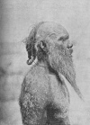  
Click to enlarge](img/ntca009.jpg.md)  
Fig. 9. Arunta Native, old man  

p. 34

mainly of individuals each of whom bears the name of some animal or
plant; that is each such group consists, to a large extent, but by no
means exclusively, of men and women of, what is commonly spoken of as, a
particular totem. The question of totems amongst these tribes will be
dealt with in detail subsequently, what we desire to draw attention to
here is simply the fact that, in these tribes, there is no such thing as
the members of one totem being bound together in such a way that they
must combine to fight on behalf of a member of the totem to which they
belong. If, for example, a large number of natives are gathered together
and a fight occurs, then at once the Panunga and Bulthara men on the one
hand, and the Purula and Kumara on the other hand, make common cause. It
is only indeed during the performance of certain ceremonies that the
existence of a mutual relationship, consequent upon the possession of a
common totemic name, stands out at all prominently. In fact it is
perfectly easy to spend a considerable time amongst the Arunta tribe
without even being aware that each individual has a totemic name,
whilst, on the other hand, the fact that every individual belongs to one
or other of the divisions, Panunga, Purula, etc., is soon apparent. This
is associated with the fact that in these tribes, unlike what obtains in
so many of the tribes whose organisation has hitherto been described,
the totem has nothing whatever to do with regulating marriage, nor again
does the child of necessity belong either to its mother's or its
father's totem.

In many works on anthropology it is not unusual to see a particular
custom which is practised in one or more tribes quoted in general terms
as the custom of “the Australian native.” It is, however, essential to
bear in mind that, whilst undoubtedly there is a certain amount in
common as regards social organisation and customs amongst the Australian
tribes, yet, on the other hand, there is great diversity. Some tribes,
for example, count descent in the maternal line, others count it in the
paternal line; indeed, it is not as yet possible to say which of these
methods is the more widely practised in Australia. In some tribes totems
govern marriage, in others they have nothing to do with the question. In
some

p. 35

[  
Click to enlarge](img/ntca010.jpg.md)  
Fig. Arunta Native, to show the frizzly nature of the beard  

tribes a tooth is knocked out at the initiation rite, in others the
knocking out of the tooth may be practised, but is not part of the
initiation rite, and in others again the custom is not practised at all.
In some tribes the initiation rite consists in circumcision and perhaps
other forms of mutilation as well; in others this practice is quite
unknown. In some tribes there is a sex totem, in others there is no such
thing; and in isolated cases we meet with an individual totem p. 36 distinct from the totem common to a group of
men and women.

When the great size of the land area occupied by the Australian tribes
is taken into account, such diversity in custom and organisation is not
to be wondered at. When, if ever, we gain an adequate knowledge of the
various tribes still left, it may be possible to piece the whole
together and to trace out the development from a common starting-point
of the various customs and systems of organisation met with in different
parts of the continent. At the present time we can perhaps group the
tribes into two or three large divisions, each possessing certain
well-marked features in common, such as counting descent in the maternal
or paternal line as the case may be, but beyond this, as yet, we cannot
go. [1](#fn_16.md)

p. 37

In the matter of personal appearance, whilst conforming generally to the
usual Australian type of features, there is very considerable difference
between various individuals. In the matter of height, the average of
twenty adult males measured by us, was 166.3 cm. The tallest was 178.2
cm., and the shortest 158.2 cm. The average of ten adult females was
156.8 cm.; the tallest was 163 cm., and the shortest was 151.5 cm. The
average chest measurement of the same twenty men was 90.33 cm.; the
greatest being 97 cm., and the least 83 cm.

In some the pronounced curve of the nose gave superficially a certain
Jewish aspect, though in many this curve was completely wanting, and in
all the nasal width was very considerable, the spreading out of the
lobes being certainly emphasised by the practice of wearing a nose-bone.
In the twenty males the average width was 4.8 cm. and the length 5.1
cm.; in the ten females the average width was 4.3 cm. and the length 4.6
cm. The greatest width in any male was 5.4 cm. and the least 3.9 cm.;
the length of the former was 5.2 cm., and of the latter 4 cm. The
greatest length was 6.2 cm., and in this case the width was 4.9 cm.,
which represents the greatest variation measured as between the length
and width, the latter in some few cases (five out of the thirty)
slightly exceeding the length. The root of the nose is depressed and the
supra-orbital ridges very strongly marked. The buccal width is
considerable, averaging 5.8 cm. in the males and 5.4 cm. in the females.
The greatest width in the males is 6.5 cm. and in the females 6 cm., the
least width being respectively 5.3 cm. and 4.7 cm. The lips are always
thick.

In colour the Central Australian, though usually described as black, is
by no means so. Out of the twenty males examined all, save one,
corresponded as closely as possible with the chocolate-brown which is
numbered 28 on Broca's scheme, [1](#fn_17.md) the
odd one was slightly lighter. The only way in which to judge correctly
of the colour is to cut a small square hole in a sheet of white paper
and to place this upon the skin; unless this is done there is a tendency
on first inspection to think that the tint is darker than it really is.
To ascertain

p. 38

the tint two or three parts of the body were tested, the chest, back and
legs. It must be remembered that the Central Australian native is fond
of rubbing himself over with grease and red ochre, especially at times
when ceremonies are being performed, but we do not think that in the
individuals examined this interfered materially with the determination,
the colour of all the individuals and of the various parts tested being
strikingly uniform. While at work we always had two or three of them
together, and they could always detect the patch of colour on the plate
which corresponded to that of the skin examined. The women, with one
exception, corresponded in colour to number 29, the odd one being of the
darker shade, number 28, like the men. The new-born child is always of a
decidedly lighter tint, but it rapidly darkens after the first day or
two. A half-caste girl at Alice Springs corresponded to number 21 in
colour, and the offspring, a few months old, by a white man of a
half-caste woman in the southern part of the tribe, was
undistinguishable in colour from the average English child of the same
age.

The hair of the head is always well developed in the males, though,
owing to certain customs which will be described later, and which
necessitate the periodical cutting off of the hair, the amount on the
head of any individual is a variable quantity. When fully developed it
falls down over the shoulders in long and very wavy locks. As a general
rule it is shorter than this, but it always appears to be more or less
wavy, though the fondness of the natives for smearing it over with
grease and red ochre frequently results in the production of tangled
locks, in each of which the component hairs are matted together, whereas
in the natural state they would simply form a wavy mass. The beard is
usually well-developed, and better so amongst the Arunta, Ilpirra, and
Luritcha than amongst the northern tribes, such as the Warramunga and
Waagi, where the whiskers are usually but comparatively poorly
developed. The beard is usually frizzy rather than wavy, and in some
instances this feature is a very striking one; but we have never,
amongst many hundred natives examined, seen one which could be called
woolly. The colour, except amongst the older men who have reached an age
of,

p. 39

[  
Click to enlarge](img/ntca011.jpg.md)  
Fig. 11. Arunta Native, to show the wavy nature of the hair  

so far as can be judged, fifty or sixty years, when the hair becomes
scanty and white, is usually jet black, though the presence of abundant
red ochre may, at first sight, cause it to appear to be of a more
brownish hue, and occasionally it is of a dark brown tint rather than
jet black. Amongst the children there are now and then met with some
whose hair is of a decidedly lighter colour, but the lightness is
confined to the tips, very rarely reaching to the roots, and with the
growth of the individual it usually, but not always, assumes the normal
dark colour. The legs and arms usually have a thin coating p. 40 of short, crisp, black hair, and sometimes the
whole body may be covered with hair, the most extreme development of
which was seen in the case of one of the oldest men, where, as the hair
was white with age, it stood out in strong contrast to the dark skin;
but, as a rule, the hairs on the general surface of the body are nothing
like so strongly developed as in the case of the average Englishman, and
are not noticeable except on close examination.

The method of treatment of the hair varies in different tribes and
produces a marked difference in the appearance of the face. In all the
tribes living between Charlotte Waters in the south and Tennant Creek in
the north the men, at puberty, pull out the hairs on the forehead,
causing this to look much more lofty and extensive than it is in
reality. Each hair is separately pulled out, and over the part thus
artificially made bare the *chilara* or forehead band is worn. The
remaining hair is tightly pulled back and usually bound round with fur
string, and is often in the Arunta and Luritcha tribes surmounted by the
emu-feather chignon already referred to. In the Urabunna tribe away to
the south of Charlotte Waters the hair is often enclosed in a net-like
structure. In the Warramunga tribe the older men, but only those who
have reached an age of about forty years, pull the hairs out of the
upper lip, a custom never practised in the more southern tribes.

Amongst the women the hair is generally worn short, [1](#fn_18.md) which is closely associated with the fact
that, at times, each woman has to present her hair to the man who is
betrothed to her daughter, for the purpose of making him a waist-belt.
The body is usually smooth with, at most, a development of very fine
short hairs only perceptible on close examination, and there may be
occasionally a well-marked development of hair on the lip or chin, which
is especially noticeable in the old women, some of whom are probably
fifty years of age and have reached a stage of ugliness which baffles
description.

A very striking feature of both men and women are the body scars which
are often spoken of as tattoo marks, a name which, as Dr. Stirling says,
“is unfortunate and should be

p. 41

[  
Click to enlarge](img/ntca012.jpg.md)  
12. Group of Warramunga Men, four of the older ones have the upper lip
bare  

abandoned, as the scars in question with which the bodies of Australian
natives are generally decorated differ entirely from the coloured
patterns produced by the permanent staining of the tissue with pigments
to which the term tattoo mark ought to be limited.” [1](#fn_19.md)

Every individual has a certain number of these scars raised on his body
and arms, but very rarely on the back. As is well known, they are made
by cutting the skin with a piece of flint, or, at the present day, glass
is used when obtainable, and into the wound thus made ashes are rubbed
or the down of the eagle-hawk, the idea being, so they say, to promote
healing, and not, though the treatment probably has this effect, to aid
in the raising of a scar. In some cases they may stretch right across
the chest or abdomen. As a general rule the scars are both more numerous
and longer on the men than on

p. 42

the women, but no definite distinction can be drawn in this respect; the
absolutely greatest number of scars noticed being on a woman on whom
there were forty roughly parallel cicatrices between the navel and a
point just above the breasts. Very frequently, on the other hand, the
scars are limited on a woman to one or two which unite the breasts
across the middle line. The cicatrices in the region of the breast
usually stand out most prominently, the most marked ones having an
elevation of 15 mm. and a width of 20 mm. In addition to these roughly
horizontal bands, which are always made in greater or lesser number,
others may be present which we may divide into three series, (*a*) a few
usually curved bands on the scapular region which are not often met
with; (*b*) a series of usually paired short bands leading off on either
side obliquely across the chest to the shoulder; (*c*) bands on the
arms. In some cases these may be vertically disposed, in others
horizontally, and in others we find some of one form and some of the
other. In all of them again there is no distinction to be drawn between
men and women. Occasionally the cicatrices on the arm will be as
prominent as those on the body, but usually they are less so.

There is, apart from ornament, no special meaning, so far as their form
or arrangement is concerned, to be attached at the present day to these
cicatrices, nor could we discover anything in their customs and
traditions leading to the belief that they had ever had any deeper
meaning. [1](#fn_20.md) Vague statements have been
made with regard to marks such as these, to the effect that they
indicate, in some way, the particular division of the tribe to which
each individual belongs. Amongst the tribes from Oodnadatta in the
south, to Tennant Creek in the north, they certainly have no such
meaning, and we are very sceptical as to whether they have anywhere in
Australia; they are so characteristic of the natives of many parts, that
the idea of their having a definite meaning is one which naturally
suggests itself; but at all events, so far as the tribes now dealt with
are concerned, they have no significance at

p. 43

[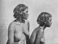  
Click to enlarge](img/ntca013.jpg.md)  
Fig. 13. Young Women, Arunta Tribe, side face  

the present day as indicative of either tribal, class, or totemic group.

In addition to these every man will be marked usually on the left
shoulder, but sometimes on the right as well, with irregular scars which
may form prominent cicatrices, and are the result of self-inflicted
wounds made on the occasion of the mourning ceremonies which are
attendant upon the death of individuals who stand in certain definite
relationships to him, such, for example, as his *Ikuntera* or
father-in-law, actual or tribal. Not infrequently the men's thighs will
be marked with scars indicative of wounds inflicted with a stone knife
during a fight.

Just like the men, the women on the death of certain relatives cut
themselves, and these cuts often leave scars behind. Sometimes writers
have described these scars and treated them as evidence of the cruel
treatment of the women by the men, whereas, as a matter of fact, by far
the greater number

p. 44

of scars, which are often a prominent feature on a woman's body, are the
indications of self-inflicted wounds, and of them she is proud, as they
are the visible evidence of the fact that she has properly mourned for
her dead.

Not infrequently platycnemia, or flattening of the tibial bones, is met
with, and at times the curious condition to which Dr. Stirling has given
the name of Camptocnemia. The latter consists in an anterior curvature
of the tibial bone and gives rise to what the white settlers have, for
long, described by the very apt term “boomerang-leg.” To what extent
either or both of these conditions are racial or pathological it seems
difficult to say, and for a full description of them the reader is
referred to Dr. Stirling's report. [1](#fn_21.md)

As a general rule both men and women are well nourished, but naturally
this depends to a large extent on the nature of the season. When
travelling and hungry the plan is adopted of tightening the waistbelt,
indeed this is worn so tight that it causes the production of a loose
flap of skin, which is often a prominent feature on the abdomens of the
older men. Though the leg is not strongly developed, so far as size is
concerned, still it is not always so spindle-shaped as is usually the
case amongst Australian natives, and the muscles are as hard as
possible, for the black fellow is always in training. The calf is
decidedly thin, the average of the twenty men, in circumference in its
widest part, being 31.5 cm., and of the ten women, 29.8 cm.

The hands are decidedly small, the large span of the men averaging 16.8
cm. and of the women, 15.6 cm. Only three of the men measure over 18
cm., and one measuring 22 cm. was of very exceptional size for a native.
The smallest measures 15.3 cm.

For the measurements of the head reference must be made to the appendix;
here it must suffice to say that the average cephalic index of the
twenty men is 74.5, and that of the ten women, 75.7. These are, of
course, the measurements in the living subject; but, even if we allow
for the two units which Broca concluded should be subtracted from the
index

p. 45

[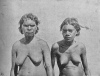  
Click to enlarge](img/ntca014.jpg.md)  
Fig. 14. Young Women, Arunta Tribe, full face  

of the living subject to get that of the cranium, [1](#fn_22.md) they are still relatively high as compared
with the index of 71.5, which may be regarded as about the average index
for Australian skulls. It must also be noted that there is great
variability amongst the different individuals, the minimum measurement
of the males being 68.8 lying at the extreme of dolichocephalic skulls,
while the maximum of 80.55 is just within the limit of
sub-brachicephalic skulls. In the females the smallest index is 73.88,
and the largest 80.7. It must also be remembered that, owing to constant
rubbing of the head with grease and red ochre, which mat the hairs
together and form a kind of coating all round their roots, there is
considerable difficulty experienced in bringing the instrument into
contact with the actual scalp, and that this difficulty has of course to
be encountered twice in the measurement of the transverse

p. 46

diameter. Making all allowances, there remains the strongly marked
variation which undoubtedly exists amongst the various individuals.

We may, in general terms, describe the Arunta native as being somewhat
under the average height of an Englishman. His skin is of a dark
chocolate colour, his nose is distinctly platyrhinic with the root deep
set, his hair is abundant and wavy, and his beard, whiskers and
moustache well-developed and usually frizzled and jet black. His
supra-orbital ridges are well-developed, and above them the forehead
slopes back with the hair removed so as to artificially increase its
size. His body is well formed and very lithe, and he carries himself
gracefully and remarkably erect with his head thrown well back.

Naturally, in the case of the women, everything depends upon their age,
the younger ones, that is those between fourteen and perhaps twenty,
have decidedly well-formed figures, and, from their habit of carrying on
the head *pitchis* containing food and water, they carry themselves
often with remarkable grace. As is usual, however, in the case of savage
tribes the drudgery of food-collecting and child-bearing tells upon them
at an early age, and between twenty and twenty-five they begin to lose
their graceful carriage; the face wrinkles, the breasts hang pendulous,
and, as a general rule, the whole body begins to shrivel up, until, at
about the age of thirty, all traces of an earlier well-formed figure and
graceful carriage are lost, and the woman develops into what can only be
called an old and wrinkled hag.

In regard to their character it is of course impossible to judge them
from a white man's standard. In the matter of morality their code
differs radically from ours, but it cannot be denied that their conduct
is governed by it, and that any known breaches are dealt with both
surely and severely. In very many cases there takes place what the white
man, not seeing beneath the surface, not unnaturally describes as secret
murder, but, in reality, revolting though such slaughter may be to our
minds at the present day, it is simply exactly on a par with the
treatment accorded to witches not so very long ago in European
countries. Every case of such secret murder,

p. 47

[  
Click to enlarge](img/ntca015.jpg.md)  
Fig. 15. Young Woman, Arunta, showing body scars and tooth knocked out  

when one or more men stealthily stalk their prey with the object of
killing him, is in reality the exacting of a life for a life, the
accused person being indicated by the so-called medicine man as one who
has brought about the death of another man

p. 48

by magic, and whose life must therefore be forfeited. [1](#fn_23.md) It need hardly be pointed out what a
potent element this custom has been in keeping down the numbers of the
tribe; no such thing as natural death is realised by the native; a man
who dies has of necessity been killed by some other man, or perhaps even
by a woman, and sooner or later that man or woman will be attacked. In
the normal condition of the tribe every death meant the killing of
another individual.

Side by side, however, with this crude and barbarous custom we find
others which reveal a more pleasing side of the native character.
Generosity is certainly one of his leading features. He is always
accustomed to give a share of his food, or of what he may possess, to
his fellows. It may be, of course, objected to this that in so doing he
is only following an old established custom, the breaking of which would
expose him to harsh treatment and to being looked upon as a churlish
fellow. It will, however, hardly be denied that, as this custom
expresses the idea that in this particular matter every one is supposed
to act in a kindly way towards certain individuals, the very existence
of such a custom, even if it be only carried out in the hope of securing
at some time a *quid pro quo*, shows that the native is alive to the
fact that an action which benefits some one else is worthy of being
performed. And here we may notice a criticism frequently made with
regard to the native, and that is that he is incapable of gratitude. It
is undoubtedly true that the native is not in the habit of showing
anything like excessive gratitude on receiving gifts from the white man,
but then neither does he think it necessary to express his gratitude
when he receives a gift from one of his own tribe. It is necessary to
put one's self into the mental attitude of the native, and then the
matter is capable of being more or less explained and understood. It is
with him a fixed habit to give away part of what he has, and he neither
expects the man to whom he gives a thing to express his gratitude, nor,
when a native gives him anything, does he

p. 49

[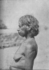  
Click to enlarge](img/ntca016.jpg.md)  
Fig. 16. Old Woman, Arunta Tribe  

think it necessary to do so himself, for the simple reason that giving
and receiving are matters of course in his everyday life; so, when he
receives anything from a white man, he does not think it necessary to do
what he neither does nor is p. 50 expected to
do, in the case of his fellow-tribesmen. It does not occur to him that
an expression of gratitude is necessary. On the other hand he parts, as
a matter of course, and often for the merest trifle (not only what is a
trifle to us, but also to him), with objects which have cost him much
labour to produce, but which a white man perhaps takes a fancy to. That
he is, in reality, incapable of the feeling of gratitude is, so far as
our experience goes, by no means true. It may be added that, taking all
things into account, the black fellow has not perhaps any particular
reason to be grateful to the white man, for it must be remembered that
his feelings are concerned with the group rather than with the
individual. To come in contact with the white man means that, as a
general rule, his food supply is restricted, and that he is, in many
cases, warned off from the water-holes which are the centres of his best
hunting grounds, and to which he has been accustomed to resort during
the performance of his sacred ceremonies; while the white man kills and
hunts his kangaroos and emus he is debarred in turn from hunting and
killing the white man's cattle. Occasionally the native will indulge in
a cattle hunt; but the result is usually disastrous to himself, and on
the whole he succumbs quietly enough to his fate, realising the
impossibility of attempting to defend what he certainly regards as his
own property.

With regard to their treatment of one another it may be said that this
is marked on the whole by considerable kindness, that is, of course, in
the case of members of friendly groups, with every now and then the
perpetration of acts of cruelty. The women are certainly not treated
usually with anything which could be called excessive harshness. They
have, as amongst other savage tribes, to do a considerable part, but by
no means all, of the work of the camp, but, after all, in a good season
this does not amount to very much, and in a bad season men and women
suffer alike, and of what food there is they get their share. If,
however, rightly or wrongly, a man thinks his wife guilty of a breach of
the laws which govern marital relations, then undoubtedly the treatment
of the woman is marked by brutal and often revolting severity. To their
children they are, we may say

p. 51

[  
Click to enlarge](img/ntca017.jpg.md)  
Fig. 17. Young Woman, Warramunga Tribe  

uniformly, with very rare exceptions, kind and considerate, carrying
them, the men as well as the women taking part in this, when they get
tired on the march, and always seeing that they get a good share of any
food. Here again it must be remembered that the native is liable to fits
of sudden passion, and in one of these, hardly knowing what he does, he
may treat a child with great severity. There is no such thing as doing
away with aged or infirm people; on the contrary such are treated with
especial kindness, receiving a share of the food which they are unable
to procure for themselves.

Infanticide is undoubtedly practised, but, except on rare occasions, the
child is killed immediately on birth, and then only when the mother is,
or thinks she is, unable to rear it owing to there being a young child
whom she is still feeding, and with them suckling is continued for it
may be several years. They believe that the spirit part of the child
goes back at once to the particular spot from whence it came, and can

p. 52

be born again at some subsequent time even of the same woman. Twins,
which are of extremely rare occurrence, are usually immediately killed
as something which is unnatural but there is no ill-treatment of the
mother, who is not thought any the less of, such as is described as
occurring in the case of certain West African peoples by Miss Kingsley.
We cannot find out what exactly lies at the root of this dislike of
twins in the case of the Arunta and other tribes. Dr. Fison once
suggested that it might be due to the fact that the idea of two
individuals of the same class being associated so closely was abhorrent
to the native mind, that it was, in fact, looked upon much in the light
of incest. In the case of the twins being one a boy and the other a
girl, this might account for it, but when they both are of the same sex
it is difficult to see how any feeling of this kind could arise.
Possibly it is to be explained on the simpler ground that the parent
feels a not altogether unrighteous anger that two spirit individuals
should think of entering the body of the woman at one and the same time,
when they know well that the mother could not possibly rear them both,
added to which the advent of twins is of very rare occurrence, and the
native always has a dread of anything which appears strange and out of
the common. In connection with this it may be added that on the very
rare occasions on which the child is born at a very premature stage as
the result of an accident, nothing will persuade them that it is an
undeveloped human being; they are perfectly convinced that it is the
young of some other animal, such as a kangaroo, which has by some
mistake got inside the woman. [1](#fn_24.md)

On rare occasions, at all events amongst the Luritcha tribe, children of
a few years of age are killed, the object of this being to feed a weakly
but elder child, who is supposed thereby to gain the strength of the
killed one.

p. 53

[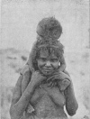  
Click to enlarge](img/ntca018.jpg.md)  
Fig 18. Woman carrying Child, Arunta Tribe  

When times are favourable the black fellow is as light-hearted as
possible. He has not the slightest thought of, or care for, what the
morrow may bring forth, and lives entirely in the present. At night time
men, women and children gather round the common camp fires talking and
singing their monotonous chants hour after hour, until one after the
other they drop out of the circle, going off to their different camps,
and then at length all will be quiet, except for the occasional cry of a
child who, as not seldom happens, rolls over into the fire and has to be
comforted or scolded into quietness.

There is, however, in these, as in other savage tribes, an undercurrent
of anxious feeling which, though it may be stilled and, indeed,
forgotten for a time, is yet always present. In his natural state the
native is often thinking that some enemy is attempting to harm him by
means of evil magic, and, on the other hand, he never knows when a
medicine man in some distant group may not point him out as guilty p. 54 of killing some one else by magic. It is,
however, easy to lay too much stress upon this, for here again we have
to put ourselves into the mental attitude of the savage, and must not
imagine simply what would be our own feelings under such circumstances.
It is not right, by any means, to say that the Australian native lives
in constant dread of the evil magic of an enemy. The feeling is always,
as it were, lying dormant and ready to be at once called up by any
strange or suspicious sound if he be alone, especially at night time, in
the bush; but on the other hand, just like a child, he can with ease
forget anything unpleasant and enter perfectly into the enjoyment of the
present moment. Granted always that his food supply is abundant, it may
be said that the life of the Australian native is, for the most part, a
pleasant one.

In common with all other Australian tribes, those of the Centre have
been shut off from contact with other peoples, and have therefore
developed for long ages without the stimulus derived from external
sources. It is sometimes asserted that the Australian native is
degenerate, but it is difficult to see on what grounds this conclusion
is based. His customs and organisation, as well as his various weapons
and implements, show, so far as we can see, no indication of any such
feature. It may be said that, as far as we are yet acquainted with their
customs, the various tribes may be regarded as descended from ancestors
who observed in common with one another certain customs, and were
regulated by a definite social system which was at one time common to
them all. In course of time, as they wandered over the continent and
became divided into groups, locally isolated to a large extent from one
another, these groups developed along different lines. It is true that
there has not been any strongly marked upward movement, but on the other
hand, with possibly a few exceptions which might have been expected to
occur now and again in particular cases such as that of the Kulin tribe,
instanced by Mr. Howitt, any movement which there has been in social
matters has been clearly in the direction of increasing their
complexity, and there is, at all events, no evidence of the former
existence of any stage of civilisation higher than the one in which we
now find them.

------------------------------------------------------------------------

### Footnotes

[2:1](ntca03.htm#fr_0.md) Gibber is an aboriginal
word meaning a rock or stone. The word is probably derived originally
from a Queensland dialect, but is now used by white men in many parts.
*Gibber-gunyah* is an aboriginal cave dwelling or rock-shelter.

[5:1](ntca03.htm#fr_1.md) The tree to which this
most inappropriate name has been given is *Casuarina Decaisneana*: it
may reach a height of thirty or forty feet and is often found growing,
as its popular name implies, in sterile, desert country.

[7:1](ntca03.htm#fr_2.md) The native from long
practice is able to secure water from such sources as tree roots in
spots where an inexperienced white man would perish from thirst. An
interesting account of this matter has been given by Mr. T. A. Magarey,
in a paper entitled “Aboriginal Water Quest,” published in the *Report
of the Aust. Ass. Adv Sci*., vol. vi., 1895, p. 647.

[9:1](ntca03.htm#fr_3.md) In different parts of the
tribe he is known by different names: in the north he is called
Alatunja, in the west Chichurta, at Hermannsburg on the Finke River
Inkata or Inkatinja, and in the north-east Chantchwa.

[15:1](ntca03.htm#fr_4.md) *The Australian Race*,
vol. i. p. 52.

[15:2](ntca03.htm#fr_5.md) This subject has already
been dealt with by Mr. Howitt in his paper on the organisation of the
Australian tribes, *Trans. R. S. Victoria*, 1889, p. 108, and our
experience undoubtedly corroborates his opinion.

[16:1](ntca03.htm#fr_6.md) It has been stated that
when out in the bush the natives communicate with one another by means
of smoke signals, and in a remarkable paper by Mr. T. A. Magarey,
published in the *Report of the Aust. Ass. Adv. Sci*., vol. v., 1893, p.
498, a long account is given of various smoke signal codes which are
stated by the author to be in use amongst the tribes with whom we have
come in contact. Mr. Magarey states in regard to this matter that “the
greatest obstacle in the way of obtaining the information required is
the proud racial reticence of the natives themselves.” It may be that we
have not succeeded in overcoming this, but we venture to say that Mr.
Magarey is entirely wrong in the statements made concerning the Central
natives. We do not mean to say that they never make smoke signals, but
that they are always of a very simple nature, that on each occasion when
made they are only understood when they have been agreed upon before for
use on the special occasion, and that in these tribes, amongst whom we
have had special opportunities for acquiring information, there is no
set code of any kind. What Mr. Roth says in regard to the native tribes
of Central Queensland is exactly applicable to the Central Australian
tribes generally, and that is, “It would appear that no special
information can be conveyed by these smoke signals beyond the actual
presence there of the person or persons making them.” After careful
investigation we can fully corroborate Mr. Roth so far as the Arunta
tribe is concerned.

[18:1](ntca03.htm#fr_7.md) The dingo is the only
animal which the native has attempted to domesticate. At the present
time the introduced dog has supplanted the dingo, and all over Australia
mongrels of all imaginable kinds are seen in scores in every native
camp, as no dog is ever killed.

[19:1](ntca03.htm#fr_8.md) Wooden troughs used for
carrying food and water.

[20:1](ntca03.htm#fr_9.md) The euro is a small
kangaroo (*Macropus robustus*).

[21:1](ntca03.htm#fr_10.md) Food restrictions are
dealt with in chapter xii.

[21:2](ntca03.htm#fr_11.md) A comprehensive list of
animals and plants has been already published by Dr. Stirling, *Report
of Horn Exped. to Central Aust.*, pt. iv. p. 51.

[24:1](ntca03.htm#fr_12.md) Whilst at Hermannsburg
on the Finke River, and also at Alice Springs, Dr. E. Eylmann, who has
been engaged for some time past in scientific exploration in Central
Australia, tested carefully the capacity of the natives with regard to
the senses of sight and hearing, and has kindly communicated to us the
result of his tests. Dr. Eylmann says, “I found that both senses were
not on an average better developed in the aborigines than in Europeans.”

[25:1](ntca03.htm#fr_13.md) The experience of Mr.
E. C. Cowle, to whose kindly aid we are much indebted, and than whom no
one has had better opportunities of judging, is decisive upon this
point. When in pursuit of wild natives amongst the desolate scrubs and
ranges he has had ample opportunities of comparing their different
capacities in this respect, and, from long experience, is qualified to
speak with certainty. At the present time Mr. Cowle has under him one
native who, in difficult country—and what this means those who have
travelled over the wild and desolate parts of the interior know well—can
follow with unerring certainty, and while riding, tracks which the other
black fellows with him will only distinguish with difficulty, or,
sometimes, will even fail to see.

[26:1](ntca03.htm#fr_14.md) The terms given are
those used in the north of the Arunta. In the south the words are often
quite different from those used in the north. A grammar and vocabulary
has been published by the Rev. H. Kempe, who was for some years in
charge of an outlying mission station in the southern part at
Hermannsburg. *Trans. R. S. South Australia*, 1891, p. 1.

[27:1](ntca03.htm#fr_15.md) These head rings, which
are called *Okrullanina*, are usually made and presented to the woman by
a son-in-law, to whom the woman has to give her own hair.

[36:1](ntca03.htm#fr_16.md) It is not easy to say
with anything like certainty that one tribe is in any particular respect
more “primitive” than another. It is, for example, generally assumed
that counting descent in the female, is a more primitive method than
counting descent in the male line, and that of two tribes, in one of
which we have maternal descent and in the other paternal, the former is
in this respect in a more primitive condition than the latter; but it
may even be doubted whether in all cases the counting of descent in the
female line has preceded the counting of it in the male line. The very
fact that descent is counted at all, that is, that any given individual
when born has some distinguishing name, because he or she is born of
some particular woman, indicates the fact that men and women are divided
into groups bearing such distinctive names, for it must be remembered
that in these savage tribes the name which is transmitted to offspring,
and by means of which descent is counted, is always a group name. When
once we have any such system, whether it be totemic or otherwise, then
we have arrived at a stage in which it is possible to imagine that the
men of one particular group have marital relations only with women of
another particular group. Supposing we take two of these exogamous
groups, which we will designate A and B. Thus men of A have marital
relations with women of B, and *vice versa*. When once these groups are
established, then, there is, in reality, no difficulty whatever in
counting descent in the male just as easily as in the female line. It is
quite true that the individual father of any particular child may not be
known, but this, so far as counting descent under the given conditions
is concerned, is a matter of no importance. The only name which can be
transmitted, and by means of which descent can be counted (as indeed it
is amongst the Australian tribes of the present day), is the group name,
and as women of group B can only have marital relations with men of
group A, it follows that the father of any child of a woman of group B
must belong to group A, and therefore, though the actual father may not
be known, there appears to be no inevitable necessity for the child to
pass into group B rather than into group A. On the other hand, if we
suppose men of one group to have marital relations with women of more
than one other group, then, unless each woman be restricted to one man,
descent, if counted at all, must of necessity follow the female line.

[37:1](ntca03.htm#fr_17.md) *Instructions
Anthropologiques Générales*, M. P. Broca, 2nd edit., 1879.

[40:1](ntca03.htm#fr_18.md) Amongst the Warramunga
women the hair on the middle of the head may be made into a plait which
falls over towards the forehead.

[41:1](ntca03.htm#fr_19.md) *Loc. cit*., p. 24.

[42:1](ntca03.htm#fr_20.md) Certain of them, both
on men and women, are made at special times in connection with
initiatory and mourning ceremonies, as described later.

[44:1](ntca03.htm#fr_21.md) *Loc. cit*. p. 19.

[45:1](ntca03.htm#fr_22.md) As quoted by Topinard,
*Anthropology*, English trans., 1896, p. 326. Broca's original paper is
not available in Melbourne.

[48:1](ntca03.htm#fr_23.md) At the final mourning
ceremonies of an old man held recently, when the men were leaving the
grave one of the older ones jumped on to it and shouted out, “We have
not found the Kurdaitcha who killed you yet, but we will find him and
kill him.”

[52:1](ntca03.htm#fr_24.md) Sterility is of
frequent occurrence at the present day amongst the native women. The
greatest fertility is amongst the strong stout women, the thin and
weaker ones rarely having children. Possibly sterility in many cases is
associated with injury received during the initiation rite of
Arilthakuma. The natives believe that it may be brought about by a girl
in her youth playfully or thoughtlessly tying on a man's hair
waist-band. The latter so used, if only for a moment or two, has the
effect of cramping her internal organs and making them incapable of the
necessary expansion, and this is the most frequent explanation of
sterility given by the natives.

------------------------------------------------------------------------

[Next: Chapter II. The Social Organisation of the Tribes](ntca04.md)
