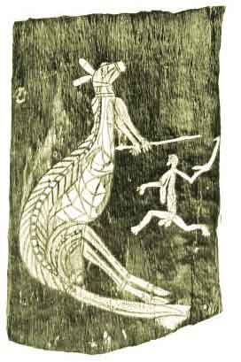

[Intangible Textual Heritage](../../index)  [Australia](../index.md) 
[Images](imglist.md) 

------------------------------------------------------------------------

<table width="75%">
<colgroup>
<col style="width: 50%" />
<col style="width: 50%" />
</colgroup>
<tbody>
<tr class="odd">
<td width="50%"></td>
<td width="50%"><h1 id="native-tribes-of-the-northern-territory-of-australia" data-align="CENTER">Native Tribes of the Northern Territory of Australia</h1>
<h3 id="by-baldwin-spencer" data-align="CENTER">by Baldwin Spencer</h3>
<h5 id="macmillan-and-co.-london" data-align="CENTER">Macmillan And Co., London</h5>
<h5 id="section" data-align="CENTER">[1914]</h5></td>
</tr>
</tbody>
</table>

[Jump to Index](#index)  [Start Reading](ntna03.md) 

------------------------------------------------------------------------

This is a comprehensive ethnography of the Australian Aborigines of
Northern Australia, particularly the group known as the Kakadu, and the
tribes of Melville Island. This is one of about half a dozen
ethnographies written before the destruction of the Australian
traditional cultures. This book is well written and, for the most part,
presented from a non-ethnocentric (non-judgemental) point of view, which
sets it apart from most of the other available public domain materal on
this topic. As far as material on the traditions of these tribes, this
is the only source text which we will ever have. Shortly after this was
written, the traditional life of these tribes was devastated by the
impact of European culture. This is a priceless record of a vanished
stone-age civilization.

Due to space considerations, I have only been able to include a few of
the illustrations; the complete list can be viewed at the link at the
top of each page labeled [Images](imglist.md). In addition, I have
refrained from posting images of people, ceremonies or sacred objects
from the original book, in deference to modern Aboriginal protocol. I
have included a set of bark drawings in the 'X-Ray' style. This unique
Aboriginal style is generally considered one of the most sophisticated
genres of representational art ever devised.

NOTICE

This classic work of anthropology has been posted on the Internet for
research purposes. We believe that this work is substantially accurate
in its details. However some errata have been found which were present
in the original book and will be published here shortly. Please be aware
that some of the material presented here may disclose information about
Aboriginal beliefs and practises which would normally only be available
to initiated persons.

------------------------------------------------------------------------

[Title Page](ntna00.md)  
[Preface](ntna01.md)  
[Contents](ntna02.md)  
[Chapter I: Introduction](ntna03.md)  
[Chapter II: Social Organisation and Marriage Regulations](ntna04.md)  
[Chapter III: Initiation Ceremonies](ntna05.md)  
[Chapter IV: Totemic Systems and Totem Groups](ntna06.md)  
[Chapter V: Sacred Sticks, Bull-Roarers, and Ceremonial
Objects](ntna07.md)  
[Chapter VI: Burial and Mourning Ceremonies](ntna08.md)  
[Chapter VII: Magic and Medicine](ntna09.md)  
[Chapter VIII: Beliefs in Regard to the Origin of Children](ntna10.md)  
[Chapter IX: Traditions Concerning Imberombera, The Great Ancestor, And
Also Other Ancestors Of The Kakadu Nation](ntna11.md)  
[Chapter X: Various Traditions, Customs and Beliefs](ntna12.md)  
[Chapter XI: Food Restrictions](ntna13.md)  
[Chapter XII: Weapons and Implements](ntna14.md)  
[Chapter XIII: Clothing and Ornament](ntna15.md)  
[Chapter XIV: Decorative Art](ntna16.md)  
