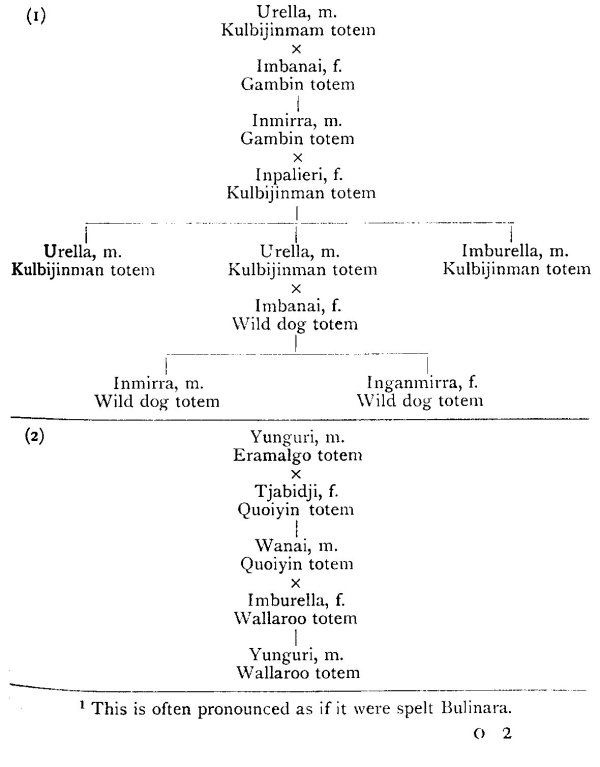
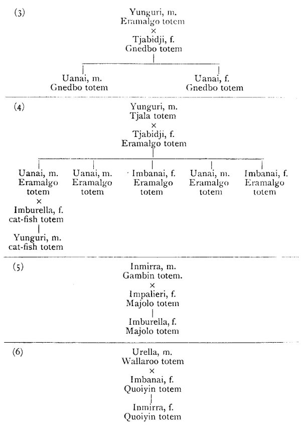
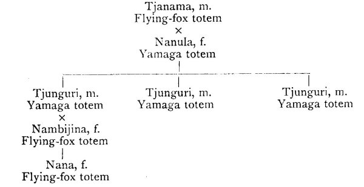
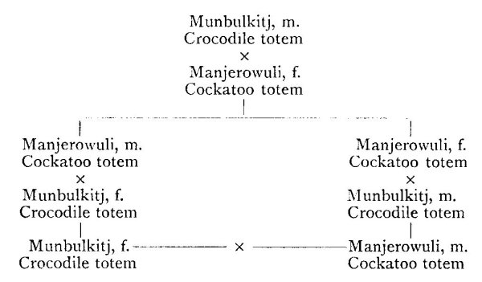

[Intangible Textual Heritage](../../index)  [Australia](../index) 
[Images](imglist)  [Index](index)  [Previous](ntna05)  [Next](ntna07) 

------------------------------------------------------------------------

# CHAPTER IV

### TOTEMIC SYSTEMS AND TOTEM GROUPS

Division of northern tribes into five groups so far as totemic matters
are concerned.--Kakadu tribe.--The Yalmuru and Iwaiyu.--Manner of
acquiring totemic names.--Examples of totemic names in different
families.--Totemic names not hereditary.--List of totemic groups-Sacred
objects associated with the Muraian ceremony.--Emu egg stone-Showing the
Muraian sticks and stones.--Intichiuma ceremony.--The ancestor Kulbaran
finding the Muraian.--List of Muraian sticks and stones.--Painting
them.--Status name of Lekerungen given after having seen the
Muraian.--History of the Emu egg stone and the crocodile stick.--Warrai
tribe.--Totemic groups exogamic.--Waduman tribe.--List of totemic
groups.--Genealogical tables to show descent of totem in maternal
line.--Accessory totems.--Eating of totemic animal or plant.--Ceremonies
to increase totemic animal or plant.--Headman of totemic group.--Orkbau
ceremony.--Mudburra tribe.--Descent of totem in maternal line.--Tjutju
ceremony to increase the totemic animal or plant.--Wulwullam
tribe.--Melville Island tribe.--Names of totemic objects and
groups.--Intermarrying groups.--Descent of totem is in maternal
line.--Iwaidja tribe.--Local intermarrying groups.--Descent of totem in
maternal line.--Table showing descent and marriage.--Larakia
tribe.--Descent of totem in paternal line.--Worgait tribe.--Main and
accessory totems.--Descent in paternal line.--Djauan tribe.--Pairs of
sub-classes have totem groups in common Totemic groups
exogamic.--Descent in the paternal line.--Mungarai tribe.--Totemic
groups associated with sub-classes.--List of groups and the sub-classes
to which they belong.--Descent of totem neither in maternal nor paternal

{p. 178}

line.--List showing totemic groups of certain parents and
children.--Yungman tribe.--Similar to Mungarai.--Nullakun
tribe.--Descent in paternal line.

THERE considerable variation amongst the different tribes inhabiting the
Northern Territory in regard to their totemic systems. In some tribes,
such as the Waduman and Mudburra, the totemic name is transmitted in the
maternal line; in others, such as the Worgait and Djauan, in the
paternal line.

In some, the totemic groups are divided between the moieties, in others,
such as the Djauan and Mungarai, they are divided between the classes or
sub-classes, so that the child cannot possibly inherit either its
father's or its mother's totem.

In some, such as the Waduman and Mudburra, there is no division of the
totem groups between the moieties or classes, the same group occurring
on both sides of the tribe, but the totemic groups are exogamous, and
the totem descends in the female line. In others, moieties and classes
do not exist, and in these there is no descent of the totem from parent
to child, the latter receiving his totemic name in consequence of an
intimation conveyed by a spirit individual to the parent.

In all tribes, however, there is a very definite totemic system, which
may or may not regulate marriage.

In most tribes the totemic groups are exogamous, but in some, such as
the Kakadu, they are not, though it is very rare to find a man married
to a woman of the same totemic group as himself. Such a marriage,
however, in the Kakadu and allied tribes would be quite allowable.

Amongst these more northern tribes we may distinguish five main groups
so far as totemic matters are concerned

{p. 179}

\(1\) A group represented by the Larakia, Worgait, and Wulwullam, in
which the totem groups are divided between the two moieties; they are
strictly exogamic and descent is counted in the male line.

\(2\) A well-marked group of tribes including the Djauan, Mungarai,
Warrai, Yungman, Mara, and Nullakun, in which the totem groups are
divided between the classes or sub-classes so that a child passes into a
totemic group belonging to the same side of the tribe to which his
father belongs, but of necessity different in name from his father's,
because different totemic groups are attached to different classes or
sub-classes.

\(3\) A well-marked group of tribes, including the Waduman, Mudburra,
Ngainman, and Billianera, in which the same totemic groups are found on
both sides of the tribe, and in which the descent of the totem is in the
female line. The totemic groups are strictly exogamous.

\(4\) Abnormal and modified coastal and island tribes, such as those on
Melville Island and the Iwaidji, in which there are no moieties or
classes, but in which there are local groups and in which certain
restrictions with regard to marriage exist in connection with the
totemic groups. The descent of the totem is in the female line.

\(5\) Abnormal and evidently modified coastal tribes, such as the Kakadu
and allied tribes, in which no moieties or classes are present, and in
which the totem descends in neither the female nor the male line.

In at all events many of the tribes, such as the Kakadu, Waduman and
Mudburra, the men perform ceremonies that are the equivalent of the
Intichiuma in the Arunta, and have for their object the increase of the
totemic animal or plant.

The Kakadu group of tribes is evidently much modified

{p. 180}

in many ways, and in none more so than in regard to their totemic
system. The question of totems is closely bound up with their beliefs in
regard to the origin of children, As described in connection with this
subject,\[1\] when an individual dies his spirit part remains
with his bones in the form of what is called a Yalmuru. This, again,
gives rise to a double of itself, called all Iwaiyu, which the Yalmuru
places in some food, such as a sugar-bag or fish, that the father of the
future child then secures, aided by the Yalmuru in doing so. This food
will be the totem of the future child. The Iwaiyu jumps out of the food
before the man secures the latter, and rejoins the Yalmuru. Finally, in
the form of a small frog, called Purnumanemo,\[2\] it goes
into its mother. The Yalmuru, at night time, comes to the father while
he is asleep in his camp and tells him the name of the child and its
totem. Originally, in the far past times, each individual had his totem,
or *jereipunga*, given to him by the great ancestor of the tribe named
Imberombera, or by men and women sent out by and acting under her
instructions. At each reincarnation the Yalmuru decides upon the
Jereipunga, which may or may not be the same as that to which it
belonged during a previous reincarnation. It has no reference of
necessity to that of either the father or mother, nor is it concerned in
any way with the marriage system. In the Kakadu tribe, indeed, there is
no idea of heredity of the totemic name in either the male or female
line. A few examples of actual families living in the Kakadu camp, while
I was staying at Oenpelli, their central camping ground, will serve to
illustrate this matter.

\[1. See Chapter vii.

2\. A very small species of Hyla that lives under bark and sheaths of
leaves.\]

{p. 181}

\(1\) A man named Ungara whose totem is Kimberikara (Barramundi, a
fish); his wife, Obaiya, is Mormo, sugar-bag. They have two children,
Monmuna a boy, who is Kunbaritja, a small fish, and Murawillawill, whose
totem is Eribinjori, crocodile. The totem of Ungara's father was
Kunbaritja, and that of his mother Mormo.

\(2\) A man named Mukalakki whose totem is Mormo. That of one wife,
named Mitjunga, is Kunaitja, mullet; that of another, named Numerialmak,
is Kulekuli. His father, named Monmuna, was Kimberikara, his mother,
named Kumbainba, was Eribinjori, a crocodile; his brother was Murno,
opossum; the mother of Monmuna was Kintjilbara, a snake, his wife's
mother was Kulekuli, catfish.

\(3\) A man named Miniamaka, whose totem is Jameru, a small fish; his
wife, named Murrapurnminni, is Kulekuli, cat-fish; a son, called
Naminjeya, is Kimberikara. His father and mother were both Kimberikara.

(4.) A man named Mitjeralak whose totem is Kalerungeni, flying fox; his
father, named Mitiunga is Jameru, a small fish; his father's father was
Eribinjori, crocodile.

\(S\) A man named Kopereik whose totem is Kunaitja, mullet; his father
is Kimberikara.

\(6\) A man named Oogutjali whose totem is Kunbaritja, a fish; his wife,
named Belgramma, is Narenma, a snake; a son, called Tjurabego, is
Eribinjori, crocodile; a daughter, called Mikgeirne, is Kulekuli,
cat-fish; a daughter, named Mirowargo, is Kalerungeni, flying fox; a
daughter, named Minagi, is also Kalerungeni, and another, called
Mukarula, is Mormo, sugar-bag.

It will be seen from these examples that there is a complete and most
perplexing mixing up of the totems, so far as anything like descent of
the totemic name is concerned. They have nothing whatever to do with

{p. 182}

regulating marriage, nor are they hereditary in either the paternal or
maternal line. Further still, there is no attempt made for each
individual to retain the totem (f the old ancestor of whom he is
supposed to be the reincarnation. In the case of the above-named
individuals there is actually only one--the woman Mitiunga--in which the
living person has the same totem as the old ancestor of whom he, or she,
is supposed to be the reincarnation. In regard to their totemic system,
the group of tribes that have the Imberombera legend, or its equivalent,
appear to stand by themselves. In some respects, as, for example, in
regard to the idea of definite local centres, peopled by spirit
individuals, they call to mind the Arunta, but, on the other hand, they
differ from them and from all others in the remarkable way in which each
centre is the home of a definite group of individuals, the actual names
of all of whom are known and handed down from generation to generation.

The following is a list of the totemic groups in the Kakadu tribe. It is
quite possible that there may be more than these, but they will, at all
events, serve to indicate their nature in this tribe which may be taken
as representative of the northern coastal tribes generally. The latter
inhabit the well-watered country, where food is abundant, that lies
between the Ranges and the sea. It will be noticed that, in every case,
the totemic animal or plant is edible:--

<table data-cellspacing="0" data-border="0" data-cellpadding="9" width="798">
<colgroup>
<col style="width: 50%" />
<col style="width: 50%" />
</colgroup>
<tbody>
<tr class="odd">
<td width="50%" data-valign="TOP">
Alberjiji, Whistling Duck. 
Banjil, a Fish. 
Baralil, a Fish. 
Biaka, a Wallaby. 
Boinmun, a Rat. 
Brutpenniweir, Jabiru. 
Eribinjori, Crocodile. 
Erlaungerla Echidna.
</td>
<td width="50%" data-valign="TOP">
Eyenbumbo, Fish-hawk. 
Gunumaramila, a Yam. 
Jailba, Sugar-bag. 
Jeluabi, a non-venomous Snake. 
Jeruober, Old-man Kangaroo. 
Jimeribunna, Native Companion. 
Jimmidauappa, a small Fish.
</td>
</tr>
</tbody>
</table>

 

{p. 183}

<table data-cellspacing="0" data-border="0" data-cellpadding="9" width="798">
<colgroup>
<col style="width: 50%" />
<col style="width: 50%" />
</colgroup>
<tbody>
<tr class="odd">
<td width="50%" data-valign="TOP">
Kaleiyu, White Cockatoo. 
Kalerungeni, Flying Fox. 
Karakera, Spur-winged Plover. 
Kimberikara, Barramunda (a Fish). 
Kintjilbara, a Carpet Snake. 
Kopereipi, Emu. 
Korunokadju, Wild Dog. 
Kudbauu, a Fish. 
Kudjalinga, Turtle. 
Kulabaga, Pied Egret. 
Kulawura, Jungle Fowl. 
Kulekuli, Cat-fish. 
Kulijidbo, a Yam. 
Kuljoanjo, a non-venomous Snake. 
Kulori, a Yam. 
Kunaitja, Mullet. 
Kunbaritja, a small Fish. 
Kunjeama, a "Plum." 
Kupulapuli, White Crane. 
Kurnembo, Goose. 
Mangortji, wedge-tailed Eagle. 
Marabornji, brush-tailed Wallaby. 
Mimiorko, Bandicoot. 
Mimweluda-uda, Blue Mt. Parakeet. 
Minjiweya, a Yam. 
Miriwidjonga, Quail. 
Mitjiborla, a Wallaby. 
Moain, a small Fish. 
Mormo, Sugar-bag. 
Mornum, a Yam. 
Mudburraburra, native Cat. 
Mudebenbo, native Turkey.
</td>
<td width="50%" data-valign="TOP">
Mungalama, Lily Seed. 
Munmarwer, a Snake. 
Murarowa, a Cypress Bulb 
Monmorlpa, a Rat. 
Murkailpu, Sugar-bag. 
Murlappa, a Yam. 
Murno, Opossum, M. 
Murora, a small Wallaby. 
Nabapungeni, Black Kangaroo. 
Narenma, a Snake. 
Ngabadaua, a Snake. 
Ngulauter, a Fish. 
Nguloa, a Fish. 
Numberanerji, a Snake. 
Nuppadaitba, a Fish. 
Padauitja, a Sugar-bag. 
Parijiliji, Lily root. 
Pitjordu, Lizard. 
Puneri, a Lizard. 
Putamunga, Water Lizard. 
Tiradjuno, a Water Snake. 
Tjailba, Sugar-bag. 
Tjameru, a small Fish. 
Tjikali, Wood Grub. 
Tjilaka, Jew Fish. 
Tjimidaba, a long-nosed Fish. 
Tjinangu, a Sugar-bag. 
Tjunara, a Yam. 
Tjungoan, a Snake. 
Ulloa, a Fish. 
Unari, a Lizard. 
Worki, a Lily Root. 
Wuridjonga, Lily Seed and Roots. 
Yidaburabara, a Snake. 
Yinganga, small Crocodile.
</td>
</tr>
</tbody>
</table>

 

Whilst investigating the initiation ceremonies in this tribe with Mr.
Cahill, I came across a very interesting part of the final initiation
ceremony that is called Muraian.\[1\] This, consisted in showing the
older men certain very sacred sticks and stones intimately associated
with the

\[1. See Chapter iii.\]

{p. 184}

totems.\[1\] They are as intensely *kumali* as are the churinga of the
Arunta, and the natives when showing them to us and performing the
ceremony took most elaborate precautions to prevent any women from
having the slightest chance to see what was being done. Each stone or
stick was wrapped tip in sheet after sheet of paper bark.

The first that we saw, and we came upon it by mere accident, was a small
stone called Iwaija Kopereipi, or Emu egg. It measured about four inches
in length by two and a half in diameter. It was sufficiently like an egg
in shape as to suggest the name. (Plate VII, Fig. 7). The general
surface had been red-ochred, but a yellow band, not seen in the figure,
ran round it and two red bands, each with a central row of white dots,
ran half-way up each side. The remainder of the surface was covered with
close set lines of white, crossing one another approximately at right
angles. Its history was as follows: Long ago, for the egg has now passed
through the hands of nine old men, one after the other, an old ancestor
named Nauundel, was out in the bush, searching for sugar-bag, when he
heard a curious hissing noise. He looked round and, in the distance, saw
an egg and a snake coiled round it. It was the hissing of the snake that
Nauundel heard. The snake was one now called Kintjilbara. Nauundel came
close up, got a stick and began to poke the snake which, by and by, went
away. He did not attempt to injure it. The egg stood up on end and
Nauundel lifted it from the ground and tied it up in paper bark. Then he
cut some grass, laid it in his bag and put the egg, wrapped in paper
bark, upon it, saying, *Geimbi kala muraian; ngainma kala, kulapunna
maleiappa*, which means, "This is a Muraian stone all right; it is mine
all right, I put it in my bag." All night he heard

\[1. For a description of these, see Chapter v.\]

{p. 185}

the egg saying *Prr, Prr,* as it moved about restlessly inside the paper
bark. It moved about so much that it tossed all the grass out of the bag
and, as it would not keep still, and Nauundel was afraid of losing it,
he placed the mouth of the bag near the fire and stupefied the egg with
the heat and smoke.

Only Murabulba, that is, very old men, are allowed to see the egg. When
its present possessor, a man named Narlinda, wishes to show it during
the progress of the Muraian ceremonies, he says to the younger men,
*morpiu, yapu, ge*, which means, literally translated, "food, go, all of
you"--in other words, all of you go out into the bush and collect food.
The young men know what he means, or, rather, that there is something
that they must not see, and away they go. He says nothing to the other
men but, as Narlinda told us, they know what he means and nudge one
another. When the young men are far away, Narlinda sits down by himself,
a little distance away from the old men, unwraps the paper bark, and
calls the others up. They come with their heads bent down. Narlinda
tells them to come near and not be frightened because it will not
"growl," that is, it will not be angry with them or do them any harm.

When they are going to hold these special ceremonies there may be only
one or two, or several, of these sacred objects brought on to the
ceremonial ground, which is most carefully placed and, if necessary, as
in the one we saw, closed in with bushes. At one of these ceremonies,
after the men have brought in their sacred sticks and stories, each one
being in the charge of some special individual, they are placed on the
ground to one side of the enclosed space. If there are any men present
who have not seen them before, but are judged to be old enough to do so,
an old man, such as Narlinda, says,

Koregora

{p. 186}

Muraian, kaiano jeri, balera, yadimma najei kubari kudanuji korto, that
is, "Look, these are Muraian, do not quarrel or, by and by, all your
fingers will swell up." The performance itself is a very curious one and
the men become very excited. The illustrations (Plates III, IV, V, VI
and VII) will give some idea of what the objects themselves are like.
When we saw it enacted, two of the men stood to one side, one clanging
sticks, the other clapping his hands. First of all a stick representing
a fish, called Jimidauappa, was brought in by a man to whom it belonged.
Followed by the other men, he came from behind some bushes, creeping
along with the sticks in his hands. On the ground he stood in the
middle, all the other men circling round and round him, while he pointed
the stick at each of them. At first they sang the words

Ka kai ka ka le  
Ka lulla le,

and, after dancing for some time, they all extended their arms towards
the stick, time after time, drawing them back rapidly and yelling,
*Brau, brau*, which means, Give, give. They were supposed to be
demanding a plentiful supply of the fish Jimidauappa.

Finally, the man fixed the stick upright in the ground and they all
danced round and round, pretending to rub their hands up and down it,
after which they rubbed themselves. Then they retired behind the bushes.
After a short time they came on again, this time bringing several sticks
(Figures 47, 48) and, in addition, rushing round the other men who stood
to one side. One after another the sticks were fixed upright in the
ground until there were some twenty or more sticks and stones there. At
one stage, when only a few had been brought in, a special one--the
Muraian itself--was produced. The man carrying it tumbled down on the
ground and was

{p. 187}

followed by the others and they all wriggled and rolled about in the
most grotesque fashion (Fig. 49). The Muraian was in the form of a
slightly curved slab of wood, with the representation of a head at one
end (Plate IV., Fig. 1), a very short tall at the other, and two little
projections at each side, representing limbs. It was supposed to be a
turtle, to which it certainly showed considerable resemblance, quite
enough to be recognisable, and the rolling about of the men was supposed
to be an imitation of the movements of the animal itself.

When all the sticks and stones, many of them elaborately decorated, some
representing yams with strings of gaily coloured cockatoo feathers wound
round them, had been brought on to the ground, they were arranged in a
circle and the men danced round and round them with their arms
alternately extended and drawn back, while they yelled, *Brau brau*,
that is, "Give, give." It was, as the natives told us, a request, in
fact, a demand, to the sacred representatives of the various animals and
plants to provide them with these same animals and plants that form
their food supply.

Amongst the native tribes of Central Australia I have seen what Mr.
Gillen and myself have called the Intichiuma ceremonies. These are
performed by the men of different totemic groups, with the idea of
increasing the number of the animals and plants with which the
ceremonies are concerned, but, in the Central tribes, it is only the men
of any one totemic group who Perform the ceremony associated with it,
and there is no such thing as any definite request or demand. The mere
performance of the ceremony is supposed to bring about the desired
result. In the Kakadu tribe, and the same is true of other tribes
associated with it, the

{p. 188}

members of different totemic groups join together and, though it is
difficult to express, accurately, the difference between the two forms
of ceremonies, both of which have the same object in view, that is, the
increase of the food supply, it may be said that the Central tribes do
not make anything in the way of a personal appeal to any object which is
supposed to represent an animal or plant, whereas, amongst the Kakadu,
this is most evident. The men of the latter tribe very clearly showed,
by their insistent and fierce cry of *Brau, brau,* "Give, give," that
they were directly asking, even demanding, the representatives of the
various animals and plants to provide them with food. Amongst the many
ceremonies of this kind that I have seen performed by Australian
aboriginals, none have impressed me more than these, as indicating that
savage man believes that he is able to control his food supply by means
of magic. The way in which the men danced round the ceremonial objects,
or rolled over on the ground holding them in their hands, was most
suggestive of the idea that, by doing so, they brought about some close
connection between themselves and the totemic animals or plants
represented by the sacred sticks and stones. All that the men could tell
us was that their old ancestors had always performed these ceremonies
and that, after they had done so, the animals and plants had always
multiplied.

Altogether we saw about seventy of these sacred stones and sticks which,
above all things possessed by the Kakadu and surrounding tribes, are
pre-eminently Kumali or sacred. They brought just a few at a time to
show us, taking the most elaborate precautions lest any woman or child,
or even any young man, was in sight. Before they brought them in, they
halted under the shelter of bushes and reconnoitred the place to

{p. 189}

make quite sure that they were safe and that no women were within sight.
When a man saw us he would put a finger up to his nose, the sign that
they had something *Kumali*. Then, when they were satisfied that
everything was secure, they brought them in, wrapped up in fold after
fold of paper bark. Whilst showing them to us they only spoke in
whispers and, so real was it to them, that we, without thinking about
it, felt compelled to do the same.

They told us that the first of these Muraian objects was found, very
long ago, by an old ancestor called Kulbaran. He saw something strange
in the form of a turtle moving about in the water, caught it and
discovered that it was Muraian, or rather the turtle told him so. The
turtle then described the ceremonies and taught Kulbaran how to perform
them and how to make the sacred sticks and stones. He told Kulbaran that
they were all *kumali widjeru*, that is very sacred or kumali. He also
told him that the old men might eat the Muraian animals but that the
young men must not do so.

Kulbaran, when first he saw the Muraian, said, *Ngeinyimma ameina?*
which means, "What is your name?" or "Who are you?" The Muraian replied,
*Ngainma Muraian*, "I am Muraian"; *Ngainma jerapo mubilabilia balera*,
"I dance corrobboree later on," and then he danced, lifting up his legs
and arms and singing, *Yai, Yai,* as he did so. The old man Kulbaran
said, *onje mubilabilla yama*, "which way another dance," or, "Is there
any other dance?" and Muraian showed him some more. Then he said that
all the dances that he showed Kulbaran were kumali; *Jimmidauappa* (a
fish) *kumali*; *Banjil* (a fish) *kumali*; *Kurnembo iwaiji* (Goose
egg) *kumali*, and so on, through the whole series.

The stones that we saw were representatives of the

{p. 190}

following:--Gunumaramilla (a yam); Kopereipi iwaiji (Emu egg); Kulijidbo
(a yam); Kulori (a yarn); Kudjalinga (turtle); Kudjalinga iwaiji (turkey
egg); Idabarabara; Jimeribunna (native companion); Purijiliji and Worki
(lily root); Kopereipi (Emu); Eribinjori (large crocodile); Eribinjori
iwaiji (crocodile eggs); Alberjiji (whistling duck); Mundebendo (Brush
turkey); Kunjeama (plum); Kulekuli (Cat fish).

The sticks were representatives of the following

Kimberikara (Barramunda) Munburungun; Kulekuli (Cat fish); Tjunara (a
yam) Jimidauappa (small fish); Eribinjori (large crocodile) Numereji (a
snake); Murlappa (a yam); Brutpenniweir (Jabiru); Jungoan (snake);
Kudjalinga (turtle); Mundebenbo (Brush turkey); Murlappa (a yam);
Minjiweya (a yam); Banjil (a fish); Bararil (a small fish); Kimberikara
(Barramundi).

In the case of both the stones and sticks there were, in many of them,
several representatives of the same totemic animals and plants and also
distinct stones and sticks representing males, females, and eggs of the
same animals.

The stones of course can be passed on from one generation to another,
but the sticks are naturally liable to decay and are renewed from time
to time. In a climate such as that of the Alligator River district, it
is difficult to preserve, intact, sticks that are continually being
greased and painted and are hidden away, wrapped up in paper bark, in
damp places, such as those in which the natives secrete them. They are
very liable to be attacked by insects, such as boring beetles, and they
must be periodically replaced by new ones. When they are used during any
ceremony, such as the one we witnessed, the design is more or less
rubbed off and, on each occasion,

{p. 191}

it is repainted. The same design is always used and must not apparently
be varied. We several times saw serious consultations taking place
amongst the old men as to the drawing of the design on a stick or stone.
The white lines are put on with a very crude but effective paint brush,
consisting simply of a little twig, about six inches long, one end of
which is frayed with the teeth and then flattened out to form a small,
thin disc about the size of a sixpenny bit. This is dipped into the
white pipe clay which has been moistened with water so as to form a thin
paste. It is held between the thumb and fingers, the handle of the brush
lying in the palm of the hand in just the same way in which a white
artist often holds a brush.

In addition to its function as an Intichiuma ceremony, the Muraian
serves, just as the Engwura does amongst the Arunta tribe, as a *finale*
to the initiation ceremonies, daring which older men are shown objects
that, in many cases, they have never and, in some, but rarely seen. The
same is true of the Engwura, when a series of ceremonies, with men
wearing decorations and using ceremonial objects, such as Nurtungas and
Waningas, are shown to the relatively younger men. The ceremony is
supposed, in both cases, to make the men 'good,' using the word in its
native sense; they must not growl or quarrel. After a man has passed
through, or. rather, witnessed, the Muraian, he receives the special
status name of *Lekerungen*, just as, in the Arunta, the men who have
seen the Engwura are called *Urliara*. It also serves to enhance the
importance of the old men and is of service to them in regard to their
food supply because, whilst they can eat any of the animals or plants
associated with the ceremony, no matter by whom they are captured, the
younger men, even when they have seen the Muraian,

{p. 192}

must not touch anything secured by the old men and must also give the
latter a share of any of the Muraian foods that they secure. Also, for
some reason that the natives do not know, save that their arms and hands
would become very sore if the rule were not carefully followed, the men
who have seen the Muraian must, on no account, allow a dog to eat any
remnant of their food,

I have previously referred to the handing down of the sacred stones and
sticks. Two examples will serve to show how carefully their history is
preserved. I n the case of the Emu-egg stone, tradition reports that it
has been, in succession, in the possession of the following men: (1)
Nauundel, who originally found it, (2) Nortmanitj, (3) Pwenguno, (5)
Butja, (5) Nanilmango, (6) Nuburungillimaka, (7) Kingunaiya, (8)
Yerimain, and (9) Narlinda, who now owns it.

In the case of an Eribinjori, or crocodile, stick, which the natives
regarded as one of the most important, the history is still longer. It
was owned in the first place by Kulbaran, who, when he became very old
and unable to perform the ceremonies, gave it to (2) Midjail, his
younger brother, after whom the following successively received it: (3)
Numinbal, (4) Ungoreddi, (5) Alumbawerner, (6) Amunjureri, (7) Bulluoko,
(8) Abringillimaka, (9) Ungowilla, (10) Nauukmawitch, (11) Pwenguno,
(12) Pordjo, (13) Nauulmango, (14) Kingmanaia, (15) Kerauappa, (16)
Naumarak, (17) Mantjiritj, (18) Yiraman, who died recently, and from
whom it descended to (19) Miniamaka, its present holder.

In the Warrai tribe the name for totem is *mumulbuk*. They are divided
amongst the classes. One group is associated with the two classes
Ajumbitj-Appularan, the other with Appungerti-Auinmitj. Thus
Ajumbitj-Appularan have the following, Bulta (eagle-hawk),

{p. 193}

Kinnimill (a yam), Gunbelli (small crocodile), Norquipito (red ochre),
Bulp (pipe clay), Doito (stone axe), Deiurnu (kangaroo), Wairdmo (fire
stick), Jin (leech), Gunnigunni (flying fox). Appungerti-Auinmitj have
Murdukul (a fish), Yilli (swamp lily), Tji (a snake), Wit (water), Bera
(large crocodile), Kuala (turtle), Niri (dog), Gani (night time),
Wordjal (black plover), Ngurin (emu).

It will be noticed that there are, relatively, a large number of totemic
groups associated with objects other than animals and plants, a feature
in which this and other of the central tribes differ from the coastal
tribes amongst whom, with very rare exceptions, the totemic names are
those of edible objects.

Inasmuch as the totemic groups are divided between the two moieties of
the tribe and a man must marry a woman who does not belong to his own
moiety, it follows that the totemic groups are exogamic. The child
belongs to a totemic group associated with its father's side of the
tribe but not to his father's own totemic group. My informant told me
that a leech man marries a fish woman and that their children are yam. A
fish man marries a flying-fox woman and their children are leech. A
flying-fox man marries a fish woman and their children are crocodile. A
crocodile man marries a snake woman and their children are flying-fox.
Unfortunately, I was unable to gain as complete and minute information
as I should have liked. The Warrai tribe is now decadent, having been
ruined by coming into contact With the mining fields, and it is always
unsafe to rely implicitly upon information in regard to matters
concerned with the organisation of a tribe derived from natives who are
thus, more or less, demoralised. Dr. Howitt drew attention to the manner
in which tribes had been obliged to modify their old customs in regard

{p. 194}

especially to marriage, in consequence of the decimation of their
numbers. My informant, called Plainmur by the natives and "Doctor" by
the white men, in reference to his former profession, was, however, an
old man who was well acquainted with the ancient customs of his tribe, I
also had the assistance of a peculiarly intelligent "boy" who spoke
English well, so that, I think, the information, so far as it goes, is
correct. When their old customs were in force the old man said that the
Warrai people never killed their own totemic animal and that if he were
to see anyone else killing it he would he angry and would ask him, Why
have you killed my mumulbuk?

In the Waduman tribe the word for totem is Gwaiyan, though some natives
pronounce it as if it were spelt Quoiyin or Quoiyan. The following is a
list of totemic groups in this tribe. Mudbi (Barramunda fish); Ganbin
(flying-fox); Kumerinji (emu); Inumbergo (male kangaroo); Undallo,
(female kangaroo); Wallanja (goanna); Tjuril (turtle); Korondulmi
(rainbow); Kunadjerri (white snake); Kului (red-bellied water snake);
Tjala or Kunajeraru (cat-fish); Pingan (a bony fish); Tuaiin (a
long-nosed fish); Kandaua (moon); Butbutbau or Kirriwuk (a bird, the
coucal); Wallano (a yam) Miakka (a yam); Kulbijinman (a large venomous
snake) Miyun (wild dog); Biauiak (a small bird); Wiyan (water); Bulliyan
(eagle hawk); Mabilli (small wallaby); Kadmanning (a small hawk)
Koallimilla (small turtle); Illaluban (carpet snake) Errimembo (a
venomous snake); Ledi (grasshopper); five kinds of sugar bag called
respectively Quoiyin, from the top of a tree (the equivalent of Mormo in
the Kakadu); Gnedbo (a small bag also from high up); Luerga (from the
base of ant hills); Eramalgo or Eramergo (from dead limbs); Dielba or
Kulmldjin (from the tops of trees).

{p. 195}

In this tribe, as also In the Ngainman, Mudburra, and Billianera
tribes,\[1\] the descent of the class name is in the father's line, that
of the totem in the mother's, with the result that the totemic groups
are distributed amongst the classes, the same totem group occurring on
both sides of the tribe. A man must not marry a woman of his own totem.
The following examples of individuals in our camp will serve to
illustrate the matter. M. stands for male and f for female.

\[1. This is often pronounced as if it were spelt Bulinara.\]

{p. 196}

 

In addition to the main totem each individual has one or more, usually
two, accessory totems. The main one Is that associated with the totemic
group into which he is born. The others are given to him when he is
initiated. He is first of all, during the initiation ceremonies) told

{p. 197}

his main totem, which is that of his mother, and, at a later period, the
accessory totems. If you ask a Waduman native what is his Gwaiyan he
will tell you his main one. He does not usually without further
questioning mention the accessory ones, the significance of which I
could not find out. As an example of these we may take the oldest Uanai
man in Table 4. His name was Iblongwa and his main totem was Eramalgo, a
sugar bag; his accessory ones are Kandauak (moon) and Tjuril (turtle).
His father's main totem was Tjala (cat-fish), with accessory ones Gnedbo
and Luerga, two kinds of sugar bag. His mother's main totem was
Eramalgo, with accessory ones Kandauak and Tjuril, which happen to be
identical with his, though this is not a matter of necessity. As he told
us, when he entered his mother, he was Eramalgo; the other two were
given to him later when he was initiated. The different way in which a
native regards his main and his accessory totems may be seen from the
fact that

Iblongwa will not cut Eramalgo out of a tree himself, but will cat it if
it be given to him by another man. On the other hand, he will kill and
eat Tjuril freely. In the same way, a Quoiyin man will not cut Quoiyin
out of a tree himself, but will eat it if it be given to him. The Urella
man of the Kulbijinman totem in the first table, whose name was
Waljakula, told us that he would not himself kill the snake Kulbijinman,
but would eat it if it had been killed by another man and given to him.
On the other hand, he has Biauiak (a small bird) as an accessory totem,
and this he kills and eats freely.

The different totemic groups perform ceremonies for the increase of the
totemic animal or plant. The name of these ceremonies is Tjutju, which
is quite distinct from the name Pudaueru, applied to the sacred totemic
ceremonies, or from Warangin, the name of the ordinary

{p. 198}

corrobboree. The Tjutju ceremonies are the equivalents of the Intichiuma
in the Arunta tribe.

The head man of each totemic group is called Tjungunni. If he dies the
next eldest brother succeeds to the post, and so on through the
brothers, including amongst these the father's brothers' sons. If there
are none of these alive then the eldest son succeeds. That is, for
example, if there be three brothers and the eldest dies, the office of
Tjungunni does not descend to his son, but to the elder of the two
survivors. If both of them die then it reverts to the eldest son of the
first named, even if, in years, he be younger than a son of the second
brother. Being the son of an elder brother, he is the "elder brother" of
all the three brothers' sons, no matter what his actual age may be.

When performing the ceremony of Tjutju the men of the group paint and
dance, the others watching them. After the ceremony of any particular
totemic group has been performed the men of all other groups go out and
gather some of the animal or plant. If, for example, it be Eramalgo, the
latter, after being brought into camp, is taken to the Eramalgo
Tjungunni, the men saying, *Me Eramalgo*, "here is Eramalgo." He
replies, *Ma angui*, "give it, I eat." It is handed over to him and he
puts it in a pitchi, mixes it with water, eats a little himself, and
hands it over to the other men, saying, *Nun burri*, "I have finished."
After this they may all eat it. So, in the same way, a flying-fox man
will eat a little of the animal, and hands the rest over to the other
men who do not belong to the totemic group.

If a man of any totemic group dies, the animal or plant is tabu to all
members of that totemic group until after the performance of a small
ceremony called *Orkbau*. The brother of the dead person brings the
totemic animal or

{p. 199}

into camp. During the ceremony the members of the totemic group are
painted with red ochre. A fire is made and the Tjungunni man passes the
body of the animal or the plant, if, for example, it be a yam, through
the smoke arising from the fire, after which it may be eaten. All
members of the totemic group must put their heads into the smoke of the
fire in which the animal is cooked.

In the Mudburra tribe, whose country adjoins that of the Waduman, the
word for totem is Ngalu, and the head man of each group is called
Malugurni. The descent of the totem, as in the Waduman tribe, is counted
in the female line. The following table of one family in camp will
illustrate this:--

The Mudburra natives also perform the Tjutju ceremonies to increase the
totemic animal or plant. After securing the latter the men who do not
belong to the totemic group bring it up to the head man and hand it to
him, the old man saying, *Ma, punungalu*, "give it, I eat." He takes a
little and then hands it back, saying, *Aidonok berri*, "I have
finished."

The Pine Creek or Wulwullam tribe is now decadent, having for many
years, like the Warrai tribe, been in contact with the mining
population. One of its oldest

{p. 200}

men, who could go back to the early days, told me that the totemic
groups were divided between the moieties, and that the totem descended
in the father's line. A Kangaroo man married a Barramunda woman, and
their children were Kangaroo; a Sugar-bag man married a Rain woman, and
their children were Sugar-bag.

Amongst the Melville Islanders the totemic system is somewhat different
from that of any tribes on the mainland. The word for totem is Pukui. If
you say to a man, *Inta ananunga pukui*, he will reply, *Ingaga*, which
means white cockatoo, *Irrungabi*, crocodile, or whatever may be the
name of his totem. On the other hand, there is a special name applied to
the members of the various totemic groups which is quite distinct from
that of the totemic animal or plant. These curious double names are as
follows:--

|       |                     |               |
|-------|---------------------|---------------|
| \(1\) | Crocodile           | Irrungabi.    |
|       | Crocodile man       | Urdungui.     |
| \(1\) | Mullet              | Takaringa.    |
|       | Mullet man          | Arriwidiwi.   |
| \(2\) | Turtle              | Kirkulani.    |
|       | Turtle man          | Andjului      |
| \(2\) | Rain                | Pakateringa.  |
|       | Rain man            | Andjului.     |
| \(3\) | Wild dog            | Teiaminni.    |
|       | Wild dog man        | Namungarau.   |
| \(3\) | Wood                | Timareringa.  |
|       | Wood man            | Ukaringui.    |
|       | White cockatoo      | Ingaga.       |
|       | White cockatoo man  | Jabijabui.    |
|       | Sea bird            | Witjerevi.    |
|       | Sea bird man        | Mitjiwinilla. |
|       | Pandanus            | Mierti.       |
|       | Pandanus man        | Yirikiwi.     |
|       | Blood wood tree     | Urnalaka.     |
|       | Blood wood tree man | Wanningetti.  |

 

Amongst these totemic groups there are three pairs, indicated by the
numbers (1), (2), and (3). These are regarded respectively as being what
is called *amandinni*, that is, mates. Crocodile and mullet are mates;
turtle and rain; wild dog and wood. The members of groups

{p. 201}

that are *amandinni* are supposed to belong to the same "skin," or
*pukui*, and may not intermarry. Any man can marry any woman, provided
she does not belong to his *pukui*.

Alligator and mullet marry cockatoo, blood wood, sea bird, turtle, wild
dog, wood, Pandanus, rain.

Wild dog and wood marry crocodile, cockatoo, blood wood, sea bird,
turtle, mullet, Pandanus, rain.

Turtle and rain marry crocodile, cockatoo, blood wood, sea bird, wild
dog, wood, mullet, Pandanus.

Cockatoo, blood wood, sea bird, and Pandanus have no *amandinni* and so
may marry anyone save a member of their own totemic group.

The descent of the totem is strictly in the mother's line.

There is something very abnormal about the Iwaidja tribe at Port
Essington, which is evidently closely allied, in some respects, to the
Melville Islanders. As in the latter there are local groups. My
information was gained, with the assistance of Mr. R. J. Cooper, from
Port Essington natives who knew their own and the Melville Island
systems. There are three divisions in the tribe, with totemic groups
attached to each. These three divisions again refer to local groups, as
do those on Melville Island and also those amongst the Kakadu tribe, to
which, in other points, the Iwaidja natives are closely allied. Their
names and the totemic groups associated with them are as follows:--

GROUP 1.--*Munbulkitj*.

|                 |             |
|-----------------|-------------|
| Barramunda      | Mangauuli.  |
| Barramunda men  | Munbulkitj. |
| Goanna (lizard) | Wallwarra.  |
| Goanna man      | Maiyak.     |
| Crocodile       | Meirdneiai. |
| Crocodile man   | Munbulkitj. |
| Mullet          | Ngurilliak. |
| Mullet man      | Maiyak.     |

 

{p. 202}

GROUP 2.--*Manjerojelli*.

|              |                |
|--------------|----------------|
| Wild dog     | Lang.          |
| Wild dog man | Allaquallurut. |
| Wood         | Allmara.       |
| Wood man     | Manjerojelli.  |

 

GROUP 3.--*Manjerowuli*.

|                     |                    |
|---------------------|--------------------|
| Jungle fowl         | Urgurgi.           |
| Jungle fowl man     | Manjerowuli.       |
| Turtle              | Manbirri.          |
| Turtle man          | Manjerowuli.       |
| Rain                | Wailmat.           |
| Rain man            | Manjerowuli.       |
| Blood wood tree     | Wubuin.            |
| Blood wood tree man | Imma-wubuin.       |
| Shark               | Wanba.             |
| Shark man           | Manjerowuli.       |
| Sea bird            | Odjurn.            |
| Sea bird man        | Allakwulwurjuring. |
| Cockatoo            | Allallak.          |
| Cockatoo man        | Manjerimaringait.  |

 

It will be seen that, as in the Melville Island system, the totemic
animal or plant has one name, the member of the group another. The
Iwaidja word for totem is *Wailar*.

Members of the Munbulkitj and Manjerojelli groups marry those of
Manjerowuli, and *vice versâ*. It will be noticed that in each case
individuals belonging to certain totemic groups carry as their totemic
name, if it can be called so, that of one of the local tribal divisions,
Munbulkitj, Manjerojelli, or Manjerowuli. For example, Barramunda men
are called Munbulkitj, wood men are called Manjerojelli, and turtle men
are called Manjerowuli. The natives were quite clear on this point.

The descent of the totem is in the female line. One of our informants
was a cockatoo man, his mother was cockatoo and his father crocodile.
His mother's brother was also cockatoo, and is married to a crocodile
woman. They have a daughter who is crocodile and has been

{p. 203}

promised as wife, by her father, to the first-named cockatoo man. In
this case the mother of the man and her brother have the same father but
not the same mother. Another of our informants was a cockatoo man, his
mother was cockatoo and his father a wood man.

The descent and marriage may be indicated as in the following table:--

The Munbulkitj woman of the crocodile totem is the proper wife of the
Manjerowuli man of the cockatoo totem.

It would appear as if very considerable modifications were taking place
amongst the northern coastal tribes in regard to their totemic systems,
just as, also, in connection with their social organisation. Much the
same thing happened on the opposite side of the continent where, in
Victoria, a local organisation took the place of the normal class
system, and where, also, amongst the most modified tribes, the old
totemic system largely disappeared, its former existence being indicated
by the persistence of a few, perhaps only one or two, totemic group
names. In the Iwaidja tribe, at the present day, the old class system
has been replaced by a local organisation, the totemic groups are very
unequally

{p. 204}

distributed amongst the local groups, and the totemic group names are
evidently disappearing. Munbulkitj has only one totemic name and that is
common to two groups, goanna and mullet; Manjerojelli has one,
Manjerowuli has three.

It is practically too late to study the totemic systems amongst tribes
such as the Larakia, whose members have been for long in contact with
settlements. Amongst the Larakia my informant told me that the word for
totem was *Unga*; that originally every individual belonged to a totemic
group; that a man of one token could not marry a woman of the same, and
that the children took the totemic name of the father.

In the Worgait tribe each individual may apparently be associated with
more than one totemic group. My informant told me that he belonged to
the frog, shark, and sugar-bag totem groups, and that he had inherited
them from his father. The first was his main totem, the other two, as he
said, "came afterwards." His mother was water-snake. A man may not marry
a woman of the same totemic name as himself. If a stranger comes into a
camp he is asked, *Ninik kuna koga*, "What is your totem?" If, for
example, he be a snake (or yam) man, he will reply, *Naidja wunga* (or
*wila*) koga, that is, "the snake (or yam) totem." Further still, my
informant told me that if the stranger was an old man and told him that
his totem was frog, he, the younger man, would call him *boppa*, the
same name that he applies to his father. If, on the other hand, he
belonged to the water-snake totemic group, he would call him *kukka*,
the same name that he applies to his mother's brother. There is, so far
as I could find out, no restriction in regard to eating the totemic
animal or plant.

{p. 205}

in the Djauan tribe the totem groups are associated with the
sub-classes, the various pairs of the latter that are known as "mates,"
or *kumaranbun*, having totem groups in common. Thus Ngaritjban and
Pungaringba have pelican, kangaroo, and goanna Pulainba and Palieringba
have sugar-bag and lily Waidba and Kamara have plum\[1\] and
snake (*kurk*) Kungilla and Wamut have crocodiles (*kangi*, the larger,
and *togal*, the smaller) and snake (*tjural*). A man may marry a woman
of any totem group provided she belongs to the proper sub-class, and as
the totem groups are strictly divided amongst these it follows that a
man cannot marry a woman of the same totemic name as himself. The word
for totem is *lunga* and descent is counted in the male line. My
informant was a Wamut man of a snake (*tjural*) totem; he was married to
a *Pungaringba* woman of the goanna totem and his children were Kungilla
and snake (*tjural*).

In the Mungarai tribe the totem groups are associated with the
sub-classes, the native term for totem being *Namaragua*. Each totemic
group has a head man called *Tjugeanandu*. My chief informant, an old
man named Wallungwarra, gave me the following list of totemic groups,
but it is probable that there are still more; these, however, were all
that he, and two other men with him, could recollect:--

Bat (wallalka), black snake (djungwitj), cat-fish (warba), small
crocodile (walbian), crow (waiwagmin), euro (kangilauro), goanna
(djerkain), hawk (kamannin), kangaroo (gaauwi), lily (godiak), frilled
lizard (wadidji), native companion (dagmin), opossum (widjurt), pelican
(abaiya), porcupine (mullulberri), waterplant (ngarait), rain (ngaugo),
a non-venomous snake (ngabandi), a

\[1. The fruit of a tree, *Buchanania nangoides*.\]

{p. 206}

poison snake (mimain), water snake (nanjugo), sugar-bag (ngauwap),
native turkey (tjambirrina), long-tailed wallaby (walligeru), wallaby or
paddy melon (mabiling), dark wallaby (ngirimu), rock wallaby
(wunarungun), wind (wailulu).

The groups are divided amongst the sub-classes as indicated in the
following list:--

|                          |                   |                |
|--------------------------|-------------------|----------------|
| All rain                 | men and women are | ngapalieri.    |
| All paddy melon          |  "           "    | nakomara.      |
| All water plant          |  "           "    | ngapalieri.    |
| All snake                |  "           "    | nakomara.      |
| All goanna               |  "           "    | ngangiella.    |
| All turkey               |  "           "    | ngabullan.     |
| All cat-fish             |  "           "    | ngapungari.    |
| All crocodile            |  "           "    | ngangiella.    |
| All frilled lizard       |  "           "    | ngaritjbellan. |
| All small hawk           |  "           "    | nakomara.      |
| All native companion     |  "           "    | ngopungari.    |
| All poison snake         |  "           "    | ngabullan.     |
| All euro                 |  "           "    | ngabullan.     |
| All brush-tailed wallaby |  "           "    | ngapalieri.    |
| All opossum              |  "           "    | tjabijin.      |
| All dingo                |  "           "    | tjabijin.      |
| All sugar-bag            |  "           "    | ngabullan.     |
| All plain wallaby        |  "           "    | ngangiella.    |
| All porcupine            |  "           "    | ngaburella.    |
| All bat                  |  "           "    | ngapalieri.    |
| All lily                 |  "           "    | tjabijin.      |
| All pelican              |  "           "    | tjabijin.      |
| All black snake          |  "           "    | ngangiella.    |
| All kangaroo             |  "           "    | ngaburella.    |
| All wind                 |  "           "    | ngaritjbellan. |
| All rock wallaby         |  "           "    | nakomara.      |

 

A remarkable feature of the totemic system of this tribe is that while,
as usual, a man must marry a woman belonging to a totemic group
different from his own, the children pass into one which is neither the
same as that of their father or mother, but is associated with the
subclass to which they belong on the father's side of the

{p. 207}

tribe. The following list indicates a certain number of the marriage
arrangements so far as the totem groups are concerned and those Into
which the children pass:--

A Ngapalieri man of the water-plant totem marries a Nakomara woman of
the paddy-melon totem and their children are Ngabullan and poison snake.

A Ngapalieri man of the rain-totem marries a Nakomara woman of the
rock-wallaby totem and their children are Ngabullan and Euro.

A Ngangiella man of the plain-wallaby totem marries a Ngabullan woman of
the euro totem and their children are Tjabijin and opossum. '

A Nakomara man of the paddy-melon totem marries a Ngapalieri woman of
the brush-tailed wallaby totem and their children are Ngaburella and
porcupine.

A Ngaburella man of the porcupine totem marries a Ngaritjbellan woman of
the frilled-lizard totem and their children are Nakomara and small hawk.

A Ngangiella man of the goanna totem marries a Ngabullan woman of the
turkey totem and their children are Tjabijin and lily.

A Ngabullan man of the sugar-bag totem marries a Ngangiella woman of the
crocodile totem and their children are Ngapalieri and rain.

A Tjabijin man of the pelican totem marries a Ngapungari woman of the
cat-fish totem and their children are Ngangiella and black snake.

A Ngaburella man of the kangaroo totem marries a Ngaritjbellan woman of
the wind totem and their children are Nakomara and paddy melon.

A Tjabijin man of the dingo totem marries a Ngapungari woman of the
native companion totem and their children are Ngangiella and plain
wallaby.

The same curious system is apparently present in the Yungman Tribe into
which, however, I had very little opportunity of inquiring. The totem
groups appear to be associated with the sub-classes and the children of
necessity belong to a group associated with the father's Side of the
tribe but with a sub-class to which he does

{p. 208}

not belong--the sub-class of his father and of his children. Thus, for
example, a man of the dingo totem marries a sugar-bag woman and the
children belong to the rain totem. The Nullakun term for totem is
*mungaiini*.

These two tribes appear to differ from their neighbours in having their
totem groups divided, not between the moieties, but the sub-classes, so
that it is impossible for a child to have the same totem as either its
father or its mother. The Mungarai and Yungman are in contact, on the
one hand, with tribes such as the Djauan, which has been already
described, and, on the other, with the Nullakun and Mara. The
organisation of the Djauan, so far as the class system is concerned, is
identical with that of the Mungarai and Yungman, and yet the totemic
system is practically the same as that of the Mara and Nullakun tribes,
from both of which it differs radically in regard to its class
organisation. In the Djauan tribe the totem groups are divided between
the sub-classes in such a way that those to which parents and children
belong have them in common and the descent of the totem is strictly
paternal. In the Mara and Nullakun the same is true, though sub-class
names are not present. My informant in the former tribe was a Mumbali
man and his totem, the native word for which is *Urarakammo*, was a
snake called *daual*. His father's totem was *daual* and so, also, was
that of his children. His wife was a Purdal woman and her totem was
*Tjarukual* or Euro; his mother was a Kuial woman of the *wordabil* or
goanna totem. His son must marry a Kuial woman of the *wordabil* totem.
Each totem group has its head man who is called *Yunguan*.

So, again, in the Nullakun tribe descent is counted the direct male line
and the totems are divided between

{p. 209}

the classes. Thus, the children of a *kulakulungini*, or rainbow man,
are *kulakulungini*; those of a *nanguru*, or large crocodile man, are
*nanguru*, and those of a *janambu*, or small crocodile man, are
*janambu*. The native word for totem is *mus*, and each group has its
head man, who is called *Kujungowangeri*.

{p. 210}

------------------------------------------------------------------------

[Next: Chapter V: Sacred Sticks, Bull-Roarers, and Ceremonial
Objects](ntna07)
