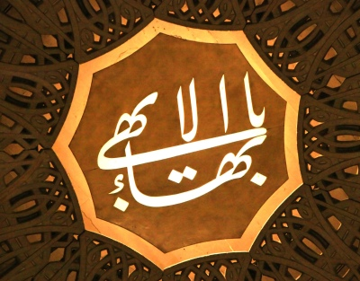

  
[Intangible Textual Heritage](../../index)  [Baha'i](../index.md)  [Wisdom
of the East](../../woe/index.md) 

------------------------------------------------------------------------

<table width="75%">
<colgroup>
<col style="width: 50%" />
<col style="width: 50%" />
</colgroup>
<tbody>
<tr class="odd">
<td width="50%" data-valign="TOP"></td>
<td width="50%" data-valign="CENTER"><h1 id="the-splendour-of-god" data-align="CENTER">The Splendour of God</h1>
<h2 id="by-eric-hammond" data-align="CENTER">by Eric Hammond</h2>
<h4 id="section" data-align="CENTER">[1909]</h4></td>
</tr>
</tbody>
</table>

------------------------------------------------------------------------

[Contents](#contents)    [Start Reading](sog00.md)    [Page
Index](pageidx)    [Text \[Zipped\]](sog.txt.gz.md)

------------------------------------------------------------------------

This is a short introduction to the Baha'i religion, part of the [Wisdom
of the East](../../woe/index.md) series. It includes short but profound
texts by the founders of the religion, including the Bab, Baha'u'llh and
Abdul Baha (also known as Abbas Effendi). It includes a longer text, The
Seven Valleys an allegorical tale of the journey of the soul.

------------------------------------------------------------------------

 [Title Page](sog00.md)  
[Contents](sog01.md)  
[The Benediction of Abbas Effendi](sog02.md)  
[Editorial Note](sog03.md)  
[A Glimpse Through the Gate](sog04.md)  
[The Bab: The Foreteller](sog05.md)  
[Baha'u'llah: The One Foretold](sog06.md)  
[Abdul Baha: ''The Servant of God''](sog07.md)  

### The Seven Valleys

[Introduction](sog08.md)  
[The First Valley: The Valley of Search](sog09.md)  
[The Second Valley: The Valley of Love](sog10.md)  
[The Third Valley: The Valley of Divine Knowledge](sog11.md)  
[The Fourth Valley: The Valley of Divine Unity](sog12.md)  
[The Fifth Valley: The Valley of Contentment](sog13.md)  
[The Sixth Valley: The Valley of Astonishment](sog14.md)  
[The Seventh Valley: The Valley of Absolute Poverty and
Annihilation](sog15.md)  

### Texts from the Tablets of Baha'u'llah

[Tablet of Tarazet](sog16.md)  
[Tablet of the World](sog17.md)  
[Words of Paradise](sog18.md)  
[The Tablet of Tajalleyat](sog19.md)  
[Tablet of Ishraket Baha‘u‘llah](sog20.md)  

### Some Hidden Words and Words of Wisdom from the Supreme Pen of Baha‘u‘llah

[Introduction](sog21.md)  
[Of the Light](sog22.md)  
[Of Divine Humanity](sog23.md)  
[Of Justice](sog24.md)  
[Of Disputation and Fault-Finding](sog25.md)  
[Of Poverty and Wealth](sog26.md)  
[Of Work and Fruitfulness](sog27.md)  
[Of Obedience](sog28.md)  
[Of Pride](sog29.md)  
[Of Companionship](sog30.md)  
[Of the Beloved and his Beauty](sog31.md)  
[Of Knowledge](sog32.md)  
[Of Oneness](sog33.md)  
[From the Book of the Covenant](sog34.md)  
[True Belief](sog35.md)  

### The Commands of the Blessed Master Abdul-Baha

[As Revealed in Tablets and Instructions for the Beloved in
America](sog36.md)  
