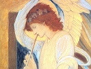

  
[Intangible Textual Heritage](../../index)  [Bible](../index.md) 
[Index](index)  [Previous](bep01)  [Next](bep03.md) 

------------------------------------------------------------------------

[Buy this Book at
Amazon.com](https://www.amazon.com/exec/obidos/ASIN/0913510017/internetsacredte.md)

------------------------------------------------------------------------

  
*The Book of Enoch the Prophet*, tr. by Richard Laurence, \[1883\], at
Intangible Textual Heritage

------------------------------------------------------------------------

p. 1

# THE BOOK OF ENOCH.

I

### CHAP. I.

1\. THE word of the blessing of Enoch,
how he blessed the elect and the righteous, who were to exist in the
time of trouble; rejecting [1](#fn_20.md) all the
wicked and ungodly. Enoch, a righteous man, who was with God, answered
and spoke, *while* his eyes were open, and while he saw a holy vision in
the heavens. [2](#fn_21.md) This the angels showed
me.

2\. From them I heard all things, and understood what I saw; that which
will not take place in this generation, but in a generation which is to
succeed at a distant period, on account of the elect.

3\. Upon their account I spoke and conversed with him, who will go forth
from his habitation, the Holy and Mighty One, the God of the world:

p. 2

4\. Who will hereafter tread upon Mount Sinai; appear with his hosts;
and be manifested in the strength of his power from heaven.

5\. All shall be afraid, and the Watchers be terrified.

6\. Great fear and trembling shall seize them, even to the ends of the
earth. The lofty mountains shall be troubled, and the exalted hills
depressed, melting like a honeycomb in the flame. The earth shall be
immerged, and all things which are in it perish; while judgment shall
come upon all, even upon all the righteous:

7\. But to them shall he give peace: he shall preserve the elect, and
towards them exercise clemency.

8\. Then shall all belong to God; be happy and blessed; and the
splendour of the Godhead shall illuminate them.

II

### CHAP. II.

Behold, he comes with ten thousands of his saints, to execute judgment
upon them, and destroy the wicked, and reprove all the carnal [1](#fn_22.md) for everything which the sinful and
ungodly have done, and committed against him. [2](#fn_23.md)

p. 3

III

### CHAP. III.

1\. All who are in the heavens know what is transacted [1](#fn_24.md) there.

2\. They know that the heavenly luminaries change not their paths; that
each rises and sets regularly, every one at its proper period, without
transgressing the commands which they have received. They behold the
earth, and understand what is there transacted, from the beginning to
the end of it.

3\. They see that every work of God is invariable in the period of its
appearance. They behold summer and winter: perceiving that the whole
earth is full of water; and that the cloud, the dew, and the rain
refresh it.

IV

### CHAP. IV.

They consider and behold every tree, how it appears to wither, and every
leaf to fall off, except of fourteen trees, which are not deciduous;
which wait from the old, to the appearance of the new leaf, for two or
three winters.

V

### CHAP. V.

Again they consider the days of summer, that the sun is upon it at its
very beginning; while you

p. 4

seek for a covered and shady spot on account of the burning sun; while
the earth is scorched up with fervid heat, and you become incapable of
walking either upon the ground or upon the rocks in consequence of that
heat.

VI

### CHAP. VI.

1\. They consider how the trees, when they put forth their green leaves,
become covered, and produce fruit; understanding everything, and knowing
that He who lives for ever does all these things for you:

2\. *That* the works at the beginning of every existing year, that all
his works, are subservient to him, and invariable; yet as God has
appointed, so are all things brought to pass.

3\. They see, too, how the seas and the rivers together complete their
respective operations:

4\. *But* you endure not patiently, nor fulfil the commandments of the
Lord; but you transgress and calumniate *his* greatness; and malignant
are the words in your polluted mouths against his Majesty.

5\. Ye withered in heart, no peace shall be to you!

6\. Therefore your days shall you curse, and the years of your lives
shall perish; perpetual execration

p. 5

shall be multiplied, and you shall not obtain mercy.

7\. In those days shall you resign your peace with the eternal
maledictions of all the righteous, and sinners shall perpetually
execrate you;

8\. *Shall execrate* you with the ungodly.

9\. The elect shall possess light, joy, and peace; and they shall
inherit the earth.

10\. But you, ye unholy, shall be accursed.

11\. Then shall wisdom be given to the elect, all of whom shall live,
and not again transgress by impiety or pride; but shall humble
themselves, possessing prudence, and shall not repeat transgression.

12\. They shall not be condemned the whole period of their lives, nor
die in torment and indignation; but the sum of their days [1](#fn_25.md) shall be completed, and they shall grow
old in peace; while the years of their happiness shall be multiplied
with joy, and with peace, for ever, the whole duration of their
existence.

VII

### CHAP. VII. \[SECT. II. [2](#fn_26.md)\]

1\.  [3](#fn_27.md) It happened after the sons of
men had multiplied

p. 6

in those days, that daughters were born to them, elegant and beautiful.

2\. And when the angels, the sons of heaven, beheld them, they became
enamoured of them, saying to each other, Come, let us select for
ourselves wives from the progeny of men, and let us beget children.

3\. Then their leader Samyaza said to them; I fear that you may perhaps
be indisposed to the performance of this enterprise;

4\. And that I alone shall suffer for so grievous a crime.

5\. But they answered him and said; We all swear;

6\. And bind ourselves by mutual execrations, that we will not change
our intention, but execute our projected undertaking.

7\. Then they swore all together, and all bound themselves by mutual
execrations. Their whole number was two hundred, who descended upon
Ardis, which is the top of mount Armon.

8\. That mountain therefore was called [1](#fn_28.md) Armon, because they had sworn upon it, and
bound themselves by mutual execrations.

9\. These are the names of their chiefs: Samyaza, who was their leader,
Urakabarameel, Akibeel, Tamiel, Ramuel, Danel, Azkeel, Saraknyal, Asael,

p. 7

\[paragraph continues\] Armers, Batraal,
Anane, Zavebe, Samsaveel, Ertael, Turel, Yomyael, Arazyal. These were
the prefects of the two hundred angels, and the remainder were all with
them.

10\. Then they took wives, each choosing for himself; whom they began to
approach, and with whom they cohabited; teaching them sorcery,
incantations, and the dividing of roots and trees.

11\.  [1](#fn_29.md) And the women [2](#fn_30.md) conceiving brought forth giants,

12\. Whose stature was each three hundred cubits. These devoured all
which the labour of men produced; until it became impossible to feed
them;

13\. When they turned themselves against men, in order to devour them;

14\. And began to injure birds, beasts, reptiles, and fishes, to eat
their flesh one after another, and to drink their blood.

15\. Then the earth reproved the unrighteous.

VIII

### CHAP. VIII.

1\. Moreover Azazyel taught men to make swords, knives, shields,
breastplates, the fabrication of

p. 8

mirrors, [1](#fn_31.md) and the workmanship of
bracelets and ornaments, the use of paint, the beautifying of the
eyebrows, *the use of* stones of every valuable and select kind, and of
all sorts of dyes, so that the world became altered.

2\. Impiety increased; fornication multiplied; and they transgressed and
corrupted all their ways.

3\. Amazarak taught all the sorcerers, and dividers of roots:

4\. Armers *taught* the solution of sorcery;

5\. Barkayal *taught* the observers of the stars;

6\. Akibeel *taught* signs;

7\. Tamiel *taught* astronomy;

8\. And Asaradel taught the motion of the moon.

9\. And men, being destroyed, cried out; and their voice reached to
heaven.

IX

### CHAP. IX.

1\. Then Michael and Gabriel, Raphael, Suryal, and Uriel, looked down
from heaven, and saw the quantity of blood which was shed on earth, and
all the iniquity which was done upon it, and said one to another, *It
is* the voice of their cries;

2\. The earth deprived *of her children* has cried even to the gate of
heaven.

p. 9

3\. And now to you, O ye holy ones of heaven, the souls of men complain,
saying, Obtain Justice for us with [1](#fn_32.md)
the Most High. Then they said to their Lord, the King, *Thou art* Lord
of lords, God of gods, King of kings. The throne of thy glory is for
ever and ever, and for ever and ever is thy name sanctified and
glorified. Thou art blessed and glorified.

4\. Thou hast made all things; thou possessest power over all things;
and all things are open and manifest before thee. Thou beholdest all
things, and nothing, can be concealed from thee.

5\. Thou hast seen what Azazyel has done, how he as taught every species
of iniquity upon earth, and has disclosed to the world all the secret
things which are done in the heavens.

6\. Samyaza also has taught sorcery, to whom thou hast given authority
over those who are associated with him. They have gone together to the
daughters of men; have lain with them; have become polluted;

7\. And have discovered crimes to them.

8\. The women likewise have brought forth giants.

9\. Thus has the whole earth been filled with blood and with iniquity.

10\. And now behold the souls of those who are dead, cry out.

p. 10

11\. And complain even to the gate of heaven.

12\. Their groaning ascends; nor can they escape from the
unrighteousness which is committed on earth. Thou knowest all things,
before they exist.

13\. Thou knowest these things, and what has been done by them; yet thou
dost not speak to us.

14\. What on account of these things ought we to do to them?

X

### CHAP. X.

1\. Then the Most High, the Great and Holy One spoke,

2\. And sent Arsayalalyur to the son of Lamech,

3\. Saying, Say to him in my name, Conceal thyself.

4\. Then explain to him the consummation which is about to take place;
for all the earth shall perish; the waters of a deluge shall come over
the whole earth, and all things which are in it shall be destroyed.

5\. And now teach him how he may escape, and how his seed may remain in
all the earth.

6\. Again the Lord said to Raphael, Bind Azazyel hand and foot; cast him
into darkness; and opening the desert which is in Dudael, cast him in
there.

7\. Throw upon him hurled and pointed stones, covering him with
darkness;

p. 11

8\. There shall he remain for ever; cover his face, that he may not see
the light.

9\. And in the great day of judgment let him be cast into the fire.

10\. Restore the earth, which the angels have corrupted; and announce
life to it, that I may revive it.

11\. All the sons of men shall not perish in consequence of every
secret, by *which* the Watchers have destroyed, and which they have
taught, their offspring.

12\. All the earth has been corrupted by the effects of the
teaching [1](#fn_33.md) of Azazyel. To him
therefore ascribe the whole crime.

13\. To Gabriel also the Lord said, Go to the biters, to the reprobates,
to the children of fornication; and destroy the children of fornication,
the offspring of the Watchers, from among men; bring them forth, and
excite [2](#fn_34.md) them one against another. Let
them perish by *mutual* slaughter; for length of days shall not be
theirs.

14\. They shall all entreat thee, but their fathers shall not obtain
*their wishes* respecting them; for they shall hope for eternal life,
and that they may live, each of them, five hundred years.

15\. To Michael likewise the Lord said, Go and announce *his crime* to
Samyaza, and to the others

p. 12

who are with him, who have been associated with women, that they might
be polluted with all their impurity. And when all their sons shall be
slain, when they shall see the perdition of their beloved, bind them for
seventy generations underneath the earth, even to the day of judgment,
and of consummation, until the judgment, *the effect of* which will last
for ever, be completed. [1](#fn_35.md)

16\. Then shall they be taken away into the lowest depths of the fire in
torments; and in confinement shall they be shut up for ever.

17\. Immediately after this shall he, together with them, burn and
perish; they shall be bound until the consummation of many generations.

18\. Destroy all the souls addicted to dalliance, and the offspring of
the Watchers, for they have tyrannized over mankind.

19\. Let every oppressor perish from the face of the earth;

20\. Let every evil work be destroyed;

21\. The plant of righteousness and of rectitude appear, and its
produce [2](#fn_36.md) become a blessing.

22\. Righteousness and rectitude shall be for ever planted with delight.

23\. And then shall all the saints give thanks, and live until they have
begotten a thousand children,

p. 13

while the whole period of their youth, and their sabbaths shall be
completed in peace. In those days all the earth shall be cultivated in
righteousness; it shall be wholly planted with trees, and filled with
benediction; every tree of delight shall be planted in it.

24\. In it shall vines be planted; and the vine which shall be planted
in it shall yield fruit to satiety; every seed, which shall be sown in
it, shall produce for one measure a thousand; and one measure of olives
shall produce ten presses of oil.

25\. Purify the earth from all oppression, from all injustice, from all
crime, from all impiety, and from all the pollution which is committed
upon it. Exterminate them from the earth.

26\. Then shall all the children of men be righteous, and all nations
shall pay me divine honours, and bless me; and all shall adore me.

27\. The earth shall be cleansed from all corruption, from every crime,
from all punishment, and from all suffering; neither will I again send a
deluge upon it from generation to generation for ever.

28\. In those days I will open the treasures of blessing which are in
heaven, that I may cause them to descend upon earth, and upon all the
works and labour of man.

29\. Peace and equity shall associate with the sons of men all the days
of the world, in every generation of it.

p. 14

XI

### (No CHAP. XI. [1](#fn_37).md)

XII

### CHAP. XII. \[SECT. III. [2](#fn_38.md)\]

1\. Before all these things Enoch was concealed; nor did any one of the
sons of men know where he was concealed, where he had been, and what had
happened.

2\. He was wholly engaged with the holy ones, and with the Watchers in
his days.

3\. I, Enoch, was blessing the great Lord and King of peace.

4\. And behold the Watchers called me Enoch the scribe.

5\. Then *the Lord* said to me: Enoch, scribe of righteousness, go tell
the Watchers of heaven, who have deserted the lofty sky, and their holy
everlasting station, *who* have been polluted with women.

6\. And have done as the sons of men do, by taking to themselves wives,
and who have been greatly corrupted on the earth;

7\. That on the earth they shall never obtain peace and remission of
sin. For they shall not rejoice in their offspring; they shall behold
the slaughter of their beloved; shall lament for the destruction of
their sons; and shall petition for ever; but shall not obtain mercy and
peace.

p. 15

XIII

### CHAP. XIII.

1\. Then Enoch, passing on, said to Azazyel: Thou shalt not obtain
peace. A great sentence is gone forth against thee. He shall bind thee;

2\. Neither shall relief, mercy, and supplication be thine, on account
of the oppression which thou hast taught;

3\. And on account of every act of blasphemy, tyranny, and sin, which
thou hast discovered to the children of men.

4\. Then departing from him I spoke to them all together;

5\. And they all became terrified, and trembled;

6\. Beseeching me to write for them a memorial of supplication, that
they might obtain forgiveness; and that I might make the memorial of
their prayer ascend up before the God of heaven; because they could not
themselves thenceforwards address him, nor raise up their eyes to heaven
on account of the disgraceful offence for which they were judged.

7\. Then I wrote a memorial of their prayer and supplication, for their
spirits, for everything which they had done, and for the subject of
their entreaty, that they might obtain remission and rest.

8\. Proceeding on, I continued over the waters of Danbadan, which is on
the right to the west of

p. 16

\[paragraph continues\] Armon, reading the
memorial of their prayer, until I fell asleep.

9\. And behold a dream came to me, and visions appeared above me. I fell
down and saw a vision of punishment, that I might relate it to the sons
of heaven, and reprove them. When I awoke I went to them. All being
collected together stood weeping in Oubelseyael, which is situated
between Libanos and Seneser, with their faces veiled.

10\. I related in their presence all the visions which I had seen, and
my dream;

11\. And began to utter these words of righteousness, reproving the
Watchers of heaven.

XIV

### CHAP. XIV.

1\. This is the book of the words of righteousness, and of the reproof
of the Watchers, who belong to the world, according to that which He,
who is holy and great, commanded in the vision. I perceived in my dream,
that I was now speaking with a tongue of flesh, and with my breath,
which the Mighty One has put into the mouth of men, that they might
converse with it.

2\. And understand with the heart. As he has created and given to men
*the power of* comprehending the word of understanding, so has he
created and given to me *the power of* reproving the Watchers,

p. 17

the offspring of heaven. I have written your petition; and in my vision
it has been shown me, that what you request will not be granted you as
long as the world endures. [1](#fn_39.md)

3\. Judgment has been passed upon you: *your request* will not be
granted you.

4\. From this time forward, never shall you ascend into heaven; He has
said, that on the earth He will bind you, as long as the world endures.

5\. But before these things you shall behold the destruction of your
beloved sons; you shall not possess them, but they shall fall before you
by [the](errata.htm#1.md) sword.

6\. Neither shall you entreat for them, nor for yourselves;

7\. But you shall weep and supplicate in silence. The words of the book
which I wrote.

8\. A vision thus appeared to me.

9\. Behold, in *that* vision clouds and a mist invited me; [2](#fn_40.md) agitated stars [3](#fn_41.md) and flashes of lightning impelled and
pressed me forwards, while winds in the vision assisted my flight,
accelerating my progress. [4](#fn_42.md)

10\. They elevated me aloft to heaven. I proceeded, until I arrived at a
wall built with stones of

p. 18

crystal. [1](#fn_43.md) A vibrating flame [2](#fn_44.md) surrounded it, which began to strike me
with terror.

11\. Into this vibrating flame I entered;

12\. And drew nigh to a spacious habitation built also with stones of
crystal. Its walls too, as well as pavement, were *formed* with stones
of crystal, and crystal likewise was the ground. Its roof had the
appearance of agitated [3](#fn_45.md) stars and
flashes of lightning; and among them were cherubim of fire in a stormy
sky. [4](#fn_46.md) A flame burned around its
walls; and its portal blazed with fire. When I entered into this
dwelling, it was hot as fire and cold as ice. No *trace* of delight or
of life was there. Terror overwhelmed me, and a fearful shaking seized
me.

13\. Violently agitated and trembling, I fell upon my face. In the
vision I looked,

14\. And behold there was another habitation more spacious than *the
former*, every entrance to which was open before me, erected in *the
midst of* a vibrating flame.

15\. So greatly did it excel in all points, in glory, in magnificence,
and in magnitude, that it is impossible to describe to you either the
splendour or the extent of it.

16\. Its floor was on fire; above were lightnings

p. 19

and agitated stars, while its roof exhibited a blazing fire.

17\. Attentively I surveyed it, and saw that it contained an exalted
throne;

18\. The appearance of which was like that of frost; while its
circumference resembled the orb of the brilliant sun; and *there was*
the voice of the cherubim.

19\. From underneath this mighty throne rivers of flaming fire issued.

20\. To look upon it was impossible.

21\. One great in glory sat upon it:

22\. Whose robe was brighter than the sun, and whiter than snow.

23\. No angel was capable of penetrating to view the face of Him, the
Glorious and the Effulgent; nor could any mortal behold Him. A fire was
flaming [1](#fn_47.md) around Him.

24\. A fire also of great extent continued to rise up before Him; so
that not one of those who surrounded Him was capable of approaching Him,
among the myriads of 'myriads who were before Him. To Him holy
consultation was needless. [2](#fn_48.md) Yet did
not the sanctified, who were near Him, depart far from Him either by
night or by day; nor were they removed from Him. I also was so far
advanced, with a veil on my face, and trembling.

p. 20

\[paragraph continues\] Then the Lord with
his *own* mouth called me, saying, Approach hither, Enoch, at my holy
word.

25\. And He raised me up, making me draw near even to the entrance. My
eye was directed to the ground.

XV

### CHAP. XV.

1\. Then addressing me, He spoke and said, [1](#fn_49.md) Hear, neither be afraid, O righteous
Enoch, thou scribe of righteousness: [2](#fn_50.md)
approach hither, and hear my voice. Go, say to the Watchers of heaven,
who have sent thee to pray for them, You ought to pray for men, and not
men for you.

2\. Wherefore have you forsaken the lofty and holy heaven, which endures
for ever, and have lain with women; have defiled yourselves with the
daughters of men; have taken to yourselves wives; have acted like the
sons of the earth, and have begotten an impious offspring? [3](#fn_51.md)

3\. You being spiritual, holy, and possessing a life [4](#fn_52.md) which is eternal, have polluted yourselves
with women; have begotten in carnal blood; have lusted in the blood of
men; and have done as those who are flesh and blood do.

4\. These however die and perish.

p. 21

5\. Therefore have I given to them wives, that they might cohabit with
them; that sons might be born of them; and that this might be transacted
upon earth.

6\. But you from the beginning were made spiritual, possessing a life
which is eternal, and not subject to death for ever. [1](#fn_53.md)

7\. Therefore I made not wives for you, because, being spiritual, your
dwelling is in heaven.

8\.  [2](#fn_54.md) Now the giants, who lave been
born of spirit and of flesh, shall be called upon earth evil spirits,
and on earth shall be their habitation. Evil spirits shall proceed from
their flesh, because they were created from above; from the holy
Watchers was their beginning and primary foundation. Evil spirits shall
they be upon earth, and the spirits of the wicked shall they be called.
The habitation of the spirits of heaven shall be in heaven; but upon
earth shall be the habitation of terrestrial spirits, who are born on
earth.

9\. The spirits of the giants shall be like clouds, which shall oppress,
corrupt, fall, contend, and bruise upon earth.

10\. They shall cause lamentation. No food shall they eat; and they
shall be thirsty; they shall be

p. 22

concealed, and shall not [1](#fn_55.md) rise up
against the sons of men, and against women; for they come forth during
the days of slaughter and destruction.

XVI

### CHAP. XVI.

1\. And as to the death of the giants, wheresoever their spirits depart
from their bodies, let their flesh, that which is perishable, be without
judgment. Thus shall they perish, until the day of the great
consummation of the great world. A destruction shall take place of [2](#fn_56.md) the Watchers and the impious.

2\. And now to the Watchers, who have sent thee to pray for them, who in
the beginning were in heaven,

3\. Say, In heaven have you been; secret things, however, have not been
manifested to you; yet have you known a reprobated mystery.

4\. And this you have related to women in the hardness of your heart,
and by that mystery have women and mankind multiplied evils upon the
earth.

5\. Say to them, Never therefore shall you obtain peace.

p. 23

XVII

### CHAP. XVII. \[SECT. IV. [1](#fn_57.md)\]

1\. They raised me up into a certain place, [2](#fn_58.md) where there was the appearance of a
burning fire; and when they pleased they assumed the likeness of men.

2\. They carried me to a lofty spot, to a mountain, the top of which
reached to heaven.

3\. And I beheld the receptacles of light and of thunder at the
extremities of the place, where it was deepest. There was a bow of fire,
and arrows in their quiver, a sword of fire, and every species of
lightning.

4\. Then they elevated me to a babbling stream, [3](#fn_59.md) and to a fire in the west, which received
all the setting of the sun. I came to a river of fire, which flowed like
water, and emptied itself into the great sea westwards.

5\. I saw every large river, until I arrived at the great darkness. I
went to where all of flesh migrate; and I beheld the mountains of the
gloom which constitutes winter, and the place from which issues the
water in every abyss.

6\. I saw also the mouths of all the rivers in the world, and the mouths
of the deep.

p. 24

XVIII

### CHAP. XVIII.

1\. I then surveyed the receptacles of all the winds, perceiving that
they contributed to adorn [1](#fn_60.md) the whole
creation, and to preserve the foundation of the earth.

2\. I surveyed the stone which supports the corners of the earth.

3\. I also beheld the four winds, which bear up the earth, and the
firmament of heaven.

4\. And I beheld the winds occupying the exalted sky. [2](#fn_61.md)

5\. Arising in the midst of heaven and of earth, and constituting the
pillars of heaven.

6\. I saw the winds which turn the sky, which cause the orb of the sun
and of all the stars to set; and over the earth I saw the winds which
support the clouds.

7\. I saw the path of the angels.

8\. I perceived at the extremity of the earth the firmament of heaven
above it. Then I passed on towards the south;

9\. Where burnt, both by day and night, six mountains formed of glorious
stones; three towards the east, and three towards the south.

10\. Those which were towards the east were of a variegated stone; one
of which was of margarite,

p. 25

and another of antimony. Those towards the south were of a red stone.
The middle one reached to heaven like the throne of God; *a throne
composed* of alabaster, the top of which was of sapphire. I saw, too, a
blazing fire hanging over [1](#fn_62.md) all the
mountains.

11\. And there I saw a place on the other side of an extended territory,
where waters were collected.

12\. I likewise beheld terrestrial fountains, deep in the fiery columns
of heaven.

13\. And in the columns of heaven I beheld fires, which descended
without number, but neither on high, nor into the deep. Over these
fountains also I perceived a place which had neither the firmament of
heaven above it, nor the solid ground underneath it; neither was there
water above it, nor anything on wing; but the spot was desolate.

14\. And there I beheld seven stars, like great blazing mountains, and
like spirits entreating me.

15\. Then the angel said, This place, until the consummation of heaven
and earth, will be the prison of the stars, and the host of heaven.

16\. The stars which roll over fire are those which transgressed the
commandment of God before their time arrived; for they came not in their
proper season. Therefore was He offended with them, and bound them,
until the period of the consummation of their crimes in the secret year.

p. 26

XIX

### CHAP. XIX.

1\. Then Uriel said, Here the angels, who cohabited with women,
appointed their leaders;

2\. And being numerous in appearance made men profane, and caused them
to err; so that they sacrificed to devils as to gods. For in the great
day *there shall be* a judgment, with which they shall be *judged*,
until they are consumed; and their wives also shall be judged, who led
astray the angels of heaven that they might salute them.

3\. And I, Enoch, I alone saw the likeness of the end of all things. Nor
did any human being see it, as I saw it.

XX

### CHAP. XX.

1\. These are the names of the angels who watch.

2\. Uriel, one of the holy angels, who *presides* over [1](#fn_63.md) clamour and terror.

3\. Raphael, one of the holy angels, who *presides* over the spirits of
men.

4\. Raguel, one of the holy angels, who inflicts punishment on the world
and the luminaries.

5\. Michael, one of the holy angels, who, *presiding* over human virtue,
commands the nations.

6\. Sarakiel, one of the holy angels, who *presides* over the spirits of
the children of men that transgress.

p. 27

7\. Gabriel, one of the holy angels, who *presides* over Ikisat, [1](#fn_64.md) over paradise, and over the cherubim.

------------------------------------------------------------------------

### Footnotes

[1:1](bep02.htm#fr_21.md) *to the rejection of*.
N.B. The Italic words in the text supply an ellipsis. In the notes they
are used to mark the literal sense.

[1:2](bep02.htm#fr_22.md) *which* was *in the
heavens*.

[2:1](bep02.htm#fr_23.md) of flesh.

[2:2](bep02.htm#fr_24.md) Quoted by St. Jude ver.
14, 15.

[3:1](bep02.htm#fr_25.md) *the work*.

[5:1](bep02.htm#fr_26.md) *the days of their life*.

[5:2](bep02.htm#fr_27.md) Section II. Paris MS.
transcribed by Woide.

[5:3](bep02.htm#fr_28.md) The first two extracts
made by Syncellus from the Greek commence here, and end with the 15th
verse of chap. x.

[6:1](bep02.htm#fr_29.md) *they called*.

[7:1](bep02.htm#fr_30.md) This and the following
verses of this chapter, viz. 11, 12, 13, 14, 15, seem to belong to the
next chapter, and should perhaps be inserted between the 8th and 9th
verses of that chapter. Such appears to be their situation in the Greek
fragment, quoted by Syncellus.

[7:2](bep02.htm#fr_31.md) *They*.

[8:1](bep02.htm#fr_32.md) *made them see that which
was behind them*.

[9:1](bep02.htm#fr_33.md) *Bring judgment to us
from*.

[11:1](bep02.htm#fr_34.md) *by the teaching of the
work of Azazyel*.

[11:2](bep02.htm#fr_35.md) *send*.

[12:1](bep02.htm#fr_36.md) Here end the first two
extracts made by Syncellus.

[12:2](bep02.htm#fr_37.md) and the work of
righteousness and rectitude.

[14:1](bep02.htm#fr_38.md) The Paris MS. makes the
last two verses of the preceding chapter, the xi. chapter.

[14:2](bep02.htm#fr_39.md) Paris MS.

[17:1](bep02.htm#fr_40.md) *in all the days of the
world*.

[17:2](bep02.htm#fr_41.md) *clouds invited me, and
a mist invited me*.

[17:3](bep02.htm#fr_42.md) *the running of the
stars*.

[17:4](bep02.htm#fr_43.md) *hastening me*.

[18:1](bep02.htm#fr_44.md) *hail*, *crystal*.

[18:2](bep02.htm#fr_45.md) *a tongue of fire*.

[18:3](bep02.htm#fr_46.md) *the course of the*.

[18:4](bep02.htm#fr_47.md) *and their heaven* (i.e.
*whose heaven*) was *water*.

[19:1](bep02.htm#fr_48.md) *A fire of flaming
fire*.

[19:2](bep02.htm#fr_49.md) *And he required not
holy counsel*.

[20:1](bep02.htm#fr_50.md) *he said with his
voice*.

[20:2](bep02.htm#fr_51.md) *O Enoch, O righteous
man, and scribe of righteousness*.

[20:3](bep02.htm#fr_52.md) *giants*.

[20:4](bep02.htm#fr_53.md) *living a life*.

[21:1](bep02.htm#fr_54.md) *in all the generations
of the world*.

[21:2](bep02.htm#fr_55.md) The third extract made
by Syncellus begins here, and ends with the first verse of the next
chapter.

[22:1](bep02.htm#fr_56.md) *and those spirits shall
not*. M. De Sacy here remarks, that the sense seems to require an
affirmative, instead of a negative, clause.

[22:2](bep02.htm#fr_57.md) *It shall be consummated
respecting*.

[23:1](bep02.htm#fr_58.md) Paris MS., in which
however the title of chap. xvii. is omitted, although the section is
noticed.

[23:2](bep02.htm#fr_59.md) *one place*.

[23:3](bep02.htm#fr_60.md) *to water of life, which
spoke*.

[24:1](bep02.htm#fr_61.md) *that in them were the
ornaments of*.

[24:2](bep02.htm#fr_62.md) *the height of heaven*.

[25:1](bep02.htm#fr_63.md) *which was over*.

[26:1](bep02.htm#fr_64.md) *for* he it is *who* is
over.

[27:1](bep02.htm#fr_65.md) *Ikisat*. This appears
to be a proper name.

------------------------------------------------------------------------

[Next: Chapters XXI-XL](bep03.md)
