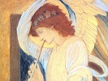

  
[Intangible Textual Heritage](../../index)  [Bible](../index) 
[Index](index)  [Previous](bep05)  [Next](bep07) 

------------------------------------------------------------------------

[Buy this Book at
Amazon.com](https://www.amazon.com/exec/obidos/ASIN/0913510017/internetsacredte)

------------------------------------------------------------------------

  
*The Book of Enoch the Prophet*, tr. by Richard Laurence, \[1883\], at
Intangible Textual Heritage

------------------------------------------------------------------------

p. 114

LXXXI

### CHAP. LXXXI.

1\. Now, my son Mathusala, all these things I speak unto thee, and write
for thee. To thee I have revealed all, and have given thee books of
everything.

2\. Preserve, my son Mathusala, the books written by thy father; [1](#fn_184) that thou mayest transmit them to future
generations.

3\. Wisdom have I given to thee, to thy children, and thy posterity,
that they may transmit to their children, for generations for ever, this
wisdom in their thoughts; and that those who comprehend it may not
slumber, but hear with their ears; that they may learn this wisdom, and
be deemed worthy of eating *this* wholesome food.

4\. Blessed are all the righteous; blessed all who walk in *the paths
of* righteousness; in whom no crime *is found*, as in sinners, when all
their days are numbered.

5\. With respect to the progress of the sun in heaven, it enters and
goes out of each gate for thirty days, with the leaders of the thousand
classes of the stars; with four which are added, and appertain to the
four quarters of the year, which conduct them, and accompany them at
four periods.

6\. Respecting these, men greatly err, and do not

p. 115

compute them in the computation of every age; for they greatly err
respecting them; nor do men know accurately that they are in the
computation of the year. But indeed these are marked down [1](#fn_185) for ever; one in the first gate, one in
the third, one in the fourth, and one in the sixth:

7\. So that the year is completed in three hundred and sixty-four days.

8\. Truly has been stated, [2](#fn_186) and
accurately has been computed that which is marked down; for the
luminaries, the months, the fixed periods, the years, and the days,
Uriel has explained to me, and communicated to me; [3](#fn_187) whom the Lord of all creation, on my
account, commanded (according to the might of heaven, and the power
which it possesses both by night and by day) to explain *the laws of*
light to man, of the sun, moon, and stars, and of all the powers of
heaven, which are turned with their respective orbs.

9\. This is the ordinance of the stars, which set in their places, in
their seasons, in their periods, in their days, and in their months.

10\. These are the names of those who conduct them, who watch and enter
in their seasons, according to their ordinance in their periods, in
their months, in *the times of* their influence, and in their stations.

p. 116

11\. Four conductors of them first enter, who separate the four quarters
of the year. After these, twelve conductors of their classes, who
separate the months and the year *into* three hundred and sixty-four
*days*, with the leaders of a thousand, who distinguish between the
days, as well as between the four additional ones; which, *as*
conductors, divide the four quarters of the year.

12\. These leaders of a thousand are in the midst of the conductors, and
the conductors are added each behind his station, and their conductors
make the separation. These are the names of the conductors, who separate
the four quarters of the year, who are appointed *over them:* Melkel,
Helammelak,

13\. Meliyal, and Narel.

14\. And the names of those who conduct them are Adnarel, Jyasusal, and
Jyelumeal.

15\. These are the three who follow after the conductors of the classes
*of stars;* each following after the three conductors of the classes,
which themselves follow after those conductors of the stations, who
divide the four quarters of the year.

16\. In the first part of the year rises and rules Melkyas, who is named
Tamani, and Zahay. [1](#fn_188)

17\. All the days of his influence, *during* which he rules, are
ninety-one days.

18\. And these are the signs of the days which

p. 117

are seen upon earth. In the days of his influence *there is*
perspiration, heat, and trouble. All the trees become fruitful; the leaf
of every tree comes forth; the corn is reaped; the rose and every
species of flowers blossoms in the field; and the trees of winter are
dried up.

19\. These are the names of the conductors who are under them: Barkel,
Zelsabel; and another additional conductor of a thousand is named
Heloyalef, the days of whose influence have been completed. The other
conductor next after them is Helemmelek, whose name they call the
splendid Zahay.

20\. All the days of his light are ninety-one days.

21\. These are the signs of the days upon earth, heat and drought; while
the trees bring forth their fruits, warmed and concocted, and give their
fruits to dry.

22\. The flocks follow and yean. All the fruits of the earth are
collected, with everything in the fields, and the vines are trodden.
This takes place during the time of his influence.

23\. These are their names and orders, and *the names* of the conductors
who are under them, of those who are chiefs of a thousand: Gedaeyal,
Keel, Heel.

24\. And the name of the additional leader of a thousand is Asphael.

p. 118

25\. The days of his influence have been completed.

LXXXII

### CHAP. LXXXII. \[SECT. XVI. [1](#fn_189)\]

1\. And now I have shown thee, my son Mathusala, every sight which I saw
prior to thy birth. [2](#fn_190) I will relate
another vision, which I saw before I was married; they resemble each
other.

2\. The first was when I was learning a book; and the other before I was
married to thy mother. I saw a potent vision;

3\. And on account of these things besought the Lord.

4\. I was lying down in the house of my grandfather Malalel, *when* I
saw in a vision heaven purifying, and snatched away.

5\. And falling to the earth, I saw likewise the earth absorbed by a
great abyss; and mountains suspended over mountains.

6\. Hills were sinking upon hills, lofty trees were gliding [3](#fn_191) off from their trunks, and were in the
act of being projected, and of sinking into the abyss.

7\. Being alarmed at these things, my voice faltered. [4](#fn_192) I cried out and said, The earth is
destroyed. Then my grandfather Malalel raised me

p. 119

up, and said to me: Why dost thou thus cry out, my son? and wherefore
dost thou thus lament?

8\. I related to him the whole vision which I had seen. He said to me,
Confirmed is that which thou hast seen, my son;

9\. And potent the vision of thy dream respecting every secret sin of
the earth. Its substance shall sink into the abyss, and a great
destruction take place.

10\. Now, my son, rise up; and beseech the Lord of glory (for thou art
faithful), that a remnant may be left upon earth, and that he would not
wholly destroy it. My son, all this *calamity* upon earth comes down
from heaven; [1](#fn_193) upon earth shall
there be a great destruction.

11\. Then I arose, prayed, and entreated; and wrote down my prayer for
the generations of the world, explaining everything to my son Mathusala.

12\. When I went out below, and looking up to heaven, beheld the sun
proceeding from the east, the moon descending to the west, a few
*scattered* stars, and everything which God [2](#fn_194) has known from the beginning, I blessed
the Lord of judgment, and magnified him: because he hath sent forth the
sun from the chambers [3](#fn_195) of the east;
that, ascending and rising in the face of heaven, it might spring up,
and pursue the path which has been pointed out to it.

p. 120

LXXXIII

### CHAP. LXXXIII.

1\. I lifted up my hands in righteousness, and blessed the holy, and the
Great One. I spoke with the breath of my mouth, and with a tongue of
flesh, which God has formed for all the sons of mortal men, that with it
they may speak; giving them breath, a mouth, and a tongue to converse
with.

2\. Blessed art thou, O Lord, the King, great and powerful in thy
greatness, Lord of all the creatures of heaven, King of kings, God of
the whole world, whose reign, whose kingdom, and whose majesty endure
for ever and ever.

3\. From generation to generation shall thy dominion *exist*. All the
heavens are thy throne for ever, and all the earth thy footstool for
ever and for ever.

4\. For thou hast made *them*, and over all thou reignest. No act
whatsoever exceeds thy power. With thee wisdom is unchangeable; nor from
thy throne and from thy presence is it ever averted. Thou knowest all
things, seest and hearest them; nor is anything concealed from thee; for
thou perceivest all things.

5\. The angels of thy heavens have transgressed; and on mortal flesh
shall thy wrath remain, [1](#fn_196) until the
day of the great judgment.

p. 121

6\. Now then, O God, Lord and mighty King, I entreat thee, and beseech
thee to grant my prayer, that a posterity may be left to me on earth,
and that the whole human race may not perish;

7\. That the earth may not be left destitute, and destruction take place
for ever.

8\. O my Lord, let the race perish from off the earth which has offended
thee, but a righteous and upright race establish for a posterity [1](#fn_197) for ever. Hide not thy face, O Lord,
from the prayer of thy servant.

LXXXIV

### CHAP. LXXXIV. \[SECT. XVII. [2](#fn_198)\]

1\. After this I saw another dream, and explained it all to thee, my
son. Enoch arose and said to his son Mathusala, To thee, my son, will I
speak. Hear my word; and incline thine ear to the visionary dream of thy
father. Before I married thy mother Edna, I saw a vision on my bed;

2\. And behold, a cow sprung forth from the earth;

3\. And this cow was white.

4\. Afterwards a female heifer sprung forth; and with it another
heifer: [3](#fn_199) one of them was black, and
one was red. [4](#fn_200)

p. 122

5\. The black heifer then struck the red one, and pursued it over the
earth.

6\. From that period I could see nothing more of the red heifer; but the
black one increased in bulk, and a female heifer came with him.

7\. After this I saw that many cows proceeded forth, resembling him, and
following after him.

8\. The first female young one also went out in the presence of the
first cow; and sought the red heifer; but found him not.

9\. And she lamented with a great lamentation, while she was seeking
him.

10\. Then I looked until that first *cow* came to her, from which time
she became silent, and ceased to lament.

11\. Afterwards she calved another white cow.

12\. And again calved many cows and black heifers.

13\. In my sleep also I perceived a white bull, which in like manner
grew, and became a large white bull.

14\. After him many white cows came forth, resembling him.

15\. And they began to calve many *other* white cows, which resembled
them and followed each other.

p. 123

LXXXV

### CHAP. LXXXV.

1\. Again I looked attentively, [1](#fn_201)
while sleeping, and surveyed heaven above.

2\. And behold a single star fell from heaven.

3\. Which being raised up, ate and fed among those cows.

4\. After that I perceived *other* large and black cows; and behold all
of them changed their stalls and pastures, while their young began to
lament one with another. Again I looked in my vision, and surveyed
heaven; when behold I saw many stars which descended, and projected
themselves from heaven to where the first star was,

5\. Into the midst of those young ones; while the cows were with them,
feeding in the midst of them.

6\. I looked at and observed them; when behold, they all acted after the
manner of horses, and began to approach the young cows, all of whom
became pregnant, and brought forth elephants, camels, and asses.

7\. At these all the cows were alarmed and terrified; when they began
biting with their teeth, swallowing, and striking with their horns.

8\. They began also to devour the cows; and

p. 124

behold all the children of the earth trembled, shook with terror at
them, and suddenly fled away.

LXXXVI

### CHAP. LXXXVI.

1\. Again I perceived them, when they began to strike and to swallow
each other; and the earth cried out. Then I raised my eyes a second time
towards heaven, and saw in a vision, that, behold, there came forth from
heaven as it were the likeness of white men. One came forth from thence,
and three with him.

2\. Those three, who came forth last, seized me by my hand; and raising
me up from the generations of the earth, elevated me to a high station.

3\. Then they showed me a lofty tower on the earth, while every hill
became diminished. And they said, Remain here, until thou perceivest
what shall come upon those elephants, camels, and asses, upon the stars,
and upon all the cows.

LXXXVII

### CHAP. LXXXVII.

1\. Then I looked at that one of the four *white men*, who came forth
first.

2\. He seized the first star which fell down from heaven.

3\. And, binding it hand and foot, he cast it into

p. 125

a valley; a valley narrow, deep, stupendous, and gloomy.

4\. Then one of them drew his sword, and gave it to the elephants,
camels, and asses, who began to strike each other. And the whole earth
shook on account of them.

5\. And when I looked in the vision, behold, one of those four angels,
who came forth, hurled from heaven, collected together, and took all the
great stars, whose form partly resembled that of horses; and binding
them all hand and foot, cast them into the cavities of the earth.

LXXXVIII

### CHAP. LXXXVIII.

1\. Then one of those four went to the white cows, and taught them a
mystery. While the cow was trembling, it was born, and became a
man, [1](#fn_202) and fabricated for himself a
large ship. In this he dwelt, and three cows [2](#fn_203) dwelt with him in that ship, which
covered them.

2\. Again I lifted up my eyes towards heaven, and saw a lofty roof.
Above it were seven cataracts, which poured forth on a certain village
much water.

3\. Again I looked, and behold there were fountains open on the earth in
that large village.

4\. The water began to boil up, and rose over the

p. 126

earth; so that the village was not seen, while its whole soil was
covered with water.

5\. Much water was over it, darkness, and clouds. Then I surveyed the
height of this water; and it was elevated above the village.

6\. It flowed over the village, and stood higher than the earth.

7\. Then all the cows which were collected there, while I looked on
them, were drowned, swallowed up, and destroyed in the water.

8\. But the ship floated above it. All the cows, the elephants, the
camels, and the asses, were drowned on the earth, and all cattle. Nor
could I perceive them. Neither were they able to get out, but perished,
and sunk into the deep.

9\. Again I looked in the vision until those cataracts from that lofty
roof were removed, and the fountains of the earth became equalized,
while other depths were opened;

10\. Into which the water began to descend, until the dry ground
appeared.

11\. The ship remained on the earth; the darkness receded; and it became
light.

12\. Then the white cow, which became a man, went out of the ship, and
the three cows with him.

13\. One of the three cows was white, resembling that cow; one of them
was red as blood; and one of them was black. And the white cow left
them.

p. 127

14\. Then began wild beasts and birds to bring forth.

15\. Of all these the different kinds assembled together, lions, tigers,
wolves, dogs, wild boars, foxes, rabbits, and the hanzar,

16\. The siset, the avest, kites, the phonkas, and ravens.

17\. Then a white cow [1](#fn_204) was born in
the midst of them.

18\. And they began to bite each other; when the white cow, which was
born in the midst of them, brought forth a wild ass and a white cow at
the same time, and *after that* many wild asses. Then the white
cow, [2](#fn_205) which was born, brought forth
a black wild sow and a white sheep. [3](#fn_206)

19\. That wild sow also brought forth many swine;

20\. And that sheep brought forth twelve sheep. [4](#fn_207)

21\. When those twelve sheep grew up, they delivered one of them [5](#fn_208) to the asses. [6](#fn_209)

22\. Again those asses delivered that sheep to the wolves; [7](#fn_210)

23\. And he grew up in the midst of them.

24\. Then the Lord brought the eleven *other* sheep, that they might
dwell and feed with him in the midst of the wolves.

p. 128

25\. They multiplied, and there was abundance of pasture for them.

26\. But the wolves began to frighten and oppress them, while they
destroyed their young ones.

27\. And they left their young in torrents of deep water.

28\. Now the sheep began to cry out on account of their young, and fled
for refuge to their Lord. One [1](#fn_211)
however, which was saved, escaped, and went away to the wild asses.

29\. I beheld the sheep moaning, crying, and petitioning their Lord,

30\. With all their might, until the Lord of the sheep descended at
their voice from his lofty habitation; went to them; and inspected them.

31\. He called to that sheep which had secretly stolen away from the
wolves, and told him to make the wolves understand that they were not to
touch the sheep.

32\. Then that sheep went to the wolves with the word of the Lord, when
another met him, [2](#fn_212) and proceeded
with him.

33\. Both of them together entered the dwelling of the wolves; and
conversing with them made them understand, that from thenceforwards they
were not to touch the sheep.

34\. Afterwards I perceived the wolves greatly

p. 129

prevailing over the sheep with their whole force. The sheep cried out;
and their Lord came to them.

35\. He began to strike the wolves, who commenced a grievous
lamentation; but the sheep were silent, nor from that time did they cry
out.

36\. I then looked at them, until they departed from the wolves. The
eyes of the wolves were blind, who went out and followed them with all
their might. But the Lord of the sheep proceeded with them, and
conducted them.

37\. All his sheep followed him.

38\. His countenance *was* terrific and splendid, and glorious was his
aspect. Yet the wolves began to follow the sheep, until they overtook
them in a certain lake of water. [1](#fn_213)

39\. Then that lake became divided; the water standing up on both sides
before their face.

40\. And while their Lord was conducting them, he placed himself between
them and the wolves.

41\. The wolves however perceived not the sheep, but went into the midst
of the lake, following them, and running after them into the lake of
water.

42\. But when they saw the Lord of the sheep, they turned to fly from
before his face.

43\. Then the water of the lake returned, and that suddenly, according
to its nature. It became full,

p. 130

and was raised up, until it covered the wolves. And I saw that all of
them which had followed the sheep perished, and were drowned.

44\. But the sheep passed over this water, proceeding to a wilderness,
which was without both water and grass. And they began to open their
eves and to see.

45\. Then I beheld the Lord of the sheep inspecting them, and giving
them water and grass.

46\. The sheep *already mentioned* was proceeding *with them*, and
conducting them.

47\. And when he had ascended the top of a lofty rock, the Lord of the
sheep sent him to them.

48\. Afterwards I perceived their Lord standing before them, with an
aspect terrific and severe.

49\. And when they all beheld him, they were frightened at his
countenance.

50\. All of them were alarmed, and trembled. They cried out after that
sheep; and to the other sheep who had been with him, and who was in the
midst of them, *saying*, We are not able to stand before our Lord, or to
look upon him.

51\. Then that sheep who conducted them went away, and ascended the top
of the rock;

52\. When the *rest of the* sheep began to grow blind, and to wander
from the path which he had shown them; but he knew it not.

53\. Their Lord however was moved with great

p. 131

indignation against them; and when that sheep had learned *what had
happened*,

54\. He descended from the top of the rock, and coming to them, found
that there were many,

55\. Which had become blind;

56\. And had wandered from his path. As soon as they beheld him, they
feared, and trembled at his presence;

57\. And became desirous of returning to their fold.

58\. Then that sheep, taking with him other sheep, went to those which
had wandered.

59\. And afterwards began to kill them. They were terrified at his
countenance. Then he caused those which had wandered to return; who went
back to their fold.

60\. I likewise saw there in the vision, that this sheep became a man,
built an house for the Lord of the sheep, and made them all stand in
that house.

61\. I perceived also that the sheep which proceeded to meet this sheep,
their conductor, died. I saw, too, that all the great sheep perished,
while smaller ones rose up in their place, entered into a pasture, and
approached a river of water. [1](#fn_214)

62\. Then that sheep, their conductor, who became a man, was separated
from them, and died.

63\. All the sheep sought after him, and cried for him with bitter
lamentation.

p. 132

64\. I saw likewise that they ceased to cry after that sheep, and passed
over the river of water.

65\. And that there arose other sheep, all of whom conducted them, [1](#fn_215) instead of those who were dead, and who
had *previously* conducted them.

66\. Then I saw that the sheep entered into a goodly place, and a
territory delectable and glorious.

67\. I saw also that they became satiated; that their house was in the
midst of a delectable territory: and that sometimes their eyes were
opened, and that sometimes they were blind; until another sheep [2](#fn_216) arose and conducted them. He brought
them all back; and their eyes were opened.

68\. Then dogs, foxes, and wild boars began to devour them, until
*again* another sheep [3](#fn_217) arose, the
master of the flock, one of themselves, a ram, to conduct them. This ram
began to butt on every side those dogs, foxes, and wild boars, until
they all perished.

69\. But the *former* sheep opened his eyes, and saw the ram in the
midst of them, who had laid aside his glory.

70\. And he began to strike the sheep, treading upon them, and behaving
himself without dignity.

71\. Then their Lord sent the *former* sheep *again* to a still
different [4](#fn_218) sheep, [5](#fn_219) and raised him up to be

p. 133

a ram, and to conduct them instead of that sheep who had laid aside his
glory.

72\. Going therefore to him, and conversing with him alone, he raised up
that ram, and made him a prince and leader of the flock. All the time
that the dogs [1](#fn_220) troubled the sheep,

73\. The first ram paid respect to this latter ram.

74\. Then the latter ram arose, and fled away from before his face. And
I saw that those dogs caused the first ram to fall.

75\. But the latter ram arose, and conducted the smaller sheep.

76\. That ram likewise begat many sheep, and died.

77\. Then there was a smaller sheep, [2](#fn_221) a ram, instead of him, which became a
prince and leader, conducting the flock.

78\. And the sheep increased in size, and multiplied.

79\. And all the dogs, foxes, and wild boars feared, and fled away from
him.

80\. That ram also struck and killed all the wild beasts, so that they
could not again prevail in the midst of the sheep, nor at any time ever
snatch them away.

81\. And that house was made large and wide; a lofty tower being built
upon it by the sheep, for the Lord of the sheep.

p. 134

82\. The house was low, but the tower was elevated and very high.

83\. Then the Lord of the sheep stood upon that tower, and caused a full
table to approach before him.

84\. Again I saw that those sheep wandered, and went various ways,
forsaking that their house;

85\. And that their Lord called to some among them, whom he sent [1](#fn_222) to them.

86\. But these the sheep began to kill. And when one of them was saved
from slaughter, [2](#fn_223) he leaped, and
cried out against those who were desirous of killing him.

87\. But the Lord of the sheep delivered him from their hands, and made
him ascend to him, and remain with him.

88\. He sent also many others to them, to testify, and with lamentations
to exclaim against them.

89\. Again I saw, when some of them forsook the house of their Lord, and
his tower; wandering on all sides, and growing blind,

90\. I saw that the Lord of the sheep made a great slaughter among them
in their pasture, until they cried out to him in consequence of that
slaughter. Then he departed from the place *of his habitation*, and left
them in the power of lions, tigers, wolves, and the zeebt, and in the
power of foxes, and of every beast.

p. 135

91\. And the wild beasts began to tear them.

92\. I saw, too, that he forsook the house of their fathers, and their
tower; giving them all into the power of lions to tear and devour them;
into the power of every beast.

93\. Then I began to cry out with all my might, imploring the Lord of
the sheep, and showing him how the sheep were devoured by all the beasts
of prey.

94\. But he looked on in silence, rejoicing that they were devoured,
swallowed up, and carried off; and leaving them in the power of every
beast for food. He called also seventy shepherds, and resigned to them
*the care of* the sheep, that they might overlook them;

95\. Saying to them and to their associates, Every one of you
henceforwards overlook the sheep, and whatsoever I command you, do; and
I will deliver them to you numbered. [1](#fn_224)

96\. I will tell you which of them shall be slain; these destroy. And he
delivered the sheep to them.

97\. Then he called to another, and said, Understand, and watch
everything which the shepherds shall do to these sheep; for many more of
them shall perish than I have commanded.

98\. Of every excess and slaughter, which the shepherds shall commit,
*there shall be* an account;

p. 136

as, how many may have perished by my command, and how many they may have
destroyed of their own heads.

99\. Of all the destruction *brought about by* each of the shepherds
there shall be an account; and according to the number I will cause a
recital to be made before me, how many they have destroyed of their own
heads, and how many they have delivered up to destruction, that I may
have this testimony against them; that I may know all their proceedings;
and that, delivering *the sheep* to them, I may see what they will do;
whether they will act as I have commanded them, or not.

100\. *Of this*, however, they shall be ignorant; neither shalt thou
make any explanation to them, neither shalt thou reprove them; but there
shall be an account of all the destruction *done* by them in their
respective seasons. Then they began to kill, and destroy more than it
was commanded them.

101\. And they left the sheep in the power of lions, so that very many
of them were devoured and swallowed up by lions and tigers; and wild
boars preyed upon them. That tower they burnt, and overthrew that house.

102\. Then I grieved extremely on account of the tower, and because the
house of the sheep was overthrown.

p. 137

103\. Neither was I afterwards able to perceive whether they *again*
entered that house.

104\. The shepherds likewise, and their associates, delivered them to
all the wild beasts, that they might devour them. Each of them in his
season, according to his number, was delivered up; each of them, one
with another, was described in a book, how many of them, one with
another, were destroyed, in a book.

105\. More, however, than was ordered, every *shepherd* killed and
destroyed.

106\. Then I began to weep, and was greatly indignant, on account of the
sheep.

107\. In like manner also I saw in the vision him who wrote, how he
wrote down one, destroyed by the shepherds, every day. He ascended,
remained, and exhibited each of his books to the Lord of the sheep,
*containing* all which they had done, and all which each of them had
made away with;

108\. And all which they had delivered up to destruction.

109\. He took the book up in his hands, read it, sealed it, and
deposited it.

110\. After this, I saw shepherds overlooking for twelve hours.

111\. And behold three of the sheep [1](#fn_225) departed,

p. 138

arrived, went in; and began building all which was fallen down of that
house.

112\. But the wild boars [1](#fn_226) hindered
them, although they prevailed not.

113\. Again they began to build as before, and raised up that tower,
which was called a lofty tower.

114\. And again they began to place before the tower a table, with every
impure and unclean kind of bread upon it.

115\. Moreover also all the sheep were blind, and could not see; as were
the shepherds likewise.

116\. Thus were they delivered up to the shepherds for a great
destruction, who trod them under foot, and devoured them.

117\. Yet was their Lord silent, until all the sheep in the field were
destroyed. The shepherds and the sheep were all mixed together; but they
did not save them from the power of the beasts.

118\. Then he who wrote the book ascended, exhibited it, and read it at
the residence of the Lord of the sheep. He petitioned him for them, and
prayed, pointing out every act of the shepherds, and testifying before
him against them all. Then taking the book, he deposited it with him,
and departed.

p. 139

LXXXIX

### CHAP. LXXXIX.

1\. And I observed during the time, that thus thirty-seven [1](#fn_227) shepherds were overlooking, all of whom
finished in their respective periods as the first. Others then received
them into their hands, that they might overlook them in their respective
periods, every shepherd in his own period.

2\. Afterwards I saw in the vision, that all the birds of heaven
arrived; eagles, the avest, kites and ravens. The eagle instructed them
all.

3\. They began to devour the sheep, to peck out their eyes, and to eat
up their bodies.

4\. The sheep then cried out; for their bodies were devoured by the
birds.

5\. I also cried out, and groaned in my sleep against that shepherd
which overlooked the flock.

6\. And I looked, while the sheep were eaten up by the dogs, by the
eagles, and by the kites. They neither left them their body, nor their
skin, nor their muscles, until their bones alone remained; until their
bones fell upon the ground. And the sheep became diminished.

7\. I observed likewise during the time, that twenty-three
shepherds [2](#fn_228) were overlooking; who

p. 140

completed in their respective periods fifty-eight periods.

8\. Then were small lambs born of those white sheep; who began to open
their eyes and to see, crying out to the sheep.

9\. The sheep, however, cried not out to them, neither did they hear
what they uttered to them; but were deaf, blind, and obdurate in the
greatest degrees.

10\. I saw in the vision that ravens flew down upon those lambs;

11\. That they seized one of them; and that tearing the sheep in pieces,
they devoured them.

12\. I saw also, that horns grew upon those lambs; and that the ravens
lighted down upon their horns.

13\. I saw, too, that a large horn sprouted out on an animal [1](#fn_229) among the sheep, and that their eyes
were opened.

14\. He looked at them. Their eyes were wide open; and he cried out to
them.

15\. Then the dabela [2](#fn_230) saw him; all
of whom ran to him.

16\. And besides this, all the eagles, the avest, the ravens and the
kites, were still carrying off the sheep, flying down upon them, and
devouring them.

p. 141

\[paragraph continues\] The sheep were
silent, but the dabela lamented and cried out.

17\. Then the ravens contended, and struggled with them.

18\. They wished among them to break his horn; but they prevailed not
over him.

19\. I looked on them, until the shepherds, the eagles, the avest, and
the kites came.

20\. Who cried out to the ravens to break the horn of the dabela; to
contend with him; and to kill him. But he struggled with them, and cried
out, that help might come to him.

21\. Then I perceived that the man came who had written down the names
of the shepherds, and who ascended up before the Lord of the sheep.

22\. He brought assistance, and caused every one to see him descending
to the help of the dabela.

23\. I perceived likewise that the Lord of the sheep came to them in
wrath, while all those who saw him fled away; all fell down in his
tabernacle before his face; while all the eagles, the avest, ravens, and
kites assembled, and brought with them all the sheep of the field.

24\. All came together, and strove to break the horn of the dabela.

25\. Then I saw, that the man, who wrote the book at the word of the
Lord, opened the book of destruction, of that destruction which the last

p. 142

twelve shepherds [1](#fn_231) wrought; and
pointed out before the Lord of the sheep, that they destroyed more than
those who preceded them.

26\. I saw also that the Lord of the sheep came to them, and taking in
his hand the sceptre of his wrath seized the earth, which became rent
asunder; while all the beasts and birds of heaven fell from the sheep,
and sunk into the earth, which closed over them.

27\. I saw, too, that a large sword was given to the sheep, who went
forth against all the beasts of the field to slay them.

28\. But all the beasts and birds of heaven fled away from before their
face.

29\. And I saw a throne erected in a delectable land;

30\. Upon this sat the Lord of the sheep, who received all the sealed
books;

31\. Which were open before him.

32\. Then the Lord called the first seven white ones, and commanded them
to bring before him the first of the first stars, which preceded the
stars whose form partly resembled that of horses; the first star, which
fell down first; and they brought them all before him.

33\. And he spoke to the man who wrote in his

p. 143

presence, who was one of the seven white ones, saying, Take those
seventy shepherds, to whom I delivered up the sheep, and who receiving
them killed more of them than I commanded. Behold, I saw them all bound,
and all standing before him. First came on the trial of the stars,
which, being judged, and found guilty, went to the place of punishment.
They thrust them into *a place*, deep, and full of flaming fire, and
full of pillars of fire. Then the seventy shepherds were judged, and
being found guilty, were thrust into the flaming abyss.

34\. At that time likewise I perceived, that one abyss was thus opened
in the midst of the earth, which was full of fire.

35\. And to this were brought the blind sheep; which being judged, and
found guilty, were all thrust into that abyss of fire on the earth, and
burnt.

36\. The abyss was on the right of that house.

37\. And I saw the sheep burning, and their bones consuming.

38\. I stood beholding him immerge that ancient house, while they
brought out its pillars, every plant in it, and the ivory infolding it.
They brought it out, and deposited it in a place on the right side of
the earth.

39\. I also saw, that the Lord of the sheep produced a new house, great,
and loftier than the

p. 144

former, which he bounded by the former circular spot. All its pillars
were new, and its ivory new, as well as more abundant than the former
ancient *ivory*, which he had brought out.

40\. And while all the sheep which were left were in the midst of it,
all the beasts of the earth, and all the birds of heaven, fell down and
worshipped them, petitioning them, and obeying them in everything.

41\. Then those three, who were clothed in white, and who, holding me by
my hand, had before caused me to ascend, while the hand of him *who*
spoke held me; raised me up, and placed me in the midst of the sheep,
before the judgment took place.

42\. The sheep were all white, with wool long and pure. Then all who had
perished, and had been destroyed, every beast of the field, and every
bird of heaven, assembled in that house: while the Lord of the sheep
rejoiced with great joy, because all were good, and had come back again
to his dwelling.

43\. And I saw that they laid down the sword which had been given to the
sheep, and returned it to his house, sealing it up in the presence of
the Lord.

44\. All the sheep would have been inclosed in that house, had it been
capable of containing them; [1](#fn_232) and
the eyes of all were open, gazing on the good

p. 145

\[paragraph continues\] One; nor was there
one among them who did not behold him.

45\. I likewise perceived that the house was large, wide, and extremely
full. I saw, too, that a white cow was born, whose horns were great; and
that all the beasts of the field, and all the birds of heaven, were
alarmed at him, and entreated him at all times.

46\. Then I saw that the nature of all of them was changed, and that
they became white cows;

47\. And that the first, *who* was in the midst of them, spoke, [1](#fn_233) when that word became a large beast,
upon the head of which were great and black horns;

48\. While the Lord of the sheep rejoiced over them, and over all the
cows.

49\. I lay down in the midst of them: I awoke; and saw the whole. This
is the vision which I saw, lying down and waking. Then I blessed the
Lord of righteousness, and gave glory to Him.

50\. Afterwards I wept abundantly, nor did my tears cease, so that I
became incapable of enduring it. While I was looking on, they
flowed [2](#fn_234) on account of what I saw;
for all was come and gone by; every individual circumstance respecting
the conduct of mankind was seen by me.

51\. In that night I remembered my former

p. 146

dream; and therefore wept and was troubled, because I had seen that
vision.

XC

### CHAP. XC. \[SECT. XVIII. [1](#fn_235)\]

1\. And now, my son Mathusala, call to me all thy brethren, and assemble
for me all the children of thy mother; for a voice calls me, and the
spirit is poured out upon me, that I may show you everything which shall
happen to you for ever.

2\. Then Mathusala went, called to him all his brethren, and assembled
his kindred.

3\. And conversing with all his children in truth,

4\. *Enoch* said, Hear, my children, every word of your father, and
listen in uprightness to the voice of my mouth; for I would gain your
attention, while I address you. My beloved, be attached to integrity,
and walk in it.

5\. Approach not integrity with a double heart; nor be associated with
double-minded men: but walk, my children, in righteousness, which will
conduct you in good paths; and be truth your companion.

6\. For I know, that oppression will exist and prevail on earth; that on
earth great punishment shall in the end take place; and that there shall
be a consummation of all iniquity, which shall be

p. 147

cut off from its root, and every fabric *raised by* it shall pass away.
Iniquity, however, shall again be renewed, and consummated on earth.
Every act of crime, and every act of oppression and impiety, shall be a
second time embraced.

7\. When therefore iniquity, sin, blasphemy, tyranny, and every *evil*
work, shall increase, and *when* transgression, impiety, and uncleanness
also shall increase, *then* upon them all shall great punishment be
inflicted from heaven.

8\. The holy Lord shall go forth in wrath, and upon them all shall great
punishment from heaven be inflicted. [1](#fn_236)

9\. The holy Lord shall go forth in wrath, and with punishment, that he
may execute judgment upon earth.

10\. In those days oppression shall be cut off from its roots, and
iniquity with fraud shall be eradicated, perishing from under heaven.

11\. Every place of strength [2](#fn_237) shall
be surrendered with its inhabitants; with fire shall it be burnt. They
shall be brought from every part of the earth, and be cast into a
judgment of fire. They shall perish in wrath, and by a judgment
overpowering them [3](#fn_238) for ever.

p. 148

12\. Righteousness shall be raised up from slumber; and wisdom shall be
raised up, and conferred upon them.

13\. Then shall the roots of iniquity be cut off; sinners perish by the
sword; and blasphemers be annihilated everywhere. [1](#fn_239)

14\. Those who meditate oppression, and those who blaspheme, by the
sword shall perish. [2](#fn_240)

15\. And now, my children, I will describe and point out to you the path
of righteousness and the path of oppression.

16\. I will again point them out to you, that you may know what is to
come.

17\. Here now, my children, and walk in the path of righteousness, but
shun that of oppression; for all who walk in the path of iniquity shall
perish for ever.

p. 149

XCI

### CHAP. XCI. \[SECT. XIX. [1](#fn_241)\]

1\. That which was written by Enoch. He wrote all this instruction of
wisdom for every man of dignity, and every judge of the earth; for all
my children who shall dwell upon earth, and for subsequent generations,
conducting themselves uprightly and peaceably.

2\. Let not your spirit be grieved on account of the times; for the
holy, the Great One, has prescribed a period [2](#fn_242) to all.

3\. Let the righteous man arise from slumber; let him arise, and proceed
in the path of righteousness, in all its paths; and let him
advance [3](#fn_243) in goodness and in eternal
clemency. Mercy shall be showed to the righteous man; upon him shall be
conferred integrity and power for ever. In goodness and in righteousness
shall he exist, and shall walk in everlasting light; but sin shall
perish in eternal darkness, nor be seen from this time forward for
evermore.

XCII

### CHAP. XCII.

1\. After this, Enoch began to speak from a book.

2\. And Enoch said, Concerning the children of righteousness, concerning
the elect of the world,

p. 150

and concerning the plant of righteousness and integrity.

3\. *Concerning* these things will I speak, and *these things* will I
explain to you, my children: I *who* am Enoch. In consequence of that
which has been shown to me, from my heavenly vision and from the voice
of the holy angels have I acquired knowledge; and from the tablet of
heaven have I acquired understanding.

4\. Enoch then began to speak from a book, and said, I have been born
the seventh in the first week, while judgment and righteousness wait
with patience.

5\. But after me, in the second week, great wickedness shall arise, and
fraud shall spring forth.

6\. In that week [1](#fn_244) the end of the
first shall take place, in which mankind shall be safe.

7\. But when *the first* is completed, [2](#fn_245) iniquity shall grow up; and he shall
execute the decree upon sinners. [3](#fn_246)

8\. Afterwards, in the third week, during its completion, a man [4](#fn_247) of the plant of righteous judgment shall
be selected; and after him the plant of righteousness shall come for
ever.

9\. Subsequently, in the fourth week, during its completion, the visions
of the holy and the righteous

p. 151

shall be seen, the order of generation after generation *shall take
place*, and an habitation shall be made for them. [1](#fn_248) Then in the fifth week, during its
completion, the house of glory and of dominion [2](#fn_249) shall be erected for ever.

10\. After that, in the sixth week, all those who are in it shall be
darkened, the hearts of all of them shall be forgetful of wisdom, and in
it shall a man [3](#fn_250) ascend.

11\. And during its completion he shall burn the house of dominion with
fire, and all the race of the elect root shall be dispersed. [4](#fn_251)

12\. Afterwards, in the seventh week, a perverse generation shall arise;
abundant shall be its deeds, and all its deeds perverse. During its
completion, the righteous shall be selected from the everlasting plant
of righteousness; and to them shall be given the sevenfold doctrine of
his whole creation.

13\. Afterwards there shall be another week, the eighth of
righteousness, to which shall be given a sword to execute judgment and
justice upon all oppressors.

14\. Sinners shall be delivered up into the hands of the righteous, who
during its completion shall acquire habitations by their righteousness;
and the house of the great King shall be established for

p. 152

celebrations for ever. After, this, in the ninth week, shall the
judgment of righteousness be revealed to the whole world.

15\. Every work of the ungodly shall disappear from the whole earth; the
world shall be marked for destruction; and all men shall be on the look
out for the path of integrity.

16\. And after this, on the seventh day of the tenth week, there shall
be an everlasting judgment, which shall be executed upon the Watchers;
and a spacious eternal heaven shall spring forth in the midst of the
angels.

17\. The former heaven shall depart and pass away; a new heaven shall
appear; and all the celestial powers shine with sevenfold splendour for
ever. Afterwards likewise shall there be many weeks, which shall
externally exist in goodness and in righteousness.

18\. Neither shall sin be named there for ever and for ever. [1](#fn_252)

19\. Who is there of all the children of men, capable of hearing the
voice of the Holy One without emotion?

20\. Who is there capable of thinking his thoughts?

p. 153

\[paragraph continues\] Who capable of
contemplating all the workmanship of heaven? Who of comprehending the
deeds of heaven?

21\. He may behold its animation, but not its spirit. He may be capable
of conversing *respecting it*, but not of ascending *to it*. He may see
all the boundaries of these things, and meditate upon them; but he can
make nothing like them.

22\. Who of all men is able to understand the breadth and length of the
earth?

23\. By whom have been seen the dimensions of all these things? Is it
every man who is capable of comprehending the extent of heaven; what its
elevation is, and by what it is supported?

24\. How many are the numbers of the stars; and where all the luminaries
remain at rest?

XCIII

### CHAP. XCIII.

1\. And now let me exhort you, my children, to love righteousness, and
to walk in it; for the paths of righteousness are worthy of acceptation;
but the paths of iniquity shall suddenly fail, and be diminished.

2\. To men of note in their generation the paths of oppression and death
are revealed; but they keep far from them, and do not follow them.

3\. Now, too, let me exhort you *who are* righteous, not to walk in the
paths of evil and oppression, nor

p. 154

in the paths of death. Approach them not, that you may not perish; but
covet,

4\. And choose for yourselves righteousness, and a good life.

5\. Walk in the paths of peace, that you may live, and be found worthy.
Retain my words in your inmost thoughts, and obliterate them not from
your hearts; for I know that sinners counsel men to commit crime
craftily. They are not found in every place, nor does every counsel
possess a little of them.

6\. Woe to those who build up iniquity and oppression, and who lay the
foundation of fraud; for suddenly shall they be subverted, and never
obtain peace.

7\. Woe to those who build up their houses with crime; for from their
very foundations shall their houses [1](#fn_253) be demolished, and by the sword shall
they *themselves* fall. Those, too, who acquire gold and silver, shall
justly and suddenly perish. Woe to you who are rich, for in your riches
have you trusted; but from your riches you shall be removed; because you
have not remembered the Most High in the days of your prosperity: \[you
shall be removed, because you have not remembered the Most High in the
days of your prosperity. [2](#fn_254)\]

p. 155

8\. You have committed blasphemy and iniquity; and. are destined to the
day of the effusion of blood, to the day of darkness, and to the day of
the great judgment.

9\. This I declare and point out to you, that he who created you will
destroy you.

10\. When you fall, he will not show you mercy; but your Creator will
rejoice in your destruction.

11\. Let those, then, who shall be righteous among you in those days,
detest sinners, and the ungodly.

XCIV

### CHAP. XCIV.

1\. O that my eyes were clouds of water, that I might weep over you, and
pour forth my tears like rain, [1](#fn_255) and
rest from the sorrow of my heart!

2\. Who has permitted you to hate and to transgress? Judgment shall
overtake you, ye sinners.

3\. The righteous shall not fear the wicked; because God will again
bring them into your power, that you may avenge yourselves of them
according to your pleasure.

4\. Woe to you who shall be so bound by execrations, that you cannot be
released from them; the remedy being far removed from you on account of
your sins. Woe to you who recompense your

p. 156

neighbour with evil; for you shall be recompensed according to your
works.

5\. Woe to you, ye false witnesses, you who aggravate iniquity; for you
shall suddenly perish.

6\. Woe to you, ye sinners; for you reject the righteous; for you
receive or reject *at pleasure* those who *commit* iniquity; and their
yoke shall prevail over you.

XCV

### CHAP. XCV.

1\. Wait in hope, ye righteous; for suddenly shall sinners perish from
before you, and you shall exercise dominion over them, according to your
will.

2\. In the day of the sufferings of sinners your offspring shall be
elevated, and lifted up like eagles. Your nest shall be more exalted
than that of the avest; you shall ascend, and enter into the cavities of
the earth, and into the clefts of the rocks for ever, like conies, from
the sight of the ungodly;

3\. Who shall groan over you, and weep like sirens.

4\. You shall not fear those who trouble you; for restoration shall be
yours; a splendid light shall shine around you, and the voice of
tranquillity shall be heard from heaven. Woe to you, sinners; for your
wealth makes you resemble saints, but your hearts reproach you,
*knowing* that you are sinners.

p. 157

\[paragraph continues\] This word shall
testify against you, for the remembrance of crime.

5\. Woe to you who feed upon the glory of the corn, and drink the
strength of the deepest spring, [1](#fn_256)
and in *the pride of* your power tread down the humble.

6\. Woe to you who drink water at pleasure; [2](#fn_257) for suddenly shall you be recompensed,
consumed, and withered, because you have forsaken the fountain of life.

7\. Woe to you who act iniquitously, fraudulently, and blasphemously;
there shall be a remembrance against you for evil.

8\. Woe to you, ye powerful, who with power strike down righteousness;
for the day of your destruction shall come; *while* at that very time
many and good days shall be the portion of the righteous, [3](#fn_258) *even* at the period of your judgment.

XCVI

### CHAP. XCVI.

1\. The righteous are confident that sinners will be disgraced, and
perish in the day of iniquity.

2\. You shall yourselves be conscious of it; for the Most High will
remember your destruction, and the angels shall rejoice over it. What
will you do ye sinners, and where will you fly in the day of

p. 158

judgment, when you shall hear the words of the prayer of the righteous?

3\. You are not like them who in this respect witness against you; you
are associates of sinners.

4\. In those days shall the prayers of the righteous come up before the
Lord. When the day of your judgment shall arrive; and every circumstance
of your iniquity be related before the great and the holy One;

5\. Your faces shall be covered with shame; while every deed,
strengthened by crime, shall be rejected.

6\. Woe unto you, sinners, who in the midst of the sea, and on dry land,
are those against whom an evil record exists. Woe to you who squander
silver and gold, not obtained in righteousness, and say, We are rich,
possess wealth, and have acquired everything which we can desire.

7\. Now then will we do whatsoever we are disposed to do; for we have
amassed silver; our barns are full, and the husbandmen of our families
are like overflowing water. [1](#fn_259)

8\. Like water shall your falsehood pass away; for your wealth will not
be permanent, but shall suddenly ascend from you, because you have
obtained it all iniquitously; to extreme malediction shall you be
delivered up.

9\. And now I swear to you, ye crafty, as well as

p. 159

simple ones; that you, often contemplating the earth, you *who are* men,
clothe yourselves more elegantly [1](#fn_260)
than married women, and both together more so than unmarried ones,
everywhere *arraying yourselves* in majesty, in magnificence, in
authority, and in silver: but gold, purple, honour, and wealth, like
water, flow away.

10\. Erudition therefore and wisdom are not theirs. Thus [2](#fn_261) shall they perish, together with their
riches, with all their glory, and with their honours;

11\. While with disgrace, with slaughter, and in extreme penury, shall
their spirits be thrust into a furnace of fire.

12\. I have sworn to you, ye sinners, that neither mountain nor hill has
been or shall be subservient [3](#fn_262) to
woman.

13\. Neither in this way has crime been sent down to us [4](#fn_263) upon earth, but men of their own heads
have invented it; and greatly shall those who give it efficiency be
execrated.

14\. Barrenness shall not be *previously* inflicted on woman; but on
account of the work of her hands shall she die childless.

15\. I have sworn to you, ye sinners, by the holy and the Great One,
that all your evil deeds are

p. 160

disclosed in the heavens; and that none of your oppressive acts are
concealed and secret.

16\. Think not in your minds, neither say in your hearts, that every
crime is not manifested and seen. In heaven it is daily written down
before the Most High. Henceforwards shall it be manifested; for every
act of oppression which you commit shall be daily recorded, until the
period of your condemnation.

17\. Woe to you, ye simple ones, for you shall perish in your
simplicity. To the wise you will not listen, and that which is good you
shall not obtain. [1](#fn_264)

18\. Now therefore know that you are destined to the day of destruction;
nor hope that sinners shall live; but in process of time you shall
die; [2](#fn_265) for you are not marked [3](#fn_266) for redemption;

19\. But are destined to the day of the great judgment, to the day of
distress, and the extreme ignominy of your souls.

20\. Woe to you, ye obdurate in heart, who commit crime, and feed on
blood. Whence *is it that* you feed on good things, drink, and are
satiated? Is it not because our Lord, the Most High, has abundantly
supplied every good thing upon earth? To you there shall not be peace.

21\. Woe to you who love the deeds of iniquity.

p. 161

\[paragraph continues\] Why do you hope
for that which is good? Know that you shall be given up into the hands
of the righteous; who shall cut off your necks, slay you, and show you
no compassion.

22\. Woe to you who rejoice in the trouble of the righteous; for a grave
shall not be dug for you.

23\. Woe to you who frustrate the word of the righteous; for to you
there shall be no hope of life.

24\. Woe to you who write down the word of falsehood, and the word of
the wicked; for their falsehood they record, that they may hear and not
forget folly.

25\. To them there shall be no peace; but they shall surely die
suddenly.

XCVII

### CHAP. XCVII.

1\. Woe to them who act impiously, who laud and honour the word of
falsehood. You have been lost in perdition; and have never led a
virtuous life.

2\. Woe to you who change the words of integrity. They transgress
against the everlasting decree;

3\. And cause the heads of those who are not sinners to be trodden down
upon the earth.

4\. In those days you, O ye righteous, shall have been deemed worthy of
having your prayers rise up in remembrance; and shall have deposited
them

p. 162

in testimony before the angels, that they might record the sins of
sinners in the presence of the Most High.

5\. In those days the nations shall he overthrown; but the families of
the nations shall rise again in the day of perdition.

6\. In those days they who become pregnant shall go forth, carry off
their children, and forsake them. Their offspring shall slip from them,
and while suckling them shall they forsake them; they shall never return
to them, and never instruct their beloved.

7\. Again I swear to you, ye sinners, that crime has been prepared for
the day of blood, which never ceases.

8\. They shall worship stones, and engrave golden, silver, and wooden
images. They shall worship impure spirits, demons, and every idol, in
temples; but no help shall be obtained for them. [1](#fn_267) Their hearts shall become impious
through their folly, and their eyes be blinded with mental
superstition. [2](#fn_268) In their visionary
dreams shall they be impious and superstitious, [3](#fn_269) lying in all their actions, and
worshipping a stone. Altogether shall they perish.

9\. But in those days blessed shall they be, to whom the word of wisdom
is delivered; who point

p. 163

out and pursue the path of the Most High; who walk in the way of
righteousness, and who act not impiously with the impious.

10\. They shall be saved.

11\. Woe to you who expand the crime of your neighbour; for in hell
shall you be slain.

12\. Woe to you who lay the foundation of sin and deceit, and who are
bitter on earth; for on it shall you be consumed.

13\. Woe to you who build your houses by the labour of others, every
part of which is constructed with brick, [1](#fn_270) and with the stone of crime; I tell you,
that you shall not obtain peace.

14\. Woe to you who despise the extent of the everlasting inheritance of
your fathers, while your souls follow after idols; for to you there
shall be no tranquillity.

15\. Woe to them who commit iniquity, and give aid to blasphemy, who
slay their neighbour until the day of the great judgment; for your glory
shall fall; malevolence shall He put into your hearts, and the spirit of
his wrath shall stir you up, that every one of you may perish by the
sword.

16\. Then shall all the righteous and the holy remember your crimes.

p. 164

XCVIII

### CHAP. XCVIII.

1\. In those days shall fathers be struck down with their children in
the presence of each other; [1](#fn_271) and
brethren with their brethren shall fall dead: until a river shall flow
from their blood.

2\. For a man shall not restrain his hand from his children, nor from
his children's children; his mercy will be to kill them. [2](#fn_272)

3\. Nor shall the sinner restrain his hand from his honoured brother.
From the dawn of day to the setting sun shall the slaughter
continue. [3](#fn_273) The horse shall wade up
to his breast, and the chariot shall sink to its axle, [4](#fn_274) in the blood of sinners.

XCIX

### CHAP. XCIX.

1\. In those days the angels shall descend into places of concealment,
and gather together in one spot all who have assisted in crime.

2\. In that day shall the Most High rise up to execute the great
judgment upon all sinners, and to commit the guardianship of all the
righteous and holy to the holy angels, that they may protect them as the
apple of an eye, until every evil and every crime be annihilated.

p. 165

3\. Whether *or no* the righteous sleep securely, [1](#fn_275) wise men shall then truly perceive.

4\. And the sons of the earth shall understand every word of that book,
knowing that their riches cannot save them in the ruin of their crimes.

5\. Woe to you, ye sinners, when you shall be afflicted on account of
the righteous in the day of the great trouble; shall be burnt in the
fire; and be recompensed according to your deeds.

6\. Woe to you, ye perverted in heart, who are watchful to obtain an
accurate knowledge of evil, and to discover terrors. No one shall assist
you.

7\. Woe to you, ye sinners; for with the words of your mouths, and with
the work of your hands, have you acted impiously; in the flame of a
blazing fire shall you be burnt.

8\. And now know ye, that the angels shall inquire into your conduct in
heaven; of the sun, the moon, and the stars, *shall they inquire*
respecting your sins; for upon earth you exercise jurisdiction over the
righteous.

9\. Every cloud shall bear witness against you, the snow, the dew, and
the rain: for all of them shall be withholden from you, that they may
not descend upon you, nor become subservient to your crimes.

10\. Now then bring gifts of salutation to the rain;

p. 166

that, not being withholders, it may descend upon you; and to the dew, if
it has received from you gold and silver. But when the frost, snow,
cold, every snowy wind, and every suffering belonging to them, fall upon
you, in those days you will be utterly incapable of standing before
them.

------------------------------------------------------------------------

### Footnotes

[114:1](bep06.htm#fr_186) *the books of the
hand of thy father*.

[115:1](bep06.htm#fr_187) *to impress, express,
or to seal*.

[115:2](bep06.htm#fr_188) *have they related*.

[115:3](bep06.htm#fr_189) *has breathed into
me*.

[116:1](bep06.htm#fr_190) *the sun*.

[118:1](bep06.htm#fr_191) Paris MS.

[118:2](bep06.htm#fr_192) *before thee*.

[118:3](bep06.htm#fr_193) *cutting*.

[118:4](bep06.htm#fr_194) *the word fell down
in my mouth*.

[119:1](bep06.htm#fr_195) *all this upon earth
is from heaven*.

[119:2](bep06.htm#fr_196) *he*.

[119:3](bep06.htm#fr_197) *windows*.

[120:1](bep06.htm#fr_198) *be*.

[121:1](bep06.htm#fr_199) *the plant of a
seed*.

[121:2](bep06.htm#fr_200) Paris MS.

[121:3](bep06.htm#fr_201) The sense seems to
require that the passage should be, "*two other heifers*."

[121:4](bep06.htm#fr_202) Cain and Abel.

[123:1](bep06.htm#fr_203) *with my eyes*.

[125:1](bep06.htm#fr_204) Noah.

[125:2](bep06.htm#fr_205) Shem, Ham, and
Japheth.

[127:1](bep06.htm#fr_206) Abraham.

[127:2](bep06.htm#fr_207) Isaac.

[127:3](bep06.htm#fr_208) Esau and Jacob.

[127:4](bep06.htm#fr_209) The twelve
Patriarchs.

[127:5](bep06.htm#fr_210) Joseph.

[127:6](bep06.htm#fr_211) The Midianites.

[127:7](bep06.htm#fr_212) The Egyptians.

[128:1](bep06.htm#fr_213) Moses.

[128:2](bep06.htm#fr_214) Aaron.

[129:1](bep06.htm#fr_215) The Red Sea.

[131:1](bep06.htm#fr_216) The river Jordan.

[132:1](bep06.htm#fr_217) The Judges of Israel.

[132:2](bep06.htm#fr_218) Samuel.

[132:3](bep06.htm#fr_219) Saul.

[132:4](bep06.htm#fr_220) *another*.

[132:5](bep06.htm#fr_221) David.

[133:1](bep06.htm#fr_222) The Philistines.

[133:2](bep06.htm#fr_223) Solomon.

[134:1](bep06.htm#fr_224) The prophets.

[134:2](bep06.htm#fr_225) Elijah.

[135:1](bep06.htm#fr_226) *with number*.

[137:1](bep06.htm#fr_227) Zerubbabel, Joshua,
and Nehemiah.

[138:1](bep06.htm#fr_228) The Samaritans.

[139:1](bep06.htm#fr_229) An apparent error for
*thirty-five*. See verse 7. The kings of Judah and Israel.

[139:2](bep06.htm#fr_230) The kings of Babylon,
etc., during and after the captivity. The numbers thirty-*five* and
twenty-three make fifty-eight; and not thirty-*seven*, as erroneously
put in the first verse.

[140:1](bep06.htm#fr_231) on *one*.

[140:2](bep06.htm#fr_232) The ibex, probably
symbolizing Alexander the Great.

[142:1](bep06.htm#fr_233) The native princes of
Judah after its delivery from the Syrian yoke.

[144:1](bep06.htm#fr_234) *were inclosed in
that house, and it did not contain them*.

[145:1](bep06.htm#fr_235) *became a word*.

[145:2](bep06.htm#fr_236) *descended*.

[146:1](bep06.htm#fr_237) Paris MS.

[147:1](bep06.htm#fr_238) This verse is wanting
in the Paris MS. as transcribed by Woide. It seems in the Bodleian MS.
to be a mere lapse of the transcriber, who wrote the same words twice
over.

[147:2](bep06.htm#fr_239) *tower*, *palace*, or
*temple*.

[147:3](bep06.htm#fr_240) *powerful judgment*.

[148:1](bep06.htm#fr_241) *cut off*.

[148:2](bep06.htm#fr_242) Between the 14th and
15th verses of this chapter six others are inserted both in the Bodleian
and Paris MSS., which I have transposed so as to constitute the 13th,
14th, 15th, 16th, 17th, and 18th verses of the ninety-second chapter.
This transposition seemed absolutely necessary to make sense of that
chapter; in which, after the enumeration of seven weeks, or periods, the
account of the eighth, ninth, and tenth weeks, contained in the verses
transposed, seemed necessary to complete the narrative. Here they are
clearly unconnected and misplaced.

[149:1](bep06.htm#fr_243) Paris MS.

[149:2](bep06.htm#fr_244) *has given days*.

[149:3](bep06.htm#fr_245) *his goings* be.

[150:1](bep06.htm#fr_246) *in it*.

[150:2](bep06.htm#fr_247) *after it has been
completed*.

[150:3](bep06.htm#fr_248) The deluge.

[150:4](bep06.htm#fr_249) Abraham.

[151:1](bep06.htm#fr_250) The Law.

[151:2](bep06.htm#fr_251) Temple of Solomon.

[151:3](bep06.htm#fr_252) Nebuchadnezzar.

[151:4](bep06.htm#fr_253) Babylonian captivity.

[152:1](bep06.htm#fr_254) The preceding six
verses, viz. 13th, 14th, 15th, 16th, 17th, and 18th, are taken from
between the 14th and 15th verses of the nineteenth chapter, where they
are to be found in the MSS. But the sense in this place seemed so
manifestly to require them here, that I have ventured to transpose them.

[154:1](bep06.htm#fr_255) *they*.

[154:2](bep06.htm#fr_256) These lines are
evidently a repetition of the preceding, from an error in the
transcription. They do not occur in the Paris 14 MS.

[155:1](bep06.htm#fr_257) *a cloud of water*.

[157:1](bep06.htm#fr_258) *of the root of the
spring*.

[157:2](bep06.htm#fr_259) *at all times*.

[157:3](bep06.htm#fr_260) *shall come to the
righteous*.

[158:1](bep06.htm#fr_261) *like much water*.

[159:1](bep06.htm#fr_262) *put elegance upon
you more*.

[159:2](bep06.htm#fr_263) *And in it*.

[159:3](bep06.htm#fr_264) *a servant*. Perhaps
in furnishing them with treasures for ornaments.

[159:4](bep06.htm#fr_265) *has our crime been
sent down*.

[160:1](bep06.htm#fr_266) *shall not find you*.

[160:2](bep06.htm#fr_267) *you shall go on, and
die*.

[160:3](bep06.htm#fr_268) *pointed out*.

[162:1](bep06.htm#fr_269) *shall be found for
them*.

[162:2](bep06.htm#fr_270) *with the fear of
their heart*.

[162:3](bep06.htm#fr_271) *and fear*.

[163:1](bep06.htm#fr_272) *every structure of
which is brick*.

[164:1](bep06.htm#fr_273) *in one place*.

[164:2](bep06.htm#fr_274) *he has been
merciful, that he may kill*.

[164:3](bep06.htm#fr_275) *they shall be
slain*.

[164:4](bep06.htm#fr_276) *its upper part*.

[165:1](bep06.htm#fr_277) *a deep sleep*.

------------------------------------------------------------------------

[Next: Chapters C-CV](bep07)
