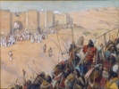

  
[Intangible Textual Heritage](../../index)  [Bible](../index.md) 
[Index](index)  [Next](biob01.md) 

------------------------------------------------------------------------

[Buy this Book at
Amazon.com](https://www.amazon.com/exec/obidos/ASIN/B002ECE954/internetsacredte.md)

------------------------------------------------------------------------

  
*The Biography of the Bible*, by Ernest Sutherland Bates, \[1937\], at
Intangible Textual Heritage

------------------------------------------------------------------------

# BIOGRAPHY OF THE BIBLE

##### A BRIEF ACCOUNT OF ITS CHARACTER, AUTHORSHIP, TEXT, TRANSLATION AND INFLUENCE ON THE EVOLUTION OF MANKIND

## ERNEST SUTHERLAND BATES

##### Editor of

##### THE BIBLE DESIGNED TO BE READ AS LIVING LITERATURE

#### SIMON AND SCHUSTER NEW YORK

#### \[1937\]

Scanned, Proofed and Formatted at Intangible Textual Heritage, June
2009, by John Bruno Hare. This text is in the public domain in the US
because its copyright was not renewed in a timely fashion as required by
law at the time.

------------------------------------------------------------------------

[Next: Table of Contents](biob01.md)
