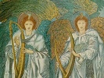

  
[Intangible Textual Heritage](../../index)  [Bible](../index.md) 
[Apocrypha](../../chr/apo/index)  [Index](index)  [Previous](boe089.md) 
[Next](boe091.md) 

------------------------------------------------------------------------

[Buy this Book on
Kindle](https://www.amazon.com/exec/obidos/ASIN/B0037Z6LLW/internetsacredte.md)

------------------------------------------------------------------------

  
*The Book of Enoch*, by R.H. Charles, \[1917\], at Intangible Textual
Heritage

------------------------------------------------------------------------

LXXXVII\. *The Advent of the Seven Archangels*.

### CHAPTER LXXXVII.

1\. And again I saw how they began to gore each other and to devour each
other, and the earth began to cry aloud. 2. And I raised mine eyes again
to heaven, and I saw in the vision, and behold there came forth from
heaven beings who were like white men: and four went forth from that
place and three with them. 3. And those three that had last come forth
grasped me by my hand and took me up, away from the generations of the
earth, and raised me up to a lofty place, and showed me a tower raised
high above the earth, and all the hills were lower. 4. And one said unto
me: 'Remain here till thou seest everything that befalls those
elephants, camels, and asses, and the stars and the oxen, and all of
them.'

------------------------------------------------------------------------

[Next: Chapter LXXXVIII](boe091.md)

